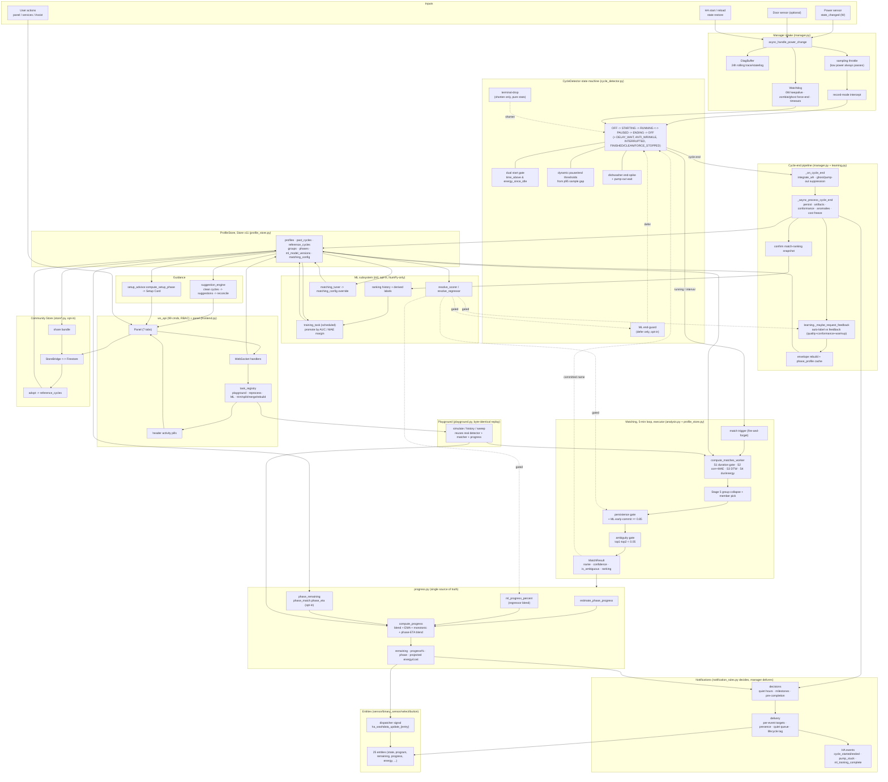
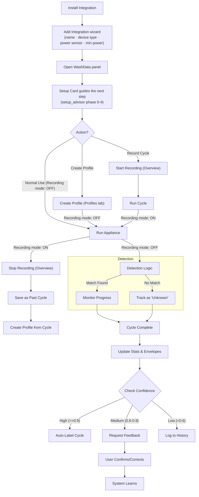
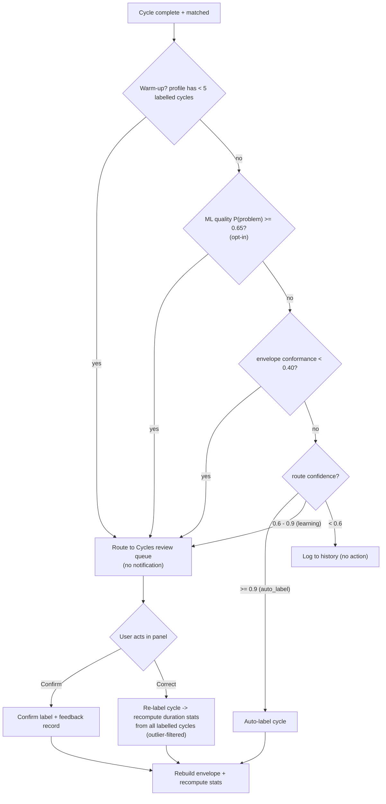
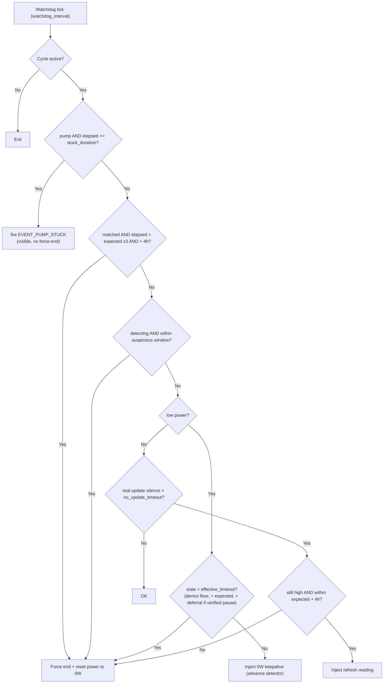
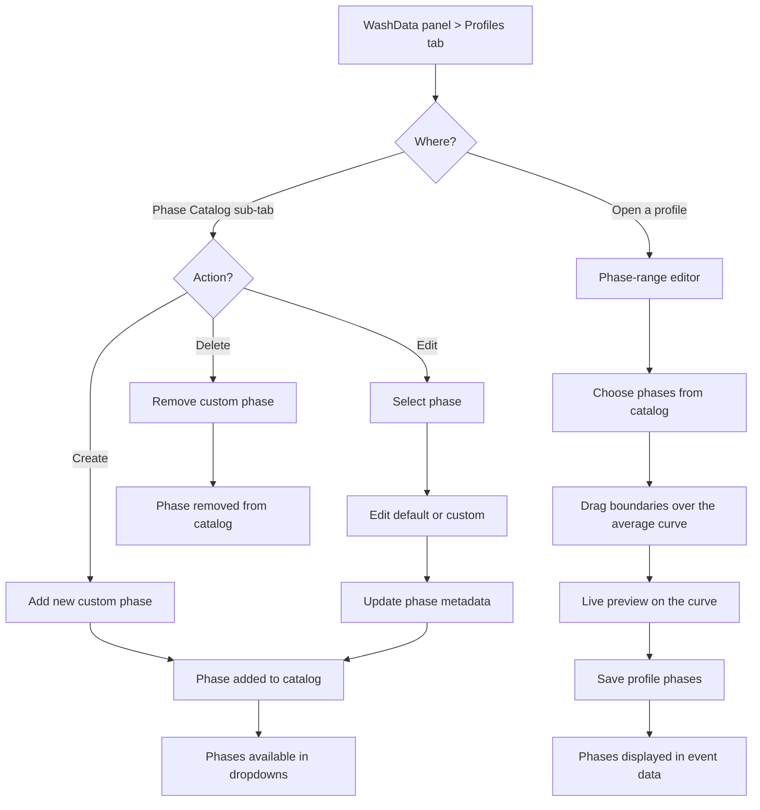
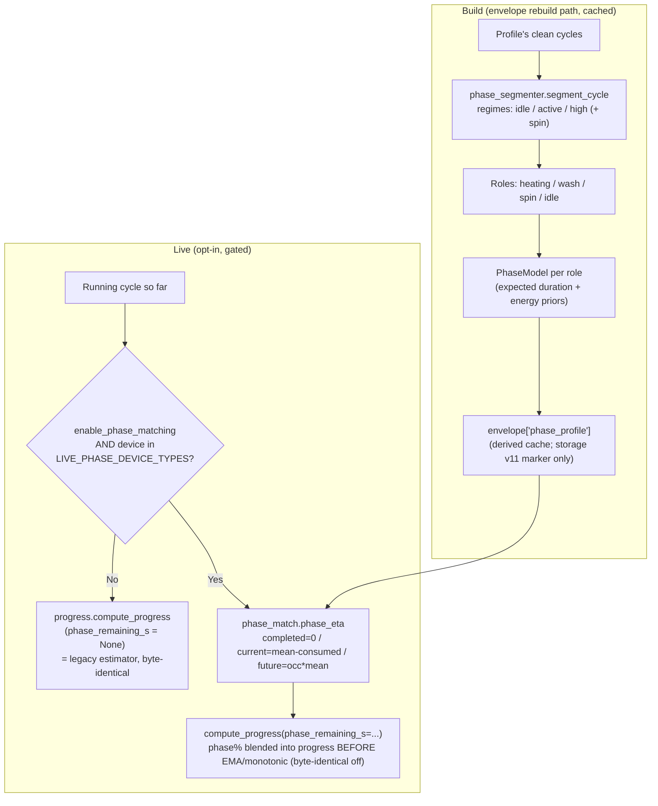

# WashData Implementation Guide

Note: Despite the name, WashData also works well for other appliances (e.g., dryers and dishwashers) as long as the power-draw cycle is reasonably predictable.

## Overview

This document covers the complete implementation of all major features:
1. Variable cycle duration support (configurable tolerance)
2. Smart progress management (100% on complete, 0% after unload)
3. Self-learning feedback system
4. Export/Import with full settings transfer
5. Auto-maintenance watchdog with switch control
6. Robust Cycle State Machine (vNext)
7. Reliability Features

---

## Table of Contents

- [Flows & Processes](#flows--processes)
- [Key Features](#features-implemented)
- [Key Classes & APIs](#key-classes--apis)
- [Event Flow](#event-flow)
- [Configuration](#configuration)
- [Deployment Notes](#deployment-notes)

---

## Flows & Processes

### 0. End-to-End System Map (complete)

The single big picture. Every subsequent diagram in this section zooms into one region of
this map. Solid arrows are the primary data/control path; dotted arrows are opt-in or
feedback paths. Boxes are grouped by subsystem (module ownership in parentheses).



**Reading the map, briefly:** power readings flow left-to-right through the manager into the
detector; a 5-minute executor loop matches the running cycle against stored profiles;
`progress.py` turns the match into remaining/phase/energy which drive the entities and gate
notifications; cycle end persists the cycle, runs the learning router, and (opt-in) feeds the
ML training data. Everything the panel does goes through the WebSocket layer and, for long
jobs, the task registry. The Playground replays stored cycles through the *same* detector +
matcher + `progress.py` so its output matches live behaviour byte-for-byte. The opt-in ML
scorers/regressors and the Community Store are the only dotted (conditional) paths into the
core.

### 0a. Exhaustive decision & loop map (every branch)

The whole runtime as one graph: every decision diamond and every loop-back. Diamonds are
decisions; `-->|yes|`/`-->|no|` (or labelled) edges are the branch taken; dotted edges are
opt-in/feedback paths, state transitions ("next reading"), and the recurring loops
(per-reading, 5-min match, watchdog poll, 60s state-expiry poll, PAUSED/ENDING resume).

```mermaid
flowchart TD
    %% ================= POWER INGESTION =================
    RDG(["Power sensor reading (t, W)"]) --> ING1{"unavailable / unknown / non-numeric?"}
    ING1 -->|yes| DROP1["drop"]
    ING1 -->|no| ING2["diag_buffer.record_power (raw, pre-throttle)"]
    ING2 --> ING3{"recorder.is_recording?"}
    ING3 -->|yes| REC["feed recorder - update power - notify"] --> DROP1
    ING3 -->|no| ING4{"power &gt;= min_power AND<br/>&lt; sampling_interval since last?"}
    ING4 -->|"yes (throttle)"| DROP1
    ING4 -->|"no (low power bypasses)"| ING5["learning.process_power_reading"]
    ING5 --> PR0["detector.process_reading(power, t)"]

    %% ================= DETECTOR HOT PATH =================
    PR0 --> D1{"dt = t - last &lt; 0?"}
    D1 -->|yes| DDROP["update last_t - return"]
    D1 -->|no| D2{"manual-stop lockout active?"}
    D2 -->|no| D4["update cadence (p95 dt) - MA buffer"]
    D2 -->|yes| D3{"power &lt; start_threshold_w?"}
    D3 -->|yes| D3a["clear lockout"] --> D4
    D3 -->|no| D3b{"lockout_high &lt; 180s?"}
    D3b -->|yes| DDROP2["swallow - return"]
    D3b -->|no| D3c["release lockout (back-to-back load)"] --> D4
    D4 --> D5{"state in OFF/DELAY_WAIT/STARTING/UNKNOWN?"}
    D5 -->|yes| D6["threshold = start_threshold_w"]
    D5 -->|no| D7["threshold = stop_threshold_w"]
    D6 --> D8{"power &gt;= threshold (is_high)?"}
    D7 --> D8
    D8 -->|yes| D9["time_above += dt - energy_since_idle += P*dt/3600"]
    D8 -->|no| D10["time_below += dt"]
    D9 --> DISP{"current state"}
    D10 --> DISP
    DISP -->|OFF| OFF1
    DISP -->|ANTI_WRINKLE| AW1
    DISP -->|DELAY_WAIT| DW1
    DISP -->|STARTING| ST1
    DISP -->|RUNNING| RUN1
    DISP -->|PAUSED| PAU1
    DISP -->|ENDING| END1
    DISP -->|"FINISHED / INTERRUPTED / FORCE_STOPPED"| TERMx["terminal: manager owns -&gt; OFF (see expiry)"]

    %% ================= OFF =================
    OFF1{"is_high?"}
    OFF1 -->|yes| OFFstart["seed cycle -&gt; STARTING"]
    OFF1 -->|no| OFFdelay{"delay-start enabled AND<br/>stop_w &lt; start_w AND power in band?"}
    OFFdelay -->|yes| OFFband{"band_seconds &gt;= delay_confirm?"}
    OFFband -->|yes| OFFtoDW["-&gt; DELAY_WAIT"]
    OFFband -->|no| OFFwait["accumulate band - stay OFF"]
    OFFdelay -->|no| OFFstay["stay OFF"]
    OFFstart -.->|next reading| ST1
    OFFtoDW -.->|next reading| DW1

    %% ================= ANTI_WRINKLE =================
    AW1{"burst peak &gt; aw_max_power OR<br/>burst dur &gt; aw_max_duration?"}
    AW1 -->|yes| AWre["seed from burst -&gt; STARTING"]
    AW1 -->|no| AWidle{"idle &gt;= max(end_thr,120s)<br/>OR in-state &gt; 7200s?"}
    AWidle -->|yes| AWoff["-&gt; OFF"]
    AWidle -->|no| AWstay["stay ANTI_WRINKLE"]
    AWre -.->|next reading| ST1

    %% ================= DELAY_WAIT =================
    DW1{"power &gt;= start_w?"}
    DW1 -->|yes| DWstreak{"high streak &gt;= start_duration?"}
    DWstreak -->|yes| DWstart["seed cycle -&gt; STARTING"]
    DWstreak -->|no| DWanchor["anchor high - stay"]
    DW1 -->|no| DWlow{"power &lt; stop_w AND true_off &gt;= 30s?"}
    DWlow -->|yes| DWoff["-&gt; OFF (cancelled)"]
    DWlow -->|no| DWto{"in-state &gt;= 8h?"}
    DWto -->|yes| DWoff
    DWto -->|no| DWstay["stay DELAY_WAIT"]
    DWstart -.->|next reading| ST1

    %% ================= STARTING =================
    ST1{"time_above &gt;= start_duration AND<br/>energy_since_idle &gt;= start_energy?"}
    ST1 -->|yes| STrun["-&gt; RUNNING"]
    ST1 -->|no| STabort{"not is_high AND time_below &gt; 1s<br/>AND NOT verified_pause?"}
    STabort -->|yes| SToff["-&gt; OFF (false start)"]
    STabort -->|no| STstay["stay STARTING"]
    STrun -.->|next reading| RUN1

    %% ================= RUNNING =================
    RUN1{"time_below &gt;= dynamic_pause_threshold<br/>(max 15s, 3x p95 dt)?"}
    RUN1 -->|yes| RUNpause["force match -&gt; PAUSED"]
    RUN1 -->|no| RUNsafe{"in-state &gt; 8h?"}
    RUNsafe -->|yes| RUNfs["finish force_stopped"]
    RUNsafe -->|no| RUNmatch["periodic match (match_interval)"]
    RUNpause -.->|next reading| PAU1
    RUNmatch -.->|5-min loop| MO1

    %% ================= PAUSED =================
    PAU1{"is_high?"}
    PAU1 -->|yes| PAUresume["-&gt; RUNNING (resume)"]
    PAU1 -->|no| PAUend{"time_below &gt;= dynamic_end_threshold?"}
    PAUend -->|yes| PAUto["-&gt; ENDING"]
    PAUend -->|no| PAUmatch["periodic match - stay PAUSED"]
    PAUresume -.->|resume loop| RUN1
    PAUto -.->|next reading| END1
    PAUmatch -.->|5-min loop| MO1

    %% ================= ENDING =================
    END1{"is_high reading?"}
    END1 -->|yes| ENhi{"arm gate: expected&lt;=0 OR<br/>duration &gt;= expected x 0.85?"}
    ENhi -->|yes| ENspike["record end-spike"]
    ENhi -->|no| ENnoarm["mid-cycle: do not arm"]
    ENspike --> ENterm{"terminal_spike?<br/>in-state&gt;=120s; dishwasher near_expected 0.90"}
    ENnoarm --> ENterm
    ENterm -->|yes| ENstay["stay ENDING"]
    ENterm -->|no| ENpast{"past_expected (&gt;= 0.98)?"}
    ENpast -->|yes| ENstay
    ENpast -->|no| ENresume["-&gt; RUNNING (genuine activity)"]
    END1 -->|no| ENlow["periodic match"]
    ENlow --> ENsmart{"Smart Termination: matched AND<br/>dur &gt;= expected x smart_ratio AND conf &gt;= 0.4<br/>AND !ambiguous AND !prefix_ambiguous<br/>AND in-state &gt;= smart_debounce<br/>AND dishwasher pump-out wait done?"}
    ENsmart -->|yes| ENfin1["finish completed (SMART, keep_tail)"]
    ENsmart -->|no| ENtd{"Terminal-drop (opt-in): provider AND<br/>!verified_pause AND off_delay &gt; 90 AND<br/>time_below &gt;= 90 AND is_terminal_drop?"}
    ENtd -->|yes| ENfin2["finish interrupted (TERMINAL_DROP)"]
    ENtd -->|no| ENto{"time_below &gt;= max(off_delay, min_off_gap)?"}
    ENto -->|no| ENwait["stay ENDING"]
    ENto -->|yes| ENwin{"recent_window energy &lt;= end_energy_threshold?"}
    ENwin -->|no| ENblock["blocked by energy gate - stay"]
    ENwin -->|yes| ENdef["evaluate _should_defer_finish"]
    ENresume -.->|resume loop| RUN1
    ENstay -.->|resume possible| END1
    ENlow -.->|5-min loop| MO1

    %% ================= DEFER LADDER =================
    ENdef --> DF1{"verified_pause?"}
    DF1 -->|yes| DFdefer["DEFER (stay ENDING)"]
    DF1 -->|no| DF2{"dishwasher AND dur &lt; 1800s?"}
    DF2 -->|yes| DFdefer
    DF2 -->|no| DF3{"no profile OR expected &lt;= 0?"}
    DF3 -->|yes| DFfin["FINISH"]
    DF3 -->|no| DF4{"dur &gt; expected + 14400s (4h)?"}
    DF4 -->|yes| DFfin
    DF4 -->|no| DF5{"ML end-guard: conf &gt;= 0.55 AND<br/>P(end) &lt; 0.5 AND defer &lt; 1800s?"}
    DF5 -->|yes| DFdefer
    DF5 -->|no| DF6{"dishwasher dur &lt; expected x 0.85?"}
    DF6 -->|yes| DFdefer
    DF6 -->|no| DF7{"dishwasher pump-out wait?"}
    DF7 -->|yes| DFdefer
    DF7 -->|no| DF8{"conf &lt; 0.55?"}
    DF8 -->|yes| DFfin
    DF8 -->|no| DF9{"dur &lt; expected x min_duration_ratio?"}
    DF9 -->|yes| DFdefer
    DF9 -->|no| DFfin
    DFdefer -.->|re-eval next reading| END1
    DFfin --> FIN
    ENfin1 --> FIN
    ENfin2 --> FIN
    RUNfs --> FIN

    %% ================= FINISH =================
    FIN["_finish_cycle"] --> FINstat{"duration &lt; interrupted_min (150s)<br/>OR &lt; completion_min (600s)?"}
    FINstat -->|yes| FINint["status = interrupted"]
    FINstat -->|no| FINcomp["status = completed"]
    FINint --> FINcb["build offset power_data -&gt; _on_cycle_end"]
    FINcomp --> FINcb
    FINcb --> CE1

    %% ================= MATCH ORCHESTRATION (5-min loop) =================
    MO1{"manual program active?"}
    MO1 -->|yes| MOman["return (program, 1.0, dur, phase)"]
    MO1 -->|no| MO2{"already matching OR no readings<br/>OR has_real_profiles == false?"}
    MO2 -->|yes| MOskip["skip"]
    MO2 -->|no| S1

    %% ================= MATCH PIPELINE (Stages 1-5) =================
    S1{"Stage 1: duration ratio in [min,max]?"}
    S1 -->|no| S1rej["reject candidate"]
    S1 -->|yes| S2["Stage 2: score = 0.45 corr + 0.55 peak-rel MAE"]
    S2 --> S2k{"score &gt;= keep_min (0.1)?"}
    S2k -->|no| S1rej
    S2k -->|yes| S3{"dtw_bandwidth &gt; 0?"}
    S3 -->|yes| S3d["Stage 3: DTW-lite top5 - blend 0.5/0.5 - re-sort"]
    S3 -->|no| S4
    S3d --> S4["Stage 4: + duration/energy agreement (0.22/0.22)"]
    S4 --> S5{"cohesive group? (cohesion &gt;= 0.80)"}
    S5 -->|yes| S5g["collapse to aggregate - pick member"]
    S5 -->|no| S5i["keep individual"]
    S5g --> S5m{"member fit &lt; 0.55 x group<br/>OR overrun &gt; 1.05?"}
    S5m -->|yes| S5dg["downgrade to uncertain"]
    S5m -->|no| CMT
    S5i --> CMT{"top1 score &gt;= 0.4 commit?"}
    S5dg --> CMT
    CMT -->|no| MRunk["MatchResult: unknown / detecting"]
    CMT -->|yes| AMBq{"ambiguous? top1 - top2 &lt; 0.05"}
    AMBq -->|yes| MRamb["uncertain -&gt; feedback"]
    AMBq -->|no| MRok["MatchResult: confident"]
    MRok --> MO3
    MRamb --> MO3
    MRunk --> MO3

    %% ================= PROGRAM SWITCHING =================
    MO3{"current program?"}
    MO3 -->|"detecting..."| SW1{"conf &gt;= 0.15 AND !ambiguous?"}
    SW1 -->|no| SWstay["stay detecting"]
    SW1 -->|yes| SW2{"persistent (counter &gt;= match_persistence)<br/>OR ML early-commit (score &gt;= 0.85, conf &gt;= 0.30)?"}
    SW2 -->|yes| SWset["commit program"]
    SW2 -->|no| SWinc["bump candidate counter - stay"]
    MO3 -->|matched| SW3{"divergence: conf &lt; peak x 0.6?"}
    SW3 -->|yes| SW3p{"unmatch counter &gt;= persistence?"}
    SW3p -->|yes| SWrevert["revert to detecting"]
    SW3p -->|no| SWincd["bump unmatch counter"]
    SW3 -->|no| SW4{"override: conf &gt; 0.8 AND gap &gt; 0.15,<br/>or persistent + trend + gap &gt; 0.05?"}
    SW4 -->|yes| SWset
    SW4 -->|no| SWkeep["keep current"]
    SWset --> DUPD
    SWrevert --> DUPD
    SWkeep --> DUPD
    MOman --> DUPD

    %% ================= DETECTOR UPDATE + LIVE =================
    DUPD["detector.update_match(name, conf, dur, phase,<br/>is_mismatch, is_ambiguous, is_prefix_ambiguous)"]
    DUPD --> DUP2{"user paused?"}
    DUP2 -->|yes| DUPvp["verified_pause = True (authoritative)"]
    DUP2 -->|no| DUPenv{"envelope verify low-power phase?"}
    DUPenv -->|yes| DUPvp
    DUPenv -->|no| DUPclear["clear verified_pause"]
    DUPvp --> UPR["_update_remaining_only"]
    DUPclear --> UPR
    DUPD -.->|expected_duration + conf feed| END1

    %% ================= PROGRESS / ETA =================
    UPR --> P1{"matched profile AND &gt;= 10 pts?"}
    P1 -->|no| Plin["linear fallback (alpha 0.10)"]
    P1 -->|yes| Pph["phase-aware base"]
    Pph --> P2{"ml_pct? (remaining_time regressor, opt-in)"}
    Plin --> P2
    P2 -->|yes| Pblend["blended = 0.5 base + 0.5 ml_pct"]
    P2 -->|no| Pbase["base only"]
    Pblend --> P3{"power variance tier?"}
    Pbase --> P3
    P3 -->|"&lt; 50W"| Pa1["EMA alpha 0.20"]
    P3 -->|"50-100W"| Pa2["EMA alpha 0.10"]
    P3 -->|"&gt; 100W"| Pa3["EMA alpha 0.05"]
    Pa1 --> Pbd{"backward drop &gt; device threshold?"}
    Pa2 --> Pbd
    Pa3 --> Pbd
    Pbd -->|yes| Pdamp["heavy damp 95/5"]
    Pbd -->|no| Pema["apply EMA"]
    Pdamp --> Pph2{"phase_remaining_s set? (opt-in)"}
    Pema --> Pph2
    Pph2 -->|yes| Pblend2["phase_pct = elapsed/(elapsed+phase_s); blend into<br/>phase-progress before EMA/monotonic (f = base_progress/100)"]
    Pph2 -->|no| Pbc["remaining = matched_dur x (1 - smoothed/100)"]
    Pblend2 --> Pcap["cap progress 99 live"]
    Pbc --> Pcap
    Pcap --> PE{"progress &gt;= 3% AND energy_so_far &gt; 0?"}
    PE -->|yes| PEml{"total_energy regressor? (opt-in)"}
    PEml -->|yes| PEr["projected = regressor - max(., so_far)"]
    PEml -->|no| PEl["projected = so_far / (progress/100)"]
    PE -->|no| PEskip["no projection yet"]
    Pcap --> ANm{"elapsed &gt; expected x 1.5?"}
    ANm -->|yes| ANov["cycle_anomaly = overrun (visible only)"]
    ANm -->|no| ANok["no live anomaly"]
    Pcap --> ENTS2["update entities via dispatcher signal"]
    UPR --> PCq{"pre-complete: lead set AND not fired AND<br/>remaining &lt;= lead AND progress &lt; 100 AND !ambiguous?"}
    PCq -->|yes| PCfire["fire pre-completion notification"]
    PCq -->|no| PCno["skip"]
    UPR --> LVq{"live progress: RUNNING/PAUSED/ENDING<br/>AND live services AND throttle ok?"}
    LVq -->|yes| LVfire["update live card (bar + countdown)"]
    LVq -->|no| LVno["skip"]

    %% ================= CYCLE END =================
    CE1["_on_cycle_end: stop timers - integrate_wh"] --> CEg{"ghost? dur &lt; 60s AND energy &lt; 0.05Wh<br/>OR dishwasher pump-out ghost?"}
    CEg -->|yes| CEdisc["discard (no persist/notify/learn) - arm expiry"]
    CEg -->|no| CE2["capture race token - schedule async tail"]
    CE2 --> CE3{"still detecting?"}
    CE3 -->|yes| CE3m["final match on full data (thr 0.15, ignore ambiguity)"]
    CE3 -->|no| CE4
    CE3m --> CE4["freeze locals (B1) - conformance - artifacts"]
    CE4 --> CEan1{"duration &lt; median x 0.55?"}
    CEan1 -->|yes| CEun["anomaly = underrun"]
    CEan1 -->|no| CEov{"elapsed &gt; expected x 1.5?"}
    CEov -->|yes| CEovr["anomaly = overrun"]
    CEov -->|no| CEnoan["no duration anomaly"]
    CE4 --> CEz{"|energy z-score| &gt; 2.5?"}
    CEz -->|yes| CEes["energy_anomaly (high/low)"]
    CEz -->|no| CEze["energy normal"]
    CE4 --> CEml{"ml_models_enabled?"}
    CEml -->|yes| CEq["ML quality score (pre-persist)"]
    CEml -->|no| CEnoq["skip quality"]
    CEq --> CEadd
    CEnoq --> CEadd["add_cycle - rebuild envelope - lifetime counters"]
    CEadd --> LR1
    CEadd --> EVend["fire EVENT_CYCLE_ENDED (exclude heavy)<br/>- finish notification - milestone"]
    CEadd -.->|ranking + labels| MLtrain

    %% ================= LEARNING ROUTING =================
    LR1{"non-imported profile AND &lt; 5 labeled cycles (warmup)?"}
    LR1 -->|yes| LRreq["request verification (Cycles queue, no notification)"]
    LR1 -->|no| LR2{"ML quality P(problem) &gt;= 0.65?"}
    LR2 -->|yes| LRreq
    LR2 -->|no| LR3{"envelope conformance &lt; 0.40?"}
    LR3 -->|yes| LRreq
    LR3 -->|no| LR4{"route conf &gt;= auto_label (0.9)?"}
    LR4 -->|yes| LRauto["auto-label - rebuild envelope"]
    LR4 -->|no| LR5{"route conf &gt;= learning (0.6)?"}
    LR5 -->|yes| LRpend["pending feedback record"]
    LR5 -->|no| LRskip["skip (log only)"]
    LRauto --> CEreset
    LRpend --> CEreset
    LRreq --> CEreset
    LRskip --> CEreset
    CEreset{"back-to-back: race token changed?"}
    CEreset -->|yes| CEkeep["keep new cycle's live fields (skip reset)"]
    CEreset -->|no| CEoff["reset terminal - progress 100 - arm expiry timer"]

    %% ================= NOTIFICATION DISPATCH =================
    EVend --> NO1{"quiet hours? finish-type event AND<br/>in window AND allow_deferral?"}
    NO1 -->|yes| NOq["queue -&gt; flush at window end"]
    NO1 -->|no| NO2{"presence: notify_only_when_home AND nobody home?"}
    NO2 -->|yes| NOp["pending -&gt; release on home"]
    NO2 -->|no| NO3["run actions (script) + per-event services"]
    NO3 --> NO4{"LIVE event?"}
    NO4 -->|yes| NO4m{"target is mobile_app_*?"}
    NO4m -->|no| NOskip["skip target"]
    NO4m -->|yes| NOsend["send (progress / countdown / LiveActivity)"]
    NO4 -->|no| NO5{"any service sent?"}
    NO5 -->|no| NOpn["persistent-notification fallback"]
    NO5 -->|yes| NOsend
    NOq -.->|window end| NO2
    NOp -.->|person home| NO3

    %% ================= WATCHDOG (poll loop) =================
    WD0(["watchdog tick (watchdog_interval)"]) --> WDp{"pump AND elapsed &gt;= stuck_duration?"}
    WDp -->|yes| WDpe["fire EVENT_PUMP_STUCK"]
    WDp -->|no| WDz{"matched AND elapsed &gt; expected x3 AND &gt; 14400s?"}
    WDz -->|yes| WDfe["force_end"]
    WDz -->|no| WDg{"detecting AND within suspicious window?"}
    WDg -->|yes| WDfe
    WDg -->|no| WDl{"low power?"}
    WDl -->|yes| WDlt{"stale &gt; effective_timeout?"}
    WDlt -->|yes| WDfe
    WDlt -->|no| WDka["inject 0W keepalive"]
    WDl -->|no| WDh{"silence &gt; no_update_timeout?"}
    WDh -->|yes| WDhw{"within expected + 14400s?"}
    WDhw -->|yes| WDref["inject refresh reading"]
    WDhw -->|no| WDfe
    WDh -->|no| WDok["ok"]
    WD0 -.->|loop| WD0
    WDka -.->|advances detector| PR0
    WDref -.-> PR0
    WDfe --> FIN

    %% ================= STATE EXPIRY (poll loop) =================
    EX0(["expiry tick (60s, after cycle end)"]) --> EXn{"clean nag pending?"}
    EXn -->|yes| EXhold["send nag once - hold terminal"]
    EXn -->|no| EXpo{"power-off enabled? 0 &lt; power_off_w &lt; stop_w"}
    EXpo -->|yes| EXpw{"power &lt; threshold for power_off_delay?"}
    EXpw -->|yes| EXoff["_reset_terminal_to_off"]
    EXpw -->|no| EXwait["progress bar zeroes - terminal persists"]
    EXpo -->|no| EXt{"progress_reset_delay elapsed?"}
    EXt -->|yes| EXoff
    EXt -->|no| EXwait
    EX0 -.->|loop| EX0
    CEoff -.->|arms| EX0
    CEdisc -.->|arms| EX0
    EXoff -.->|state = OFF| OFF1

    %% ================= ML CONSUMERS (opt-in, gated) =================
    MLtrain["training_task (scheduled)<br/>promote by AUC / MAE margin"]
    MLtrain -.-> MLend["end scorer -&gt; defer only"]
    MLtrain -.-> MLcommit["live_match scorer -&gt; early commit"]
    MLtrain -.-> MLqual["quality scorer -&gt; downgrade"]
    MLtrain -.-> MLreg["remaining_time / total_energy regressors"]
    MLtd["terminal-drop (pure stats, no model)"]
    MLend -.->|"P(end) &lt; 0.5"| DF5
    MLcommit -.->|"&gt;= 0.85"| SW2
    MLqual -.->|"&gt;= 0.65"| LR2
    MLreg -.-> P2
    MLtd -.-> ENtd

    %% ================= PANEL / WS / TASKS / PLAYGROUND =================
    USR(["user action (panel / service / Assist)"]) --> WS1{"RBAC allows?"}
    WS1 -->|no| WSden["deny"]
    WS1 -->|yes| WS2{"long op?"}
    WS2 -->|yes| WS3["task_registry (progress / cancel / header pill)"]
    WS2 -->|no| WS4["direct handler -&gt; profile_store / manager"]
    WS3 --> PGsim["Playground replay:<br/>same detector + matcher + progress"]
    PGsim -.->|byte-identical| PR0
    WS4 -.-> ENTS2

    %% ================= COMMUNITY STORE (opt-in) =================
    CS0{"online features enabled?"}
    CS0 -->|yes| CSadopt["adopt -&gt; reference_cycles"]
    CS0 -->|yes| CSshare["share bundle -&gt; Firestore"]
    CSadopt -.->|feeds envelope + matcher| S1

    %% ================= SETUP ADVISOR =================
    SU0{"setup phase (setup_advisor)"}
    SU0 -->|"none + reference-only"| SU1c["Phase 1c: run once to confirm download"]
    SU0 -->|none| SU0p["Phase 0: record/label or browse store"]
    SU0 -->|few labeled| SU2["Phase 2: build coverage"]
    SU0 -->|good| SU3["Phase 3: tuning / groups / phases"]
    SU0 -->|healthy| SU4["Phase 4: complete (quiet chip)"]
    CEadd -.->|recompute| SU0
```

### 1. User Journey Flow
This high-level flow describes how a user interacts with the integration, from initial setup to daily use and feedback.



### 2. Event Processing Pipeline
How raw power sensor data is processed into cycle states.
 
 ```mermaid
 sequenceDiagram
     participant Sensor as Power Sensor
     participant Manager as WashDataManager
     participant Detector as CycleDetector
     participant Matcher as ProfileStore (executor)
     
     Sensor->>Manager: State Change (Power W)
     Manager->>Manager: diag_buffer.record + throttle (low power bypasses)
     Manager->>Detector: process_reading(time, watts)
     
     rect rgb(20, 20, 20)
     Note over Detector: State Machine Logic
     Detector->>Detector: Check Gates (Start/End Energy)
     Detector->>Detector: Update State (OFF/RUNNING)
     end
     
     Detector-->>Manager: State Changed (e.g. STARTING -> RUNNING)
     
     loop Every match_interval (~5 min) while RUNNING
         Detector->>Manager: profile_matcher (fire-and-forget trigger)
         Manager->>Matcher: async_match_profile (executor, NumPy)
         Matcher->>Matcher: Stage 1-5 pipeline
         Matcher-->>Manager: MatchResult (name, confidence, ambiguity)
         Manager->>Manager: switching (persistence / ML commit) + progress.py
     end
     Manager->>Manager: dispatcher signal -> entities (publish-on-change)
 ```
 
 ### 3. Cycle Detection State Machine
 The core finite state machine logic governing cycle lifecycle.
 
 ```mermaid
 stateDiagram-v2
     [*] --> OFF
     OFF --> DELAY_WAIT: Standby band held (delay-start, opt-in)
     DELAY_WAIT --> STARTING: Power >= start_threshold_w
     DELAY_WAIT --> OFF: True-off or delay timeout
     OFF --> STARTING: Power >= start_threshold_w (sustained)
     STARTING --> RUNNING: time_above >= start_duration AND energy >= start_energy
     STARTING --> OFF: Gates not met (spike)
     RUNNING --> PAUSED: Power below pause threshold
     PAUSED --> RUNNING: Power back above threshold
     RUNNING --> ENDING: Low-power run begins
     PAUSED --> ENDING: Low-power run sustained
     ENDING --> RUNNING: Power/energy resumes (false end; ML end-guard may defer)
     ENDING --> FINISHED: off_delay + energy gate, or Smart Termination near expected
     ENDING --> INTERRUPTED: Short run (< completion_min), or terminal-drop fast finalize (opt-in)
     ENDING --> FORCE_STOPPED: Watchdog / no-update timeout
     FINISHED --> ANTI_WRINKLE: Dryer tumble pulses (opt-in)
     ANTI_WRINKLE --> OFF: True-off after idle
     FINISHED --> CLEAN: Door sensor configured, laundry not yet removed
     CLEAN --> OFF: Door opened (unloaded); or power-off (opt-in, #284)
     FINISHED --> OFF: Progress-reset delay (default); or power < power_off_threshold for power_off_delay (opt-in, #284)
     INTERRUPTED --> OFF: Progress-reset delay; or power-off (#284)
     FORCE_STOPPED --> OFF: Progress-reset delay; or power-off (#284)
     FINISHED --> [*]
 ```

 > **Terminal → Off is a single owner.** All terminal states (FINISHED / INTERRUPTED / FORCE_STOPPED, plus the CLEAN overlay) return to OFF through one place, `manager._reset_terminal_to_off`, driven by `_handle_state_expiry`. By default that fires after the **Progress Reset Delay**. When the opt-in **Power Off Threshold** (`power_off_threshold_w`, issue #284) is set below `stop_threshold_w`, power-based Off takes over the transition: the terminal state persists until power stays below the threshold for `power_off_delay`, and the progress-reset timer then only clears the progress bar (it no longer forces OFF). `ANTI_WRINKLE → OFF` keeps its own idle/timeout logic in the detector and is unaffected.
 
 ### 4. Matching Pipeline (5-Stage)
 The logic used to identify which profile matches the current cycle.
 
 ```mermaid
 graph TD
     A[Raw Power Data] --> B[Adaptive resample and align]
     B --> C{Stage 1: Fast Reject}
     C -- "Duration ratio < 0.10 or > 1.5" --> D[Discard]
     C -- Pass --> E["Stage 2: Core Similarity (0.45 corr + 0.55 peak-relative MAE)"]
     E --> F["Stage 3: DTW-Lite refine top 5 (ensemble; always on when band > 0)"]
     F --> G["Stage 4: Duration + Energy agreement (0.22 each)"]
     G --> H["Stage 5: Profile groups (collapse cohesive near-duplicates, pick member)"]
     H --> I{"Top-1 score >= 0.4 commit threshold?"}
     I -- No --> M["Unknown / Detecting..."]
     I -- Yes --> J{"Ambiguous? top1 - top2 < 0.05"}
     J -- Yes --> R["Uncertain -&gt; request feedback"]
     J -- No --> L[Match Confirmed]
 ```

### 5. Learning Mechanism (Feedback Loop)
How the system adapts to user corrections.



The confidence ladder is the *routing* confidence: a warm-up profile, a suspicious ML quality
score (opt-in), or low envelope conformance each downgrade an otherwise-high-confidence match
to the review queue. Feedback is surfaced in the panel's **Cycles** tab, never as a
notification. A correction **re-labels** the cycle and **recomputes** the profile's duration
statistics from all its labelled cycles (outlier-filtered) - the old EWMA nudge was removed.


---

## Features Implemented

### 1. Variable Cycle Duration (configurable tolerance)

**Problem:** Real washers don't run for exact programmed times. Load size, water temperature, and soil level cause natural variance of 10-20%.

**Solution:** (the matcher tolerance is configurable; current default **±25%** via `profile_duration_tolerance`)
- Mock socket simulates ±15% realistic duration variance
- Profile matching tolerates up to ±25% variance (was ±50%)
- Better real-world detection accuracy, fewer false negatives

**Files Modified:**
- `devtools/mqtt_mock_socket.py` - Added `--variability` argument for realistic duration variance.
- `custom_components/ha_washdata/profile_store.py` - Updated duration tolerance and matching logic.

**How It Works (Duration Filter):**
```python
# Profile matching logic (Initial Filter)
duration_ratio = actual_duration / expected_duration
# Accepts if within range (current default: 0.10 - 1.5; see const.py MATCH_* / CLAUDE.md)
# This prevents comparing apples to oranges (e.g. 30min vs 2h cycles)
```

**Testing:**
```bash
python3 devtools/mqtt_mock_socket.py --speedup 720 --default LONG
# Watch for: [VARIANCE] Applied ±X.X% duration variance
```

---

### 1b. Cycle Status Classification (✓/⚠/✗)

**Why:** Distinguish natural completions from abnormal endings and restarts.

**Statuses:**
- ✓ `completed` - Natural finish after `off_delay` in low-power wait.
- ✓ `force_stopped` - Watchdog finalized while already in low-power wait; treated as success.
- ✗ `interrupted` - Abnormal early end: very short run or abrupt power cliff that never recovers.
- ⚠ `resumed` - Active cycle restored after HA restart.

**Logic:**
- Detector tracks low-power window and elapsed time; `force_end()` maps to `completed` when low-power wait ≥ `off_delay`, else `force_stopped` and `_should_mark_interrupted` can reclassify short/abrupt runs.

**UI & Scoring:**
- ✓ cases are considered successful; ✗ is flagged as abnormal; ⚠ retains reduced confidence.

---

### 1c. Phase Catalog Scope Model (0.4.3)

**Problem:**
- Users need a single catalog to manage phases across all appliance types.
- At the same time, profile phase assignment should stay device-specific.
- Global phases (empty `device_type`, meaning "All Devices") are present in per-device lists and can appear duplicated in edit/delete selectors.

**Solution:**
- Phase Catalog management view aggregates all device types and renders grouped sections by device label.
- Assign Phase flow keeps strict device-type filtering.
- Edit/Delete selectors now use a scoped internal key (`device_type::phase_name`) and dedupe by `(name, device_type)` so global phases are shown once.

**Implementation Notes:**
- UI selectors in config flow track selected phase name and selected phase scope separately.
- Update/delete operations resolve against the selected scope, preventing accidental edits in the wrong device context.
- Global phases are displayed as "All Devices" and not repeated for each device type.

---

### 2. Progress Reset Logic (100% → 0%)

**Problem:** Progress stayed stuck at last calculated value when cycle ended; no clear completion signal or unload time tracking.

**Solution:**
- Progress reaches 100% immediately when cycle completes (clear signal)
- Progress stays at 100% for the **Progress Reset Delay** (default **30 min**, `progress_reset_delay`) as the unload window
- After that idle window, progress automatically resets to 0% **and** the state returns to Off
- If a new cycle starts within the window, the reset is cancelled
- **Power-based Off (opt-in, #284):** when `power_off_threshold_w > 0` (and below `stop_threshold_w`), the state returns to Off as soon as power stays below the threshold for `power_off_delay` seconds instead of on the timer. In that mode the Progress Reset Delay still clears the progress bar but no longer forces Off, so a finished-but-still-on machine stays in Finished/Clean until it is actually switched off. Evaluated only in terminal states, so a mid-cycle soak is never read as Off; disabled (`0`) leaves behaviour byte-identical.

**Files Modified:**
- `custom_components/ha_washdata/manager.py` - Complete implementation

**State Flow:**
```
RUNNING → COMPLETE
    ↓
Progress = 100% (cycle finished)
Start 30-min idle timer (progress_reset_delay)
    ↓
[Scenarios]
├─ New cycle starts within 30min → Cancel reset, progress → 0%
└─ 30min passes with no activity → Progress → 0% (unload complete)
```

**Implementation Details:**

| Component | Purpose |
|-----------|---------|
| `_cycle_completed_time` | Tracks when cycle finished (ISO timestamp) |
| `_progress_reset_delay` | Configurable idle time (default: 1800s/30min) |
| `_start_state_expiry_timer()` | Begin countdown after cycle end |
| `_handle_state_expiry()` | Async callback checking if idle threshold passed |
| `_stop_state_expiry_timer()` | Cancel reset if new cycle starts |

**Entity Updates:**
```yaml
# During cycle (0-100%)
sensor.washer_progress: "45"

# Cycle ends
sensor.washer_progress: "100"

# After the reset-delay idle window (default 30 min)
sensor.washer_progress: "0"
```

---

### 3. Self-Learning Feedback System

**Problem:** System couldn't learn from users or improve over time; no transparency about why cycles were detected a certain way.

**Solution:**
- Emit feedback request events for high-confidence matches
- Accept user confirmations or corrections via service call
- Learn from corrections (update profile durations conservatively)
- Track all feedback for history and review

**Files Created:**
- `custom_components/ha_washdata/learning.py` (208 lines) - New LearningManager class

**Files Modified:**
- `custom_components/ha_washdata/manager.py` - Integrated learning
- `custom_components/ha_washdata/__init__.py` - Service handler
- `custom_components/ha_washdata/const.py` - Constants

#### Feedback Request Flow

When a cycle completes with high-confidence match:

```yaml
Event: ha_washdata_feedback_requested
Payload:
  cycle_id: "abc123xyz"
  detected_profile: "60°C Cotton"
  confidence: 0.75
  estimated_duration: 60  # minutes
  actual_duration: 62     # minutes
  is_close_match: true
  created_at: "2025-12-17T15:30:00+00:00"
```

#### User Confirmation

Call service to confirm detection was correct:

```yaml
service: ha_washdata.submit_cycle_feedback
data:
  entry_id: "integration_entry_id"
  cycle_id: "abc123xyz"
  user_confirmed: true
  notes: "Perfect detection"
```

#### User Correction

Correct if the detected program was wrong:

```yaml
service: ha_washdata.submit_cycle_feedback
data:
  entry_id: "integration_entry_id"
  cycle_id: "abc123xyz"
  user_confirmed: false
  corrected_profile: "40°C Delicate"
  corrected_duration: 3300  # seconds
  notes: "Was actually a delicate cycle"
```

#### Learning Algorithm (current)

> **Updated:** the old EWMA nudge (`80% old + 20% new`) is **no longer used**. A
> correction now **re-labels the cycle** onto the corrected profile (and fixes that
> cycle's duration), then the profile's envelope is rebuilt and **all** statistics
> (`avg_duration` / `min` / `max`) are **recomputed from the profile's labelled cycles**
> - see `learning.py::_apply_correction_learning`. Expected duration is a **robust
> statistic** over those cycles: `profile_store.filter_duration_outliers()` drops
> outliers with Tukey IQR fences (1.5×IQR), falling back to a MAD-based robust-Z filter
> (≤3.5) when the IQR collapses.

When a user confirms or corrects a cycle:
1. Store the confirmation/correction in feedback history.
2. On a correction, re-label the cycle onto the corrected profile and set its duration.
3. Rebuild the profile envelope and **recompute** its duration statistics from all its
   labelled cycles (outlier-filtered) - no single-correction weighting.
4. Future matches use the recomputed profile stats.

This recompute-from-labelled-cycles approach is more accurate than a running average:
one bad correction can be fixed by re-labelling, and the stats always reflect the
current membership rather than the order corrections arrived in.

#### Accessing Feedback Data

**Get pending feedback:**
```python
manager.learning_manager.get_pending_feedback()
# Returns: {cycle_id: {feedback_data...}}
```

**Get feedback history:**
```python
manager.learning_manager.get_feedback_history(limit=10)
# Returns: [{feedback_record}, ...] sorted by date desc
```

**Get learning statistics:**
```python
manager.learning_manager.get_learning_stats()
# Returns: {
#   "total_feedback": 5,
#   "confirmations": 3,
#   "corrections": 2,
#   "pending": 0
# }
```

#### ML Quality Gate (0.5.0)

When ML models are enabled (`enable_ml_models` option), `manager._compute_cycle_quality_score` runs the `hybrid_curve_quality` model at cycle end and stores `ml_quality_score` (0–1, P(problem)) on the cycle. `learning._maybe_request_feedback` then reads this: if the score is ≥ `ML_QUALITY_SUSPICIOUS_THRESHOLD` (0.65), the auto-label is downgraded to a feedback request even if matcher confidence is high — this catches confident-but-wrong labels caused by ghost cycles or corrupted data.

#### ML Early Match Commit (0.5.0)

During active matching (`manager._async_do_perform_matching`), the `live_match_commit` model scores P(top-1 is correct). When the score is ≥ `ML_MATCH_COMMIT_THRESHOLD` (0.85) AND raw confidence ≥ 0.30, the profile is committed immediately — bypassing the persistence counter (default: 3 consecutive matching calls). This cuts time-to-first-match for clear, distinctive cycles. Falls back to persistence if ML is disabled or the scorer raises.

#### ML Remaining-Time Regressor (0.5.0)

**Problem:** Time-remaining was `matched_profile_duration × (1 − progress)`, i.e. it assumes every run of a program takes the profile's median duration. Real appliances drift — an aging washer, a heavier load, or an eco variant can run materially longer/shorter — and the naive estimate is systematically wrong for those runs.

**Solution:** the first **regression** head in the ML subsystem (all others are logistic classifiers). It predicts the cycle **completion fraction** (elapsed / actual-total) from duration-*invariant* shape features, so a run that will take 1.5× the median is recognized as only half-done when the naive elapsed/median says 75%.

- **Model kind:** `standardized_linear` (ridge). `trainer.fit_ridge` standardizes both features and target and solves the ridge normal equations in closed form (NumPy only); `predict_matrix_spec`/`predict_value_spec` un-standardize via the spec's `output_center`/`output_scale`. No sigmoid, no threshold.
- **No shipped baseline:** unlike the three classifier heads there is no embedded `*_model.py`. `engine.resolve_regressor("remaining_time", store)` returns a predictor only once on-device training has promoted one; otherwise `(None, None)` and live behavior is unchanged.
- **Features** (`feature_extraction.PROGRESS_FEATURE_COLUMNS`): `elapsed_over_expected` (the naive estimate, kept as the first column so the baseline is trivially recoverable), `energy_over_expected`, `mean_power_over_peak`, `recent_power_over_peak`, `tail_slope_norm` (a declining tail ⇒ near the end), `active_fraction`, `elapsed_log`.
- **Training data** (`training_task._progress_dataset`): each clean completed cycle is cut at several elapsed fractions (0.15…0.90); the target is the prefix's true completion fraction. Every stored trace becomes a handful of supervised examples — no manual labeling.
- **Promotion gate** (`training_task._train_regression_capability`): the trained regressor is promoted only when its held-out MAE beats the naive elapsed/expected estimate (feature column 0) by `ML_TRAINING_REGRESSION_MARGIN` (5%). On synthetic variable-duration cycles the model reaches ~0.003 MAE vs ~0.12 naive.
- **Runtime blend** (`manager._ml_progress_percent` → `_update_remaining_only`): the predicted fraction is blended into the phase-aware `phase_progress` at `ML_PROGRESS_BLEND_WEIGHT` (0.5) **before** the existing EMA smoothing/monotonicity guards, and also into the linear-fallback progress. Gated on `enable_ml_models`; a bad model can only nudge, never override, the proven phase estimator, and everything downstream (remaining/total back-calculation) stays consistent because we blend *progress*, not *seconds*.

#### Terminal-Drop Fast Finalize (0.5.0)

**Problem:** When power drops to zero, the detector holds the cycle open for `effective_off_delay = max(off_delay, min_off_gap)` before finalizing — up to **8 min for washing machines**, **1 h for dishwashers** — because a drop to 0 W is indistinguishable from a legitimate soak / drying pause. So a genuinely-stopped cycle (plug pulled, program cancelled) sits "running" for minutes before the integration reacts, even though it correctly labels it *Interrupted* afterwards.

**Solution:** a per-device **anomaly** heuristic (pure statistics, no trained model, like `compute_profile_health`) that lets the detector recognize a drop as *terminal* and finalize fast. It learns, from the device's own history, the earliest point at which that appliance has ever legitimately gone quiet — a drop earlier than that is an anomaly.

- **Baseline** (`profile_store.earliest_sustained_quiet_offset`): the smallest elapsed offset at which any **completed** cycle first shows a sustained (≥ `TERMINAL_DROP_MIN_QUIET_SPAN_S`, 60 s) near-zero span. Only completed cycles seed it — interrupted / force-stopped / terminal-drop cycles are exactly the anomalies being caught, so including them would poison the baseline. The strict *minimum* (not a percentile) is deliberately conservative: one cycle that went quiet early only lowers the baseline, making the detector fire *less* often. Returns `None` (⇒ keep the slow path) below `TERMINAL_DROP_MIN_CLEAN_CYCLES` (3) completed cycles.
- **Familiarity / novelty gate** (`device_active_peak_range` + the `TERMINAL_DROP_PEAK_FAMILIAR_TOL`, 0.4, check in `is_terminal_drop`): an early drop is only trusted as terminal when the cycle's **power level** is one the device has produced before — its peak within the historical `[min, max]` peak band widened by ±40%. A very early drop is *below the matcher's duration gate* (`min_duration_ratio` 0.10), so match confidence is not available that early to confirm the cycle is recognized; power level is the familiarity signal that *is* available. A cycle drawing power unlike anything in its history is treated as a possible **new program** and **deferred** to the proven slow path rather than assumed to be a stop — the guard against a first-ever program that legitimately goes quiet early being mistaken for a pulled plug.
- **Provider** (`manager._terminal_drop_provider`, baselines cached via `_terminal_drop_baseline` keyed by cycle count): delegates to the pure `profile_store.is_terminal_drop(...)`, which requires all of — clearly ON (peak ≥ `TERMINAL_DROP_MIN_PEAK_RATIO` × stop-threshold), familiar (above), and anomalous (trailing cliff began `< TERMINAL_DROP_EARLINESS_RATIO` × quiet-baseline). Gated on `enable_ml_models`; returns `False` (fully inert) when off.
- **Runtime** (`cycle_detector._is_terminal_drop` in the `STATE_ENDING` fallback): when the provider confirms terminal, the cycle finalizes once power has been sub-threshold for `TERMINAL_DROP_OFF_DELAY_SECONDS` (90 s) — bypassing the energy/defer gates, because the sustained quiet span already proves the appliance is off and the anomaly check has ruled out an early pause — stamping `TerminationReason.TERMINAL_DROP` and status `interrupted`. Reaction drops from ~8–10 min to ~2 min.
- **Asymmetry:** the exact mirror-image of the ML end-guard. The end-guard can only ever *defer* a finish (never end early); the terminal-drop detector can only ever *shorten* the wait (never end a normal cycle early, since a normal end's drop is not earlier than the device's learned quiet baseline).

#### Cycle Artifact Detection (0.5.0)

**Problem:** Real cycles contain transient artifacts — most commonly a user opening a dishwasher/washer mid-cycle to add an item (power drops to ~0 and resumes), plus sustained out-of-band dips/spikes. These were invisible: nothing flagged them or explained an odd-looking trace.

**Solution:** `ProfileStore.detect_cycle_artifacts(profile_name, points)` reuses the envelope-conformance resampling to compare the trace against the matched profile's `[lower, upper]` band and classify contiguous deviating segments: a **`pause`** (near-zero where the profile expects activity *and* it resumes afterward — excluded at the very end, which is just the cycle finishing), a sustained below-band **`dip`**, or above-band **`spike`**. Each event is `{type, start_s, end_s, detail (plain English), severity}` in the trace's own time offsets; the list is capped to the most significant few, chronological. Pure statistics (no ML), never raises.

Frozen onto `cycle_data["artifacts"]` at cycle end (`manager._async_process_cycle_end`) and served by `ws_get_cycle_power_data` (stored, or computed on the fly for older cycles). The panel **shades each artifact span** on the cycle graph (`_drawCycleEditor` bands), surfaces the detail in the existing hover readout (`_onGraphHover` reads `wd.artifacts`), lists them under the graph, and shows a ⚠ badge in the Cycles list. No new notification — artifacts live on the graph where users inspect. The events also double as candidate labels for a future supervised anomaly model (the "runtime anomaly model" idea), which needs labeled examples this detector begins to accumulate.

#### Runtime Overrun Anomaly (0.5.0)

**Problem:** Users had no *visible*, device-agnostic signal that a running cycle is taking materially longer than usual. Pump-stuck fires an event (pump-only), and the zombie-killer only acts at 300% (hard termination) — nothing surfaced the common "this ran long" case for the UI.

**Solution:** `manager._update_cycle_anomaly` sets `_overrun_ratio = elapsed / expected` each estimate tick and flags `_cycle_anomaly = "overrun"` once the ratio crosses `CYCLE_OVERRUN_ANOMALY_RATIO` (1.5). It is deliberately **soft**: purely a visible signal, **never a notification** and **never a termination** (the zombie-killer still owns hard limits). Surfaced three ways, all in existing places: (1) `cycle_anomaly`/`overrun_ratio` attributes on the **State** sensor while running; (2) frozen onto the cycle as `cycle_data["anomaly"]`/`["overrun_ratio"]` at end; (3) an ⏱ badge in the panel's Cycles list. Cleared on idle/off and when no profile is matched; never raises.

#### Profile Advisories (0.5.0)

**Problem:** The per-profile signals (health, duration/energy trends) were surfaced as scattered badges; users had no consolidated, *actionable* "what should I do about this profile" view.

**Solution:** `ProfileStore.compute_profile_advisories` (pure statistics; reuses `compute_profile_health` + `compute_profile_trends`) returns a ranked list of `{profile, severity, code, message}` recommendations — e.g. poor fit → "review its cycles or re-record", durations trending longer → "if the appliance changed, re-record/rebuild", energy trending up → "worth checking the appliance". A profile already flagged `poor` suppresses its (redundant) trend advice. Returned by `ws_get_profiles` as `profile_advisories` and rendered as a **Recommendations** banner in the panel's Profiles tab — an existing surface, **never a notification**. Warnings rank before info; `[]` on error.

#### Progress-Driven Phase Estimate (0.5.0)

**Problem:** The per-profile phase configurator (users draw phase ranges on a profile's envelope; `get_profile_phase_ranges`) fed `check_phase_match`, but keyed on **raw elapsed seconds**. When a cycle runs longer/shorter than the profile's nominal timeline the phase readout drifts (e.g. shows "Spin" while still washing). It was effectively a *visual* configurator whose output didn't track reality.

**Solution:** `manager._current_phase_from_progress` makes that one configurator *functional* by indexing the same phase ranges with the **live ML-blended progress fraction** instead of raw elapsed: `position = progress_fraction × (max phase end)`, then the existing `check_phase_match` lookup. `phase_description` prefers this live phase, falling back to the matcher's `matched_phase` then the detector state. No second phase system — one definition (the visual ranges), driven by the progress estimator (which already carries the remaining-time regressor blend). Returns `None` (clean fallback) when not running, no profile is matched, or the profile has no configured ranges, so existing setups are unaffected. This also lays the groundwork for a future on-device phase classifier: the per-profile ranges + labelled cycles are the training labels — no separate per-cycle labeler needed.

#### Projected Energy & Cost (0.5.0)

**Problem:** WashData already freezes each *completed* cycle's `energy_kwh`/`cost` from a configured price (`CONF_ENERGY_PRICE_STATIC`/`CONF_ENERGY_PRICE_ENTITY`), but users had no in-flight estimate of what the *running* cycle will use/cost.

**Solution:** `manager._update_projected_energy` prefers the on-device `total_energy` regressor (`manager._ml_energy_total`) and falls back to `accumulated_energy ÷ progress_fraction` when it is unavailable/inert. Cost uses the same price resolution used at cycle end (so the running estimate and the final frozen value are consistent). It clears below a `_PROJECTION_MIN_PROGRESS` (3%) floor, never projects below energy already consumed, and never raises. Surfaced as `projected_energy_kwh` / `projected_cost` **attributes** on `WasherProgressSensor` (no new entity or translations); keys are omitted when idle or too early in a cycle.

#### Total-Energy Regressor (0.5.0)

**Problem:** the `energy_so_far ÷ progress_fraction` projection assumes energy accumulates *linearly with time*. It doesn't — appliances with an early heating phase front-load energy (at 40% of the way through time you may already be at ~85% of total energy), so the time-based projection reads high early in the cycle.

**Solution:** a second `standardized_linear` on-device regressor (capability `total_energy`, target = **energy-completion fraction** `energy_so_far / final_energy`) built on the *same* feature vector as the remaining-time model (`progress_features` / `PROGRESS_FEATURE_COLUMNS`) — only the training label differs. `training_task._energy_dataset` synthesizes the labels from cut prefixes of clean cycles. Its held-out MAE is gated against the naive `elapsed_over_expected` baseline (which *is* the current time-based projection), so it is promoted **only when it beats the existing method**. `manager._ml_energy_total` predicts the fraction and returns `energy_so_far / fraction` (floored so an under-confident prediction can't blow up), which `_update_projected_energy` prefers. No shipped baseline → inert until on-device training promotes one; behaviour is unchanged when the ML opt-in is off.

#### Reference Power Curve attribute (0.5.0, #304)

**Problem:** consumers such as home energy managers want the matched program's *forward-looking load shape* (e.g. "a ~2 kW heating spike hits in the next 15 min") to make a "ride out a dip vs. throttle another load" decision — something a scalar time-remaining can't express. WashData already learns this shape (the profile envelope) but kept it internal.

**Solution:** `ProfileStore.reference_curve(name, n=REFERENCE_PROFILE_CURVE_POINTS)` — a pure, read-only accessor (no detection/matching change) that downsamples the profile envelope's `avg` (`[[offset_s, watts], ...]`, hundreds–thousands of points) to ≤ `n` (50) points via `np.interp`, returning `{"points", "duration_s", "cycle_count"}`. Never raises (returns `None` on a missing/degenerate envelope). Surfaced as the `reference_profile` **attribute** on `WasherProgramSensor` — whose `extra_state_attributes` already returns `None` for `off`/`detecting...`/`starting`/`unknown`, so the attribute is present **only once a real profile is matched** (a consumer distinguishes "not matched yet" from "matched" via the sensor state itself). Offsets are absolute seconds; the full curve is exposed (not a pre-sliced remainder) so it is **static per profile** and the consumer slices it with the live progress fraction. The attribute is listed in the sensor's `_unrecorded_attributes` so it stays out of the recorder DB (a live forecast has no historical value and would otherwise re-serialize on every state write). Downsampling keeps it under ~1 KB regardless of cycle length. Locked by `tests/test_reference_profile_curve.py`.

---

### 3b. Profile Health Heuristic (0.5.0)

**Problem:** Profiles can silently degrade over time as new cycles get assigned that don't actually match the profile's shape, or as the appliance behavior changes.

**Solution:** `ProfileStore.compute_profile_health()` computes per-profile health indicators from labeled cycle history — no ML required, pure statistics:
- `duration_cv`: coefficient of variation of cycle durations (low = consistent)
- `confidence_mean`: mean match confidence across labeled cycles
- `health_score`: `0.5 × (1 − duration_cv/0.5) + 0.5 × confidence_mean`
- `health_status`: "healthy" (≥0.65) / "fair" (0.40–0.64) / "poor" (<0.40) / "unknown" (<3 cycles)

Surfaced via `ws_get_profiles` (added to its response as `profile_health`) and shown as inline badges (⚠ poor fit, fair fit) on profile cards in the panel's Profiles tab and as a health banner in each profile's Overview modal.

---

### 3c. Profile Trends, Coverage Gaps & Envelope Conformance (0.5.0)

Three more **pure-statistics (no ML)** heuristics extend the health picture. All live in `profile_store.py`, never raise (return empty/`None` on error), and — for the first two — ride along in the `ws_get_profiles` response next to `profile_health`.

**Profile Trends** — `compute_profile_trends(min_cycles=12, recent_window=8, slope_threshold_pct=0.08)`
- Fits an ordinary-least-squares line to each profile's per-cycle duration (and energy, when the cycles carry it), then normalizes the slope to **% of the profile mean per cycle** so it is comparable across appliances.
- Classifies each series `up` / `down` / `stable` against `slope_threshold_pct`; returns `duration_trend`, `duration_slope_pct`, `duration_recent_mean_s` (+ the energy analogues), `cycle_count`, and `recent_window`.
- A rising duration trend is a maintenance signal (e.g. a washer taking progressively longer). Surfaced as a trend badge (↑/↓) on profile cards and a drift banner with a maintenance advisory in the Profiles stats tab. Response key: `profile_trends`.

**Coverage Gaps** — `suggest_coverage_gaps(recent_window=30, min_unmatched=5, min_unmatched_rate=0.20, low_confidence_threshold=0.40, duration_bucket_s=900.0)`
- Scans the most recent `recent_window` cycles, counting unmatched (no `profile_name`) and low-confidence cycles, and buckets the unmatched ones into 15-minute duration bins (only bins with ≥2 members become clusters).
- Sets `suggest_create` when unmatched count ≥ `min_unmatched` **and** unmatched rate ≥ `min_unmatched_rate`. Returns `unmatched_count`, `low_confidence_count`, `unmatched_rate`, `suggest_create`, and `duration_clusters` (largest first). `{}` when below the floor or on error.
- Drives a coverage-gap banner (unmatched count/rate + duration-cluster hints + a `data-action="create-profile"` button) in the Profiles tab. Response key: `coverage_gaps`.

**Envelope Conformance** — `compute_envelope_conformance(profile_name, points)`
- Resamples a completed cycle's trace onto the matched profile envelope's time grid (scaling by `elapsed/env_duration`, clamping to the grid ends so shorter/longer cycles still score), then returns the fraction of samples inside the `[lower, upper]` band as `conformance` (`outside_frac = 1 − conformance`), plus `samples`/`envelope_name`. `None` when there is no envelope or fewer than 4 points.
- Complementary to `MatchResult.confidence`: confidence measures shape **correlation**, conformance measures absolute power **level/spread**. A cycle can correlate well in shape yet run at the wrong wattage.
- Computed at cycle end in `manager._async_process_cycle_end` and stored on `cycle_data["envelope_conformance"]`. `learning._maybe_request_feedback` treats `conformance < 0.40` as a second auto-label downgrade trigger (independent of the ML quality gate): a high-confidence match whose power level is inconsistent with the profile is downgraded to a feedback request rather than silently auto-labeled.

---

### 4. Export/Import with Full Settings Transfer

**Problem:** Users needed to manually reconfigure all settings when setting up multiple devices or migrating to new instances.

**Solution:**
- Export all cycles, profiles, feedback history, AND all fine-tuned settings as JSON
- Import via UI (copy/paste, no filesystem needed) or file-based service
- Automatic orphaned profile cleanup during import
- Per-device isolation maintained via entry_id

**Files Modified:**
- `profile_store.py` - `export_data(entry_data, entry_options)`, `async_import_data(payload)` now handle config
- `config_flow.py` - New `async_step_export_import()` with JSON textarea
- `__init__.py` - Services updated to pass entry.data/options to export/import
- `strings.json` & `translations/en.json` - New UI labels and descriptions

**What's exported:**
```python
{
  "version": STORAGE_VERSION,
  "entry_id": "unique_id",
  "exported_at": "ISO timestamp",
  "data": {
    "profiles": {...},
    "past_cycles": [...],
    "feedback_history": [...]
  },
  "entry_data": {
    # power_sensor, name (device-specific - NOT imported)
  },
  "entry_options": {
    # ALL fine-tuned settings: min_power, off_delay, learning_confidence, etc.
  }
}
```

**UI Access:**
- Panel → **Advanced** tab → **Diagnostics** → **Export / Import**
- **Export to JSON** downloads the full backup
- **Import from JSON** pastes exported data (or an HA diagnostics download)
- All settings and profiles are applied on import

**Service Usage:**
```yaml
service: ha_washdata.export_config
data:
  device_id: "washer_device_id"
  path: "/config/ha_washdata_export.json"

service: ha_washdata.import_config
data:
  device_id: "washer_device_id"
  path: "/config/ha_washdata_export.json"
```

### 5. Auto-Maintenance Watchdog

**Problem:** Deleted cycles left orphaned profile labels; fragmented runs cluttered history.

**Solution:**
- Nightly cleanup at midnight (configurable via switch)
- Removes profiles referencing deleted cycles
- Merges fragmented cycles (last 24h, max 30min gaps)
- Logs maintenance statistics
- User can toggle on/off via `switch.<name>_auto_maintenance`

**Files Created:**
- `switch.py` - New AutoMaintenanceSwitch entity (mdi:broom icon)

**Files Modified:**
- `profile_store.py`:
  - `cleanup_orphaned_profiles()` - Remove profiles with dead cycle references
  - `async_run_maintenance(lookback_hours, gap_seconds)` - Full maintenance run
- `manager.py`:
  - `_setup_maintenance_scheduler()` - Schedule midnight task
  - `_remove_maintenance_scheduler` - Cancel scheduler
  - Enhanced `async_shutdown()` to clean up scheduler
- `const.py` - Added `CONF_AUTO_MAINTENANCE`, `DEFAULT_AUTO_MAINTENANCE=True`
- `__init__.py` - Registered Switch platform

**Maintenance Workflow:**
```
Daily at 00:00
    ↓
ProfileStore.async_run_maintenance()
    ├─ 1. cleanup_orphaned_profiles()
    │  └─ Remove profiles referencing non-existent cycles
    ├─ 2. merge_cycles(lookback_hours=24, gap_seconds=1800)
    │  └─ Merge fragmented runs from past 24h (≤30min gaps)
    └─ 3. Save and log stats
```

**Switch Entity:**
- `switch.<name>_auto_maintenance` (default: ON)
- Toggle to enable/disable nightly cleanup
- When toggled, scheduler is re-setup accordingly
- Toggling OFF cancels scheduled cleanup

### 6. Robust Cycle State Machine (vNext)

**Problem:** Simple ON/OFF logic failed with pauses, soaking, or "Anti-Crease" modes.

**Solution:**
- Implemented a formal State Machine: `OFF` -> `STARTING` -> `RUNNING` <-> `PAUSED` -> `ENDING` -> `OFF`.
- **OFF**: Monitoring for `min_power`.
- **STARTING**: Debounce phase. Requires `start_duration_threshold` AND `start_energy_threshold` (default 0.005 Wh) to confirm.
- **RUNNING**: Main active state.
- **PAUSED**: Entered if power drops low but not long enough to end. Allows for soaking or door opening.
- **ENDING**: Candidates for completion. Must satisfy `off_delay` AND `end_energy_threshold` (default 0.05 Wh in the last window) to finish.

**Benefits:**
- Eliminates false starts from brief spikes.
- Prevents false endings during long pauses if energy was high recently.
- Handles "Anti-Crease" (periodic tumbles) gracefully via `PAUSED`/`ENDING` transitions.

### 7. Reliability Features

**Goal:** Improve precision for similar cycles and reduce "stuck" time estimates.

#### A. Shape vs level weighting (Shape Matching)
**Problem:** Cycles with identical duration but different phases (e.g. Eco vs Intensive) were hard to distinguish.
**Solution (current):** The old correlation "confidence boost" (×1.2 when `corrcoef > 0.85`) was **removed** in the matching overhaul; it hurt the leave-one-out net metric. Stage 2 now scores `45% correlation + 55% peak-relative MAE`, and near-duplicate same-device programs are separated by the Stage 4 duration/energy agreement term and Stage 5 profile groups instead. See `CLAUDE.md` → *Matching Pipeline Details*.

#### B. Smart Time Prediction (Variance Locking)
**Problem:** Time remaining jumped erratically during variable phases (e.g. heating water).
**Solution:**
- System calculates standard deviation (variance) of the matched profile window.
- If variance is high (>50W std dev): Time estimate updates are **damped** (locked).
- If variance is low: Time estimate updates normally.
- **Switching Logic (Match Persistence)**: To prevent "flapping" between profiles or between a profile and "detecting...", the system enforces temporal persistence:
    - **Initial Match**: Requires 3 consecutive matching attempts before switching from "detecting..." to a specific profile.
    - **Unmatching**: Requires 3 consecutive attempts with confidence below the `unmatch_threshold` before reverting to "detecting...".
    - **Mid-Cycle Override**: Requires 3 consecutive attempts AND a minimum confidence gap of **0.15** (High Confidence) or **0.05** (Positive Trend) to switch between different profiles.
- **Divergence Detection**: Implemented a "Score-Drop" check to handle cycles that start similar but diverge later. If the current matching confidence falls below a configured ratio (default 40% drop) of the peak score recorded for that cycle, the manager automatically reverts to "Detecting...". This prevents the integration from staying locked to an incorrect long profile when a shorter one ends.
 
#### C. Smart Termination & End Spike Logic
**Problem:** Dishwashers often have a long silent drying phase followed by a brief, high-power pump-out spike. Smart termination would sometimes cut the cycle off early (during drying), missing the final spike and causing the spike to trigger a new "ghost" cycle.

**Solution:**
- **Conservative Ratio**: Dishwashers require **99%** of expected duration before Smart Termination is even considered (vs 98% for others).
- **End Spike Wait Period**: Even if the duration is met, the system scans the "Ending" state for a high-power spike.
- If no spike is found, it **waits up to 30 extra minutes** (`DISHWASHER_END_SPIKE_WAIT_SECONDS` = 1800 s) past the expected duration to catch it.
- **Quiet-tail release (short cycles)**: The pump-out wait is anchored on the profile's *expected* duration, which drifts upward as longer cycles are learned. A cycle that runs a few minutes *shorter* than that average, and whose terminal pump-out lands **before** the drop into `ENDING` (so no in-`ENDING` end-spike ever arms), would otherwise hang the full `DISHWASHER_END_SPIKE_WAIT_SECONDS` (30 min) past expected and even have its label drift to a longer near-duplicate profile. The wait now **also** releases once the cycle has reached its expected duration **and** power has since been sustained-quiet for `DISHWASHER_END_SPIKE_QUIET_RELEASE_SECONDS` (10 min). Gated on `duration >= expected`, so a long passive-drying phase that precedes a genuinely-late pump-out (quiet from ~50%-99% of expected) keeps waiting and its real pump-out is still caught by the end-spike arm. Takes the sooner of the two anchors, so it only ever shortens the wait.
- **Terminal-tail match freeze**: once a dishwasher is in `ENDING` with a profile already matched and power sustained-quiet for `DISHWASHER_MATCH_FREEZE_QUIET_SECONDS` (5 min), live re-matching is frozen. Re-matching on the ever-growing idle tail inflates the observed duration and drifts the Stage-4 duration-agreement toward the *longer* of two near-duplicate profiles (e.g. a true "65°" cycle being overtaken by "50°" as the 0 W tail lengthens), which flips the stored label and stalls Smart Termination on the ambiguity gate. The active-phase match is complete by then; a real resume sends a high reading that leaves `ENDING` and re-arms matching, so the freeze is self-correcting.
- **Ghost Cycle Suppression**: A "Suspicious Window" (20 mins) protects legitimate short cycles. Aggressive ghost cycle termination (10 min timeout) only applies if a cycle starts within 20 mins of the previous one ending.
- **Persistence**: This 20-minute window logic persists across Home Assistant restarts by restoring `_last_cycle_end_time` from the persistent `profile_store`, ensuring protection isn't lost after a reboot.
- **Tail Preservation**: The profile store now explicitly preserves trailing silence/spikes for natural completions, preventing the "profile shrinking" feedback loop where frequent early terminations made the learned profile shorter and shorter.
- **Strict Deferral**: To prevent termination hangs on mismatched profiles, the "Deferred Finish" logic now requires either a `verified_pause` (confirmed by profile envelope alignment) or high match confidence (default > 0.55).
 
#### D. Zombie Protection & Stuck Power Prevention
**Problem:** Power sensors could become "stuck" at non-zero values if a smart plug failed to push the final 0W update. Conversely, long pauses in dishwashers (e.g. drying) could trigger a watchdog kill, prematurely ending a legitimate cycle.

**Solution:**
- **Profile-Aware Watchdog**: The watchdog now checks the `expected_duration` from the matched profile. If the cycle is currently within its expected runtime (even if silent for > 60 mins), the watchdog automatically extends the timeout.
- **Verified Pause Support**: For devices like dishwashers with multi-hour silent drying phases, the watchdog detects a `verified_pause` (via profile alignment). When active, the timeout is extended to **DEFAULT_MAX_DEFERRAL_SECONDS** (4 hours) plus a 30-minute buffer, ensuring the cycle is not killed even if it exceeds its original expected duration during the pause.
- **Zombie Killer (Hard Limit)**: To prevent runaway "ghost" cycles, a hard termination limit fires when a matched cycle exceeds **300%** of its expected profile duration **and** has run more than **4 hours** (`net elapsed > expected x 3` AND `> 14400 s`).
- **Stuck Power Reset**: When the watchdog or detector forces a cycle to end (due to timeout or manual stop), the `current_power` state is explicitly reset to **0.0W**, ensuring Home Assistant entities reflect reality even if the hardware sensor fails to report the final drop.
- **Low-Power Bypass**: Power readings below `min_power` now bypass all debouncing, smoothing, and throttling filters in `manager.py`, ensuring the "cycle end" signal is processed with zero latency.

**Watchdog Logic Flow:**



## Key Classes & APIs

### WashDataManager (manager.py)

**Main entry point for cycle management.**

| Method | Purpose |
|--------|---------|
| `async_setup()` | Initialize, load state, setup listeners |
| `async_shutdown()` | Cleanup, save state |
| `_async_power_changed(event)` | Handle power sensor updates |
| `_update_estimates()` | Match profiles, set entities (every 5 min) |
| `_on_state_change(old, new)` | Handle detector state transitions |
| `_on_cycle_end(cycle_data)` | Finalize cycle, request feedback |
| `_start_state_expiry_timer()` | Begin 5-min reset countdown |
| `_handle_state_expiry()` | Async callback checking if idle threshold passed |
| `_watchdog_check_stuck_cycle()` | Profile-aware watchdog (Zombie protection) |
| `_stop_state_expiry_timer()` | Cancel reset if new cycle starts |
| `_maybe_request_feedback()` | Emit feedback request if confident |

**Properties:**
```python
manager.learning_manager  # LearningManager instance
manager._last_match_confidence  # Last profile match score
manager._cycle_completed_time  # When cycle finished (ISO)
```

### LearningManager (learning.py)

**Handles user feedback and profile learning.**

| Method | Purpose |
|--------|---------|
| `request_cycle_verification(cycle_data, confidence)` | Flag cycle for user verification |
| `submit_cycle_feedback(cycle_id, user_confirmed, corrected_profile, corrected_duration, notes)` | Accept user input |
| `_apply_correction_learning(profile_name, corrected_duration)` | Re-label the cycle, then recompute the profile's duration stats from all its labelled cycles (outlier-filtered). The old 80%/20% EWMA nudge was removed. |
| `get_pending_feedback()` | Return cycles awaiting input |
| `get_feedback_history(limit=10)` | Return recent feedback |
| `get_learning_stats()` | Return learning metrics |

### ProfileStore (profile_store.py)

**Manages cycle storage, compression, and profile matching.**

| Method | Purpose |
|--------|---------|
| `async_match_profile(power_data, duration)` | Match cycle to profile (confidence 0-1) |
| `create_profile(name, cycle_id)` | Create new profile from cycle |
| `async_save_cycle(cycle_data)` | Compress and save cycle |
| `merge_cycles(hours, gap_threshold)` | Auto-merge fragmented cycles |

**Duration Matching:**
- Tolerance: ±25% (was ±50%)
- Rejects: duration_ratio < 0.10 or > 1.5
- Accounts for realistic variance

## Recent Test Expansion Findings (2026-02-04)

During the expansion of the test suite (Phase 4), several minor issues and areas for improvement were identified:

1.  **ProfileStore.async_import_data Return Value**: The method correctly returns a dict with `entry_data` and `entry_options` keys extracted from the payload.
2.  **CycleDetector Minimum Samples for Matching**: The matching logic requires at least 12 samples after resampling. Highly irregular data with large gaps (e.g., 250s) can lead to failed matches if the total cycle duration is short, even if the "shape" is recognizable.
3.  **Timezone Sensitivity in decompress_power_data**: The isoformat() conversion in decompress_power_data uses datetime.fromtimestamp(ts) which defaults to local time. This can cause mismatches in tests comparing against UTC strings. Using dt_util.utc_from_timestamp or always using aware datetimes is recommended.
4.  **ProfileStore.delete_cycle is Async**: Some older test code or assumptions might treat it as sync. It MUST be awaited as it triggers async_rebuild_envelope and async_save.

---

### 8. Device Type Specifics

The integration includes specialized handling for different appliance types to account for their unique power profiles:

- **Washing Machine**: Standard defaults; handles repeating wash/rinse phases.
- **Dryer**: More linear power curve; shorter pauses.
- **Washer-Dryer Combo**: Uses washing-machine defaults extended to cover the optional dry leg.
- **Dishwasher**: Multi-hour silent drying phases; end pump-out spikes; requires multi-hour watchdog extensions and conservative smart termination.
- **Air Fryer**: High constant load with thermostat-driven dropouts; explicit user-set timer per cycle.
- **Bread Maker**: Long programs with low-power proving/rising phases; 2-hour active-timeout to bridge those silences.
- **Pump / Sump Pump**: Sharp on/off with no warm-down; stuck-alarm watchdog rather than profile matching is the primary feature.
- **Other (Advanced)** (`generic`): Bucket for predictable appliances that do not fit one of the named classes but still benefit from full profile matching/learning. Ships neutral defaults with no device-type-specific runtime branching; the user tunes thresholds, timeouts, and matching parameters themselves.
- **Threshold Device** (`other`): Truly uncategorised appliances where only threshold-based detection is wanted (no profile matching). Ships intentionally generic defaults the user must tune. This is also the runtime fallback for entries whose device type was hard-removed after deprecation.

**Removed in 0.5.0**: Electric Vehicle, Coffee Machine, Heat Pump, and Oven. These types fail at least one of WashData's three appliance fit tests (user-selected discrete program, reproducible power signature, clean return to OFF), so matching produced noise rather than signal. They were removed from the new-entry dropdown, and existing entries on those types are **automatically migrated to Threshold Device** on config-entry upgrade, preserving all tuned options. (Earlier releases had marked them deprecated with a scheduled 0.6.0 removal; the removal was brought forward to 0.5.0.)

---

## 9. Phase Management System

### Overview

There are **two distinct systems that share the word "phase"** in WashData, and they are not wired to each other:

1. **Phase labels (this section)** - per-profile, offset-based time ranges (Wash, Rinse, Spin, etc.) that the user draws over a profile's average power curve. These drive the **current-phase readout** and appear in event data. The live phase is indexed by the **ML-blended progress fraction**, not raw elapsed time (see [Phase-segmented matching & ETA](#phase-segmented-matching--eta-051)), so overrunning/underrunning cycles still name the phase correctly.

2. **Phase-segmented matching & ETA (0.5.1, opt-in)** - an unsupervised segmenter (`phase_segmenter.py`) that derives per-role priors (heating / wash / spin / idle) from a profile's cycles and, when `enable_phase_matching` is on, feeds a **phase-resolved time-remaining estimate** into `progress.py`. Documented in its own subsection below.

The user-drawn phase labels do **not** by themselves affect cycle detection, profile (program) matching, or duration estimation. The opt-in phase-segmented ETA *does* refine time-remaining, but only for time-remaining - it never changes which program is matched.

### Architecture (phase labels)
```text
Phase Catalog (Default + Custom)
    v
Device-Type Filtering
    v
Phase Assignment (Offset-Based Ranges)
    v
Client-side JS canvas (average power curve + phase spans, rendered in the panel)
```

### Key Concepts

**1. Phase Catalog**
- **Default Phases**: Predefined phases for each device type (Washing Machine: Pre-Wash, Wash, Rinse, Spin, Soak, Anti-Crease)
- **Custom Phases**: User-created phases per device type (e.g., "Eco Mode", "TurboWash")
- **Device-Type Scoping**: Each phase is associated with a device type, ensuring only relevant phases appear in UI dropdowns

**2. Phase Assignment**
- **Time-Based Ranges**: Phases are defined as offset-based ranges from cycle start (e.g., "Wash: 5-15 minutes")
- **Per-Profile Assignment**: Each profile can have its own phase segmentation
- **Validation**: Overlapping ranges are rejected; ranges must be contiguous with cycle duration

**3. Phase Visualization**
- **Client-side JS canvas** (the panel renders all charts in JavaScript; the old server-side `generate_*_svg` helpers were config-flow-era and have been removed). The phase configurator, inside the Profile panel modal, shows:
  - Average power curve from all cycles in the profile
  - Colored phase spans (semi-transparent rectangles)
  - Draggable boundaries at phase edges
  - Time axis (0/mid/total minutes)
  - Legend with phase names and ranges
- **Real-Time Updates**: the canvas redraws as the user drags phase ranges in the configurator

### Workflow: Creating & Assigning Phases



### API Reference

**ProfileStore Methods:**
```python
list_phase_catalog(device_type: str) → list[dict]
    # Returns merged default + custom phases for device

list_custom_phases(device_type: str) → list[dict]
    # Returns only user-created phases (and overrides of defaults)

async_create_custom_phase(device_type: str, name: str, description: str)
    # Create new phase in catalog

async_update_custom_phase(device_type: str, old_name: str, new_name: str, description: str)
    # Edit phase (default or custom). If editing a default phase, creates an override entry.
    # Cascades rename to all assigned profiles.

async_delete_custom_phase(device_type: str, name: str)
    # Remove custom phase from catalog (removes all assignments)
    # Note: Only custom phases can be deleted; defaults are immutable.

get_profile_phase_ranges(profile_name: str) → list[dict]
    # Get phase assignments for a profile

async_set_profile_phase_ranges(profile_name: str, ranges: list[dict])
    # Update phase assignments (validates no overlap)
```

### Storage Format

**Phase Catalog (in `_data["_custom_phases"]`):**
```json
{
  "name": "Eco Mode",
  "description": "Energy-saving cycle",
  "device_type": "washing_machine",
  "created_at": "2026-03-11T14:30:00+00:00"
}
```

**Profile Phase Assignment (in `_data["profiles"][profile_name]["phases"]`):**
```json
{
  "name": "Pre-Wash",
  "start": 300,      // seconds from cycle start
  "end": 900,        // seconds from cycle start
  "description": ""
}
```

### Important Notes

1. **Scope of the phase *labels***: the user-drawn phase ranges are NOT used in:
   - Cycle start/end detection (uses power thresholds)
   - Profile (program) matching (uses power-curve similarity - Stages 1-5)
   - Which program is selected
   They ARE used to name the current phase (indexed by ML-blended progress fraction). Separately, the opt-in **phase-segmented ETA** (0.5.1) refines *time-remaining* only. See the [Phase-segmented matching & ETA](#phase-segmented-matching--eta-051) subsection - the older "phases are never used in any analysis logic" claim is no longer accurate.

2. **Metadata Only**: Phase labels are display labels that:
   - Appear in event data when a cycle is running
   - Show on the dashboard card (if enabled)
   - Help users understand cycle progression
   - Aid in manual recording validation

3. **Cascade Updates**: 
   - If a phase is renamed in the catalog, all profiles using that phase are updated
   - If a phase is deleted from catalog, all assignments are removed
   - Profile rename does NOT update phase catalogs

4. **Device-Type Filtering**:
   - Phase dropdowns in assignment dialogs automatically filter to current device type
   - Custom phases created for one device type don't appear in other device types
   - Default phases are immutable but **CAN be edited** to create device-specific overrides
   - When editing a default phase, an override entry is created in the custom phases list

5. **Editing Default Phases**:
   - Select "Edit Phase" in the catalog manager
   - Choose any phase (default or custom) from the dropdown
   - Modify the name and/or description
   - An override entry is automatically created for default phases
   - This allows device-specific customization without affecting the built-in defaults

---

### Phase-segmented matching & ETA (0.5.1)

This is a separate system from the user-drawn phase labels above. It exists to solve a
specific accuracy problem: **temperature/spin variants of the same program have nearly
identical overall shape but very different phase budgets** (a 60C wash spends far longer in
heating than a 30C wash). A single whole-cycle duration model therefore mis-estimates
time-remaining for the variant that was not the median. Phase-segmented ETA gives each cycle
role its own time budget.

It is **opt-in and time-remaining-only**. It never changes which program is matched; the
Stage 1-5 program matcher is untouched.



**Segmenter (`phase_segmenter.py`).** A hysteresis regime classifier splits a trace into
idle / active / high runs (the high threshold is `max(floor, frac * P95)` of the trace),
merges sub-minimum runs, and detects the terminal spin as the last non-idle run in the
end zone. Roles produced: `heating`, `wash`, `spin`, `idle`. Per-role priors are held in a
`PhaseModel`. Models are only built for `washing_machine`, `washer_dryer`, and `dishwasher`.

**Phase-profile cache.** `_compute_phase_profile` populates `envelope["phase_profile"]` during
the normal envelope-rebuild path. It is a derived cache, not migrated data - `STORAGE_VERSION`
was bumped to **11** with a marker-only migration; the cache self-populates on the next rebuild.

**Matcher (`phase_match.py`).** Per-role duration and energy agreement uses a log-ratio score
`1/(1 + |ln(observed/expected)|/scale)`; heating is weighted most heavily (0.50) because it is
the temperature discriminator. The currently in-progress role is scored one-sided (on both
duration and energy) so a larger heating budget cannot rule out a hotter variant mid-cycle.
`phase_eta` classifies each profile role against the observed-so-far segments and sums the
remaining budget accordingly: a **completed** role (already observed, not the open one)
contributes **0** even if it ran shorter than its mean; the **current** open role contributes
`max(0, dur_mean − consumed)` using the conditional mean (no occurrence discount, since the
role is known present); a **future** role (not yet seen) contributes the occurrence-weighted
prior. (This role-aware split fixed a completed-role over-count found in review.)

**ETA blend (`progress.compute_progress`, the single source of truth).** When a
`phase_remaining_s` is supplied, it is converted to a completion **percent**
(`phase_pct = elapsed / (elapsed + phase_remaining_s)`) and blended into the phase-progress
signal **before** delegating to `_compute_progress_base` - so the blend rides the proven,
golden-locked EMA + monotonicity + back-calculation guards (design §8, "one smoothing
implementation") rather than re-deriving a raw, unsmoothed progress that could jitter or
collapse. The crossover leans on the phase budget early (low base progress) and the proven
phase estimate late (`f = base_phase_progress/100`; `blended = (1-f)·phase_pct + f·base`).
When `phase_remaining_s is None` the result is **byte-identical** to the legacy estimator, so
the feature is inert until enabled. The manager (live) and the Playground `SimRunner` call
`compute_progress` identically, so the what-if replay stays faithful.

**Candidate scope + safety gates (`ProfileStore.phase_remaining`).** The phase matcher considers
the matched program's **group siblings** when it is grouped (narrow within the family -
coherent and accurate), otherwise **all** of the device's cached phase profiles (best-fit;
the Phase-0 gate showed constraining an ungrouped cycle to the sometimes-wrong whole-cycle
match regresses the ETA). Two safety gates bound it: a **cold-start floor**
(`PHASE_PROFILE_MIN_CYCLES = 2`, so a single-cycle zero-variance prior can't drive the ETA)
and an **ambiguity gate** (top-2 phase scores within `MATCH_AMBIGUITY_MARGIN` fall back to the
classic estimate rather than committing a coin-flip variant).

**Gating.** Live phase-ETA requires both the per-device `enable_phase_matching` option flag
AND the device type being in `LIVE_PHASE_DEVICE_TYPES = (washing_machine, washer_dryer)`.
Dishwashers have a segmenter model but are deliberately excluded from *live* ETA for now.

**Panel.** A single checkbox, `enable_phase_matching`, lives in a device-gated "Time Remaining"
settings section, saved through `ws_set_options` (there is no config-flow entry for it).

**Mixed-profile / data-hygiene advisory (Phase 5).** `compute_profile_advisories` inspects the
cached phase profile and flags a profile whose cycles are internally inconsistent (heating
coefficient of variation > 0.45, or heating present in only 25-75% of cycles - a sign two
different programs were labelled as one). It emits `{code: "phase_inconsistent", ...}` in the
`profile_advisories` returned by `ws_get_profiles`. (Maintainer note: as of this branch the
advisory renders inline on the affected profile card in the Profiles tab, using the
`msg.advisory_phase_inconsistent_title` string.)

---

### Setting Conflict Validation (0.5.0)

WashData has over 180 tunables; many pairs have ordering constraints that the runtime enforces silently (e.g. by ignoring a setting when it violates a guard). Conflict validation makes those constraints **visible and fixable** before saving.

#### Conflict rules

Fourteen constraints are checked, covering:

| Rule | Constraint | Why it matters |
|------|-----------|----------------|
| **Hysteresis band** | `start_threshold_w > stop_threshold_w` | The cycle-detector state machine requires start > stop; equal values collapse the hysteresis band and cause rapid toggling |
| **Min power / stop** | `min_power <= stop_threshold_w` | `min_power` is a display/filter floor; values above stop silently discard all readings and prevent detection |
| **Power-off / stop** | `power_off_threshold_w < stop_threshold_w` | The runtime disables power-off detection when this threshold is ≥ stop; setting it there is a silent no-op |
| **Off delay / min off gap** | `off_delay <= min_off_gap` | Off Delay exceeding Min Off Gap lets two consecutive cycles merge into one |
| **Watchdog / sampling** | `watchdog_interval >= 2 × sampling_interval` | A watchdog firing in less than one sampling period can kill a healthy cycle mid-reading |
| **No-update timeout / watchdog** | `no_update_active_timeout > watchdog_interval` | The watchdog must fire before the cycle is force-stopped, not after |
| **Start duration / sampling** | `start_duration >= sampling_interval` | A start-duration shorter than the sampling interval means a single spike can open a cycle |
| **Confidence ordering** | `learning_confidence ≤ match_threshold ≤ auto_label_confidence` | All three thresholds form a strict ladder; inverting any pair breaks the auto-label / review / ignore routing |
| **Unmatch / match** | `unmatch_threshold < match_threshold` | An unmatch threshold at or above the match threshold instantly un-matches every commit |
| **Anti-wrinkle exit / stop** | `anti_wrinkle_exit_power < stop_threshold_w` | The exit power marks the true-off state for anti-wrinkle mode; if it is at or above stop, the runtime uses `max(exit, stop)`, making the setting a no-op *(washing machine / dryer / washer-dryer only)* |
| **Anti-wrinkle max / start** | `anti_wrinkle_max_power > start_threshold_w` | The max-power cap for anti-wrinkle mode must exceed start threshold or the duration limit is never applied *(washing machine / dryer / washer-dryer only)* |
| **Pump stuck / no-update timeout** | `pump_stuck_duration < no_update_active_timeout` | The pump-stuck alarm must fire before the watchdog force-stops the cycle *(pump / sump-pump only)* |
| **Duration ratio** | `profile_match_min_duration_ratio < profile_match_max_duration_ratio` | Inverted min/max eliminates all candidates at the first matching stage |

#### Frontend (panel)

`_SETTING_CONFLICTS` (a `const` array in `ha-washdata-panel.js`) encodes all 14 rules as objects with three fields:
- `keys` — the setting keys involved
- `check(vals)` → bool — returns `true` when the constraint is violated. Device-type-specific rules include a guard: the anti-wrinkle rules check `['washing_machine','dryer','washer_dryer'].includes(v.device_type)`; the pump-stuck rule checks `v.device_type === 'pump'`. `vals` always includes `device_type` via `_readSettingsFormValues` (which merges `this._opts`, and `this._opts` is populated from `get_options` which returns merged `entry.data + entry.options`).
- `fieldErrors(vals)` → map — for each affected key, returns `{msgKey, msgVars, msgFb, fixVal}` where `fixVal` is a safe corrected value

`_readSettingsFormValues(sr)` merges DOM form values (from the current settings section) over `this._opts` (last-saved values for off-screen fields), so cross-section conflicts (e.g. `min_power` in the Basic section vs `stop_threshold_w` in the Detection section) are caught even when the two fields are not on-screen simultaneously.

`_liveValidateSettings(sr)` runs every conflict rule on every `input` / `change` event and on initial render, adding a red `wd-conflict-row` below each affected field (with the translated message and a **Use X** fix button) and an `wd-has-conflict` outline. It returns the map of active conflicts; `_saveSettings()` blocks if it is non-empty.

**Conflict-suggestion coherence**: When `_liveValidateSettings` emits an error for a field, it checks whether a pending suggestion for that same field would resolve the constraint. It builds a `suggMap = {key: +s.suggested}` from `this._suggestions`; for each `(key, info)` returned by `rule.fieldErrors(vals)`, if `suggMap[key]` exists and applying that suggestion value passes `rule.check({...vals, [key]: sugV})`, the error object is tagged `{...info, suggFix: sugV}`. The rendered row then shows a `<span class="wd-conflict-sug-note">` with the translation key `conflict.suggestion_resolves` ("Stage the pending suggestion (X) below to fix this") instead of the generic **Use X** fix button. `_cascadeConflictFix` skips entries tagged with `suggFix` (they carry no `fixVal`), so the cascade loop never fights a pending suggestion.

**Cascade fix** (`_cascadeConflictFix`): clicking **Use X** triggers a loop that fixes the clicked field, then re-validates and automatically applies the next downstream fix, repeating until stable. Fields in the current section update their DOM inputs directly; fields in other sections (off-screen) update `this._opts` in memory and are tracked in `this._cascadePending`. `_saveSettings()` prefixes the `updates` payload with `_cascadePending` so off-screen cascade values are included in the next save even though they never enter a DOM input. `_cascadePending` is cleared on successful save, Refresh, or Apply Suggestions. The same cascade also fires when a tuning suggestion's **Use** button is clicked: after staging the new value in `this._opts` and re-rendering the settings form, `_cascadeConflictFix` runs with the suggestion key as `initialKey` so downstream settings are auto-fixed in the same interaction.

**Revert changes button**: `_saveSettings()` snapshots `this._opts` into `this._prevOpts` immediately before sending to the server. The "Revert changes" button (disabled until the first save in the session) sends `_prevOpts` back to the server and restores local state, giving the user one-level post-save undo. Cleared on Refresh or Apply Suggestions.

#### Backend (`suggestion_engine.py`)

`reconcile_suggestions()` enforces the same 14 constraints on the suggestion engine's proposed values via a **direction-aware, cascade-creative, fixpoint loop**:

- **Direction-aware**: each rule knows which setting is the more-fundamental *anchor* and which is the *derivative* that yields. When `start_threshold_w` is the anchor being suggested lower, `stop_threshold_w` is cascade-adjusted down — not the other way around. When `stop_threshold_w` is the anchor, `start_threshold_w` is cascaded up.
- **Cascade-create**: `adjust(key, new_val, reason)` now *creates* a new suggestion entry (`"cascade": True`) for keys not originally in the suggestion set, rather than being a no-op. This ensures the full returned map is jointly valid — e.g. suggesting a lower Start Threshold automatically cascade-creates a matching Stop Threshold and Min Power entry.
- **`in_out()` guard**: rules only fire when at least one key in the constraint is already in the suggestion map (original or cascade). Live-vs-live conflicts in device options are left to the frontend conflict check, not invented here.
- **Fixpoint loop** (up to 8 iterations, breaks early when stable): a cascade entry created in iteration N may trigger a further rule in iteration N+1. The loop converges in ≤ 2 iterations for typical chains.
- **`original_keys`**: a frozenset of keys the engine originally proposed, used to determine cascade direction within each rule.

`_reconcile_stored_suggestions()` in `SuggestionEngine` calls `reconcile_suggestions(stored, self._entry_options())` after each `apply_suggestions()` call, persisting cascade-created entries into the profile store via `set_suggestion`. This ensures the full coherent set is shown in the panel and applied together via "Apply all". The anti-wrinkle rules (8, 9) and pump-stuck rule (10) are **device-type-aware**: they compute `_dt = current.get(CONF_DEVICE_TYPE)` and skip the rule unless `_dt` matches the applicable types (anti-wrinkle: `washing_machine | dryer | washer_dryer`; pump-stuck: `pump`). A `None` device_type is treated as "eligible" to preserve backward compatibility with existing tests that call `reconcile_suggestions` without a device_type in `current`.

#### Suggestion quality gates (learning.py)

`_apply_suggestions_and_notify()` in `learning.py` is the single path that writes a new suggestion into the profile store. Two gates run before any `set_suggestion` call:

**Gate 1 — Minimum significant delta**: A suggestion is discarded (deleted from the store) if the proposed change is too small to be meaningful. For each suggestion value `sv` vs the current option value `cv`:

```
rel_delta = abs(sv - cv) / max(abs(cv), 1e-3)
```

The suggestion is dropped when **both** of the following hold simultaneously — either threshold passing is enough to keep it:

- `rel_delta < MIN_SUGGESTION_REL_DELTA` (constant: `0.08`, i.e. less than 8% relative change), **AND**
- `abs(sv - cv) < _suggestion_min_abs_delta(key)` — a per-key absolute floor:

| Key pattern | Absolute minimum | Unit |
|-------------|-----------------|------|
| `*_w`, `*_power` | 0.3 | Watts |
| `*_interval`, `*_timeout`, `*_delay`, `*_gap`, `*_duration`, `*_seconds` | 5.0 | seconds |
| `*_ratio`, `*_tolerance`, `*_confidence`, `*_threshold` | 0.02 | dimensionless |
| `*_count`, `*_window`, `*_repeat` | 1.0 | count |
| *(all others)* | 0.05 | — |

This prevents the suggestions panel from surfacing cosmetic noise (e.g. a 1 W shift in a 1000 W threshold) while still catching genuine drift that only appears as an absolute change on already-near-zero values.

**Gate 2 — Post-apply cooldown**: After the user clicks "Apply suggestions" (`ws_apply_suggestions`), `ws_api.py` records the current cycle count via `profile_store.set_suggestion_apply_cycle_count(len(past_cycles))`. On every subsequent call to `_apply_suggestions_and_notify()`, the gate checks:

```
(current_count - last_apply_count) < MIN_SUGGESTION_COOLDOWN_CYCLES  (constant: 3)
```

When fewer than 3 new cycles have completed since the last apply, new suggestions are **skipped** — neither stored nor deleted, leaving the store unchanged. The first-ever suggestion (when `last_apply_count == 0`) is exempt so new installs receive suggestions immediately.

The cooldown prevents the engine from immediately re-suggesting changes that were just applied: the first 1–2 cycles after an apply still carry the prior device signature, so waiting for at least 3 cycles gives the detector time to observe the updated thresholds before re-evaluating.

**Profile-store support**: `profile_store.py` exposes two thin helpers for the cooldown state:
- `get_suggestion_apply_cycle_count() -> int` — returns the stored count, defaulting to `0`.
- `set_suggestion_apply_cycle_count(count: int) -> None` — persists the count; called by `ws_api.py` after `ws_apply_suggestions`.

The two constants (`MIN_SUGGESTION_REL_DELTA`, `MIN_SUGGESTION_COOLDOWN_CYCLES`) live in `const.py`.

#### Suggestion label design and impact explanations (`_field()` in panel)

The `_field()` function in the panel renders the suggestion widget below each settings input. The labels and layout depend on which combination of classic and ML recommendations is available:

| Case | Rendering |
|---|---|
| Both classic and ML exist, within 5% relative | `💡 WashData recommends: X [Use]` (one value, one button) |
| Both exist, diverging ≥5% | Two-row split pill: `💡 Observed X [Use] · 🤖 Calibrated Y [Use]` plus a per-setting impact line |
| Classic only | `💡 Observed: X [Use]` |
| ML only | `🤖 Calibrated: X [Use]` |

**Label semantics**:
- **Observed** (`suggestion.observed_label`) — what the appliance's power trace statistically shows; the value comes from the stored classic suggestion (`this._suggestions`)
- **Calibrated** (`suggestion.calibrated_label`) — what would have reduced detection errors on past cycles; the value comes from `this._mlSettings[key].ml_value` (fresh ML run via `_build_settings_comparison`)
- **WashData recommends** (`suggestion.both_agree`) — used when both engines agree within 5% relative; no distinction shown to the user

**5% agreement threshold** (`relDiff < 0.05`): computed as `|cN - mN| / max(|cN|, |mN|, ε)`. Below this threshold the values are statistically indistinguishable given typical sensor noise, so collapsing to one recommendation is correct.

**Per-setting impact explanations** (`suggestion.impact.<key>.higher` / `.lower`): when the two values diverge, a `<div class="wd-sug-impact">` line is rendered below the value row. The `_t()` call uses the key name and the direction of each value relative to the other:

```js
const calIsHigher = mN > cN;
const calImpact = t(`suggestion.impact.${key}.${calIsHigher ? 'higher' : 'lower'}`, {}, '');
const obsImpact = t(`suggestion.impact.${key}.${calIsHigher ? 'lower' : 'higher'}`, {}, '');
```

The impact line is omitted when no translation key exists for the setting (the `_t()` fallback is `''`). Covered settings: `stop_threshold_w`, `start_threshold_w`, `off_delay`, `min_off_gap`, `auto_label_confidence`, `profile_match_threshold`, `watchdog_interval`, `no_update_active_timeout`, `learning_confidence`, `min_power`, `duration_tolerance`, `end_energy_threshold`, `end_repeat_count`, `running_dead_zone`.

#### Translations

All conflict message strings, the save-blocked toast (`toast.settings_conflicts`), the cascade toast (`conflict.cascade_toast`), the Revert button label and tooltips (`btn.revert_settings`, `btn.revert_settings_tip`, `btn.revert_settings_tip_none`), and the revert success toast (`toast.settings_reverted`) are fully translated across all 35 supported panel languages via `_t()`. The suggestion label and impact strings live under the `suggestion.*` key namespace in `translations/panel/en.json` and are likewise translated across all 35 languages. English strings serve as the `_t()` fallback when a translation is missing.

#### Pending settings across section switches

`this._pendingSettings` is a plain JS object on the panel component that accumulates unsaved form edits so they survive section tab switches within the Settings tab. Before each section re-render, `_snapshotFormToPending(sr)` reads every live form field (number inputs, checkboxes, entity-lists, timer-lists, JSON blobs) into `_pendingSettings`. `_htmlSettings()` then builds its working options object as `Object.assign({}, this._opts, this._pendingSettings)`, so every field initialises from the most-recently-typed value rather than the last-saved `this._opts`. `_readSettingsFormValues(sr)` uses `_pendingSettings` as a fallback for keys whose DOM inputs are off-screen, ensuring cross-section conflict checks see current pending values instead of stale saved state. `_conflictKeysFromOpts()` now delegates to `_conflictKeysForOpts(opts)`, which accepts an arbitrary options dict; both the conflict-validation path and the device-card badge call this helper with the appropriate dict. `_saveSettings()` merges `_pendingSettings` before `_cascadePending` entries and DOM values, so no pending change is silently dropped. `_pendingSettings` is cleared on successful save, Revert, Refresh, device switch, and navigating away from the Settings tab.

This mechanism fixes two related bugs: (1) values typed in a section were discarded when the user switched to another section, because each switch rebuilt the DOM from `this._opts`; (2) saving was blocked by a conflict in a section the user was not currently viewing, even when their pending edits in that section were already consistent, because conflict validation used stale saved values for off-screen fields.

#### Conflict badge on device cards and conflict banner in Settings

**Device-card conflict badge**: the device-selector bar loop calls `_conflictCountForOpts(d.options)` for each device in the `ws_get_devices` payload. When the count is >= 1, a `<span class="wd-dbadge conf">... N</span>` badge (red tint via `.wd-dbadge.conf`) is rendered before the existing suggestion/feedback badges, giving the user a visible signal that a device has unresolved conflicts without opening each device's settings. Because each device's options are already in the payload, no extra WebSocket round-trip is needed.

**Conflict banner**: `_htmlSettings()` calls `_conflictKeysFromOpts()` and, when any conflicts are active, prepends a styled red banner above the section switcher. The banner text is `_t('conflict.settings_banner', {count: conflictKeys.size}, ...)` and a **Go to first** button fires the `conf-goto-section` action. The handler iterates `_SETTINGS_SECTIONS` in order, tests whether any field in each section appears in the conflict key set, and switches the section tab to the first match. Translation keys: `conflict.settings_banner` (with `{count}` placeholder), `conflict.settings_banner_btn`. Both keys are translated across all 35 supported panel languages.

#### WashData-initiated persistent notifications removed

WashData no longer posts unsolicited Home Assistant persistent notifications for its own learning/tuning activity. Three separate paths were removed:

1. **Suggestion-ready notification** — `_async_send_suggestions_ready_notification()` and its call site in `_apply_suggestions_and_notify()` were removed from `learning.py`.
2. **Cycle-verification feedback notification** — `_async_send_feedback_notification()` and its call site in `learning._maybe_request_feedback()` were removed. This was previously gated by the `suppress_feedback_notifications` option, which is now also gone: the constant (`CONF_/DEFAULT_SUPPRESS_FEEDBACK_NOTIFICATIONS`) was removed from `const.py`, the field was removed from the panel Settings schema, and the key is stripped from existing config entries by `async_migrate_entry` (no data lost). Cycles needing verification are surfaced in the panel's **Cycles review queue** via `request_cycle_verification`.
3. **Ghost-cycle auto-tune notification** — the notification dispatch in `manager._auto_tune_min_power` (the "detected ghost cycles / suggested min_power change" message, sent via user notify channels or `_pn_create`) was removed. The `min_power` suggestion is still stored via `profile_store.set_suggestion` and surfaced in the panel's Settings suggestions banner / per-field pill.

The corresponding translation keys — `suggestions_ready_notification_title/message`, `feedback_notification_title/message`, and `auto_tune_suggestion`/`auto_tune_title`/`auto_tune_fallback` — were removed from `strings.json`, `translations/en.json`, and all other supported language files, and `suppress_feedback_notifications` was removed from every `translations/panel/*.json`. The user-configured start/finish/live/timer notification channels (and the peak-rate start tip) are unaffected.

---

## 10. Detection, Energy, Notifications, Maintenance & Panel Additions

A batch of feature groups (roadmap A-H) layered on top of the 0.5.0 architecture. All are additive: new statistics, store keys, sensors, WS commands, and panel surfaces that never change the proven detection/matching core.

### A. Detection & Intelligence Accuracy

**A1 - Underrun anomaly.** The mirror image of the runtime overrun signal (§ Runtime Overrun Anomaly). A completed cycle whose duration is below `CYCLE_UNDERRUN_ANOMALY_RATIO` (0.55) of its matched profile's median is frozen with `cycle_data["anomaly"] = "underrun"` plus `underrun_ratio`. It shares the `anomaly` field with `overrun`, so the two are mutually exclusive on one cycle. Surfaced as a ⚡ badge in the Cycles list. Pure statistics, no notification, never terminates a cycle.

**A2 - Energy anomaly.** At cycle end, the cycle's energy is compared against the matched profile's own energy history via a z-score (requires `>= 3` labelled cycles for a stable mean/stdev). When `|z| > ENERGY_ANOMALY_Z_THRESHOLD` (2.5), `cycle_data["energy_anomaly"]` is set to `"energy_spike"` or `"energy_low"` with `energy_z_score`. It is a **separate field** from `anomaly`, so a cycle can be simultaneously an overrun and an energy spike. Rendered as 🔺 / 🔻 badges in the Cycles list.

**A3 - Unlabeled cluster suggestions.** `suggest_coverage_gaps` (§ 3c) now additionally runs pairwise correlation of the recent *unmatched* cycles within each duration bucket and emits `profile_suggestions` (a cluster is kept when its average intra-cluster similarity `>= 0.75`). Returned alongside `coverage_gaps` in `ws_get_profiles`; drives a one-click **Create profile from N cycles** button in the Profiles coverage-gap banner.

**A4 - Profile warm-up.** A profile with fewer than `CONF_PROFILE_MIN_WARMUP_CYCLES` (5) labelled cycles is not yet trustworthy, so auto-labelling against it is suppressed and the match routes to a manual-confirm feedback request instead. The profile card shows a "Still learning (n/5)" badge. The threshold is exposed to the panel via `get_constants` as `PROFILE_MIN_WARMUP_CYCLES`.

**A5 - Shape drift.** `compute_profile_health` (§ 3b) gains two fields when a profile has `>= SHAPE_DRIFT_MIN_CYCLES` (10) traced cycles: `shape_drift_correlation` (the Pearson r between the *average envelope of the earliest third* of the cycles and that of the *latest third*, both resampled onto a common grid via the new `signal_processing.resample_to_n`) and `shape_drift` (bool, true when `r < SHAPE_DRIFT_THRESHOLD`, 0.85). A drifting profile raises a maintenance advisory in its detail view. Complementary to duration/energy trends: it catches a change in curve *shape* even when duration is steady.

### B. Energy, Cost & Sustainability

**B1 - HA Energy dashboard entity.** A new `sensor.<name>_energy_total` (`device_class=ENERGY`, `state_class=TOTAL_INCREASING`, unit kWh, 3-decimal precision) reports lifetime energy so Home Assistant's Energy dashboard ingests it automatically. The running total is persisted in the store as `lifetime_energy_wh` and bumped **once per completed cycle** in `manager._on_cycle_end` (`ProfileStore.async_add_lifetime_energy_wh`). Read via `ProfileStore.get_lifetime_energy_wh` / `manager.lifetime_energy_kwh`.

**B2 - Per-profile average cost.** `ProfileStore.list_profiles()` now computes `avg_cost` / `total_cost` from each member cycle's frozen `cost` (falling back to `None` when no priced cycles exist). Shown on profile cards and in the profile panel in the HA currency.

**B3 - Finish-notification template variables.** `manager._on_cycle_end` builds three new placeholders for the finish message and mirrors them into the fired event data: `{time_finished}` (`dt_util.now().strftime("%H:%M")`), `{cycle_count}` (`self.cycle_count`), and `{vs_typical}` from `manager._format_vs_typical(duration, median)` - a deterministic "N% longer/shorter than usual" against the profile median, empty when there is no usable median or the delta is under 1%.

**B4 - Peak-rate awareness.** `manager._peak_rate_tip(options, price)` returns a one-line advisory appended to the **start** notification when `CONF_PEAK_RATE_THRESHOLD` (`peak_rate_threshold`) is positive and the resolved current price is at or above it. Text comes from `CONF_PEAK_RATE_MESSAGE` (`DEFAULT_PEAK_RATE_MESSAGE = "Running at peak rate ({price}/kWh)."`, vars `{device}` / `{price}`). Purely informational - no scheduling or appliance control; never raises (a bad threshold is skipped).

### C. Notification & Alerting

**C1 - Quiet hours.** `notify_quiet_start_hour` / `notify_quiet_end_hour` (`0-23`; unset or equal = off) define a do-not-disturb window that correctly handles windows crossing midnight. Finish-type notifications (finished, clean-laundry nag, pre-completion/reminder, and the C2 milestone) that would fire inside the window are queued and delivered at the window's end; live-progress ticks and the start notification are **never** delayed.

**C2 - Cycle milestones.** `CONF_NOTIFY_MILESTONES` (`DEFAULT_NOTIFY_MILESTONES = [50, 100, 500, 1000]`) is a list of lifetime completed-cycle counts. After a cycle persists the manager fires a single milestone notification when the **monotonic lifetime counter** (`manager._lifetime_cycle_count()`, backed by the persisted `lifetime_cycle_count` store key - it only ever increments and never regresses when history is trimmed, unlike `cycle_count == len(retained history)`) crosses a threshold, using `CONF_NOTIFY_MILESTONE_MESSAGE` (`DEFAULT_NOTIFY_MILESTONE_MESSAGE = "{device} has completed {cycle_count} cycles!"`, vars `{device}` / `{cycle_count}`). The storage v9 migration seeds `lifetime_cycle_count` from existing history so an upgraded install does not re-cross milestones it already passed. Respects quiet hours; no new notification type or entity.

**C3 - iOS Live Activity enrichment.** For `mobile_app_*` **live** targets only, the notification `data` gains `subtitle` (program), a `content_state` dict `{state, progress_pct, eta_timestamp, program, device}`, and `activity` start/end lifecycle markers so a companion-app Live Activity can begin and end with the cycle. Gated on the target prefix, so Android and strict-schema notify platforms never receive the extra keys.

### D. Panel & UI

- **D1 - Live phase timeline.** Below the Status progress bar, the matched profile's phase ranges are rendered as color-coded segments with a live cursor. Falls back to the plain bar when the matched profile has no phases.
- **D2 - Duration sparkline.** Profile cards draw a mini sparkline of the last ~10 cycle durations (hidden under 3 cycles).
- **D3 - Cycles pagination.** `ws_get_device_cycles` gained an `offset` parameter and returns `total` + `has_more` (`has_more = (offset + len(cycles)) < total`); the panel adds a **Load more** button.
- **D4 - Undo toast.** Cycle and profile deletion show a 10s undo toast; the actual delete only fires after the window closes (client-side deferral).
- **D5 - Modal keyboard handling.** Escape closes the open modal and Tab/Shift+Tab are trapped within it (modal accessibility). The earlier letter/`?` tab-navigation shortcuts were removed: the panel's shadow root only receives keydown while focus is inside it (e.g. an open modal), so global shortcuts fired before any modal opened never reached the handler.
- **D6 - Bulk relabel.** The Cycles multi-select toolbar can reassign many cycles to one profile in a single action.
- **D7 - Settings change history.** Every options save appends `{key, old, new, timestamp}` to the `settings_changelog` store key (capped at `SETTINGS_CHANGELOG_MAX` = 50). New WS command `get_settings_changelog`; changed fields render a dot with a "Changed from X to Y on {date}" tooltip plus a Settings history table.

### E. Appliance Health & Predictive Maintenance

**E1 - Maintenance log.** A per-device `maintenance_log` store key holds `{id, date, event_type, notes}` records. `MAINTENANCE_EVENT_TYPES` = descale / filter_clean / drum_clean / bearing_service / other. WS commands: `get_maintenance_log`, `add_maintenance_event`, `delete_maintenance_event` (`ProfileStore.get_maintenance_log` / `async_add_maintenance_event` / `async_delete_maintenance_event`). A new **Maintenance** sub-tab under Advanced offers an add form, timeline list, and reminder editor. A logged event of a matching type within the last 30 days suppresses the corresponding drift/health advisory.

**E2 - Service reminders.** `CONF_MAINTENANCE_REMINDER_CYCLES` (`DEFAULT_MAINTENANCE_REMINDER_CYCLES = {descale: 30, filter_clean: 50, drum_clean: 100}`; bearing_service / other default off). `ProfileStore.get_maintenance_due(reminder_cfg)` returns the list of event types whose cycles-since-last-logged-event has reached/exceeded the threshold; `manager.maintenance_due` surfaces it as a `maintenance_due` attribute on the state sensor and a panel banner. No new notification type.

### F. Onboarding, Settings Disclosure & Playground

**F1 - Setup Card / adoption guidance (0.5.1).** The old first-run onboarding card, the
coverage-gap banner, and the Profiles-tab "Recommendations" banner were **consolidated into a
single Setup Card** on the Overview tab. Its content is driven by `setup_advisor.py`
(`compute_setup_phase` -> the `get_setup_status` WS command) as a six-phase state machine:

| Phase | Situation | Card guidance |
|-------|-----------|---------------|
| **0** | No profiles at all | Record/label a first program, or "Browse community setups" (Store CTA) |
| **1c** | `reference_cycles` exist but no self-recorded cycles (store-download-only) | Run the appliance once so the downloaded template can be confirmed against your machine; advances on the first non-ambiguous match |
| **2** | Building coverage (few labelled cycles) | Keep running/labelling programs to widen coverage |
| **3** | Coverage good, tuning opportunities | Review suggested settings / resolve pending feedback |
| **4** | Healthy | Card goes quiet (can resurface amber on drift) |

The card supports snooze / dismiss / hide-guidance (persisted per user via panel prefs) and
resurfaces (amber) when a new actionable condition appears. The **config flow was simplified**
in 0.5.1: the old "Create First Profile" step was removed, so setup is now purely device
type + power sensor + min power, with the Setup Card taking over from there.

**Threshold mode (no profiles).** When a device has **no real profiles**, WashData skips the
periodic match poll entirely and suppresses the "No profile matched yet" notification - a fresh
Threshold Device (or a not-yet-trained appliance) no longer nags about the absence of a match.

**F2 - Basic / Advanced settings.** A per-user `settings_level` preference (`basic` | `advanced`) drives a Basic|Advanced toggle atop the Settings tab. Basic renders ~12 highest-impact fields; Advanced renders everything. It is purely a visibility filter - hidden fields keep their stored values.

**F3 - Playground tab (unified workbench).** A top-level Playground tab backed by `playground.py`, built as **one workbench** rather than mutually-exclusive modes: a single interactive power graph is always the centrepiece; a shared detection/matching settings panel and a bottom "Across your cycles" drawer both feed it. **Single source of truth:** the whole tab reuses the *exact* production code - the real `CycleDetector`, the real Stage 1-4 matcher, `progress.py` (progress/remaining/phase/energy) and `notification_rules.py` (notification decisions). There is no client-side detection copy (the former `_pgComputeDetection` JS state machine and the static `remaining = totalDur - elapsed` countdown were deleted).

- **The graph (always present).** Pick a cycle (profile defaults to **auto-detect** so the sim shows what the matcher picks), press **Run** (or **Cancel**); one WS call (`run_playground_cycle_detail` → `playground.simulate_cycle_detail`) returns a full timeline: a per-5s `series` (state, model progress/remaining, live confidence, phase, energy, projected energy/cost), a typed `events` log (`detected`, `match_commit`/`match_changed`/`match_ambiguous`, `notify_start`/`notify_pre_complete`/`notify_finish`/`notify_milestone`/`notify_held`, `finished`), `alerts`, and an `outcome`. Alerts now include **end-detection flags**: `timeout_end` (ended only by the low-power off-delay, not smart prediction - warn when also unmatched) and `would_run_indefinitely` (`TerminationReason.FORCE_STOPPED` - never ended on its own), so an auto-detected cycle's end behaviour is visible. `_pgDrawCanvas` renders the detector state band + phase bands + draggable thresholds and **event pins**: heads sit in a band ABOVE the plot (`_PG_PIN_BAND_H`) on stems down to the real event time, nudged apart on collision; hovering a head (hit-tested via `_pgEventHits`) shows a tooltip with `_pgEventDescription(type)`. The graph is interactive (hover readout of from-start / to-end / power, scroll to zoom, drag to pan, double-click to reset via `_pgView`/`_pgHoverT`/`_pgMap`); no JS replay. Dragging a threshold or editing a param debounces a re-run (`_pgRerunDetail`). **Match faithfulness:** the detail `_matcher` reports a **persistence-gated committed** match (mirrors the manager: a candidate must be non-ambiguous top-1 for `match_persistence` consecutive matches before it commits, and the committed match is held) rather than the raw per-interval top-1 — so the series/events show no phantom mid-cycle profile flips. The detector still receives the raw top-1 (detection unchanged). The analysis panel shows **Match confidence** (the committed matcher score, same as the strip) separately from **Envelope fit** (the `get_dtw_debug` envelope score) so the two aren't confused.
- **Settings panel (shared).** `_pgOverrideFields()` groups detection triggers / timing / edge-cases / **program matching**. `build_sim_config` applies the detection keys (including `start_duration_threshold` / `abrupt_drop_watts` / `interrupted_min_seconds`, which used to be shown but silently dropped), and `apply_match_overrides` maps the matching options onto the matcher config. The **program-matching** group exposes the whole pipeline for experimentation: the two real, user-settable duration-gate options (`profile_match_min/max_duration_ratio`, Stage 1 - a value found here can be applied for real) **plus** the Stage 2-4 scoring / DTW knobs (`corr_weight`, `keep_min_score`, `dtw_bandwidth`, `dtw_blend`, `dtw_ensemble_w`, `dtw_ddtw_scale`, `dtw_refine_top_n`, `duration_weight`, `energy_weight`, `duration_scale`, `energy_scale`). The scoring knobs are **sandbox-only** - they are not persistent settings, so they only shape the simulation's match config (built fresh and never saved); they let a power user A/B how each stage scores their own cycles. **Save to settings** (`_pgApplyToSettings`) copies staged *real* overrides into the device's live options via `set_options`. (Stage-5 group-cohesion and Stage-6 phase parameters are not yet exposed - they are not config-driven in the sim path.)
- **Drawer: Test on history** - `_pgRunHistory` replays the last N cycles in small chunks (`run_playground_history` per 2-cycle slice) so each executor job is short and the event loop breathes between them (responsive UI, other data keeps loading), driving a determinate progress bar (`_htmlPgBatchBar`/`_pgUpdateBatchBar`, advanced by direct DOM writes so it is never lost) with a working **Cancel** (`_pgBatchCancel`). Rows accumulate client-side; the summary + before/after `diff` are aggregated in JS (`_pgHistorySummary`/`_pgHistoryDiff`, mirroring the backend counters - trivial counting of server-computed per-cycle results). Clicking a row calls `_pgSelectCycle(cid)`, loading that cycle **into the graph above in place** (auto-detect profile, `_pgLoadSeq` supersede, row highlight, scroll into view) - no page switch.
- **Drawer: Optimize** - `_pgRunSweep2` chunks the sweep too: one value per WS call (1D) or one grid cell per call (2D), same progress bar + Cancel; `objective_metric` (`match_accuracy`, `end_timing_accuracy`, `false_end_rate`, `median_overrun` = |median ratio − 1|, `ambiguity_rate`) is still computed server-side per call, and the best value/cell is selected client-side (`_pgSweepBest1D`/`_pgSweepBest2D`, mirroring `_sweep_is_better`). "Apply best" persists the value and stages it into the graph.

The drawer sub-tabs use `data-subtab` (not `data-tab`) so they don't collide with the main-tab router that binds every `[data-tab]`. **Responsiveness:** the long batch/sweep work is CPU-bound pure-Python; a single monolithic executor job would hold the GIL for tens of seconds and starve the event loop (freezing the whole card), so the panel drives it as many small executor-offloaded calls and yields between them. Performance: `_build_match_snapshots` is built once per call and threaded via `prebuilt=`; batch/sweep pass `compute_series=False`. WS commands (`run_playground_cycle_detail` / `run_playground_history` / `run_playground_sweep`, all in `_READ_WRITE_COMMANDS`, executor-offloaded, bounded: concurrency clamped to `MAX_BATCH_CYCLES`, sweep axes capped at `_MAX_SWEEP_VALUES`, `param_y`/`values_y` required together). WS commands re-register on every `async_setup_entry` (idempotent), so newly-added commands work after a plain integration reload — no full Home Assistant restart required. The `get_dtw_debug` overlay still backs the graph.

**F4 - Background-task registry (reconnect-safe progress/cancel/results).** Long
operations no longer run tied to a WS request or a client loop. `task_registry.py`
holds a per-`hass` `TaskRegistry` of `Task`s (id, `entry_id`, kind, label,
done/total, `progress()`/`eta_s()`, state, result, cancel flag). WS: `list_tasks`
(reconnect snapshot), `subscribe_tasks` (live push; re-hydrates automatically on
reconnect because HA replays the subscribe), `cancel_task`, `get_task_result`
(reconnect-safe result, retained for the last `_MAX_FINISHED` tasks). Playground
history/optimize kick off via `start_playground_history` / `start_playground_sweep`
-> a detached `hass.async_create_task` runner (`_pg_history_task`/`_pg_sweep_task`)
that chunks the replay across many small executor jobs (event loop breathes; no GIL
freeze), calls `reg.update` between chunks, polls `task.cancel_requested`, and
stores the finalized payload (`playground.finalize_history`/`finalize_sweep_1d/2d`,
reusing the one-shot aggregation helpers). The panel subscribes once in `_boot`
(`_onTaskEvent` -> `this._tasks`, deduped by `updated_at`), renders one header
**activity pill** per running task (`_htmlTaskPills`, updated in place via
`_updateTaskPills`) with device + action + % + ETA + Cancel, drives the drawer
progress bar from the tracked task, and loads the result on completion
(`_pgFinishTask` -> `get_task_result`). A `get_task_result` poll fallback
(`_pgPollTask`) covers backends/mocks without live subscription. Process
history/reprocess (`_reprocess_task`) and on-device ML training
(`_ml_training_task`) also run through the registry, sharing the same
registry/task/locking/settlement pattern but differing in progress reporting:
reprocess reports **phase-by-phase progress** (matching -> golden -> suggestions
-> training -> health, `done`/`total`=5), while ML training runs **to completion
in one pass** with no interim percentage (indeterminate pill). Both are detached
plain coroutines kicked via `hass.async_create_task`
(NOT WS handlers, so they carry no `@websocket_command`/`@async_response` - a
regression test enforces this), serialized per entry under `_entry_write_lock`.
After a panel reload their completion re-refreshes the ML/diagnostics views via
`_settleTaskCallback` -> `_autoSettleAdopted`, and the pills render any kind.

**Cycle-management background tasks (0.5.1).** The panel's destructive/heavy cycle-editing
operations - **trim** (`trim_cycle`), **split** (`apply_split`), **merge** (`apply_merge`),
and **rebuild envelopes** (`rebuild_envelopes`) - were moved onto the same registry. They now
return a `StartTaskResponse` (a `task_id`) immediately and run as chunked background tasks with
a header progress pill and Cancel, instead of blocking the WS request while re-integrating
energy and rebuilding envelopes. This fixes the frozen-panel behaviour (issue #311): a backgrounded
tab or a dropped socket no longer orphans or loses the operation, and the result is read back
reconnect-safe via `get_task_result`. There are **nine task kinds** in total: playground
history / sweep / cycle-detail, reprocess, ML training, rebuild-envelopes, trim, split, merge.
(Note: the `task_registry` wiring lives entirely in `ws_api.py`; `manager.py` runs its own
long jobs, e.g. scheduled ML training and health recompute, as plain executor/`async_create_task`
jobs outside the registry.)

### G. Conversation intents (Assist)

`intents.py` defines a single `HaWashdataStatus` intent (`INTENT_STATUS`), registered once per HA instance from `async_setup_entry` via `async_setup_intents` (no import-time side effects). The handler answers "is my washer done / how long left" from live manager/sensor state ("still running, about N minutes left" / "finished N minutes ago" / "not running"), resolving the device by an optional `{name}` slot. `conversation` is added to `manifest.json` dependencies. Because HA has no runtime API for a custom integration to inject sentences into the built-in conversation agent, trigger sentences are wired by the user via a `<config>/custom_sentences/en/ha_washdata.yaml` pack (one file per language); the intent is fireable immediately from automations / `intent_script` / the Assist pipeline. (Roadmap G2, a community profile library, is deferred / not shipped.)

### H. Type-safe WS API contract (developer)

`ws_schema.py` is the single source of truth for the panel's WebSocket surface: a `TypedDict` response per command plus a `WS_COMMANDS` request registry covering all **99 commands**. A debug-only `_send_result` wrapper validates outgoing responses against the declared shape when `HA_WASHDATA_WS_CONTRACT=1` (zero overhead otherwise). `devtools/generate_ws_types.py` regenerates `www/ws-types.d.ts` (TypeScript types) and `docs/WS_API.md` (auto-generated command reference). `tests/test_ws_contract.py` fails if a command is added or removed without updating the contract, keeping `ws_api.py`, `ws_schema.py`, and the generated docs in sync.
