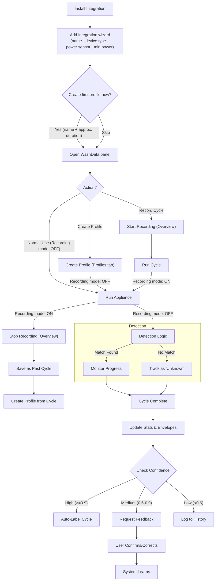
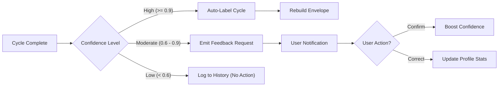
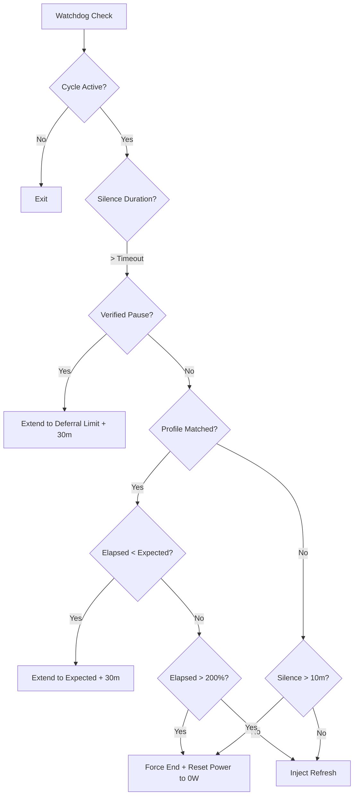
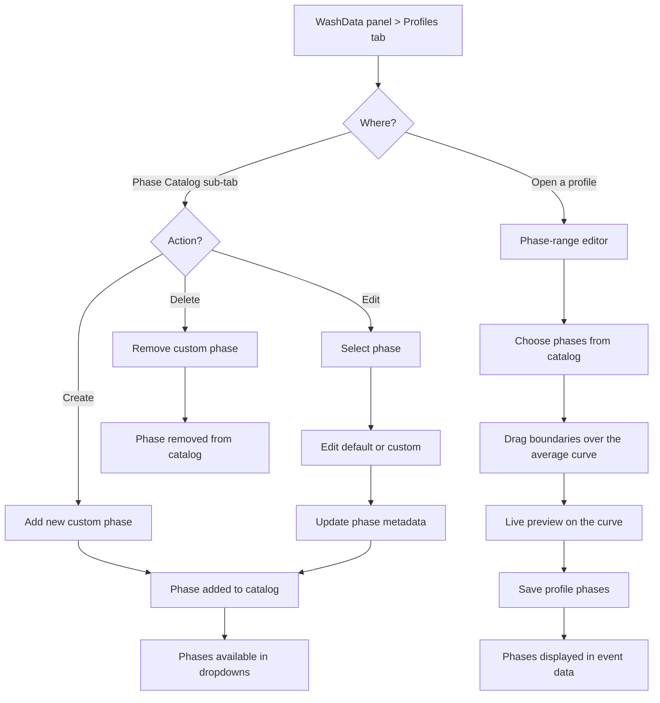

# WashData Implementation Guide

Note: Despite the name, WashData also works well for other appliances (e.g., dryers and dishwashers) as long as the power-draw cycle is reasonably predictable.

## Overview

This document covers the complete implementation of all major features:
1. Variable cycle duration support (configurable tolerance)
2. Smart progress management (100% on complete, 0% after unload)
3. Self-learning feedback system
4. Export/Import with full settings transfer
5. Auto-maintenance watchdog with switch control
6. Robust Cycle State Machine (vNext)
7. Reliability Features

---

## Table of Contents

- [Flows & Processes](#flows--processes)
- [Key Features](#features-implemented)
- [Key Classes & APIs](#key-classes--apis)
- [Event Flow](#event-flow)
- [Configuration](#configuration)
- [Deployment Notes](#deployment-notes)

---

## Flows & Processes

### 1. User Journey Flow
This high-level flow describes how a user interacts with the integration, from initial setup to daily use and feedback.



### 2. Event Processing Pipeline
How raw power sensor data is processed into cycle states.
 
 ```mermaid
 sequenceDiagram
     participant Sensor as Power Sensor
     participant Manager as WashDataManager
     participant Detector as CycleDetector
     participant Matcher as ProfileStore (Async)
     
     Sensor->>Manager: State Change (Power W)
     Manager->>Detector: process_reading(time, watts)
     
     rect rgb(20, 20, 20)
     Note over Detector: State Machine Logic
     Detector->>Detector: Check Gates (Start/End Energy)
     Detector->>Detector: Update State (OFF/RUNNING)
     end
     
     Detector-->>Manager: State Changed (e.g. STARTING -> RUNNING)
     
     loop Every 5 Minutes
         Manager->>Matcher: async_match_profile(current_data)
         Matcher->>Matcher: 5-Stage Pipeline (NumPy/DTW)
         Matcher-->>Manager: MatchResult (Best Profile, Confidence)
         Manager->>Manager: Update Estimations
     end
 ```
 
 ### 3. Cycle Detection State Machine
 The core finite state machine logic governing cycle lifecycle.
 
 ```mermaid
 stateDiagram-v2
     [*] --> OFF
     OFF --> DELAY_WAIT: Standby band held (delay-start, opt-in)
     DELAY_WAIT --> STARTING: Power >= start_threshold_w
     DELAY_WAIT --> OFF: True-off or delay timeout
     OFF --> STARTING: Power >= start_threshold_w (sustained)
     STARTING --> RUNNING: time_above >= start_duration AND energy >= start_energy
     STARTING --> OFF: Gates not met (spike)
     RUNNING --> PAUSED: Power below pause threshold
     PAUSED --> RUNNING: Power back above threshold
     RUNNING --> INTERRUPTED: Abrupt drop early (< interrupted_min_seconds)
     RUNNING --> ENDING: Low-power run begins
     PAUSED --> ENDING: Low-power run sustained
     ENDING --> RUNNING: Power/energy resumes (false end; ML end-guard may defer)
     ENDING --> FINISHED: off_delay + energy gate, or Smart Termination near expected
     ENDING --> FORCE_STOPPED: Watchdog / no-update timeout
     FINISHED --> ANTI_WRINKLE: Dryer tumble pulses (opt-in)
     ANTI_WRINKLE --> OFF: True-off after idle
     FINISHED --> CLEAN: Door sensor configured, laundry not yet removed
     CLEAN --> OFF: Door opened (unloaded); or power-off (opt-in, #284)
     FINISHED --> OFF: Progress-reset delay (default); or power < power_off_threshold for power_off_delay (opt-in, #284)
     INTERRUPTED --> OFF: Progress-reset delay; or power-off (#284)
     FORCE_STOPPED --> OFF: Progress-reset delay; or power-off (#284)
     FINISHED --> [*]
 ```

 > **Terminal → Off is a single owner.** All terminal states (FINISHED / INTERRUPTED / FORCE_STOPPED, plus the CLEAN overlay) return to OFF through one place, `manager._reset_terminal_to_off`, driven by `_handle_state_expiry`. By default that fires after the **Progress Reset Delay**. When the opt-in **Power Off Threshold** (`power_off_threshold_w`, issue #284) is set below `stop_threshold_w`, power-based Off takes over the transition: the terminal state persists until power stays below the threshold for `power_off_delay`, and the progress-reset timer then only clears the progress bar (it no longer forces OFF). `ANTI_WRINKLE → OFF` keeps its own idle/timeout logic in the detector and is unaffected.
 
 ### 4. Matching Pipeline (5-Stage)
 The logic used to identify which profile matches the current cycle.
 
 ```mermaid
 graph TD
     A[Raw Power Data] --> B[Adaptive resample and align]
     B --> C{Stage 1: Fast Reject}
     C -- "Duration ratio < 0.10 or > 1.5" --> D[Discard]
     C -- Pass --> E["Stage 2: Core Similarity (0.45 corr + 0.55 peak-relative MAE)"]
     E --> F["Stage 3: DTW-Lite refine top 5 (ensemble; always on when band > 0)"]
     F --> G["Stage 4: Duration + Energy agreement (0.22 each)"]
     G --> H["Stage 5: Profile groups (collapse cohesive near-duplicates, pick member)"]
     H --> I{"Top-1 score >= 0.4 commit threshold?"}
     I -- No --> M["Unknown / Detecting..."]
     I -- Yes --> J{"Ambiguous? top1 - top2 < 0.05"}
     J -- Yes --> R[Uncertain -> request feedback]
     J -- No --> L[Match Confirmed]
 ```

### 5. Learning Mechanism (Feedback Loop)
How the system adapts to user corrections.




---

## Features Implemented

### 1. Variable Cycle Duration (configurable tolerance)

**Problem:** Real washers don't run for exact programmed times. Load size, water temperature, and soil level cause natural variance of 10-20%.

**Solution:** (the matcher tolerance is configurable; current default **±25%** via `profile_duration_tolerance`)
- Mock socket simulates ±15% realistic duration variance
- Profile matching tolerates up to ±25% variance (was ±50%)
- Better real-world detection accuracy, fewer false negatives

**Files Modified:**
- `devtools/mqtt_mock_socket.py` - Added `--variability` argument for realistic duration variance.
- `custom_components/ha_washdata/profile_store.py` - Updated duration tolerance and matching logic.

**How It Works (Duration Filter):**
```python
# Profile matching logic (Initial Filter)
duration_ratio = actual_duration / expected_duration
# Accepts if within range (current default: 0.10 - 1.5; see const.py MATCH_* / CLAUDE.md)
# This prevents comparing apples to oranges (e.g. 30min vs 2h cycles)
```

**Testing:**
```bash
python3 devtools/mqtt_mock_socket.py --speedup 720 --default LONG
# Watch for: [VARIANCE] Applied ±X.X% duration variance
```

---

### 1b. Cycle Status Classification (✓/⚠/✗)

**Why:** Distinguish natural completions from abnormal endings and restarts.

**Statuses:**
- ✓ `completed` - Natural finish after `off_delay` in low-power wait.
- ✓ `force_stopped` - Watchdog finalized while already in low-power wait; treated as success.
- ✗ `interrupted` - Abnormal early end: very short run or abrupt power cliff that never recovers.
- ⚠ `resumed` - Active cycle restored after HA restart.

**Logic:**
- Detector tracks low-power window and elapsed time; `force_end()` maps to `completed` when low-power wait ≥ `off_delay`, else `force_stopped` and `_should_mark_interrupted` can reclassify short/abrupt runs.

**UI & Scoring:**
- ✓ cases are considered successful; ✗ is flagged as abnormal; ⚠ retains reduced confidence.

---

### 1c. Phase Catalog Scope Model (0.4.3)

**Problem:**
- Users need a single catalog to manage phases across all appliance types.
- At the same time, profile phase assignment should stay device-specific.
- Global phases (empty `device_type`, meaning "All Devices") are present in per-device lists and can appear duplicated in edit/delete selectors.

**Solution:**
- Phase Catalog management view aggregates all device types and renders grouped sections by device label.
- Assign Phase flow keeps strict device-type filtering.
- Edit/Delete selectors now use a scoped internal key (`device_type::phase_name`) and dedupe by `(name, device_type)` so global phases are shown once.

**Implementation Notes:**
- UI selectors in config flow track selected phase name and selected phase scope separately.
- Update/delete operations resolve against the selected scope, preventing accidental edits in the wrong device context.
- Global phases are displayed as "All Devices" and not repeated for each device type.

---

### 2. Progress Reset Logic (100% → 0%)

**Problem:** Progress stayed stuck at last calculated value when cycle ended; no clear completion signal or unload time tracking.

**Solution:**
- Progress reaches 100% immediately when cycle completes (clear signal)
- Progress stays at 100% for the **Progress Reset Delay** (default **30 min**, `progress_reset_delay`) as the unload window
- After that idle window, progress automatically resets to 0% **and** the state returns to Off
- If a new cycle starts within the window, the reset is cancelled
- **Power-based Off (opt-in, #284):** when `power_off_threshold_w > 0` (and below `stop_threshold_w`), the state returns to Off as soon as power stays below the threshold for `power_off_delay` seconds instead of on the timer. In that mode the Progress Reset Delay still clears the progress bar but no longer forces Off, so a finished-but-still-on machine stays in Finished/Clean until it is actually switched off. Evaluated only in terminal states, so a mid-cycle soak is never read as Off; disabled (`0`) leaves behaviour byte-identical.

**Files Modified:**
- `custom_components/ha_washdata/manager.py` - Complete implementation

**State Flow:**
```
RUNNING → COMPLETE
    ↓
Progress = 100% (cycle finished)
Start 30-min idle timer (progress_reset_delay)
    ↓
[Scenarios]
├─ New cycle starts within 30min → Cancel reset, progress → 0%
└─ 30min passes with no activity → Progress → 0% (unload complete)
```

**Implementation Details:**

| Component | Purpose |
|-----------|---------|
| `_cycle_completed_time` | Tracks when cycle finished (ISO timestamp) |
| `_progress_reset_delay` | Configurable idle time (default: 1800s/30min) |
| `_start_state_expiry_timer()` | Begin countdown after cycle end |
| `_handle_state_expiry()` | Async callback checking if idle threshold passed |
| `_stop_state_expiry_timer()` | Cancel reset if new cycle starts |

**Entity Updates:**
```yaml
# During cycle (0-100%)
sensor.washer_progress: "45"

# Cycle ends
sensor.washer_progress: "100"

# After the reset-delay idle window (default 30 min)
sensor.washer_progress: "0"
```

---

### 3. Self-Learning Feedback System

**Problem:** System couldn't learn from users or improve over time; no transparency about why cycles were detected a certain way.

**Solution:**
- Emit feedback request events for high-confidence matches
- Accept user confirmations or corrections via service call
- Learn from corrections (update profile durations conservatively)
- Track all feedback for history and review

**Files Created:**
- `custom_components/ha_washdata/learning.py` (208 lines) - New LearningManager class

**Files Modified:**
- `custom_components/ha_washdata/manager.py` - Integrated learning
- `custom_components/ha_washdata/__init__.py` - Service handler
- `custom_components/ha_washdata/const.py` - Constants

#### Feedback Request Flow

When a cycle completes with high-confidence match:

```yaml
Event: ha_washdata_feedback_requested
Payload:
  cycle_id: "abc123xyz"
  detected_profile: "60°C Cotton"
  confidence: 0.75
  estimated_duration: 60  # minutes
  actual_duration: 62     # minutes
  is_close_match: true
  created_at: "2025-12-17T15:30:00+00:00"
```

#### User Confirmation

Call service to confirm detection was correct:

```yaml
service: ha_washdata.submit_cycle_feedback
data:
  entry_id: "integration_entry_id"
  cycle_id: "abc123xyz"
  user_confirmed: true
  notes: "Perfect detection"
```

#### User Correction

Correct if the detected program was wrong:

```yaml
service: ha_washdata.submit_cycle_feedback
data:
  entry_id: "integration_entry_id"
  cycle_id: "abc123xyz"
  user_confirmed: false
  corrected_profile: "40°C Delicate"
  corrected_duration: 3300  # seconds
  notes: "Was actually a delicate cycle"
```

#### Learning Algorithm (current)

> **Updated:** the old EWMA nudge (`80% old + 20% new`) is **no longer used**. A
> correction now **re-labels the cycle** onto the corrected profile (and fixes that
> cycle's duration), then the profile's envelope is rebuilt and **all** statistics
> (`avg_duration` / `min` / `max`) are **recomputed from the profile's labelled cycles**
> - see `learning.py::_apply_correction_learning`. Expected duration is a **robust
> statistic** over those cycles: `profile_store.filter_duration_outliers()` drops
> outliers with Tukey IQR fences (1.5×IQR), falling back to a MAD-based robust-Z filter
> (≤3.5) when the IQR collapses.

When a user confirms or corrects a cycle:
1. Store the confirmation/correction in feedback history.
2. On a correction, re-label the cycle onto the corrected profile and set its duration.
3. Rebuild the profile envelope and **recompute** its duration statistics from all its
   labelled cycles (outlier-filtered) - no single-correction weighting.
4. Future matches use the recomputed profile stats.

This recompute-from-labelled-cycles approach is more accurate than a running average:
one bad correction can be fixed by re-labelling, and the stats always reflect the
current membership rather than the order corrections arrived in.

#### Accessing Feedback Data

**Get pending feedback:**
```python
manager.learning_manager.get_pending_feedback()
# Returns: {cycle_id: {feedback_data...}}
```

**Get feedback history:**
```python
manager.learning_manager.get_feedback_history(limit=10)
# Returns: [{feedback_record}, ...] sorted by date desc
```

**Get learning statistics:**
```python
manager.learning_manager.get_learning_stats()
# Returns: {
#   "total_feedback": 5,
#   "confirmations": 3,
#   "corrections": 2,
#   "pending": 0
# }
```

#### ML Quality Gate (0.5.0)

When ML models are enabled (`enable_ml_models` option), `manager._compute_cycle_quality_score` runs the `hybrid_curve_quality` model at cycle end and stores `ml_quality_score` (0–1, P(problem)) on the cycle. `learning._maybe_request_feedback` then reads this: if the score is ≥ `ML_QUALITY_SUSPICIOUS_THRESHOLD` (0.65), the auto-label is downgraded to a feedback request even if matcher confidence is high — this catches confident-but-wrong labels caused by ghost cycles or corrupted data.

#### ML Early Match Commit (0.5.0)

During active matching (`manager._async_do_perform_matching`), the `live_match_commit` model scores P(top-1 is correct). When the score is ≥ `ML_MATCH_COMMIT_THRESHOLD` (0.85) AND raw confidence ≥ 0.30, the profile is committed immediately — bypassing the persistence counter (default: 3 consecutive matching calls). This cuts time-to-first-match for clear, distinctive cycles. Falls back to persistence if ML is disabled or the scorer raises.

#### ML Remaining-Time Regressor (0.5.0)

**Problem:** Time-remaining was `matched_profile_duration × (1 − progress)`, i.e. it assumes every run of a program takes the profile's median duration. Real appliances drift — an aging washer, a heavier load, or an eco variant can run materially longer/shorter — and the naive estimate is systematically wrong for those runs.

**Solution:** the first **regression** head in the ML subsystem (all others are logistic classifiers). It predicts the cycle **completion fraction** (elapsed / actual-total) from duration-*invariant* shape features, so a run that will take 1.5× the median is recognized as only half-done when the naive elapsed/median says 75%.

- **Model kind:** `standardized_linear` (ridge). `trainer.fit_ridge` standardizes both features and target and solves the ridge normal equations in closed form (NumPy only); `predict_matrix_spec`/`predict_value_spec` un-standardize via the spec's `output_center`/`output_scale`. No sigmoid, no threshold.
- **No shipped baseline:** unlike the three classifier heads there is no embedded `*_model.py`. `engine.resolve_regressor("remaining_time", store)` returns a predictor only once on-device training has promoted one; otherwise `(None, None)` and live behavior is unchanged.
- **Features** (`feature_extraction.PROGRESS_FEATURE_COLUMNS`): `elapsed_over_expected` (the naive estimate, kept as the first column so the baseline is trivially recoverable), `energy_over_expected`, `mean_power_over_peak`, `recent_power_over_peak`, `tail_slope_norm` (a declining tail ⇒ near the end), `active_fraction`, `elapsed_log`.
- **Training data** (`training_task._progress_dataset`): each clean completed cycle is cut at several elapsed fractions (0.15…0.90); the target is the prefix's true completion fraction. Every stored trace becomes a handful of supervised examples — no manual labeling.
- **Promotion gate** (`training_task._train_regression_capability`): the trained regressor is promoted only when its held-out MAE beats the naive elapsed/expected estimate (feature column 0) by `ML_TRAINING_REGRESSION_MARGIN` (5%). On synthetic variable-duration cycles the model reaches ~0.003 MAE vs ~0.12 naive.
- **Runtime blend** (`manager._ml_progress_percent` → `_update_remaining_only`): the predicted fraction is blended into the phase-aware `phase_progress` at `ML_PROGRESS_BLEND_WEIGHT` (0.5) **before** the existing EMA smoothing/monotonicity guards, and also into the linear-fallback progress. Gated on `enable_ml_models`; a bad model can only nudge, never override, the proven phase estimator, and everything downstream (remaining/total back-calculation) stays consistent because we blend *progress*, not *seconds*.

#### Terminal-Drop Fast Finalize (0.5.0)

**Problem:** When power drops to zero, the detector holds the cycle open for `effective_off_delay = max(off_delay, min_off_gap)` before finalizing — up to **8 min for washing machines**, **1 h for dishwashers** — because a drop to 0 W is indistinguishable from a legitimate soak / drying pause. So a genuinely-stopped cycle (plug pulled, program cancelled) sits "running" for minutes before the integration reacts, even though it correctly labels it *Interrupted* afterwards.

**Solution:** a per-device **anomaly** heuristic (pure statistics, no trained model, like `compute_profile_health`) that lets the detector recognize a drop as *terminal* and finalize fast. It learns, from the device's own history, the earliest point at which that appliance has ever legitimately gone quiet — a drop earlier than that is an anomaly.

- **Baseline** (`profile_store.earliest_sustained_quiet_offset`): the smallest elapsed offset at which any **completed** cycle first shows a sustained (≥ `TERMINAL_DROP_MIN_QUIET_SPAN_S`, 60 s) near-zero span. Only completed cycles seed it — interrupted / force-stopped / terminal-drop cycles are exactly the anomalies being caught, so including them would poison the baseline. The strict *minimum* (not a percentile) is deliberately conservative: one cycle that went quiet early only lowers the baseline, making the detector fire *less* often. Returns `None` (⇒ keep the slow path) below `TERMINAL_DROP_MIN_CLEAN_CYCLES` (3) completed cycles.
- **Familiarity / novelty gate** (`device_active_peak_range` + the `TERMINAL_DROP_PEAK_FAMILIAR_TOL`, 0.4, check in `is_terminal_drop`): an early drop is only trusted as terminal when the cycle's **power level** is one the device has produced before — its peak within the historical `[min, max]` peak band widened by ±40%. A very early drop is *below the matcher's duration gate* (`min_duration_ratio` 0.10), so match confidence is not available that early to confirm the cycle is recognized; power level is the familiarity signal that *is* available. A cycle drawing power unlike anything in its history is treated as a possible **new program** and **deferred** to the proven slow path rather than assumed to be a stop — the guard against a first-ever program that legitimately goes quiet early being mistaken for a pulled plug.
- **Provider** (`manager._terminal_drop_provider`, baselines cached via `_terminal_drop_baseline` keyed by cycle count): delegates to the pure `profile_store.is_terminal_drop(...)`, which requires all of — clearly ON (peak ≥ `TERMINAL_DROP_MIN_PEAK_RATIO` × stop-threshold), familiar (above), and anomalous (trailing cliff began `< TERMINAL_DROP_EARLINESS_RATIO` × quiet-baseline). Gated on `enable_ml_models`; returns `False` (fully inert) when off.
- **Runtime** (`cycle_detector._is_terminal_drop` in the `STATE_ENDING` fallback): when the provider confirms terminal, the cycle finalizes once power has been sub-threshold for `TERMINAL_DROP_OFF_DELAY_SECONDS` (90 s) — bypassing the energy/defer gates, because the sustained quiet span already proves the appliance is off and the anomaly check has ruled out an early pause — stamping `TerminationReason.TERMINAL_DROP` and status `interrupted`. Reaction drops from ~8–10 min to ~2 min.
- **Asymmetry:** the exact mirror-image of the ML end-guard. The end-guard can only ever *defer* a finish (never end early); the terminal-drop detector can only ever *shorten* the wait (never end a normal cycle early, since a normal end's drop is not earlier than the device's learned quiet baseline).

#### Cycle Artifact Detection (0.5.0)

**Problem:** Real cycles contain transient artifacts — most commonly a user opening a dishwasher/washer mid-cycle to add an item (power drops to ~0 and resumes), plus sustained out-of-band dips/spikes. These were invisible: nothing flagged them or explained an odd-looking trace.

**Solution:** `ProfileStore.detect_cycle_artifacts(profile_name, points)` reuses the envelope-conformance resampling to compare the trace against the matched profile's `[lower, upper]` band and classify contiguous deviating segments: a **`pause`** (near-zero where the profile expects activity *and* it resumes afterward — excluded at the very end, which is just the cycle finishing), a sustained below-band **`dip`**, or above-band **`spike`**. Each event is `{type, start_s, end_s, detail (plain English), severity}` in the trace's own time offsets; the list is capped to the most significant few, chronological. Pure statistics (no ML), never raises.

Frozen onto `cycle_data["artifacts"]` at cycle end (`manager._async_process_cycle_end`) and served by `ws_get_cycle_power_data` (stored, or computed on the fly for older cycles). The panel **shades each artifact span** on the cycle graph (`_drawCycleEditor` bands), surfaces the detail in the existing hover readout (`_onGraphHover` reads `wd.artifacts`), lists them under the graph, and shows a ⚠ badge in the Cycles list. No new notification — artifacts live on the graph where users inspect. The events also double as candidate labels for a future supervised anomaly model (the "runtime anomaly model" idea), which needs labeled examples this detector begins to accumulate.

#### Runtime Overrun Anomaly (0.5.0)

**Problem:** Users had no *visible*, device-agnostic signal that a running cycle is taking materially longer than usual. Pump-stuck fires an event (pump-only), and the zombie-killer only acts at 300% (hard termination) — nothing surfaced the common "this ran long" case for the UI.

**Solution:** `manager._update_cycle_anomaly` sets `_overrun_ratio = elapsed / expected` each estimate tick and flags `_cycle_anomaly = "overrun"` once the ratio crosses `CYCLE_OVERRUN_ANOMALY_RATIO` (1.5). It is deliberately **soft**: purely a visible signal, **never a notification** and **never a termination** (the zombie-killer still owns hard limits). Surfaced three ways, all in existing places: (1) `cycle_anomaly`/`overrun_ratio` attributes on the **State** sensor while running; (2) frozen onto the cycle as `cycle_data["anomaly"]`/`["overrun_ratio"]` at end; (3) an ⏱ badge in the panel's Cycles list. Cleared on idle/off and when no profile is matched; never raises.

#### Profile Advisories (0.5.0)

**Problem:** The per-profile signals (health, duration/energy trends) were surfaced as scattered badges; users had no consolidated, *actionable* "what should I do about this profile" view.

**Solution:** `ProfileStore.compute_profile_advisories` (pure statistics; reuses `compute_profile_health` + `compute_profile_trends`) returns a ranked list of `{profile, severity, code, message}` recommendations — e.g. poor fit → "review its cycles or re-record", durations trending longer → "if the appliance changed, re-record/rebuild", energy trending up → "worth checking the appliance". A profile already flagged `poor` suppresses its (redundant) trend advice. Returned by `ws_get_profiles` as `profile_advisories` and rendered as a **Recommendations** banner in the panel's Profiles tab — an existing surface, **never a notification**. Warnings rank before info; `[]` on error.

#### Progress-Driven Phase Estimate (0.5.0)

**Problem:** The per-profile phase configurator (users draw phase ranges on a profile's envelope; `get_profile_phase_ranges`) fed `check_phase_match`, but keyed on **raw elapsed seconds**. When a cycle runs longer/shorter than the profile's nominal timeline the phase readout drifts (e.g. shows "Spin" while still washing). It was effectively a *visual* configurator whose output didn't track reality.

**Solution:** `manager._current_phase_from_progress` makes that one configurator *functional* by indexing the same phase ranges with the **live ML-blended progress fraction** instead of raw elapsed: `position = progress_fraction × (max phase end)`, then the existing `check_phase_match` lookup. `phase_description` prefers this live phase, falling back to the matcher's `matched_phase` then the detector state. No second phase system — one definition (the visual ranges), driven by the progress estimator (which already carries the remaining-time regressor blend). Returns `None` (clean fallback) when not running, no profile is matched, or the profile has no configured ranges, so existing setups are unaffected. This also lays the groundwork for a future on-device phase classifier: the per-profile ranges + labelled cycles are the training labels — no separate per-cycle labeler needed.

#### Projected Energy & Cost (0.5.0)

**Problem:** WashData already freezes each *completed* cycle's `energy_kwh`/`cost` from a configured price (`CONF_ENERGY_PRICE_STATIC`/`CONF_ENERGY_PRICE_ENTITY`), but users had no in-flight estimate of what the *running* cycle will use/cost.

**Solution:** `manager._update_projected_energy` prefers the on-device `total_energy` regressor (`manager._ml_energy_total`) and falls back to `accumulated_energy ÷ progress_fraction` when it is unavailable/inert. Cost uses the same price resolution used at cycle end (so the running estimate and the final frozen value are consistent). It clears below a `_PROJECTION_MIN_PROGRESS` (3%) floor, never projects below energy already consumed, and never raises. Surfaced as `projected_energy_kwh` / `projected_cost` **attributes** on `WasherProgressSensor` (no new entity or translations); keys are omitted when idle or too early in a cycle.

#### Total-Energy Regressor (0.5.0)

**Problem:** the `energy_so_far ÷ progress_fraction` projection assumes energy accumulates *linearly with time*. It doesn't — appliances with an early heating phase front-load energy (at 40% of the way through time you may already be at ~85% of total energy), so the time-based projection reads high early in the cycle.

**Solution:** a second `standardized_linear` on-device regressor (capability `total_energy`, target = **energy-completion fraction** `energy_so_far / final_energy`) built on the *same* feature vector as the remaining-time model (`progress_features` / `PROGRESS_FEATURE_COLUMNS`) — only the training label differs. `training_task._energy_dataset` synthesizes the labels from cut prefixes of clean cycles. Its held-out MAE is gated against the naive `elapsed_over_expected` baseline (which *is* the current time-based projection), so it is promoted **only when it beats the existing method**. `manager._ml_energy_total` predicts the fraction and returns `energy_so_far / fraction` (floored so an under-confident prediction can't blow up), which `_update_projected_energy` prefers. No shipped baseline → inert until on-device training promotes one; behaviour is unchanged when the ML opt-in is off.

---

### 3b. Profile Health Heuristic (0.5.0)

**Problem:** Profiles can silently degrade over time as new cycles get assigned that don't actually match the profile's shape, or as the appliance behavior changes.

**Solution:** `ProfileStore.compute_profile_health()` computes per-profile health indicators from labeled cycle history — no ML required, pure statistics:
- `duration_cv`: coefficient of variation of cycle durations (low = consistent)
- `confidence_mean`: mean match confidence across labeled cycles
- `health_score`: `0.5 × (1 − duration_cv/0.5) + 0.5 × confidence_mean`
- `health_status`: "healthy" (≥0.65) / "fair" (0.40–0.64) / "poor" (<0.40) / "unknown" (<3 cycles)

Surfaced via `ws_get_profiles` (added to its response as `profile_health`) and shown as inline badges (⚠ poor fit, fair fit) on profile cards in the panel's Profiles tab and as a health banner in each profile's Overview modal.

---

### 3c. Profile Trends, Coverage Gaps & Envelope Conformance (0.5.0)

Three more **pure-statistics (no ML)** heuristics extend the health picture. All live in `profile_store.py`, never raise (return empty/`None` on error), and — for the first two — ride along in the `ws_get_profiles` response next to `profile_health`.

**Profile Trends** — `compute_profile_trends(min_cycles=12, recent_window=8, slope_threshold_pct=0.08)`
- Fits an ordinary-least-squares line to each profile's per-cycle duration (and energy, when the cycles carry it), then normalizes the slope to **% of the profile mean per cycle** so it is comparable across appliances.
- Classifies each series `up` / `down` / `stable` against `slope_threshold_pct`; returns `duration_trend`, `duration_slope_pct`, `duration_recent_mean_s` (+ the energy analogues), `cycle_count`, and `recent_window`.
- A rising duration trend is a maintenance signal (e.g. a washer taking progressively longer). Surfaced as a trend badge (↑/↓) on profile cards and a drift banner with a maintenance advisory in the Profiles stats tab. Response key: `profile_trends`.

**Coverage Gaps** — `suggest_coverage_gaps(recent_window=30, min_unmatched=5, min_unmatched_rate=0.20, low_confidence_threshold=0.40, duration_bucket_s=900.0)`
- Scans the most recent `recent_window` cycles, counting unmatched (no `profile_name`) and low-confidence cycles, and buckets the unmatched ones into 15-minute duration bins (only bins with ≥2 members become clusters).
- Sets `suggest_create` when unmatched count ≥ `min_unmatched` **and** unmatched rate ≥ `min_unmatched_rate`. Returns `unmatched_count`, `low_confidence_count`, `unmatched_rate`, `suggest_create`, and `duration_clusters` (largest first). `{}` when below the floor or on error.
- Drives a coverage-gap banner (unmatched count/rate + duration-cluster hints + a `data-action="create-profile"` button) in the Profiles tab. Response key: `coverage_gaps`.

**Envelope Conformance** — `compute_envelope_conformance(profile_name, points)`
- Resamples a completed cycle's trace onto the matched profile envelope's time grid (scaling by `elapsed/env_duration`, clamping to the grid ends so shorter/longer cycles still score), then returns the fraction of samples inside the `[lower, upper]` band as `conformance` (`outside_frac = 1 − conformance`), plus `samples`/`envelope_name`. `None` when there is no envelope or fewer than 4 points.
- Complementary to `MatchResult.confidence`: confidence measures shape **correlation**, conformance measures absolute power **level/spread**. A cycle can correlate well in shape yet run at the wrong wattage.
- Computed at cycle end in `manager._async_process_cycle_end` and stored on `cycle_data["envelope_conformance"]`. `learning._maybe_request_feedback` treats `conformance < 0.40` as a second auto-label downgrade trigger (independent of the ML quality gate): a high-confidence match whose power level is inconsistent with the profile is downgraded to a feedback request rather than silently auto-labeled.

---

### 4. Export/Import with Full Settings Transfer

**Problem:** Users needed to manually reconfigure all settings when setting up multiple devices or migrating to new instances.

**Solution:**
- Export all cycles, profiles, feedback history, AND all fine-tuned settings as JSON
- Import via UI (copy/paste, no filesystem needed) or file-based service
- Automatic orphaned profile cleanup during import
- Per-device isolation maintained via entry_id

**Files Modified:**
- `profile_store.py` - `export_data(entry_data, entry_options)`, `async_import_data(payload)` now handle config
- `config_flow.py` - New `async_step_export_import()` with JSON textarea
- `__init__.py` - Services updated to pass entry.data/options to export/import
- `strings.json` & `translations/en.json` - New UI labels and descriptions

**What's exported:**
```python
{
  "version": STORAGE_VERSION,
  "entry_id": "unique_id",
  "exported_at": "ISO timestamp",
  "data": {
    "profiles": {...},
    "past_cycles": [...],
    "feedback_history": [...]
  },
  "entry_data": {
    # power_sensor, name (device-specific - NOT imported)
  },
  "entry_options": {
    # ALL fine-tuned settings: min_power, off_delay, learning_confidence, etc.
  }
}
```

**UI Access:**
- Panel → **Advanced** tab → **Diagnostics** → **Export / Import**
- **Export to JSON** downloads the full backup
- **Import from JSON** pastes exported data (or an HA diagnostics download)
- All settings and profiles are applied on import

**Service Usage:**
```yaml
service: ha_washdata.export_config
data:
  device_id: "washer_device_id"
  path: "/config/ha_washdata_export.json"

service: ha_washdata.import_config
data:
  device_id: "washer_device_id"
  path: "/config/ha_washdata_export.json"
```

### 5. Auto-Maintenance Watchdog

**Problem:** Deleted cycles left orphaned profile labels; fragmented runs cluttered history.

**Solution:**
- Nightly cleanup at midnight (configurable via switch)
- Removes profiles referencing deleted cycles
- Merges fragmented cycles (last 24h, max 30min gaps)
- Logs maintenance statistics
- User can toggle on/off via `switch.<name>_auto_maintenance`

**Files Created:**
- `switch.py` - New AutoMaintenanceSwitch entity (mdi:broom icon)

**Files Modified:**
- `profile_store.py`:
  - `cleanup_orphaned_profiles()` - Remove profiles with dead cycle references
  - `async_run_maintenance(lookback_hours, gap_seconds)` - Full maintenance run
- `manager.py`:
  - `_setup_maintenance_scheduler()` - Schedule midnight task
  - `_remove_maintenance_scheduler` - Cancel scheduler
  - Enhanced `async_shutdown()` to clean up scheduler
- `const.py` - Added `CONF_AUTO_MAINTENANCE`, `DEFAULT_AUTO_MAINTENANCE=True`
- `__init__.py` - Registered Switch platform

**Maintenance Workflow:**
```
Daily at 00:00
    ↓
ProfileStore.async_run_maintenance()
    ├─ 1. cleanup_orphaned_profiles()
    │  └─ Remove profiles referencing non-existent cycles
    ├─ 2. merge_cycles(lookback_hours=24, gap_seconds=1800)
    │  └─ Merge fragmented runs from past 24h (≤30min gaps)
    └─ 3. Save and log stats
```

**Switch Entity:**
- `switch.<name>_auto_maintenance` (default: ON)
- Toggle to enable/disable nightly cleanup
- When toggled, scheduler is re-setup accordingly
- Toggling OFF cancels scheduled cleanup

### 6. Robust Cycle State Machine (vNext)

**Problem:** Simple ON/OFF logic failed with pauses, soaking, or "Anti-Crease" modes.

**Solution:**
- Implemented a formal State Machine: `OFF` -> `STARTING` -> `RUNNING` <-> `PAUSED` -> `ENDING` -> `OFF`.
- **OFF**: Monitoring for `min_power`.
- **STARTING**: Debounce phase. Requires `start_duration_threshold` AND `start_energy_threshold` (e.g. 5Wh) to confirm.
- **RUNNING**: Main active state.
- **PAUSED**: Entered if power drops low but not long enough to end. Allows for soaking or door opening.
- **ENDING**: Candidates for completion. Must satisfy `off_delay` AND `end_energy_threshold` (e.g. < 50Wh in last window) to finish.

**Benefits:**
- Eliminates false starts from brief spikes.
- Prevents false endings during long pauses if energy was high recently.
- Handles "Anti-Crease" (periodic tumbles) gracefully via `PAUSED`/`ENDING` transitions.

### 7. Reliability Features

**Goal:** Improve precision for similar cycles and reduce "stuck" time estimates.

#### A. Shape vs level weighting (Shape Matching)
**Problem:** Cycles with identical duration but different phases (e.g. Eco vs Intensive) were hard to distinguish.
**Solution (current):** The old correlation "confidence boost" (×1.2 when `corrcoef > 0.85`) was **removed** in the matching overhaul; it hurt the leave-one-out net metric. Stage 2 now scores `45% correlation + 55% peak-relative MAE`, and near-duplicate same-device programs are separated by the Stage 4 duration/energy agreement term and Stage 5 profile groups instead. See `CLAUDE.md` → *Matching Pipeline Details*.

#### B. Smart Time Prediction (Variance Locking)
**Problem:** Time remaining jumped erratically during variable phases (e.g. heating water).
**Solution:**
- System calculates standard deviation (variance) of the matched profile window.
- If variance is high (>50W std dev): Time estimate updates are **damped** (locked).
- If variance is low: Time estimate updates normally.
- **Switching Logic (Match Persistence)**: To prevent "flapping" between profiles or between a profile and "detecting...", the system enforces temporal persistence:
    - **Initial Match**: Requires 3 consecutive matching attempts before switching from "detecting..." to a specific profile.
    - **Unmatching**: Requires 3 consecutive attempts with confidence below the `unmatch_threshold` before reverting to "detecting...".
    - **Mid-Cycle Override**: Requires 3 consecutive attempts AND a minimum confidence gap of **0.15** (High Confidence) or **0.05** (Positive Trend) to switch between different profiles.
- **Divergence Detection**: Implemented a "Score-Drop" check to handle cycles that start similar but diverge later. If the current matching confidence falls below a configured ratio (default 40% drop) of the peak score recorded for that cycle, the manager automatically reverts to "Detecting...". This prevents the integration from staying locked to an incorrect long profile when a shorter one ends.
 
#### C. Smart Termination & End Spike Logic
**Problem:** Dishwashers often have a long silent drying phase followed by a brief, high-power pump-out spike. Smart termination would sometimes cut the cycle off early (during drying), missing the final spike and causing the spike to trigger a new "ghost" cycle.

**Solution:**
- **Conservative Ratio**: Dishwashers require **99%** of expected duration before Smart Termination is even considered (vs 98% for others).
- **End Spike Wait Period**: Even if the duration is met, the system scans the "Ending" state for a high-power spike.
- If no spike is found, it **waits up to 5 extra minutes** past the expected duration to catch it.
- **Ghost Cycle Suppression**: A "Suspicious Window" (20 mins) protects legitimate short cycles. Aggressive ghost cycle termination (10 min timeout) only applies if a cycle starts within 20 mins of the previous one ending.
- **Persistence**: This 20-minute window logic persists across Home Assistant restarts by restoring `_last_cycle_end_time` from the persistent `profile_store`, ensuring protection isn't lost after a reboot.
- **Tail Preservation**: The profile store now explicitly preserves trailing silence/spikes for natural completions, preventing the "profile shrinking" feedback loop where frequent early terminations made the learned profile shorter and shorter.
- **Strict Deferral**: To prevent termination hangs on mismatched profiles, the "Deferred Finish" logic now requires either a `verified_pause` (confirmed by profile envelope alignment) or high match confidence (default > 0.55).
 
#### D. Zombie Protection & Stuck Power Prevention
**Problem:** Power sensors could become "stuck" at non-zero values if a smart plug failed to push the final 0W update. Conversely, long pauses in dishwashers (e.g. drying) could trigger a watchdog kill, prematurely ending a legitimate cycle.

**Solution:**
- **Profile-Aware Watchdog**: The watchdog now checks the `expected_duration` from the matched profile. If the cycle is currently within its expected runtime (even if silent for > 60 mins), the watchdog automatically extends the timeout.
- **Verified Pause Support**: For devices like dishwashers with multi-hour silent drying phases, the watchdog detects a `verified_pause` (via profile alignment). When active, the timeout is extended to **DEFAULT_MAX_DEFERRAL_SECONDS** (2 hours) plus a 30-minute buffer, ensuring the cycle is not killed even if it exceeds its original expected duration during the pause.
- **Zombie Killer (Hard Limit)**: To prevent runaway "ghost" cycles, a hard termination limit is enforced at **200%** of the expected profile duration (minimum 2 hours).
- **Stuck Power Reset**: When the watchdog or detector forces a cycle to end (due to timeout or manual stop), the `current_power` state is explicitly reset to **0.0W**, ensuring Home Assistant entities reflect reality even if the hardware sensor fails to report the final drop.
- **Low-Power Bypass**: Power readings below `min_power` now bypass all debouncing, smoothing, and throttling filters in `manager.py`, ensuring the "cycle end" signal is processed with zero latency.

**Watchdog Logic Flow:**



## Key Classes & APIs

### WashDataManager (manager.py)

**Main entry point for cycle management.**

| Method | Purpose |
|--------|---------|
| `async_setup()` | Initialize, load state, setup listeners |
| `async_shutdown()` | Cleanup, save state |
| `_async_power_changed(event)` | Handle power sensor updates |
| `_update_estimates()` | Match profiles, set entities (every 5 min) |
| `_on_state_change(old, new)` | Handle detector state transitions |
| `_on_cycle_end(cycle_data)` | Finalize cycle, request feedback |
| `_start_state_expiry_timer()` | Begin 5-min reset countdown |
| `_handle_state_expiry()` | Async callback checking if idle threshold passed |
| `_watchdog_check_stuck_cycle()` | Profile-aware watchdog (Zombie protection) |
| `_stop_state_expiry_timer()` | Cancel reset if new cycle starts |
| `_maybe_request_feedback()` | Emit feedback request if confident |

**Properties:**
```python
manager.learning_manager  # LearningManager instance
manager._last_match_confidence  # Last profile match score
manager._cycle_completed_time  # When cycle finished (ISO)
```

### LearningManager (learning.py)

**Handles user feedback and profile learning.**

| Method | Purpose |
|--------|---------|
| `request_cycle_verification(cycle_data, confidence)` | Flag cycle for user verification |
| `submit_cycle_feedback(cycle_id, user_confirmed, corrected_profile, corrected_duration, notes)` | Accept user input |
| `_apply_correction_learning(profile_name, corrected_duration)` | Update profile (80%/20% weighting) |
| `get_pending_feedback()` | Return cycles awaiting input |
| `get_feedback_history(limit=10)` | Return recent feedback |
| `get_learning_stats()` | Return learning metrics |

### ProfileStore (profile_store.py)

**Manages cycle storage, compression, and profile matching.**

| Method | Purpose |
|--------|---------|
| `async_match_profile(power_data, duration)` | Match cycle to profile (confidence 0-1) |
| `create_profile(name, cycle_id)` | Create new profile from cycle |
| `async_save_cycle(cycle_data)` | Compress and save cycle |
| `merge_cycles(hours, gap_threshold)` | Auto-merge fragmented cycles |

**Duration Matching:**
- Tolerance: ±25% (was ±50%)
- Rejects: duration_ratio < 0.10 or > 1.5
- Accounts for realistic variance

## Recent Test Expansion Findings (2026-02-04)

During the expansion of the test suite (Phase 4), several minor issues and areas for improvement were identified:

1.  **ProfileStore.async_import_data Return Value**: The method correctly returns a dict with `entry_data` and `entry_options` keys extracted from the payload.
2.  **CycleDetector Minimum Samples for Matching**: The matching logic requires at least 12 samples after resampling. Highly irregular data with large gaps (e.g., 250s) can lead to failed matches if the total cycle duration is short, even if the "shape" is recognizable.
3.  **Timezone Sensitivity in decompress_power_data**: The isoformat() conversion in decompress_power_data uses datetime.fromtimestamp(ts) which defaults to local time. This can cause mismatches in tests comparing against UTC strings. Using dt_util.utc_from_timestamp or always using aware datetimes is recommended.
4.  **ProfileStore.delete_cycle is Async**: Some older test code or assumptions might treat it as sync. It MUST be awaited as it triggers async_rebuild_envelope and async_save.

---

### 8. Device Type Specifics

The integration includes specialized handling for different appliance types to account for their unique power profiles:

- **Washing Machine**: Standard defaults; handles repeating wash/rinse phases.
- **Dryer**: More linear power curve; shorter pauses.
- **Washer-Dryer Combo**: Uses washing-machine defaults extended to cover the optional dry leg.
- **Dishwasher**: Multi-hour silent drying phases; end pump-out spikes; requires multi-hour watchdog extensions and conservative smart termination.
- **Air Fryer**: High constant load with thermostat-driven dropouts; explicit user-set timer per cycle.
- **Bread Maker**: Long programs with low-power proving/rising phases; 2-hour active-timeout to bridge those silences.
- **Pump / Sump Pump**: Sharp on/off with no warm-down; stuck-alarm watchdog rather than profile matching is the primary feature.
- **Other (Advanced)**: Generic bucket for appliances that do not fit one of the supported classes. Ships intentionally generic defaults that are not tuned for any specific appliance; no curated phase catalog; no device-type-specific runtime branching. The user is expected to configure thresholds, timeouts, and matching parameters themselves. Also the runtime fallback for entries whose device type is hard-removed after deprecation.

**Deprecated (0.4.4.3, scheduled removal 0.6.0)**: Electric Vehicle, Coffee Machine, Heat Pump, and Oven. Existing setups continue to work; these types fail at least one of WashData's three appliance fit tests (user-selected discrete program, reproducible power signature, clean return to OFF) so matching produces noise rather than signal. The new-entry dropdown filters them out, and existing entries on a deprecated type are recommended to migrate to a supported type or to **Other (Advanced)**.

---

## 9. Phase Management System

### Overview
Phases are **purely informational labels** that segment a cycle into meaningful time-based regions (Wash, Rinse, Spin, etc.). They do **NOT** affect cycle detection, profile matching, or time estimation - these all use power-curve analysis independently.

### Architecture
```text
Phase Catalog (Default + Custom)
    ↓
Device-Type Filtering
    ↓
Phase Assignment (Offset-Based Ranges)
    ↓
SVG Visualization (Power Curve + Phase Spans)
```

### Key Concepts

**1. Phase Catalog**
- **Default Phases**: Predefined phases for each device type (Washing Machine: Pre-Wash, Wash, Rinse, Spin, Soak, Anti-Crease)
- **Custom Phases**: User-created phases per device type (e.g., "Eco Mode", "TurboWash")
- **Device-Type Scoping**: Each phase is associated with a device type, ensuring only relevant phases appear in UI dropdowns

**2. Phase Assignment**
- **Time-Based Ranges**: Phases are defined as offset-based ranges from cycle start (e.g., "Wash: 5-15 minutes")
- **Per-Profile Assignment**: Each profile can have its own phase segmentation
- **Validation**: Overlapping ranges are rejected; ranges must be contiguous with cycle duration

**3. Phase Visualization**
- **SVG Power Curve Chart**: Interactive chart showing:
  - Average power curve (blue line) from all cycles in the profile
  - Colored phase spans (semi-transparent rectangles) 
  - Dashed gating lines at phase boundaries
  - Time axis (0/mid/total minutes)
  - Legend with phase names and ranges
- **Real-Time Updates**: Chart refresh as user edits phase ranges in the assignment dialog

### Workflow: Creating & Assigning Phases



### API Reference

**ProfileStore Methods:**
```python
list_phase_catalog(device_type: str) → list[dict]
    # Returns merged default + custom phases for device

list_custom_phases(device_type: str) → list[dict]
    # Returns only user-created phases (and overrides of defaults)

async_create_custom_phase(device_type: str, name: str, description: str)
    # Create new phase in catalog

async_update_custom_phase(device_type: str, old_name: str, new_name: str, description: str)
    # Edit phase (default or custom). If editing a default phase, creates an override entry.
    # Cascades rename to all assigned profiles.

async_delete_custom_phase(device_type: str, name: str)
    # Remove custom phase from catalog (removes all assignments)
    # Note: Only custom phases can be deleted; defaults are immutable.

get_profile_phase_ranges(profile_name: str) → list[dict]
    # Get phase assignments for a profile

async_set_profile_phase_ranges(profile_name: str, ranges: list[dict])
    # Update phase assignments (validates no overlap)
```

### Storage Format

**Phase Catalog (in `_data["_custom_phases"]`):**
```json
{
  "name": "Eco Mode",
  "description": "Energy-saving cycle",
  "device_type": "washing_machine",
  "created_at": "2026-03-11T14:30:00+00:00"
}
```

**Profile Phase Assignment (in `_data["profiles"][profile_name]["phases"]`):**
```json
{
  "name": "Pre-Wash",
  "start": 300,      // seconds from cycle start
  "end": 900,        // seconds from cycle start
  "description": ""
}
```

### Important Notes

1. **Detection Independence**: Phases are NOT used in:
   - Cycle start/end detection (uses power thresholds)
   - Profile matching (uses power curve similarity)
   - Duration estimation (uses avg_duration from profile)
   - Any matching or analysis logic

2. **Metadata Only**: Phases are display labels that:
   - Appear in event data when a cycle is running
   - Show on the dashboard card (if enabled)
   - Help users understand cycle progression
   - Aid in manual recording validation

3. **Cascade Updates**: 
   - If a phase is renamed in the catalog, all profiles using that phase are updated
   - If a phase is deleted from catalog, all assignments are removed
   - Profile rename does NOT update phase catalogs

4. **Device-Type Filtering**:
   - Phase dropdowns in assignment dialogs automatically filter to current device type
   - Custom phases created for one device type don't appear in other device types
   - Default phases are immutable but **CAN be edited** to create device-specific overrides
   - When editing a default phase, an override entry is created in the custom phases list

5. **Editing Default Phases**:
   - Select "Edit Phase" in the catalog manager
   - Choose any phase (default or custom) from the dropdown
   - Modify the name and/or description
   - An override entry is automatically created for default phases
   - This allows device-specific customization without affecting the built-in defaults

---

### Setting Conflict Validation (0.5.0)

WashData has over 180 tunables; many pairs have ordering constraints that the runtime enforces silently (e.g. by ignoring a setting when it violates a guard). Conflict validation makes those constraints **visible and fixable** before saving.

#### Conflict rules

Fourteen constraints are checked, covering:

| Rule | Constraint | Why it matters |
|------|-----------|----------------|
| **Hysteresis band** | `start_threshold_w > stop_threshold_w` | The cycle-detector state machine requires start > stop; equal values collapse the hysteresis band and cause rapid toggling |
| **Min power / stop** | `min_power <= stop_threshold_w` | `min_power` is a display/filter floor; values above stop silently discard all readings and prevent detection |
| **Power-off / stop** | `power_off_threshold_w < stop_threshold_w` | The runtime disables power-off detection when this threshold is ≥ stop; setting it there is a silent no-op |
| **Off delay / min off gap** | `off_delay <= min_off_gap` | Off Delay exceeding Min Off Gap lets two consecutive cycles merge into one |
| **Watchdog / sampling** | `watchdog_interval >= 2 × sampling_interval` | A watchdog firing in less than one sampling period can kill a healthy cycle mid-reading |
| **No-update timeout / watchdog** | `no_update_active_timeout > watchdog_interval` | The watchdog must fire before the cycle is force-stopped, not after |
| **Start duration / sampling** | `start_duration >= sampling_interval` | A start-duration shorter than the sampling interval means a single spike can open a cycle |
| **Confidence ordering** | `learning_confidence ≤ match_threshold ≤ auto_label_confidence` | All three thresholds form a strict ladder; inverting any pair breaks the auto-label / review / ignore routing |
| **Unmatch / match** | `unmatch_threshold < match_threshold` | An unmatch threshold at or above the match threshold instantly un-matches every commit |
| **Anti-wrinkle exit / stop** | `anti_wrinkle_exit_power < stop_threshold_w` | The exit power marks the true-off state for anti-wrinkle mode; if it is at or above stop, the runtime uses `max(exit, stop)`, making the setting a no-op *(washing machine / dryer / washer-dryer only)* |
| **Anti-wrinkle max / start** | `anti_wrinkle_max_power > start_threshold_w` | The max-power cap for anti-wrinkle mode must exceed start threshold or the duration limit is never applied *(washing machine / dryer / washer-dryer only)* |
| **Pump stuck / no-update timeout** | `pump_stuck_duration < no_update_active_timeout` | The pump-stuck alarm must fire before the watchdog force-stops the cycle *(pump / sump-pump only)* |
| **Duration ratio** | `profile_match_min_duration_ratio < profile_match_max_duration_ratio` | Inverted min/max eliminates all candidates at the first matching stage |

#### Frontend (panel)

`_SETTING_CONFLICTS` (a `const` array in `ha-washdata-panel.js`) encodes all 14 rules as objects with three fields:
- `keys` — the setting keys involved
- `check(vals)` → bool — returns `true` when the constraint is violated. Device-type-specific rules include a guard: the anti-wrinkle rules check `['washing_machine','dryer','washer_dryer'].includes(v.device_type)`; the pump-stuck rule checks `v.device_type === 'pump'`. `vals` always includes `device_type` via `_readSettingsFormValues` (which merges `this._opts`, and `this._opts` is populated from `get_options` which returns merged `entry.data + entry.options`).
- `fieldErrors(vals)` → map — for each affected key, returns `{msgKey, msgVars, msgFb, fixVal}` where `fixVal` is a safe corrected value

`_readSettingsFormValues(sr)` merges DOM form values (from the current settings section) over `this._opts` (last-saved values for off-screen fields), so cross-section conflicts (e.g. `min_power` in the Basic section vs `stop_threshold_w` in the Detection section) are caught even when the two fields are not on-screen simultaneously.

`_liveValidateSettings(sr)` runs every conflict rule on every `input` / `change` event and on initial render, adding a red `wd-conflict-row` below each affected field (with the translated message and a **Use X** fix button) and an `wd-has-conflict` outline. It returns the map of active conflicts; `_saveSettings()` blocks if it is non-empty.

**Conflict-suggestion coherence**: When `_liveValidateSettings` emits an error for a field, it checks whether a pending suggestion for that same field would resolve the constraint. It builds a `suggMap = {key: +s.suggested}` from `this._suggestions`; for each `(key, info)` returned by `rule.fieldErrors(vals)`, if `suggMap[key]` exists and applying that suggestion value passes `rule.check({...vals, [key]: sugV})`, the error object is tagged `{...info, suggFix: sugV}`. The rendered row then shows a `<span class="wd-conflict-sug-note">` with the translation key `conflict.suggestion_resolves` ("Stage the pending suggestion (X) below to fix this") instead of the generic **Use X** fix button. `_cascadeConflictFix` skips entries tagged with `suggFix` (they carry no `fixVal`), so the cascade loop never fights a pending suggestion.

**Cascade fix** (`_cascadeConflictFix`): clicking **Use X** triggers a loop that fixes the clicked field, then re-validates and automatically applies the next downstream fix, repeating until stable. Fields in the current section update their DOM inputs directly; fields in other sections (off-screen) update `this._opts` in memory and are tracked in `this._cascadePending`. `_saveSettings()` prefixes the `updates` payload with `_cascadePending` so off-screen cascade values are included in the next save even though they never enter a DOM input. `_cascadePending` is cleared on successful save, Refresh, or Apply Suggestions. The same cascade also fires when a tuning suggestion's **Use** button is clicked: after staging the new value in `this._opts` and re-rendering the settings form, `_cascadeConflictFix` runs with the suggestion key as `initialKey` so downstream settings are auto-fixed in the same interaction.

**Revert changes button**: `_saveSettings()` snapshots `this._opts` into `this._prevOpts` immediately before sending to the server. The "Revert changes" button (disabled until the first save in the session) sends `_prevOpts` back to the server and restores local state, giving the user one-level post-save undo. Cleared on Refresh or Apply Suggestions.

#### Backend (`suggestion_engine.py`)

`reconcile_suggestions()` enforces the same 14 constraints on the suggestion engine's proposed values via a **direction-aware, cascade-creative, fixpoint loop**:

- **Direction-aware**: each rule knows which setting is the more-fundamental *anchor* and which is the *derivative* that yields. When `start_threshold_w` is the anchor being suggested lower, `stop_threshold_w` is cascade-adjusted down — not the other way around. When `stop_threshold_w` is the anchor, `start_threshold_w` is cascaded up.
- **Cascade-create**: `adjust(key, new_val, reason)` now *creates* a new suggestion entry (`"cascade": True`) for keys not originally in the suggestion set, rather than being a no-op. This ensures the full returned map is jointly valid — e.g. suggesting a lower Start Threshold automatically cascade-creates a matching Stop Threshold and Min Power entry.
- **`in_out()` guard**: rules only fire when at least one key in the constraint is already in the suggestion map (original or cascade). Live-vs-live conflicts in device options are left to the frontend conflict check, not invented here.
- **Fixpoint loop** (up to 8 iterations, breaks early when stable): a cascade entry created in iteration N may trigger a further rule in iteration N+1. The loop converges in ≤ 2 iterations for typical chains.
- **`original_keys`**: a frozenset of keys the engine originally proposed, used to determine cascade direction within each rule.

`_reconcile_stored_suggestions()` in `SuggestionEngine` calls `reconcile_suggestions(stored, self._entry_options())` after each `apply_suggestions()` call, persisting cascade-created entries into the profile store via `set_suggestion`. This ensures the full coherent set is shown in the panel and applied together via "Apply all". The anti-wrinkle rules (8, 9) and pump-stuck rule (10) are **device-type-aware**: they compute `_dt = current.get(CONF_DEVICE_TYPE)` and skip the rule unless `_dt` matches the applicable types (anti-wrinkle: `washing_machine | dryer | washer_dryer`; pump-stuck: `pump`). A `None` device_type is treated as "eligible" to preserve backward compatibility with existing tests that call `reconcile_suggestions` without a device_type in `current`.

#### Suggestion quality gates (learning.py)

`_apply_suggestions_and_notify()` in `learning.py` is the single path that writes a new suggestion into the profile store. Two gates run before any `set_suggestion` call:

**Gate 1 — Minimum significant delta**: A suggestion is discarded (deleted from the store) if the proposed change is too small to be meaningful. For each suggestion value `sv` vs the current option value `cv`:

```
rel_delta = abs(sv - cv) / max(abs(cv), 1e-3)
```

The suggestion is dropped when **both** of the following hold simultaneously — either threshold passing is enough to keep it:

- `rel_delta < MIN_SUGGESTION_REL_DELTA` (constant: `0.08`, i.e. less than 8% relative change), **AND**
- `abs(sv - cv) < _suggestion_min_abs_delta(key)` — a per-key absolute floor:

| Key pattern | Absolute minimum | Unit |
|-------------|-----------------|------|
| `*_w`, `*_power` | 0.3 | Watts |
| `*_interval`, `*_timeout`, `*_delay`, `*_gap`, `*_duration`, `*_seconds` | 5.0 | seconds |
| `*_ratio`, `*_tolerance`, `*_confidence`, `*_threshold` | 0.02 | dimensionless |
| `*_count`, `*_window`, `*_repeat` | 1.0 | count |
| *(all others)* | 0.05 | — |

This prevents the suggestions panel from surfacing cosmetic noise (e.g. a 1 W shift in a 1000 W threshold) while still catching genuine drift that only appears as an absolute change on already-near-zero values.

**Gate 2 — Post-apply cooldown**: After the user clicks "Apply suggestions" (`ws_apply_suggestions`), `ws_api.py` records the current cycle count via `profile_store.set_suggestion_apply_cycle_count(len(past_cycles))`. On every subsequent call to `_apply_suggestions_and_notify()`, the gate checks:

```
(current_count - last_apply_count) < MIN_SUGGESTION_COOLDOWN_CYCLES  (constant: 3)
```

When fewer than 3 new cycles have completed since the last apply, new suggestions are **skipped** — neither stored nor deleted, leaving the store unchanged. The first-ever suggestion (when `last_apply_count == 0`) is exempt so new installs receive suggestions immediately.

The cooldown prevents the engine from immediately re-suggesting changes that were just applied: the first 1–2 cycles after an apply still carry the prior device signature, so waiting for at least 3 cycles gives the detector time to observe the updated thresholds before re-evaluating.

**Profile-store support**: `profile_store.py` exposes two thin helpers for the cooldown state:
- `get_suggestion_apply_cycle_count() -> int` — returns the stored count, defaulting to `0`.
- `set_suggestion_apply_cycle_count(count: int) -> None` — persists the count; called by `ws_api.py` after `ws_apply_suggestions`.

The two constants (`MIN_SUGGESTION_REL_DELTA`, `MIN_SUGGESTION_COOLDOWN_CYCLES`) live in `const.py`.

#### Suggestion label design and impact explanations (`_field()` in panel)

The `_field()` function in the panel renders the suggestion widget below each settings input. The labels and layout depend on which combination of classic and ML recommendations is available:

| Case | Rendering |
|---|---|
| Both classic and ML exist, within 5% relative | `💡 WashData recommends: X [Use]` (one value, one button) |
| Both exist, diverging ≥5% | Two-row split pill: `💡 Observed X [Use] · 🤖 Calibrated Y [Use]` plus a per-setting impact line |
| Classic only | `💡 Observed: X [Use]` |
| ML only | `🤖 Calibrated: X [Use]` |

**Label semantics**:
- **Observed** (`suggestion.observed_label`) — what the appliance's power trace statistically shows; the value comes from the stored classic suggestion (`this._suggestions`)
- **Calibrated** (`suggestion.calibrated_label`) — what would have reduced detection errors on past cycles; the value comes from `this._mlSettings[key].ml_value` (fresh ML run via `_build_settings_comparison`)
- **WashData recommends** (`suggestion.both_agree`) — used when both engines agree within 5% relative; no distinction shown to the user

**5% agreement threshold** (`relDiff < 0.05`): computed as `|cN - mN| / max(|cN|, |mN|, ε)`. Below this threshold the values are statistically indistinguishable given typical sensor noise, so collapsing to one recommendation is correct.

**Per-setting impact explanations** (`suggestion.impact.<key>.higher` / `.lower`): when the two values diverge, a `<div class="wd-sug-impact">` line is rendered below the value row. The `_t()` call uses the key name and the direction of each value relative to the other:

```js
const calIsHigher = mN > cN;
const calImpact = t(`suggestion.impact.${key}.${calIsHigher ? 'higher' : 'lower'}`, {}, '');
const obsImpact = t(`suggestion.impact.${key}.${calIsHigher ? 'lower' : 'higher'}`, {}, '');
```

The impact line is omitted when no translation key exists for the setting (the `_t()` fallback is `''`). Covered settings: `stop_threshold_w`, `start_threshold_w`, `off_delay`, `min_off_gap`, `auto_label_confidence`, `profile_match_threshold`, `watchdog_interval`, `no_update_active_timeout`, `learning_confidence`, `min_power`, `duration_tolerance`, `end_energy_threshold`, `end_repeat_count`, `running_dead_zone`.

#### Translations

All conflict message strings, the save-blocked toast (`toast.settings_conflicts`), the cascade toast (`conflict.cascade_toast`), the Revert button label and tooltips (`btn.revert_settings`, `btn.revert_settings_tip`, `btn.revert_settings_tip_none`), and the revert success toast (`toast.settings_reverted`) are fully translated across all 35 supported panel languages via `_t()`. The suggestion label and impact strings live under the `suggestion.*` key namespace in `translations/panel/en.json` and are likewise translated across all 35 languages. English strings serve as the `_t()` fallback when a translation is missing.
