[](https://ko-fi.com/3dg1luk43)
[](https://forms.gle/m6iGfP8QTasXWg5z7)
[](https://gitlocalize.com/repo/10819?utm_source=badge)

# WashData Integration

A Home Assistant custom component to monitor washing machines via smart sockets, learn power profiles, and estimate completion time using shape-correlation matching.

> [!CAUTION]  
> **ELECTRICAL SAFETY WARNING**: Using smart plugs such as Shelly or Sonoff with high-amperage appliances (washing machines, dryers, dishwashers) carries significant risk.  
> 
> *   **Fire Hazard**: Cheap or low-rated smart plugs may overheat, melt, or catch fire under sustained high loads (heating/drying phases).  
> *   **Rating Check**: Ensure your smart plug is rated for the **maximum peak power** of your appliance (often >2500W). Standard 10A plugs may fail; 16A+ or hardwired modules are recommended.  
> *   **Use at Your Own Risk**: The authors of this integration are not responsible for any electrical damage or fires caused by improper hardware usage. inspect your hardware regularly.

## ✨ Features

- **Automatic detection & program matching** - Detects cycle start/stop from the power trace and identifies *which program* ran by curve shape, duration, and energy. You teach it your programs once (it never auto-creates profiles); it recognises them thereafter and gives phase-aware time-remaining estimates.
- **Full-screen management panel** - A **WashData** sidebar entry for live status, cycle and profile management, settings, diagnostics, and logs. Replaces the old multi-screen options flow.
- **Many appliance types** - Washing machines, dryers, washer-dryer combos, dishwashers, air fryers, bread makers, and pumps/sump pumps, each with tuned defaults; plus an **Other (Advanced)** bucket you tune yourself. (Coffee machines, EVs, heat pumps, and ovens remain as deprecated types, scheduled for removal in 0.6.0.)
- **Per-cycle energy & cost** - Energy and cost tracked for every cycle; cost is frozen at the price in effect when the cycle finished, so later price changes don't rewrite history. Per-profile **average cost** and a lifetime **Energy dashboard** sensor (`sensor.<name>_energy_total`) come built in.
- **Automation-first notifications** - Ready-made per-event push alerts, or your own Home Assistant automations driven by WashData's cycle events - found and created from the panel. **Quiet hours**, **cycle milestones**, and richer finish-message variables included. See [NOTIFICATIONS.md](NOTIFICATIONS.md).
- **Ask your assistant** - "Is my washer done?" / "How long until the dryer finishes?" answered through Home Assistant's voice/text Assist. See [Ask Home Assistant](#ask-home-assistant).
- **Pause/Resume, Door & Clean state** - Pause/resume active cycles (optionally cutting power), add-clothes support via a door sensor, and a "laundry still waiting" reminder after a cycle ends.
- **Robust & self-correcting** - Energy-gated start/end detection, ghost-cycle suppression that persists across restarts, dishwasher end-spike handling, and learning feedback that refines estimates over time.
- **Experimental on-device ML (opt-in, off by default)** - A gated, NumPy-only ML subsystem with a dedicated **ML Training** tab, running *alongside* the proven detection code and never replacing it.
- **Local only** - No cloud, no external services; all data stays in your Home Assistant. An optional Lovelace **Tile Card** is included.

---

## 📘 Basic User Guide

Designed for new users to get up and running quickly.

## 1. Installation

### Option A: HACS (Recommended)
This integration is a default repository in HACS.

1. Click the button below to open the repository in HACS:

   [](https://my.home-assistant.io/redirect/hacs_repository/?owner=3dg1luk43&repository=ha_washdata&category=integration)
2. Click **Download**.
3. Restart Home Assistant.

*Alternatively, open HACS > Integrations > Explore & Download Repositories > Search for "WashData".*

### Option B: Manual Installation
1. Download the `custom_components/ha_washdata` folder from the [latest release](https://github.com/3dg1luk43/ha_washdata/releases).
2. Copy it to your Home Assistant `custom_components` directory.
3. Restart Home Assistant.


---

## ⚡ Getting Started (The "Happy Path")

Follow these steps to get accurate results quickly.

### 1. Initial Setup
1. Go to **Settings > Devices & Services** > **Add Integration** > **WashData** - or use this one-click link: [](https://my.home-assistant.io/redirect/config_flow_start/?domain=ha_washdata). (You can later manage the entry and its devices from [Settings → Devices & Services → WashData](https://my.home-assistant.io/redirect/integration/?domain=ha_washdata).)
2. **Name**: Name your appliance (e.g., "Washing Machine").
3. **Device Type**: Select the type (Washer, Dryer, etc.) - this sets smart defaults for the internal logic.
4. **Power Sensor**: Select your smart plug's power entity (Watts). *Note: The system is now optimized for polling intervals of 30-60 seconds (defaults adjusted automatically).*
5. **Minimum Power (Optional)**: The standby threshold in Watts below which the appliance counts as off (default 2 W). Leave it unless your plug reports a high phantom load.
6. **Initial Profile (Optional)**: A second step lets you pre-create one profile - give it a name (e.g. "Cotton") and an approximate duration in minutes. Skip it and add profiles later from the panel.

> **Then open the WashData panel.** After setup, a **WashData** entry appears in the Home Assistant **sidebar** - that panel is where you do everything: **Overview** (live status + manual recording), **Cycles**, **Profiles**, **Settings**, **ML Training**, and **Advanced**. The integration's **Configure** dialog now keeps only three essentials (device type, power sensor, minimum power); every other setting and action moved into the panel.

#### 💡 Tips for Zigbee2MQTT (Z2M) users
If you are using Zigbee2MQTT with smart plugs, ensure your device reporting is responsive enough for accurate matching:
- **Reporting Intervals**: Decrease the reporting intervals in Z2M (e.g., Min: 1s-10s, Max: 1200s).
- **Power Threshold**: Decrease the minimum updating threshold (e.g., from 5W to 1W or 2W) to ensure small power changes are captured promptly.
- *Note*: These changes may slightly increase Zigbee network traffic.

### 2. The Golden Rule: "Teach" the Integration
WashData **does not** come with pre-built profiles because every machine model is different. You teach it your cycles from the **WashData panel** (the sidebar entry).
#### Option A: Manual "Record Mode" (Recommended)
This gives you the cleanest data.

1. On the panel's **Overview** screen, use the **Manual Recording** widget → **Start Recording**, then run your machine.
2. When the cycle finishes, press **Stop**.
3. Go to the **Profiles** tab and create a profile from that recording.

#### Option B: The Natural Way
If you prefer to just use it and label later:
1. **Run a Cycle**: Use your machine as normal. WashData tracks it as an "Unknown" cycle.
2. **Label It**: In the panel's **Cycles** tab, open the finished "Unknown" cycle and assign it to a new profile (e.g., "Cotton 40").
3. **Repeat**: Do this for your 2-3 most common programs.

### 3. Profile Granularity - How Detailed Should Profiles Be?

WashData matches cycles using **power-consumption shape, cycle duration, and total energy** - not temperature or spin-speed settings directly. This affects how granular your profile library should be.

#### What will be reliably auto-detected

Programs with clearly different durations or power patterns are always distinguished well:

| Example pair | Why it works |
| :--- | :--- |
| Quick Wash (~20 min) vs Cotton (~3 h) | Huge duration gap - no ambiguity |
| Wash-only vs Wash+Dry | Drying adds 100–200 min and significant extra energy |
| Cotton vs Delicates | Different agitation/heating patterns and often different durations |

#### Temperature and spin-speed variants

Programs that differ **only** in temperature or spin speed (e.g. Cotton 40°C vs Cotton 60°C) often produce similar power shapes and durations. The matcher will attempt to distinguish them using correlation and energy differences, but:

- On first run the system may assign the wrong variant - **correct it from the feedback attention card** on the panel's Overview.
- With a few confirmed corrections the system learns; 3–5 corrections per variant pair is usually enough.
- If your machine's power draw barely changes between temperatures, the variants may remain hard to distinguish automatically. In that case, selecting the program manually via the Program Selector dropdown remains reliable.

#### Practical advice for washer-dryer combos

Create **separate profiles** for every wash+dry combination you use regularly (e.g. "Cotton 40°C Wash", "Cotton 40°C + Cupboard Dry"). The drying phase adds so much duration and energy that wash-only vs wash+dry is one of the easiest distinctions for the matcher to make.

Start with a small set of your most-used and most-different programs, then add temperature/spin variants gradually as you accumulate history.

### 4. Verification & Learning
Once profiles are created, WashData starts **matching** new cycles automatically.
- **Feedback**: If a match is found but confidence is moderate, you may get a "Verify Cycle" notification, and the panel's **Status** tab surfaces it as an attention card.
- **Refinement**: Confirm or correct the detection from that attention card on **Overview**.
- **Self-Improving**: Confirming a cycle helps the system refine its duration models.

---

## 🔧 Troubleshooting & Tuning

If "Auto-Detect" isn't working perfectly, use the panel's **Settings** tab to tune the logic for your specific machine (each field has a hover tooltip, and observed-cycle suggestions appear inline).

> 📊 **[Click here for a Visual Guide to these settings](SETTINGS_VISUALIZED.md)** - Graphs explaining what the numbers actually do.

| Problem | Likely Cause | Solution |
| :--- | :--- | :--- |
| **Cycle Starts Too Early** | Smart plug reports brief power spikes during boot/standby. | **Increase `Start Energy Threshold`** (e.g., to `2 Wh`). This forces the machine to consume actual energy before stating "Running". |
| **Cycle Ends Too Early** | Machine pauses (soaking) or has long low-power intervals. | **Increase `Off Delay`**. Give it more time (e.g. 5 mins) to wait before deciding the cycle is truly finished. |
| **False "Ghost" Cycles** | High-power usage at the very end (e.g. anti-crease or pump-out) triggers a new start. | **Increase `Minimum Off Gap`** (e.g. to `120s`). Forces a mandatory cooldown period between cycles. |
| **"Unknown" Matches** | Your profiles are too strict or variance is high. | **Increase `Duration Tolerance`** (e.g. `0.25`). Allows ±25% duration difference when matching. |
| **Notifications Too Late** | You want to know *before* it finishes. | **Set `Notify Before End Minutes`** (e.g. `5`). Get an alert 5 minutes before the estimated finish time. |
| **Persistent 'Running' State** | Integration stays locked to a long profile after a short cycle diverged. | **Adjust Matching Stability Thresholds** in `const.py`. Divergence detection now automatically reverts to "Detecting..." if confidence drops below 60% of the peak score. |

> **Pro Tip**: Use the **Apply Suggestions** button in Settings. It analyzes your history and calculates the perfect text-book values for your specific machine.

### Suggested Settings Sensor: What To Do

WashData exposes a diagnostic sensor: `sensor.<name>_suggested_settings`.

- `0` means there are currently no actionable recommendations.
- `> 0` means recommendations are ready to review.

When this sensor is above 0, open the panel's **Settings** tab: suggested values appear
inline next to the relevant fields with a one-click **Use** (or **Apply all**). Review
them and **Save** only the changes you agree with. Suggested values are optional and are
never forced automatically.

### 🏷️ Phase Catalog & Assignment

Phases are descriptive labels for distinct power stages within a cycle (e.g., "Pre-Wash", "Heating", "Spin").

- **Manage Phase Catalog**: In the panel's **Profiles** tab, open the **Phase Catalog** sub-tab to add, edit, or remove phase labels for each device type.
- **Assign Phases to a Profile**: In the **Profiles** tab, open a profile and use the phase-range editor to map time regions to phase labels over its average curve.
- Phases are scoped to your device type - only relevant phases appear in the assignment dialog.

---

## 📊 Documentation & References

- 🔔 **[NOTIFICATIONS.md](NOTIFICATIONS.md)** - Every notification option explained, the two ways to send notifications (per-event targets and native automations), how to build automations on WashData's cycle events (with the `{{ trigger.event.data.* }}` variables), the cycle notification lifecycle, message placeholders, companion-app payload keys, the full Events reference, and entity attributes.
- 📗 **[IMPLEMENTATION.md](IMPLEMENTATION.md)** - Deep dive into NumPy matching, State Machine logic, and Learning algorithms.
- 🧪 **[TESTING.md](TESTING.md)** - How to test with the virtual socket.

### The WashData panel

Everything is managed from the **WashData** panel in the Home Assistant sidebar. Its tabs:

| Tab | What you do there |
| --- | --- |
| **Overview** | Live state, power chart, progress with a color-coded **phase timeline**, and time remaining, a program selector, attention cards for pending suggestions and feedback, a first-run onboarding card on new devices, and **Manual Recording** (start/stop) right here on the home screen. |
| **Cycles** | Cycle history (with per-cycle energy **cost**), paginated with **Load more**; open a cycle to label, trim, split, merge, or delete it; multi-select for **compare / merge / bulk relabel / delete**, a 10s **undo** on deletes, and a "needs review" filter. |
| **Profiles** | Create (**+ New Profile**), rename, rebuild, group, and clean up profiles; per-profile **average cost** and a duration sparkline; a **Phase Catalog** sub-tab and a phase-range editor. |
| **Settings** | All tunables (detection, matching, timing, notifications, energy price, ...), each with a tooltip and inline suggestions, behind a **Basic / Advanced** toggle. **Notifications** includes an **Automations** section (see below). |
| **ML Training** | The opt-in, experimental ML subsystem: on-device training, matcher tuning, and the runtime-models toggle. (Shown only when ML training is available.) |
| **Playground** | Power-user tools: a **Cycle Simulator** that replays real cycles through the detector/matcher with overridden settings, an **A/B Settings Comparison**, and a **DTW Inspector** for seeing exactly why a cycle matched. |
| **Advanced** | Sub-tabs for **My Preferences**, **Diagnostics** (storage stats, maintenance, and config **export / import**), a **Maintenance** log with service reminders, **Logs**, **Panel Settings**, and **Access Control** (per-user RBAC). Keyboard shortcuts throughout (press **?** for the list). |

The integration's **Configure** dialog ([Settings → Devices & Services → WashData](https://my.home-assistant.io/redirect/integration/?domain=ha_washdata)) is now a small stub with just device type, power sensor, and minimum power - everything else lives in the panel. (The panel itself is a custom sidebar entry at `/ha-washdata`; open it from the Home Assistant sidebar.)

> **Notifications are built on automations.** The old built-in custom-action editor has been removed; instead, Settings → Notifications → **Automations** lists the automations that use a device and creates new ones (blank, or prefilled with a cycle trigger). Any custom actions from an older setup keep firing and can be **converted to an automation or removed** from that section. See **[NOTIFICATIONS.md](NOTIFICATIONS.md)**.

### 🖥️ Panel Walkthrough

Click a section to expand screenshots and descriptions.

<details>
<summary><strong>Overview tab</strong></summary>

**Device selector and live status**

The device bar at the top shows all configured appliances at a glance - state badge, pending suggestions count, and review queue. Clicking any card switches the active device without leaving the panel.

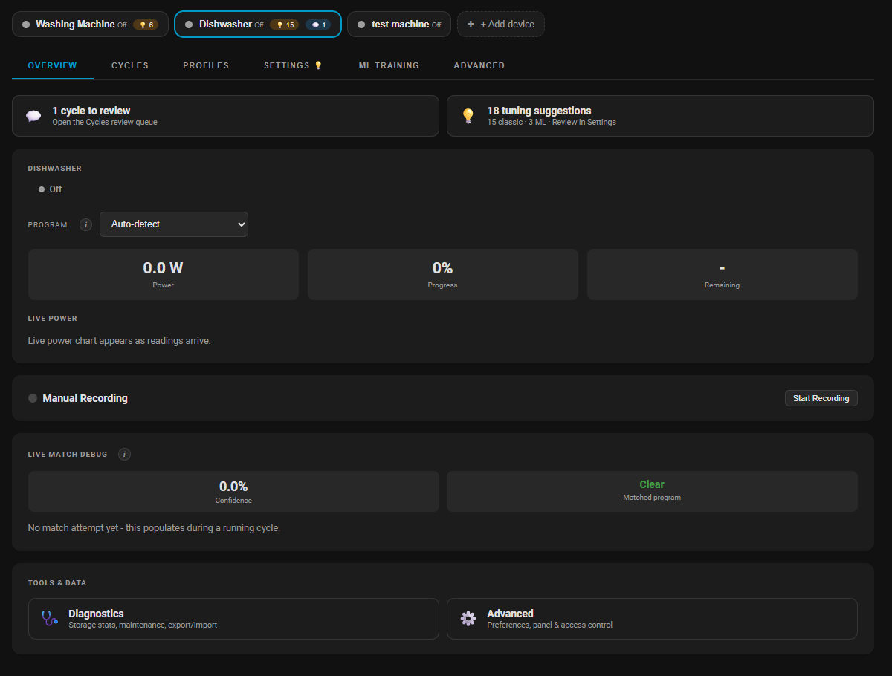

The Overview tab shows the current state (Off / Running / Detecting), a live power reading, and the progress and time-remaining estimates once a cycle is matched. Attention cards surface pending review items and tuning suggestions inline so you act without hunting through menus. **Manual Recording** lives here too - hit Start Recording before you run a new program to get a clean reference cycle.

</details>

<details>
<summary><strong>Cycles tab</strong></summary>

**Cycle history list**

Every completed cycle is listed with profile, status, date, duration, energy, cost, match confidence, and cycle-health score. Sortable columns; filter by profile name or status (completed / interrupted / unknown / needs review).

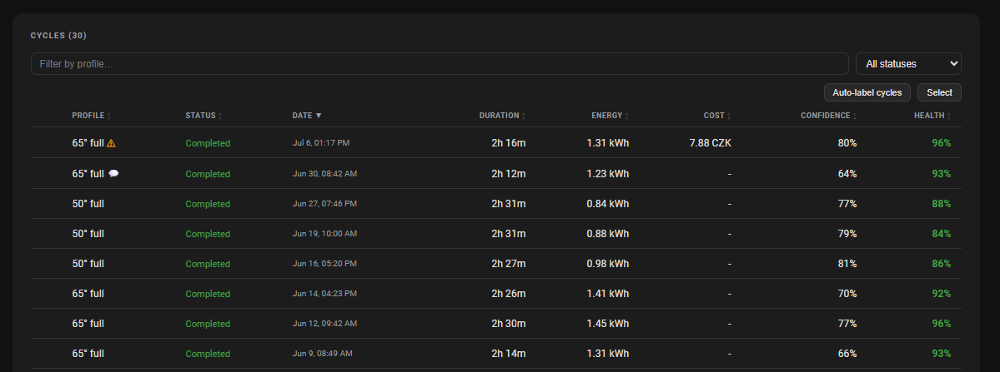

**Multi-select actions**

Tick two or more cycles to reveal the bulk action bar: **Compare** overlays their power curves side by side, **Merge** fuses two mis-split runs into one, and **Delete** removes them permanently.

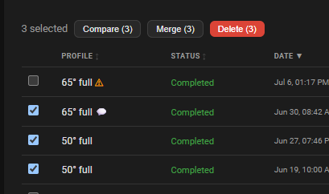

**Inspect - power graph and anomaly report**

Opening a cycle shows its power trace overlaid on the matched profile's envelope. Shaded regions highlight detected artifacts (door-open pauses, out-of-band spikes/dips). The anomaly list below the graph describes each event with its timestamp and duration so you can judge whether it was intentional (e.g. adding clothes mid-cycle) or a detection problem.

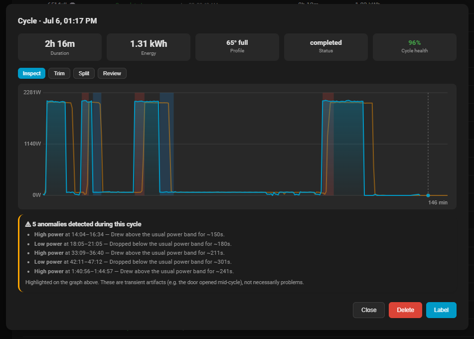

**Trim - remove noise from cycle boundaries**

Drag the red handles on the graph, or type exact offsets, to crop a late-detected start or an overrun tail. Everything outside the window is discarded when you hit **Apply Trim**.

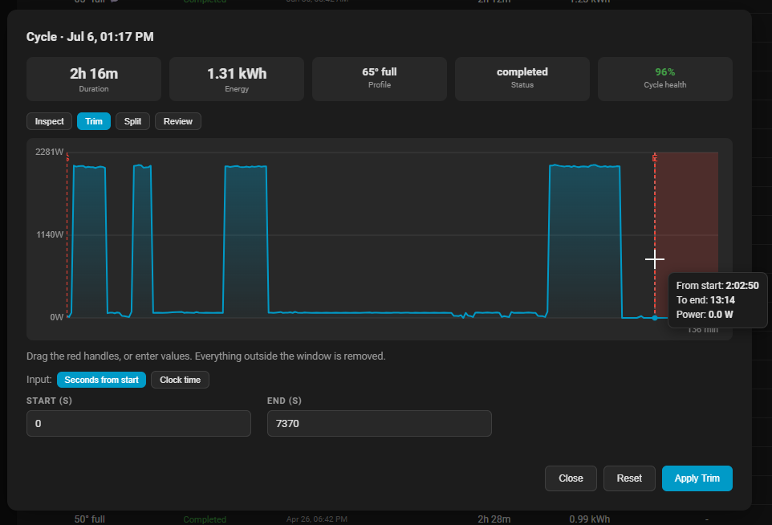

**Split - divide one run into separate cycles**

Click on the graph to place split points, or use **Auto-detect** to find idle gaps automatically. Each resulting segment gets its own profile dropdown so you can label wash and dry phases of a combo cycle separately.

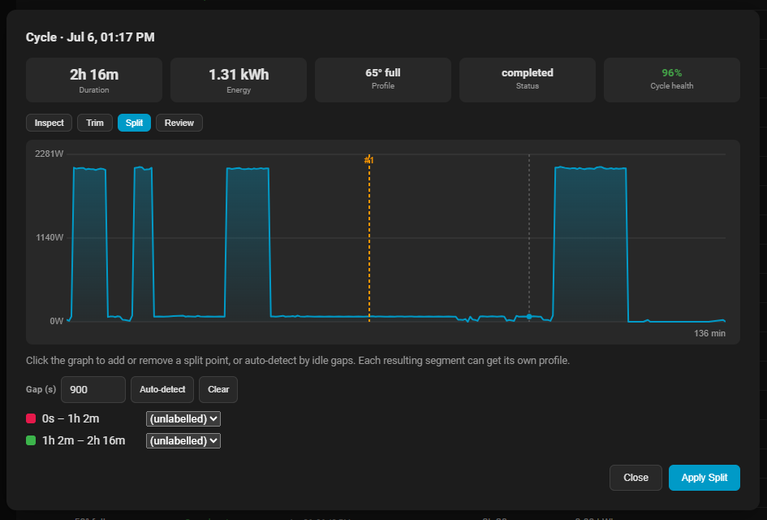

**Review - confirm, tag, and teach the model**

Set the correct profile and a quality rating (Good / Bad), tick issue tags (Late start, Noise, Wrong profile, …), compare against alternative profiles side by side, and add free-text notes. Saved reviews feed the on-device ML model and refine future matching.

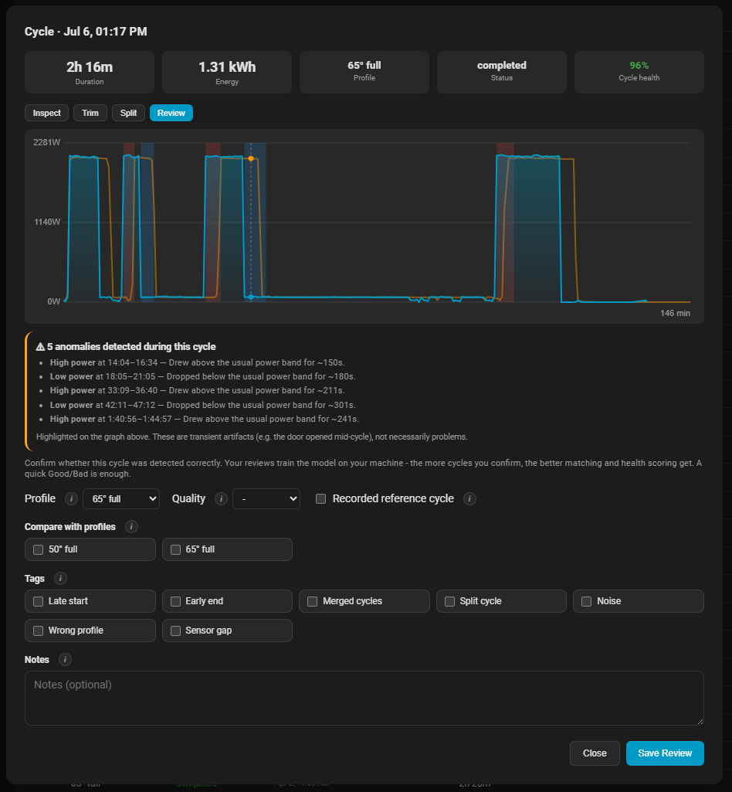

</details>

<details>
<summary><strong>Profiles tab</strong></summary>

**Profile library**

All learned programs are shown as cards with cycle count, average duration, per-cycle energy, and accumulated total. A quality badge ("acceptable quality") appears once enough cycles have been labelled. A yellow banner calls out near-duplicate clusters and invites you to group them so the matcher can reliably pick between look-alike programs (same shape, different temperature or spin speed).

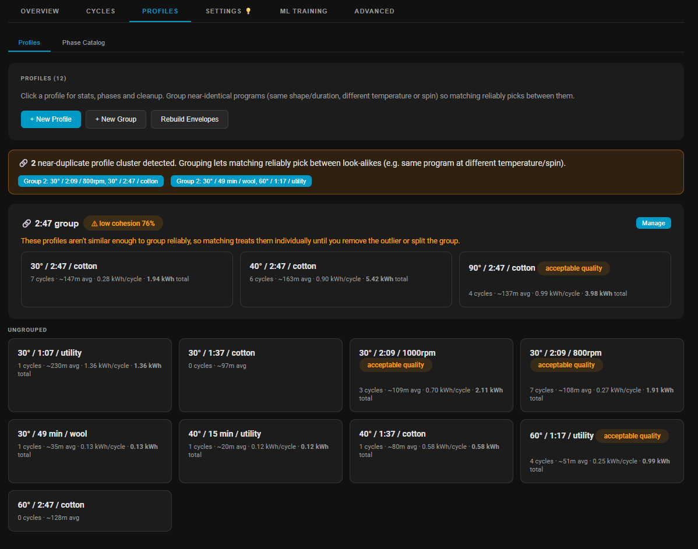

**Phases - visual phase-range editor**

Open any profile and switch to the Phases tab to see every labelled cycle's average curve with coloured phase bands overlaid. Drag boundary values or type minute offsets to map Pre-Rinse, Wash, Rinse, Soak, Spin, Dry and other phases to time ranges. The live progress readout on the Overview tab uses these ranges to display the current phase name.

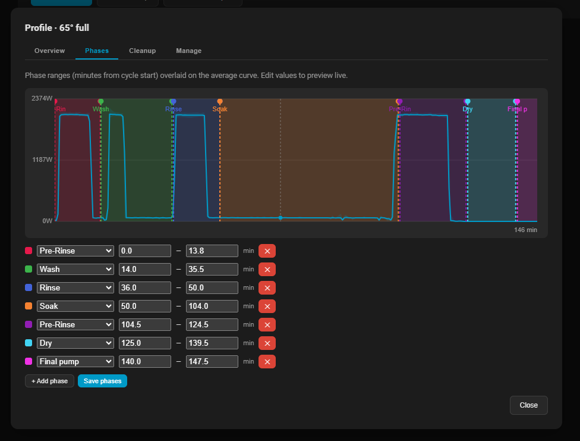

**Cleanup - spot and remove outlier cycles**

The Cleanup tab overlays every labelled cycle as a spaghetti graph. Hover a row in the table to highlight that cycle's curve; tick the checkbox to select it; hit **Delete selected** to remove outliers that are pulling the profile envelope out of shape. Scroll position is preserved while you tick boxes.

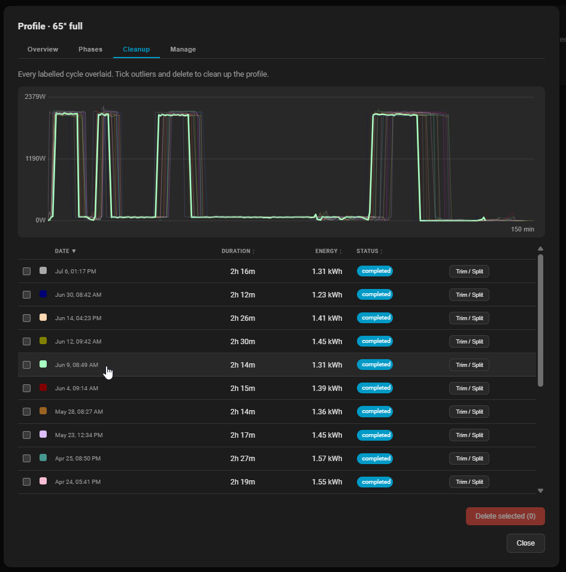

**Manage - rename, retune, delete**

Set the expected duration (used for time-remaining estimates before the cycle completes its first 50%), rebuild the envelope after cleanup, or delete the profile entirely.

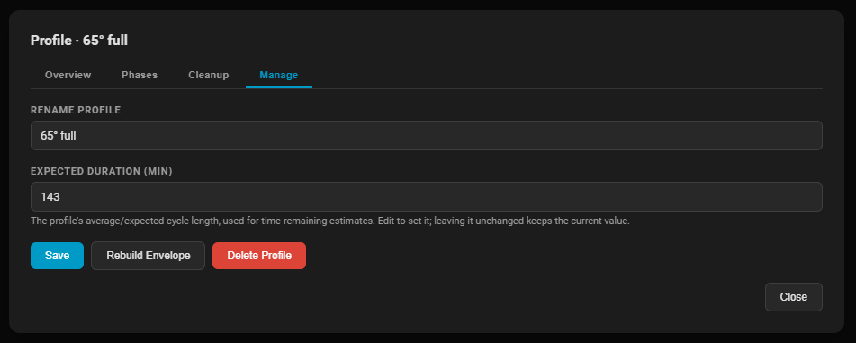

</details>

<details>
<summary><strong>Settings tab</strong></summary>

**Basic section - core identity**

Device name, device type (sets detection defaults), power sensor entity, minimum power threshold, off delay, and HA device grouping. Inline suggestion chips appear when WashData's analysis finds a better value from your cycle history - click **Use** to accept or ignore them individually, or **Apply all** in the banner.

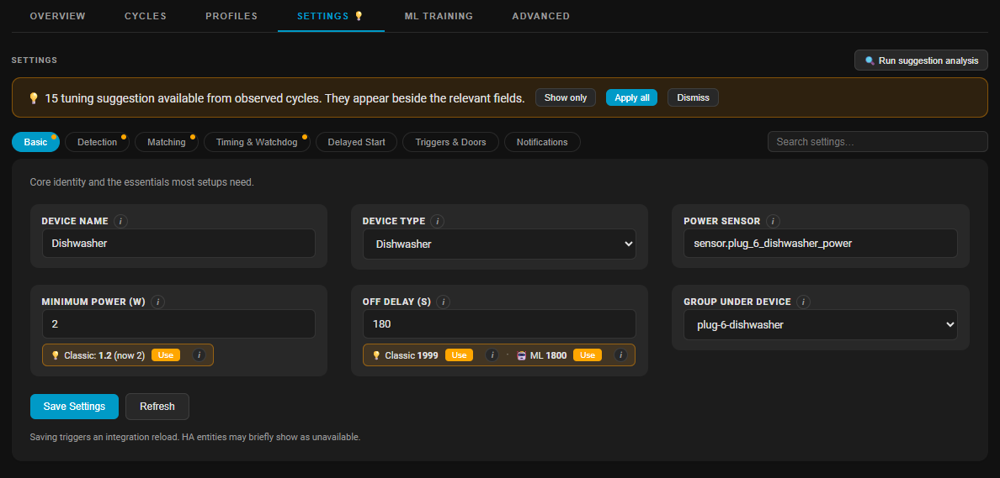

**Notifications section - push alerts and automations**

Configure push targets for cycle-start, finish, and live-progress events using a filterable entity picker (type to narrow the list). The **Automations** section links to the HA automations that already reference this device and lets you create new ones from a blank or prefilled template. Pre-end alert timing, live-update interval, and overrun threshold live here too.

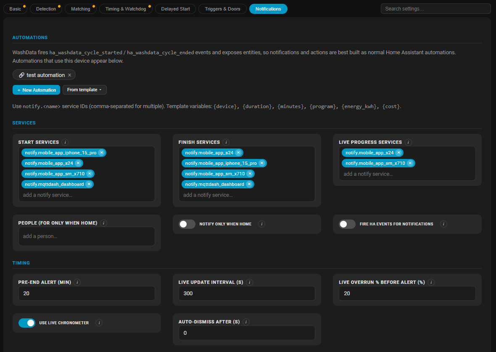

**Log drawer**

The log panel slides in from the right edge of any Settings view. It streams the last 500 WashData log lines, filterable by level (Info / Warning / Error). Drag the left edge of the drawer to resize it; the width and open/closed state persist across page refreshes.

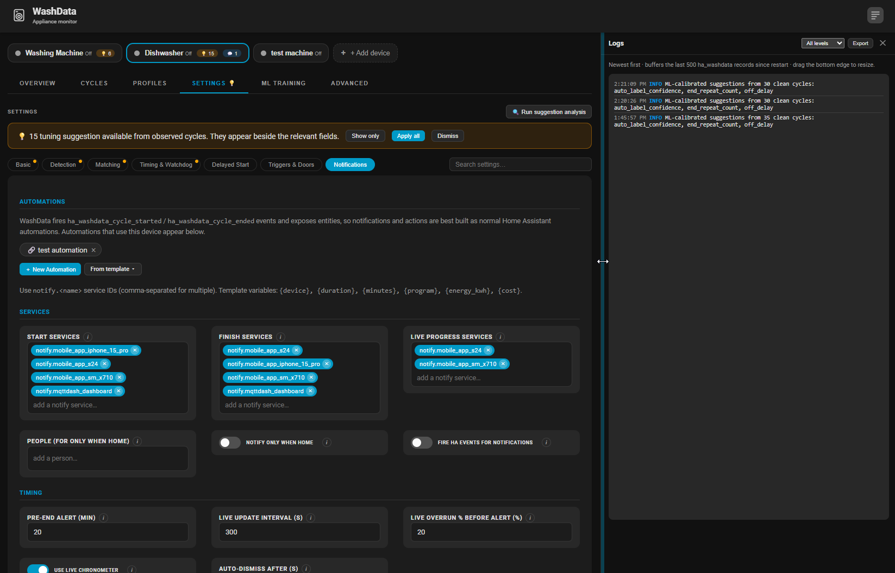

</details>

<details>
<summary><strong>ML Training tab</strong></summary>

**Status, settings, and learned models**

The ML Training tab is the single home for all on-device learning. The **Status** card shows whether models are personalized to your machine or still using the shipped baselines, with a data-readiness progress bar and last-trained timestamp. The **Settings** section has two independent toggles: one that applies models during a live cycle, and one that lets WashData retrain overnight. **What WashData has learned** lists each capability (cycle-end detection, energy estimate) with a plain-language fit chip (Strong fit / Improving / …) and a colour bar so you can see quality at a glance without reading numbers.

The **Program-matching fine-tuning** table shows whether per-device matching weights (shape vs duration vs energy) have diverged from the shipped defaults after tuning against your labelled history.

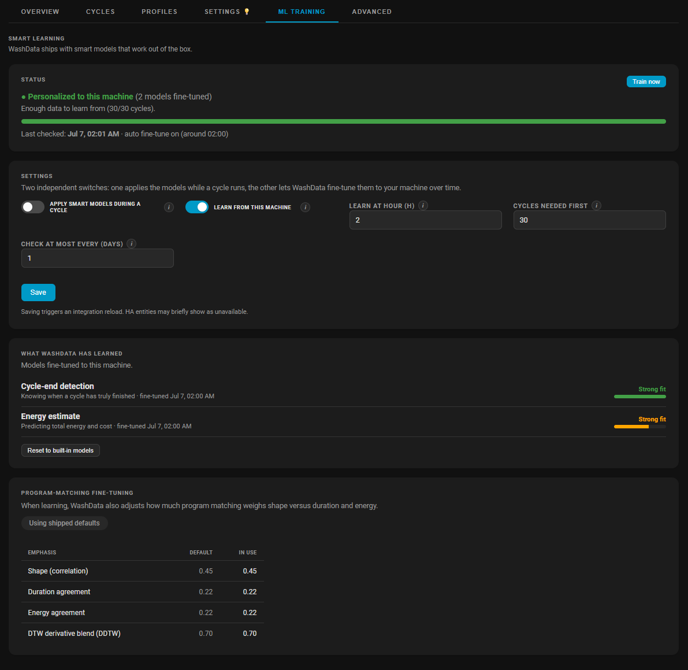

</details>

<details>
<summary><strong>Advanced tab</strong></summary>

**My Preferences**

Per-HA-account display options: default landing tab, cycle date format (relative or absolute), whether to show the expected-curve overlay on the power graph, and the live match debug card visibility.

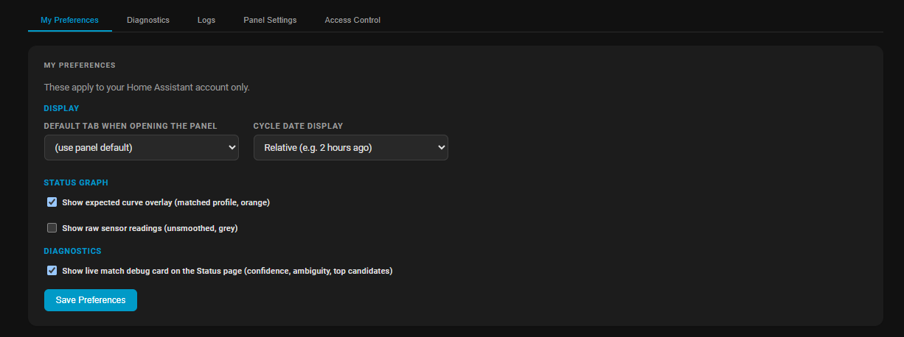

**Diagnostics**

Storage stats (cycle count, profile count, file size), and three maintenance actions: **Process History** re-runs matching and ML retraining on all stored cycles after a batch of reviews; **Clear Debug Traces** frees space; **Wipe All Data** is the nuclear option. **Export / Import** lets you back up the full profile and cycle database to JSON or restore from a previous export (also accepts HA diagnostics downloads).

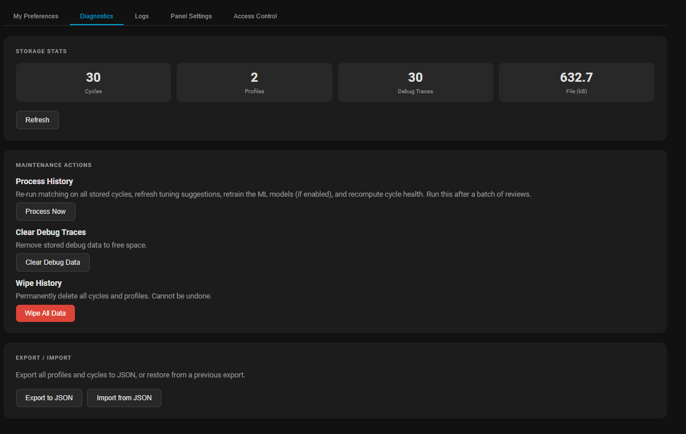

**Panel Settings**

Admin-level defaults: which tab opens by default for all users, and which tabs (Cycles, Profiles, Settings) are hidden from non-admin users.

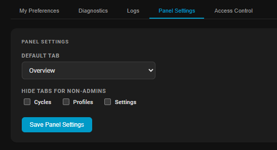

**Access Control**

Per-user RBAC. Enable per-user control, set the fallback level for unlisted users (View / Edit / None), and override per device for each HA account. Administrators always have full access and can manage everyone's permissions from this screen.

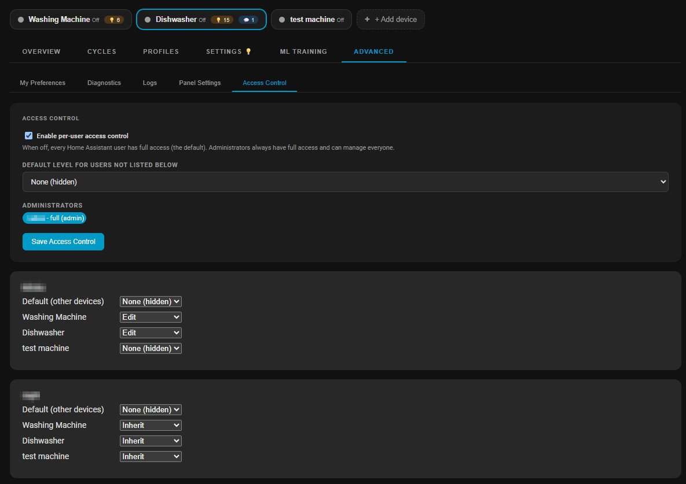

</details>

---

### Entities Provided
- **`sensor.<name>_state`**: Current status. Possible values: `idle`, `starting`, `running`, `paused`, `user_paused`, `ending`, `finished`, `anti_wrinkle`, `interrupted`, `force_stopped`, `rinse`, `clean`, `delay_wait`, `unknown`.
- **`sensor.<name>_program`**: Best-matched profile name.
- **`sensor.<name>_time_remaining`**: Smart countdown (locks during high-variance phases).
- **`sensor.<name>_total_duration`**: Total predicted duration (Elapsed + Remaining). Ideal for `timer-bar-card`.
- **`sensor.<name>_cycle_progress`**: 0–100% (resets after unload timeout).
- **`sensor.<name>_cycle_count`**: Total completed cycles stored - use in automations to schedule maintenance by cycle count.
- **`sensor.<name>_energy_total`**: Lifetime energy in kWh (`total_increasing`) - add it to the Home Assistant **Energy dashboard** to track consumption over time.
- **`sensor.<name>_current_phase`**: Active cycle phase label (e.g. "Rinsing", "Spin").
- **`sensor.<name>_pump_runs_today`**: *(Pump device type only)* Completed pump cycles in a rolling 24-hour window.
- **`binary_sensor.<name>_running`**: Simple on/off running state.
- **`button.<name>_pause_cycle`**: Pause the active cycle (available while Running/Starting/Ending and not already paused).
- **`button.<name>_resume_cycle`**: Resume a user-paused cycle.
- **`button.<name>_force_end_cycle`**: Force-terminate a stuck cycle.
- **`switch.<name>_auto_maintenance`**: Toggle nightly database cleanup.

### Services
Most management is done from the **WashData panel**, but these services are available for automations:

- **`ha_washdata.export_config`**: Full JSON backup of all settings, profiles, and cycle history.
- **`ha_washdata.import_config`**: Restore from a JSON backup. Accepts regular WashData exports **and** HA diagnostics download files.
- **`ha_washdata.pause_cycle`**: Pause the active cycle programmatically (e.g. from an energy-tariff automation).
- **`ha_washdata.resume_cycle`**: Resume a user-paused cycle.

**`ha_washdata.record_start` / `record_stop`**:
Manually start/stop a recording. Useful for automations (e.g. triggering from a physical button or separate sensor).
```yaml
service: ha_washdata.record_start
data:
  device_id: "washer_device_id"
```
- `ha_washdata.label_cycle`: Assign a profile to a cycle in history programmatically.


### Ask Home Assistant

WashData registers an Assist conversation intent (`HaWashdataStatus`) so you can ask your
voice or text assistant about an appliance in plain language and get a live answer:

- *"Is my washer done?"* → "still running, about 20 minutes left" / "finished 5 minutes ago" / "not running"
- *"How long until the dryer finishes?"* - name the appliance when you have more than one.

Home Assistant does not let a custom integration inject sentences into the built-in
conversation agent at runtime, so you wire the trigger phrases once with a sentence pack.
A ready-to-use English pack ships at [docs/custom_sentences/en/ha_washdata.yaml](docs/custom_sentences/en/ha_washdata.yaml):
copy it to `<config>/custom_sentences/en/ha_washdata.yaml` and restart Home Assistant.
It maps a wide set of phrases to the `HaWashdataStatus` intent, with an optional `{name}`
slot to pick an appliance when you have more than one. The intent works immediately from
automations and the Assist pipeline; the sentence pack is only what teaches Assist which
phrases to route to it. See [NOTIFICATIONS.md](NOTIFICATIONS.md) for the exact YAML.

### Notifications & Events

WashData notifies you in two ways: a ready-made push to **per-event targets**, or your own
Home Assistant **automations** triggered by the **bus events** it fires
(`ha_washdata_cycle_started`, `ha_washdata_cycle_ended`, `ha_washdata_pump_stuck`). The
panel's **Notifications → Automations** section finds the automations that use a device
and creates new ones (blank, or prefilled with a cycle-started / cycle-finished trigger).
In an automation you template against the event data, e.g.
`{{ trigger.event.data.duration }}`, `{{ trigger.event.data.program }}`,
`{{ trigger.event.data.cycle_data.cost }}`.

Every notification option, how to build automations with these variables, the cycle
notification lifecycle, message placeholders, companion-app payload keys, and the full
event payload reference are documented in **[NOTIFICATIONS.md](NOTIFICATIONS.md)**.

### 🤝 Contribute Training Data

The more real-world cycle data WashData has, the smarter its detection becomes - across different appliance brands, ages, and programs.

If you'd like to help, you can submit a diagnostics export directly from Home Assistant. It takes less than 2 minutes and requires no technical knowledge.

**How to export:**

1. Open Home Assistant and go to** Settings → Devices & Services**
2. Find your **WashData** integration and click on it
3. Open device you want to submit data for
4. Navigate left, to **"Device info"** section
5. Select **"Download diagnostics"**
6. A .json file will be downloaded to your device

> 🔒 **Privacy:** The export contains your appliance's power data and integration settings. It does **not** include your name, home details, location, or any other personal information.

> 💡 **Tip:** The same diagnostics file you download here can be pasted directly into the panel's **Advanced → Diagnostics → Import** (config import accepts an HA diagnostics download) to restore profiles and settings on a different HA instance - no manual format conversion needed.

➡️ **[Submit your data here](https://forms.gle/m6iGfP8QTasXWg5z7)**

All contributions are used solely to improve the WashData integration.

### Supported Languages
🇦🇱 Shqip • 🇧🇦 Bosanski • 🇧🇬 Български • 🇭🇷 Hrvatski • 🇨🇿 Čeština • 🇩🇰 Dansk • 🇳🇱 Nederlands • 🇬🇧 English • 🇪🇪 Eesti • 🇫🇮 Suomi • 🇫🇷 Français • 🇩🇪 Deutsch • 🇬🇷 Ελληνικά • 🇭🇺 Magyar • 🇮🇸 Íslenska • 🇮🇹 Italiano • 🇯🇵 日本語 • 🇰🇷 한국어 • 🇱🇻 Latviešu • 🇱🇹 Lietuvių • 🇲🇰 Македонски • 🇳🇴 Norsk • 🇵🇱 Polski • 🇵🇹 Português • 🇧🇷 Português (BR) • 🇷🇴 Română • 🇷🇺 Русский • 🇷🇸 Srpski • 🇸🇰 Slovenčina • 🇸🇮 Slovenščina • 🇪🇸 Español • 🇸🇪 Svenska • 🇹🇷 Türkçe • 🇺🇦 Українська • 🇨🇳 简体中文

## License
Non-commercial use only. See [LICENSE](LICENSE) file.
