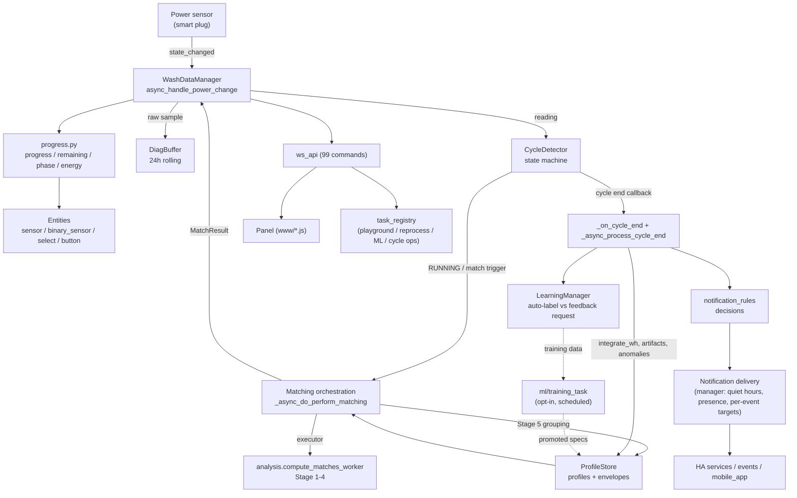

# WashData Integration Reference (Internal)

> **Status:** internal engineering reference, generated 2026-07-18 against branch `0.5.1`.
> **Audience:** maintainers and Claude. This is the authoritative "how every piece works"
> map. It is deliberately not shipped to end users (the `docs/` tree is not part of the
> HACS package). User-facing docs (README, IMPLEMENTATION, NOTIFICATIONS, SETTINGS_VISUALIZED,
> docs/STORE, docs/WS_API) are derived from this reference.
>
> **How to use it:** this file is the synthesis + index. Each subsystem has a one-page
> summary here and a full deep-dive under [`reference/`](reference/) (one file per cluster,
> with `file:line` anchors, exact formulas, and per-method notes). When a fact here and in a
> deep-dive disagree, the deep-dive (and ultimately the code) wins. The
> [Discrepancy & tech-debt register](#discrepancy--tech-debt-register) at the bottom is the
> most actionable part: it lists every place code, `CLAUDE.md`, and the shipped docs disagree.
>
> **House style:** no em dash characters anywhere in this repo (use " - ", en dash, or a reword).

---

## 1. What WashData is

WashData is a Home Assistant custom integration (`domain: ha_washdata`, `iot_class:
local_polling`, requires only `numpy`) that turns a smart power plug into an appliance cycle
monitor. It watches a power sensor, runs a state-machine cycle detector, learns per-program
power-consumption *profiles*, matches running cycles against them, and estimates
progress / time-remaining / phase / projected energy + cost. Everything runs locally; the
only optional network feature is the Community Store.

**Supported device types** (`DEVICE_TYPES` in `const.py`): `washing_machine`, `dryer`,
`washer_dryer`, `dishwasher`, `air_fryer`, `bread_maker`, `pump` (sump/pump), `generic`
("Other (Advanced)" - full profile matching with neutral defaults), and `other`
("Threshold Device" - threshold-only detection, no profile matching, user must tune).
The legacy `coffee_machine` / `ev` / `heat_pump` / `oven` types were **removed in 0.5.0**;
existing entries were migrated to `other` (Threshold Device) with tuned options preserved.

**Scale:** ~38.7k lines of Python across 43 modules in `custom_components/ha_washdata/`,
plus a single 10.5k-line panel (`www/ha-washdata-panel.js`), 25+ languages, 136 pytest
files + 210 Playwright E2E tests.

---

## 2. Module map

| File | ~Lines | Role | Deep dive |
|---|---|---|---|
| `manager.py` | 6359 | Central orchestrator (one per config entry). Power intake, matching orchestration, cycle-end pipeline, notification **delivery**, entity attributes, ML wiring, background ops. | [04](reference/04-manager-orchestrator.md) |
| `profile_store.py` | 6182 | Profiles, storage (`Store` v11), Stage-5 grouping, envelopes/conformance/artifacts, pure-stats heuristics, match-ranking history, terminal-drop baselines, phase-profile cache. | [02](reference/02-matching-and-profile-store.md) |
| `analysis.py` | 718 | The numeric matcher core (`compute_matches_worker`, Stages 1-4) + DTW-lite. Executor-run. | [02](reference/02-matching-and-profile-store.md) |
| `cycle_detector.py` | 2345 | The `OFF -> STARTING -> RUNNING <-> PAUSED -> ENDING -> OFF` state machine (+ delayed-start, anti-wrinkle, anti-crease finalize, dishwasher end, ML end-guard hook, terminal-drop hook). | [01](reference/01-detection-core.md) |
| `signal_processing.py` | 251 | Resampling + energy integration primitives (`integrate_wh`, `energy_gap_threshold_s`). **No DTW, no filtering** (those live in `analysis.py`). | [01](reference/01-detection-core.md) |
| `features.py` | 116 | `CycleSignature` feature vectors. | [01](reference/01-detection-core.md) |
| `time_utils.py` | 291 | Normalizer for the 3 `power_data` formats -> canonical `[[offset_s, power]]`. | [01](reference/01-detection-core.md) |
| `progress.py` | 694 | **Single source of truth** for progress / remaining / phase / projected-energy math. Pure; shared byte-identically by manager (live) and playground (sim). | [05](reference/05-progress-and-notification-rules.md) |
| `notification_rules.py` | 156 | Pure notification **decision** predicates (quiet hours, milestones, pre-completion). Delivery stays in manager. | [05](reference/05-progress-and-notification-rules.md) |
| `learning.py` | 834 | Feedback loop: auto-label vs request-verification routing, confidence tracking, feedback records/stats. | [06](reference/06-learning-and-suggestions.md) |
| `suggestion_engine.py` | 1806 | Classic + ML suggestion engines, `select_clean_cycles`, `reconcile_suggestions` invariants. | [06](reference/06-learning-and-suggestions.md) |
| `phase_catalog.py` | 374 | Legacy per-profile time-band phase ranges + per-device catalog labels. | [03](reference/03-phase-system.md) |
| `phase_segmenter.py` | 296 | NEW (0.5.1): unsupervised regime segmenter (idle/active/high + spin) -> per-role priors. | [03](reference/03-phase-system.md) |
| `phase_match.py` | 294 | NEW (0.5.1): per-role duration/energy agreement + `phase_eta`. | [03](reference/03-phase-system.md) |
| `ml/` | ~2.5k | Opt-in NumPy-only ML: `engine` (resolve_scorer/regressor), `feature_extraction`, `trainer`, `training_task`, `matching_tuner`, 3 embedded models + parity fixtures. | [07](reference/07-ml-subsystem.md) |
| `ws_api.py` | 5420 | 99 WebSocket command handlers (RBAC-guarded, executor/background). | [08](reference/08-ws-api-and-tasks.md) |
| `ws_schema.py` | 1024 | Typed request/response contract for the 99 commands (drives `ws-types.d.ts` + `docs/WS_API.md`). | [08](reference/08-ws-api-and-tasks.md) |
| `frontend.py` | 400 | Panel + card + per-language translation static serving. | [08](reference/08-ws-api-and-tasks.md) |
| `task_registry.py` | 244 | In-memory long-task registry (progress/ETA/cancel/reconnect + header pills). 9 task kinds. | [08](reference/08-ws-api-and-tasks.md) |
| `playground.py` | 1860 | Headless, executor-safe replay behind the Playground tab. Reuses the real detector + matcher + `progress.py` (byte-identical to live). | [09](reference/09-playground.md) |
| `__init__.py` | 1053 | Entry point: setup, service registration, config-entry migration (v1 -> v3.7). | [10](reference/10-entities-config-services.md) |
| `config_flow.py` | 263 | Minimal HA flow (device type, power sensor, min power). 180+ tunables live in the panel. | [10](reference/10-entities-config-services.md) |
| `sensor.py` / `binary_sensor.py` / `select.py` / `button.py` | ~1.4k | Entity platforms (25 entities total). | [10](reference/10-entities-config-services.md) |
| `intents.py` / `recorder.py` / `setup_advisor.py` / `diagnostics.py` / `diag_buffer.py` / `log_utils.py` | ~1.1k | Assist intent, manual recording, adoption guidance, HA diagnostics, rolling buffers, logging adapter. | [10](reference/10-entities-config-services.md) |
| `store.py` / `store_client.py` / `store_account.py` | ~1.5k | Community Store: `StoreBridge` orchestration, Firestore REST client, global account/prefs. | [11](reference/11-community-store.md) |
| `const.py` | 886 | 303 constants/keys (102 `CONF_*`, 83 `DEFAULT_*`, `MATCH_*`, `ML_*`, device-default maps, feature flags, storage). | [12](reference/12-constants-catalog.md) |
| `www/ha-washdata-panel.js` | 10478 | The full-screen panel (7 tabs). | [13](reference/13-panel-frontend.md) |
| `www/ha-washdata-card.js` | 634 | Standalone Lovelace card (no WS, reads entity state). | [13](reference/13-panel-frontend.md) |

---

## 3. Architecture & data flow

**The 5-minute matching loop is the heartbeat.** Power changes feed the detector on every
sample; the detector's `profile_matcher` callback is only a *trigger* that fires-and-forgets
an async match. Real matching runs on an interval (`profile_match_interval`, default 300s),
executor-offloaded so NumPy never blocks the event loop. Results update entities via a
dispatcher signal (`ha_washdata_update_{entry_id}`), publish-on-change.

**Cycle end is two-phase:** synchronous `_on_cycle_end` (energy integration via the shared
`integrate_wh`, ghost/pump-out suppression) then async `_async_process_cycle_end` (persist,
artifacts, envelope conformance, anomalies, cost freeze, ML quality gate, learning trigger,
events, notifications). A per-cycle UUID token guards against a back-to-back cycle race.

---

## 4. Subsystem summaries

Each links to its full deep-dive. Only the load-bearing facts are here.

### 4.1 Detection ([01](reference/01-detection-core.md))
- States: `OFF -> STARTING -> RUNNING <-> PAUSED -> ENDING -> OFF`, plus `DELAY_WAIT` (delayed-start) and `ANTI_WRINKLE` (dryer, can re-arm to STARTING).
- Hysteresis: `start_threshold_w` vs `stop_threshold_w`; `STARTING -> RUNNING` is a **dual gate** (`_time_above_threshold >= start_duration_threshold` AND `_energy_since_idle_wh >= start_energy_threshold`).
- Dynamic, cadence-adaptive pause/end thresholds from `_p95_dt` (p95 of last 20 sample gaps).
- Terminal-state expiry is owned by the **manager**, not the detector (issue #284). The detector only owns `ANTI_WRINKLE -> OFF`.
- `ENDING` has two mechanisms: **Smart Termination** (needs matched profile, confidence >= 0.4, not ambiguous/prefix-ambiguous, duration >= expected x smart_ratio, plus a device-specific debounce) and a fallback energy-gate **timeout** over a look-back window.
- **Dishwasher end** is the most intricate path: 85% end-spike arming gate, 90/99% smart_ratio, pump-out wait (`DISHWASHER_END_SPIKE_WAIT_SECONDS=1800` OR quiet-release), 1800s min-cycle floor, terminal-tail match-freeze (300s), fixed 300s smart-debounce deliberately decoupled from `off_delay`.
- Two opt-in one-directional ML/anomaly hooks: end-guard can only **defer** (bounded 1800s); terminal-drop can only **shorten** the wait.

### 4.2 Matching ([02](reference/02-matching-and-profile-store.md))
- Stage 1 duration gate; Stage 2 `score = 0.45*max(0,corr) + 0.55*mae_score` (MAE expressed relative to current cycle peak); Stage 3 DTW-lite (default `ensemble` = 0.7 L1-DTW + 0.3 derivative-DTW, blended 50/50); Stage 4 duration/energy agreement (weights 0.22/0.22, sharpened scales); Stage 5 cohesive profile-group collapsing (`GROUP_MIN_COHESION=0.80`) + member pick + downgrade safeguards.
- `MatchResult.confidence` is the **post-Stage-4 blended score** (not raw Stage-2/3, contra older CLAUDE.md wording). `is_ambiguous = (top1-top2) < 0.05`.
- Profile template order: golden single-cycle trace -> envelope avg (>=2 cycles) -> sample cycle. Envelopes: medoid reference + per-cycle DTW warp -> min/max/avg/std bands.
- `reference_cycles` (imported/community) shape envelope+template+duration but **never** usage/energy/count/trend stats; GC/repair must union `reference_cycles` ids or it corrupts import-only profiles.
- Pure-stats heuristics (never raise): profile health, trends (OLS %/cycle), coverage gaps, advisories, envelope conformance, cycle artifacts (pause/dip/spike).

### 4.3 Phases ([03](reference/03-phase-system.md)) - **heavily reworked in 0.5.1**
- Two layers share the word "phase": (1) **legacy** per-profile time-band ranges (`profile["phases"]`) driving the current-phase readout; (2) **new** unsupervised segmentation -> per-role priors -> blended ETA. They are not wired to each other.
- Legacy readout indexes the range table by **ML-blended progress fraction x nominal**, not raw elapsed, so overrun/underrun still names the phase.
- New live phase-ETA is **opt-in and double-gated**: per-device `enable_phase_matching` flag AND `LIVE_PHASE_DEVICE_TYPES = (washing_machine, washer_dryer)` only (dishwasher has a model but is excluded from live).
- ETA blend (in `progress.compute_progress`): `remaining = (1-f)*phase_remaining_s + f*base_remaining`, `f = base_progress/100`; byte-identical to legacy when `phase_remaining_s is None`.
- Phase-5 mixed-profile advisory (`code: phase_inconsistent`) is computed and served but **currently rendered nowhere** (see register).

### 4.4 Manager ([04](reference/04-manager-orchestrator.md))
- Owns detector, profile store, learning manager, recorder, diag buffer, store bridge.
- Watchdog injects 0W keepalives, extends timeouts for matched/verified-pause, and force-ends zombie (>3x expected & >4h) / ghost cycles.
- Three anomaly signals, all visible-only (never notifications): live overrun (1.5x), post-cycle underrun (<0.55x median), energy z-score (|z|>2.5).
- All progress/remaining/phase/energy/anomaly math delegated to `progress.py` (wrappers do not fork it) - this preserves Playground byte-parity.
- Notification **decisions** in `notification_rules.py`; **all delivery** (quiet-hours queue+timer, presence hold/release, per-event routing, actions/script, persistent-notification fallback, iOS Live Activity) in the manager. One shared `_lifecycle_tag` collapses start/live/pre-complete/finish into one replaceable card.

### 4.5 Progress / ETA / notification gating ([05](reference/05-progress-and-notification-rules.md))
- ML blend weight 0.5 applied **pre-EMA**. Three-tier EMA alpha by power variance (0.20 / 0.10 / 0.05); heavy 95/5 damping on backward drops beyond device threshold.
- Remaining is **always back-calculated** from progress: `remaining = matched_duration * (1 - smoothed/100)`; progress capped at 99 live.
- Phase-resolved ETA is a second blend layer (source `phase_blend`).
- Projected energy prefers the `total_energy` regressor; fallback `energy_so_far / (progress/100)`; both `max(..., energy_so_far)` and gated at progress >= 3%.
- Pre-completion notification has 5 guards incl. `not match_ambiguous`.

### 4.6 Learning & suggestions ([06](reference/06-learning-and-suggestions.md))
- Cycle end routes each cycle to auto-label / feedback-request / skip via a *routing* confidence.
- Auto-label bar `auto_label_confidence` (0.9); request floor `learning_confidence` (0.6). Warmup gate: non-imported profile with < `PROFILE_MIN_WARMUP_CYCLES` (5) labeled cycles always requests confirmation.
- Two downgrade triggers turn a high-confidence match into a feedback request: ML quality `P(problem) >= 0.65` (only when ML opted in) and `envelope_conformance < 0.40` (always live).
- Suggestion engine can recommend ~22 detection/matching/learning parameters, each from a specific statistic (full list in the deep dive); `reconcile_suggestions` keeps coupled settings consistent.

### 4.7 ML subsystem ([07](reference/07-ml-subsystem.md)) - opt-in, NumPy-only, never raises
| Capability | Type | Predicts | Cols | Promotion gate |
|---|---|---|---|---|
| `end` | classifier | P(low-power event is true end vs pause) | 8 | held-out AUC >= base-0.02 & bacc gate |
| `quality` | classifier | P(finished cycle is a problem) | 31 | AUC >= base-0.02 & bacc gate |
| `live_match` | classifier | P(top-1 live match correct) | 8 | AUC >= base-0.02 & bacc gate |
| `remaining_time` | regressor | time-completion fraction | 7 | MAE beats naive by 0.05; **no shipped baseline (inert until promoted)** |
| `total_energy` | regressor | energy-completion fraction | 7 | MAE beats naive by 0.05; **no shipped baseline** |
- Five gated runtime consumers (all behind `CONF_ENABLE_ML_MODELS`, default off), each asymmetric: end-guard (defer-only), early-commit (>=0.85 speeds first commit), quality gate (>=0.65 downgrades auto-label), remaining/energy blend (bounded 50% pre-EMA), terminal-drop (shorten-only; pure stats, no model).
- `matching_tuner` leave-one-out tunes 4 bounded scoring weights only; can never change structural matching.
- Parity fixtures (`tests/test_ml_models.py`, `tests/test_ml_feature_extraction.py`) are the anti-drift gate.

### 4.8 WS API + tasks ([08](reference/08-ws-api-and-tasks.md))
- **99 commands**, all `ha_washdata/*`, RBAC-guarded (`_guard`, 4 levels; admin-only for destructive ones even when RBAC off). Registration is idempotent on every reload (new commands work after an integration reload; the old "needs full HA restart" gotcha is obsolete).
- Background tasks return `{task_id}` immediately and run chunked in the executor; `subscribe_tasks` is the live-push progress channel (reconnect-safe). Per-entry write lock serializes store-mutating handlers.
- Panel served at `/ha_washdata/ha-washdata-panel.js`; translations at `/ha_washdata/panel-translations/{lang}.json` (no build step).

### 4.9 Playground ([09](reference/09-playground.md))
- Three entry points: `simulate_cycle_detail` (faithful per-5s timeline + events + alerts + outcome), `run_playground_history` (per-cycle rows + before/after diff), `run_playground_sweep` (1D/2D over params). No math of its own - reuses the real detector, matcher, `progress.py`, `notification_rules.py`.
- Overridable params: 11 detection keys + 2 matching keys (`profile_match_min/max_duration_ratio` only). Sweep objectives: `match_accuracy`, `end_timing_accuracy`, `false_end_rate`, `median_overrun`, `ambiguity_rate`.
- End-detection alerts: `would_run_indefinitely` (never self-ended), `timeout_end` (ended by off-delay, not smart prediction).

### 4.10 Entities / config / services ([10](reference/10-entities-config-services.md))
- 25 entities: 12 always-on sensors + conditional sensors (pump-runs, and 3 debug sensors + binary ambiguity behind `expose_debug_entities`) + dynamic per-profile count sensors + running binary sensor + program select + 5 buttons.
- State sensor attributes: `samples_recorded`, `current_program_guess`, `sub_state`, `pump_stuck` (pump), and conditional `cycle_anomaly` / `overrun_ratio` / `last_cycle_*` / `ha_restart_gaps` / `maintenance_due`. Progress sensor adds `projected_energy_kwh` / `projected_cost`.
- 13 registered services (`trigger_ml_training` only when `ENABLE_ML_TRAINING`). Config-entry schema at **v3.7**.

### 4.11 Community Store ([11](reference/11-community-store.md))
- Brand -> Device -> Program -> Reference cycles, Firestore REST backend; device auto-promotes at `confirmCount >= 5` (live-tunable). Three modules: account (global online toggle + GitHub creds + prefs), client (pure REST), `StoreBridge` (orchestration; no-raise `{"error":...}`).
- Sharing bundle: appliance metadata + LTTB-downsampled traces (<=10k pts) + per-cycle stats + QC provenance + optional phase ranges + optional numeric settings (21-key allow-list). Imported cycles land in `reference_cycles`, structurally isolated from real stats.
- Adoption guidance (`setup_advisor.compute_setup_phase`) drives the Setup Card via a 6-phase state machine (Phase 1c = store-download-only).

### 4.12 Panel ([13](reference/13-panel-frontend.md))
- 7 top tabs: Overview, Cycles, Profiles, Settings (edit), Playground (edit), Store (edit+online), Advanced. Push-driven (`set hass()` + `subscribe_events` + `subscribe_tasks`), `_t()` translation, no build step.
- Settings save via `set_options` (triggers reload); the per-key settings-history revert uses `ws_set_options` (no reload). ML Training lives under Advanced -> ML sub-tab.

---

## 5. Cross-cutting concerns

- **Energy math:** the shared `signal_processing.integrate_wh(ts, power, max_gap_s)` + data-driven `energy_gap_threshold_s` (`clip(10 x median_interval, 60, 3600)`) is used by both persistence paths (`manager._on_cycle_end`, `ProfileStore.add_cycle`) and the ENDING gate. Exception: the detector's *running* `_energy_since_idle_wh` accumulator uses a simpler left-rectangle sum (only gates STARTING->RUNNING; acceptable divergence).
- **Notifications:** one delivery layer (manager) + one decision layer (`notification_rules`). No new notification *types* are added by policy - new signals surface as sensor attributes / cycle metadata / panel banners.
- **Gating flags** (`const.py`): `SHOW_ML_LAB`, `ENABLE_ML_SUGGESTIONS`, `ENABLE_ML_TRAINING` (build-time, all True); `CONF_ENABLE_ML_MODELS` (per-device, default off, lives in `ml/engine.py`); `enable_phase_matching` (per-device); `online_features_enabled` (runtime, store).
- **Storage/migrations:** `STORAGE_VERSION = 11`. Config-entry schema v3.7. Both migration layers are tested separately (`test_migration_harness.py` for config entry, `test_migration_v032.py` calling `_async_migrate_func` directly for storage).
- **Background tasks:** `task_registry` (9 kinds) is the single source of truth for "what long thing is running"; wired from `ws_api` (not `manager`). Playground history/sweep/detail, reprocess, ML training, rebuild-envelopes, trim, split, merge.
- **i18n:** English source in `strings.json` (HA layer) + `translations/panel/en.json` (panel). All non-English via Claude subagents only - **never machine-translate**. Panel keys served directly, no bundle.

---

## 6. Documentation map & update status

| Doc | Audience | Primary source subsystems |
|---|---|---|
| README.md | end users | detection, panel, entities, services, notifications, store |
| IMPLEMENTATION.md | developers | all (flows + mermaid), the deep technical doc |
| NOTIFICATIONS.md | automation users | manager delivery + notification_rules + events |
| SETTINGS_VISUALIZED.md | tuners | const defaults + suggestion heuristics |
| docs/WS_API.md | panel/API devs | ws_schema (auto-generated) |
| docs/STORE.md | store users | community store |
| docs/plans/ROADMAP.md, IMPROVEMENT_PLAN.md | maintainer | planning history |
| TESTING.md, CONTRIBUTING.md, SECURITY.md | contributors | testing, process, security |

See the [docs audit](reference/14-docs-audit.md) for the full per-doc stale/missing list and the tiered update plan that this pass executes.

---

## 7. Discrepancy & tech-debt register

The highest-value output of this assessment. Grouped by kind. `[DOC]` = documentation is wrong;
`[CODE]` = likely code bug / dead code; `[NOTE]` = intentional divergence worth recording.

**Last full reverification: 2026-07-20.** Items 1-14 (§7.1) and 15-22 (§7.2) were all fixed in
commit `e7fd400`. Items 23-26 fixed by maintainer in 698ed31+12f61ce. Item 32 reclassified as
false positive. Items 39-40 are new. **All open code bugs (27-31, 33-41) fixed in 0.5.1 branch
(2026-07-20): see individual entries below.**

**2026-07-21 additions (0.5.2 branch):** Item 27 fully closed (panel-side abrupt_drop cleanup);
new items 42-53 added and fixed in same session. Items 50-53 are the detection-tuning fixes
(reconcile Rule 2 / smart_debounce coupling; STARTING timeout; ENDING duration-anchored backstop;
anti-crease standby-band finalize), each validated with the slow suite + a byte-identical
`dtw_ab_eval` top-1 (88.36%, matcher untouched).

| # | Status | Kind | Short description |
|---|---|---|---|
| 23-26 | FIXED | CODE | phase-match occ_penalty, advisories, cold-start, docstrings |
| 27 | FIXED | CODE | `_abrupt_drop` never set True - dead branch + vestigial config fields |
| 28 | FIXED | CODE | `event_density` always 0.0 - zero-variance ML feature column |
| 29 | FIXED | CODE | Playground legacy `run_playground_batch`/`_simulate_one` dead path; sweep direction missing from payload |
| 30 | FIXED | CODE | `auto_label_cycles` service default 0.70 (schema) vs 0.75 (Python) |
| 31 | FIXED | CODE | Double "Config reloaded" log; snapshot duplication fixed |
| 32 | FALSE POSITIVE | - | ML calibration gate correctly uses 0.55 via `_OPERATING_THRESHOLD` |
| 34 | FIXED | NOTE | analysis.py duration-ratio fallbacks 0.07/1.30 diverged from canonical 0.10/1.50 |
| 36 | FIXED | NOTE | `generate_docs_graphs.py` OUTPUT_DIR pointed to `doc/images` instead of `docs/images/suggest` |
| 39 | FIXED | CODE | `WashDataStore.get_storage_stats/async_clear_debug_data` dead + blocking I/O |
| 40 | FIXED | CODE | 5 `reconcile_suggestions` keys silently dropped by `ws_apply_suggestions` |
| 41 | NOTED | NOTE | Embedded model THRESHOLD vs live gate clarified with cross-reference comments |
| 42 | FIXED | CODE | Dead sync `match_profile()` (56 lines) removed from `profile_store.py` |
| 43 | FIXED | CODE | ML `resolve_scorer`/`resolve_regressor` lacked schema guard for stale feature columns |
| 44 | FIXED | CODE | 5 hardcoded English strings in panel.js now routed through `_t()` |
| 45 | FIXED | CODE | `apply_split_interactive` used sync `add_cycle` — retention unsaved before split `async_save` |
| 46 | FIXED | CODE | Cycle-ID 12-char SHA collision with no dedup guard in `_add_cycle_data` |
| 47 | FIXED | NOTE | `ProfileStore` init used flat duration-ratio default, not per-device default |
| 48 | FIXED | CODE | `_reprocess_task` cancel only honoured before ML step; 3 earlier steps unresponsive |
| 49 | FIXED | CODE | Playground `_SIM_SERIES_THROTTLE_S=5.0` equalled cadence; throttle was a no-op |
| 50 | FIXED | CODE | `reconcile_suggestions` Rule 2 lowered off_delay (split soak pauses); washer smart_debounce uncapped |
| 51 | FIXED | CODE | STARTING had no timeout; user-paused + machine-off pinned it in STARTING forever |
| 52 | FIXED | CODE | Ambiguous-match cycle stuck in ENDING (standby energy gate) — duration-anchored backstop added |
| 53 | FIXED | CODE | Anti-crease baseline above stop_threshold pinned cycle in RUNNING (#296) — standby-band finalize added |

### 7.1 Documentation inaccuracies (fix in this pass)

1. `[DOC]` **IMPLEMENTATION.md line ~899: "Phases are NOT used in profile matching"** - false since 0.5.1 phase-segmented matching. Highest-priority correction.
2. `[DOC]` **IMPLEMENTATION.md Section 8: deprecated types "scheduled removal 0.6.0"** - they were removed in 0.5.0 and migrated to Threshold Device.
3. `[DOC]` **IMPLEMENTATION.md Section 9: server-side SVG chart rendering** - removed; charts are client-side JS canvas now.
4. `[DOC]` **IMPLEMENTATION.md mermaid #1 (User Journey): "Create first profile now?" branch** - that config-flow step was removed in 0.5.1.
5. `[DOC]` **README Getting Started step 6 "Initial Profile (Optional)"** - removed config-flow step; delete it.
6. `[DOC]` **Phase-segmented matching undocumented everywhere** (README, IMPLEMENTATION, SETTINGS_VISUALIZED, CHANGELOG 0.5.1).
7. `[DOC]` **Setup Card / adoption guidance undocumented** (README still describes old onboarding card; STORE.md line ~50 points at it too).
8. `[DOC]` **Background cycle-management tasks (split/trim/merge/rebuild = background tasks + pills)** undocumented in user docs.
9. `[DOC]` **SETTINGS_VISUALIZED `profile_match_threshold` = "DTW similarity score"** - it is the composite Stage-2/3/4 score.
10. `[DOC]` **TESTING.md missing the Playwright E2E category** entirely (`--e2e`, 210 tests).
11. `[DOC]` **CHANGELOG 0.5.1 missing all phase-matching entries** (7 commits).
12. `[DOC]` **SECURITY.md missing 0.5.1 hardening** (admin-required destructive WS actions, RBAC task-access, export/import path guards).
13. `[DOC]` **ROADMAP D5 letter shortcuts** (`h`/`p`/`s`...) were removed; only Escape remains.
14. `[DOC]` **IMPROVEMENT_PLAN status snapshot stale** ("0.5.0, 68 commits ahead, nothing committed").

### 7.2 CLAUDE.md factual drift (fix carefully; preserve all guidance)

15. `[DOC]` `manager.py` "~5200 lines" -> actually 6359.
16. `[DOC]` `signal_processing.py` "DTW implementation" -> DTW is entirely in `analysis.py`; `signal_processing.py` has no DTW and no filtering.
17. `[DOC]` Storage migrations documented v1-v8 -> actual `STORAGE_VERSION = 11` (v9 lifetime keys, v10 `reference_cycles`, v11 phase-profile cache marker).
18. `[DOC]` `MatchResult.confidence` described as "raw Stage-2/3 similarity" -> it is the post-Stage-4 blended `best["score"]`.
19. `[DOC]` config schema "v3.6" -> actual v3.7 (3.6 -> 3.7 removes an `initial_profile` stub).
20. `[DOC]` `ml/README.md` claims no runtime consumer wires `CONF_ENABLE_ML_MODELS` "yet" - 5 do (CLAUDE.md is correct; ml/README is stale).
21. `[DOC]` `task_registry.py:~60` doc comment lists 4 task kinds; actual is 9.
22. `[NOTE]` CLAUDE.md implies `manager.py` uses `task_registry`; it does not - registry wiring lives in `ws_api.py` (manager uses plain `async_create_task`/executor jobs).

### 7.3 Likely code bugs / dead code (record; do NOT fix without maintainer sign-off)

> **Reverification pass: 2026-07-20.** Items 23-26 fixed in phase-matching code-review (698ed31
> + 12f61ce). Item 31 partially addressed (snapshot duplication removed via `_augment_active_snapshot`
> helper, double reload log remains). Item 32 reclassified as FALSE POSITIVE (see note). Items 27-30
> and the double-log half of 31 remain open. New items 39-40 added from this pass.

23. `[FIXED]` ~~`phase_match.py` `occ_penalty` dead no-op (`* 0.0`)~~ - now functional (`num += w * occ_pen`; default `occ_penalty=0.0` preserves the validated behaviour).
24. `[FIXED]` ~~Phase-5 `profile_advisories` rendered nowhere~~ - now rendered inline on the affected profile card in the Profiles tab (`msg.advisory_phase_inconsistent_title`, panel ~L7742; localized x34).
25. `[FIXED]` ~~No cold-start floor~~ - `PHASE_PROFILE_MIN_CYCLES = 2` added (`const.py:115`); phase profiles with fewer member cycles are skipped.
26. `[FIXED]` ~~Stale "INERT" docstrings in `phase_segmenter.py` / `phase_match.py`~~ - de-INERTed.
27. `[FIXED 2026-07-20/2026-07-21]` **`cycle_detector._abrupt_drop` is effectively dead** (`cycle_detector.py:276`): declared, reset to `False` in 3 places (L783/894/944), and read at L1732 to gate an INTERRUPTED path — but **never set to `True` anywhere**. The `abrupt_drop_watts` / `abrupt_drop_ratio` config fields and their `DEFAULT_*` / `CONF_*` entries are vestigial; users who tune them see no effect. **Panel-side cleanup (2026-07-21):** both settings removed from the panel.js settings schema, `_DIAGRAM_BY_KEY` map, SVG diagram renderer, and diagnostics table; translation keys `setting.abrupt_drop_ratio`, `setting.abrupt_drop_watts`, and `pg_desc.abrupt_drop_watts` removed from all 35 panel translation files.
28. `[FIXED 2026-07-20]` **`features.CycleSignature.event_density` is permanently 0.0** (`features.py:38`): the field is declared and documented as deprecated/reserved in a comment, but any ML model that includes it during on-device training has a zero-variance input dimension.
29. `[FIXED 2026-07-20]` **Playground legacy path still present** (`playground.py:361/576`): `run_playground_batch` / `_simulate_one` are the old less-accurate path; `run_playground_history` / `run_playground_sweep` use the faithful path. The legacy path is no longer reached from the panel but coexists as a maintenance burden. Additionally, `_SWEEP_LOWER_IS_BETTER` (L1459) is used internally to pick the optimal sweep cell but is not included in the returned payload, so clients cannot annotate axes or the optimum direction.
30. `[FIXED 2026-07-20]` **`auto_label_cycles` service default mismatch**: `services.yaml:89` documents `confidence_threshold` default as `0.70`; `__init__.py:496` uses `.get("confidence_threshold", 0.75)`. Python wins when called without the param — the documented default is wrong.
31. `[FIXED 2026-07-20]` **Double "Configuration reloaded successfully" log** (`manager.py:2217` and `manager.py:2245`): active-snapshot snapshot building was deduplicated into `_augment_active_snapshot` (the `age=` line duplication is gone), but the two identical reload-complete log lines remain.
32. `[FALSE POSITIVE — CLOSED]` ~~`training_task.py` calibration-gate 0.55 vs 0.5~~: `_OPERATING_THRESHOLD["end"] = DEFAULT_DEFER_FINISH_CONFIDENCE = 0.55` is fed correctly into the calibration gate (`op_thr`). The `_baseline_threshold(capability, 0.5)` call is a separate value passed to `select_threshold` (threshold selection during training), not the calibration gate. The 0.5 fallback only fires for an unknown capability. The code is correct; the original register entry was based on a superficial reading.

**New items (2026-07-20 pass):**

39. `[FIXED 2026-07-20]` **`WashDataStore.get_storage_stats()` and `WashDataStore.async_clear_debug_data()` are dead code** (`profile_store.py:830` and `profile_store.py:857`): `WashDataStore` (extends HA `Store`) is stored as `self._store` inside `ProfileStore`. External callers (e.g. `ws_api.py:2666`) always reach `ProfileStore.get_storage_stats()` (L3604), never the `WashDataStore` version. Additionally, `WashDataStore.get_storage_stats()` calls `os.path.getsize()` directly on the event loop (a blocking I/O call); the `ProfileStore` version correctly offloads to executor. **Fix:** delete both dead methods from `WashDataStore`.
40. `[FIXED 2026-07-20]` **`reconcile_suggestions` generates 5 keys that `_SUGGESTION_KEYS` (ws_api) silently drops on apply** (`ws_api.py:3040`): `reconcile_suggestions` can produce `CONF_PROFILE_UNMATCH_THRESHOLD`, `CONF_POWER_OFF_THRESHOLD_W`, `CONF_ANTI_WRINKLE_EXIT_POWER`, `CONF_ANTI_WRINKLE_MAX_POWER`, and `CONF_PUMP_STUCK_DURATION`, none of which are in `_SUGGESTION_KEYS`. `ws_apply_suggestions` silently skips any key not in the allow-list. A user clicking "Apply" for dryer anti-wrinkle, pump-stuck, or power-off suggestions gets a success response but those settings are never written. **Fix:** add the 5 keys to `_SUGGESTION_KEYS` (and `_SUGGESTION_INT_KEYS` for `CONF_PUMP_STUCK_DURATION`).

### 7.4 Intentional divergences / naming traps (record only)

33. `[NOTE]` Stage-4 "energy" term is actually **mean power (W)**, not integrated Wh (`analysis.py:380` comment confirms this) - a naming trap throughout the codebase: `energy_agreement`, `energy_weight`, `MATCH_ENERGY_WEIGHT`, CLAUDE.md. Intentional (benchmarked as more accurate than Wh) but misleading to anyone extending the matching pipeline.
34. `[FIXED 2026-07-20]` Three different duration-ratio default pairs coexist (const 0.10/1.5, `__init__` 0.50/1.50, worker `.get()` fallback 0.07/1.3); the live values come from `manager.set_duration_ratio_limits`. The `analysis.py` fallback (0.07/1.30) fires only if the manager fails to pass the config dict. **Fix:** analysis.py now uses `DEFAULT_PROFILE_MATCH_MIN/MAX_DURATION_RATIO` (0.10/1.50).
35. `[NOTE]` `CONF_ENABLE_ML_MODELS` is defined in `ml/engine.py`, not `const.py`. `CONF_PROFILE_MIN_WARMUP_CYCLES` is a fixed numeric constant (5) despite the `CONF_` prefix. `start_threshold_w` / `stop_threshold_w` / `low_power_no_update_timeout` have no `DEFAULT_*` (derived in code).
36. `[FIXED 2026-07-20]` `devtools/generate_docs_graphs.py` writes to `doc/images` (singular), but the actual settings images live in `docs/images/suggest/` - stale output path. **Fix:** `OUTPUT_DIR` corrected to `"docs/images/suggest"`.
37. `[NOTE]` The Assist intent (`HaWashdataStatus`) is not auto-wired; users must copy `docs/custom_sentences/en/ha_washdata.yaml`. Intent response templates in `translations/intent/{lang}.json` are not hassfest-validated.
38. `[NOTE]` `reconcile_suggestions` can cascade-create keys (`profile_unmatch_threshold`, `power_off_threshold_w`, `anti_wrinkle_*`, `pump_stuck_duration`) that are not in the panel's applyable allow-list — see item 40 above for the actionable version.
41. `[NOTED 2026-07-20]` Embedded model `THRESHOLD` values (`cycle_end_detector` 0.60, `hybrid_curve_quality` 0.19, `live_match_commit` 0.371786) diverge substantially from the live operating thresholds (`DEFAULT_DEFER_FINISH_CONFIDENCE` 0.55, `ML_QUALITY_SUSPICIOUS_THRESHOLD` 0.65, `ML_MATCH_COMMIT_THRESHOLD` 0.85). This is intentional: the embedded `THRESHOLD` is a training artefact fed to `select_threshold` during on-device retraining; live consumers always apply their own constants. No code bug, but confusing to anyone reading the model files.

**New items (2026-07-21 pass):**

55. `[FIXED 2026-07-21]` **PR #324 CodeRabbit review findings (8 fixed, 1 declined)** — valid pre-release bugs in the 0.5.1 stability/detection work, fixed in the 0.5.2 PR:
    - `manager.async_reload_config` (Major): reseeded `min_duration_ratio` from the flat default (not the per-device map) AND never propagated the new ratio to `detector.config.min_duration_ratio` (read by `_should_defer_finish`). Now both use the per-device map and the detector copy is kept in sync on reload.
    - `manager._on_state_change` start-push (Critical): `_notified_start` was set on event-fire before the push block, silently dropping the start push when `notify_fire_events` (default) + a push service were both configured. Now `_notified_start` is marked only when there is no push to send; regression test `test_integration_flow.py::test_start_push_fires_when_events_also_enabled` (verified fails without the fix).
    - `playground.py` series thinning (Minor): `len/N` dropped the true last point; now `(len-1)/(N-1)`.
    - `ha-washdata-panel.js` (Major x2): `_hideGraphTip` now cancels the pending hover rAF (no stuck tooltip); the Cleanup-graph pointerdown hit-tests synchronously via `_onGraphHoverInner` (click-to-select was reading a stale `_hoverNearest` after the rAF refactor).
    - `ws_api.py` (Major, 6 sites): `await lock.acquire()` moved inside the `try` (guarded release) so cancel during acquisition no longer bypasses `reg.finish()` = zombie task.
    - `cycle_detector` `_transition_to` (Major): `_starting_true_off_seconds` now cleared on OFF/STARTING entry (the paused-STARTING cancel path left it stale).
    - `cycle_detector` standby-band finalize (Major): the flat plateau (above `stop_threshold`) is now trimmed before `keep_tail=False` finalize, so it no longer inflates stored duration/energy.
    - `manager` 4h unmatched watchdog (Major): gated on the active detector state instead of `_current_program == "detecting..."` (only set on RUNNING), so a stuck STARTING now recovers.
    - `manager` low-power bypass (Major): the "genuine drop" check now compares the previous RAW sensor value (`old_state`), not the post-throttle `_current_power`, so a suppressed high→low transition is not missed.
    - `manager._compute_cycle_quality_score` (Major): `past_cycles` is now snapshotted on the event loop before the executor offload (was copied inside the executor, racing the loop appending).
    - `manager` notification actions (Major): the fire-and-forget `script.async_run` now has a done-callback that logs post-scheduling failures (full await+fallback would need a sync→async refactor of the dispatch chain — deferred).
    - `manager` shutdown (Major): detached store-touching tasks (combined-matching trigger, active-cycle clear, post-cycle processing) are now tracked via `_spawn_tracked` and cancelled in `async_shutdown`.
    - **DECLINED (termination judgment):** gating `ENDING_HARD_FINALIZE` on `_match_ambiguous`/`_match_prefix_ambiguous` (register item 52). The backstop is a deliberate duration-anchored catch-all; adding the gate would remove the safety for a confident-but-stuck cycle. Left as-is for the maintainer to decide.
    Validation: fast 1269, slow 62, E2E 272, compile + `node --check`. NB: CodeRabbit's ASSERTIVE profile surfaces a *subset* of findings per pass, so each retrigger uncovers a new batch — this was round 2.
    - **Round 3 (2 findings):** FIXED — the standby (`_is_standby_band_stuck`) and anti-crease (`_is_anticrease_tail`) window scans could accept a "sustained window" containing a data-outage-sized hole (3 readings spanning the window with a big internal gap); added `_window_has_outage_gap` (rejects when any adjacent gap in the window exceeds the sensor's data-driven `energy_gap_threshold_s`, so a change-only sensor's legitimately-sparse stable stretches ≤~35 s still pass while a dropout is rejected). REFUSED — "unload the notification Script before clearing": HA's `Script` has no `async_unload` (only `async_stop`, for in-flight runs), the cached Script holds no persistent listeners that leak on GC, and `async_stop` would only abort a transient in-flight notification (undesirable on a config reload). False positive (wrong API + no real leak).
    - **Round 4 (2 findings, both FIXED):** (a) telemetry-outage-as-quiet — a raw `dt` across a sensor outage was accrued as observed continuous quiet in two spots: the paused-STARTING true-off accumulator (now resets when `dt > _outage_threshold_s()`) and the `ENDING_HARD_FINALIZE` `required_quiet` gate (now requires the tail to be sampled with no outage gap via `_window_has_outage_gap`). Added `_outage_threshold_s()` (data-driven, shared). Both are conservative (can only defer a cancel/finalize, never cause a premature one). (b) force-stop reason: the RUNNING and ENDING 8 h safety caps called `_finish_cycle(status="force_stopped")` with the default `termination_reason=TIMEOUT`, persisting an inconsistent `status="force_stopped"/reason="timeout"`; both now pass `TerminationReason.FORCE_STOPPED` (status still takes precedence for state routing, so anti-wrinkle is unaffected).

54. `[FIXED 2026-07-21]` **Back-to-back washes with an anti-crease burst tail merged into one multi-hour cycle (#296 follow-up)** (`cycle_detector.py:_is_anticrease_tail`/`_in_anticrease_freeze`/`_anticrease_gate_open`/`_maybe_finalize_anticrease_tail`/`update_match`, `const.py:ANTI_CREASE_*`): The 0.5.1 fixes (items 52/53) only caught a *flat* standby plateau. A real Miele "Knitterschutz" tail is a low baseline PLUS periodic sub-`anti_wrinkle_max_power` tumble bursts (no heating) recurring faster than off_delay, so it defeats both the flat-plateau `_is_standby_band_stuck` gate and the continuous-quiet `ENDING_HARD_FINALIZE`. Verified against a real user export (`cycle_data/tron4r/washing_machine/ha_washdata_export_01KWFX8C3HVEK7YK6F9N6KAVVS.json`, the 206-min back-to-back cycle): replaying it through the real detector with a realistically-degrading matcher reproduced the single merged cycle; the merge happens because live re-matching on the growing tail drifts the label to a longer/ambiguous profile, breaking Smart Termination. **Fix (Approach A, opt-in via `anti_wrinkle_enabled`, gated to WM/WD/dryer):** (1) a proactive finalize (`_maybe_finalize_anticrease_tail`, called from the RUNNING/PAUSED/ENDING branches) that ends a *matched, energetic* cycle into `STATE_ANTI_WRINKLE` (reason `SMART`) once elapsed ≥ `ANTI_CREASE_FINALIZE_RATIO` (0.98) × expected AND the last `ANTI_CREASE_CONFIRM_WINDOW_S` (180 s) of readings are all ≤ `anti_wrinkle_max_power` — the anti-wrinkle state then absorbs the tail and splits off the next wash on its first heating burst; (2) a match freeze at the `update_match` sink (the single sink for the detector's own matcher AND the manager's async matcher, which calls `update_match` directly) keyed on the lighter `_in_anticrease_freeze` (gate open + current reading ≤ max_power, no window wait) so a match can't drift/flip-ambiguous during the tail and block the finalize. The past-expected gate makes a mid-wash low-power trough impossible to trip (every clean cycle's high-power activity ends before expected; the tail begins after). Asymmetric (finalize-only). Six tests in `test_issue_296_anticrease_back_to_back.py` (real-export split incl. the manager path, a freeze unit test, a no-high-power-truncation regression guard across all clean cycles, and a dishwasher-exclusion guard). Note: several older recorded cycles already have a baked-in tail (e.g. cycle 12, 112 min = 88 min wash + 24 min tail) and now correctly split into wash + anti-wrinkle tail. **Cross-device validation:** all 161 cycle_data cycles (104 dishwasher / 57 washer, across every contributor) replayed through the real detector with anti-crease force-enabled everywhere produced only the 2 intended tron4r splits — zero dishwasher/other-washer splits, zero exceptions. **Suggestion-engine tail-exclusion (was planned as "Part 3") was investigated and DECLINED:** the poisoned suggestions (stop ~2.46 W, off_delay ~2000-3576 s) are NOT tail-caused — the ~3 W floor is standby-bleed present mid-wash too (`min(active)` ≈ 3.1 W regardless of the tail; no clean percentile fix), and 19/20 of the biggest off_delay "pauses" are genuine mid-wash soaks, not tail artifacts. A proper fix (robust active-power floor / continuous-gap off_delay) is a deeper cross-device tuned-heuristic change out of this fix's scope; Parts 1+2 mitigate for free (new cycles record with the tail routed to anti-wrinkle, not baked in).

53. `[FIXED 2026-07-21]` **Anti-crease standby baseline pinned a cycle in RUNNING forever (#296)** (`cycle_detector.py:_is_standby_band_stuck`, `const.py:STANDBY_BAND_*`): A washer/dryer that finishes but holds a small flat standby draw ABOVE `stop_threshold_w` (e.g. ~2.5-3.2 W vs a ~1.2 W stop threshold) never accumulates `_time_below_threshold`, so it never reaches PAUSED/ENDING and runs to the 8 h RUNNING cap — and anti-wrinkle can't engage because entering it requires a completed TIMEOUT/SMART finish (chicken-and-egg). **Fix:** a new RUNNING-branch detector finalizes a matched cycle (device in `STANDBY_BAND_FINALIZE_DEVICE_TYPES` = WM/WD/dryer) once elapsed ≥ `STANDBY_BAND_MIN_RATIO` (2.0) × expected AND the last `STANDBY_BAND_WINDOW_S` (600 s) of readings form a flat plateau — all ≤ `STANDBY_BAND_MAX_FRACTION` (10%) of the cycle peak and spanning ≤ `max(STANDBY_BAND_FLATNESS_FLOOR_W=2 W, STANDBY_BAND_FLATNESS_FRACTION=3% of peak)`. Finalized as `TerminationReason.TIMEOUT` so an anti-wrinkle-enabled machine still routes into ANTI_WRINKLE. The flat-only + fraction-of-peak gates prevent truncating an active low-power phase; bread-maker/pump/air-fryer are excluded (legitimate holds). Window coverage uses a "saw an older reading" check (not an exact span ≥ WINDOW) so it is robust to sample phase/granularity — with 30 s sampling the oldest in-window reading is only ~570-599 s old and an exact check would never fire on real data. Three tests added to `test_termination_logic.py`.

52. `[FIXED 2026-07-21]` **Ambiguous-match cycle could sit in ENDING for hours (#296/#311)** (`cycle_detector.py:1332`, `const.py:ENDING_HARD_FINALIZE_*`): Smart Termination is (deliberately) gated on a confident, non-ambiguous match — an ambiguous/prefix-ambiguous match skips it and relies on the power+energy fallback timeout, which a low standby baseline (below `stop_threshold_w` but energetic enough to trip the `end_energy_threshold` gate over the off_delay window) holds open until the 8 h cap / manager zombie-kill. **Fix:** added a SEPARATE duration-anchored hard-finalize backstop (the ambiguity gate is unchanged). It finalizes a matched cycle in ENDING once `current_duration ≥ expected × ENDING_HARD_FINALIZE_RATIO` (2.0) AND `_time_below_threshold ≥ max(ENDING_HARD_FINALIZE_MIN_QUIET_S=600, effective_off_delay)` and it is not user-paused, with `TerminationReason.TIMEOUT`. The sustained-quiet guard prevents truncating a longer program mismatched to a shorter profile (a real longer program's high-power phases reset the below-threshold timer, so the required continuous quiet is never reached). Asymmetric (shorten-only); layered between `CYCLE_OVERRUN_ANOMALY_RATIO` (1.5) and the manager's 3× zombie-kill. Two tests added to `test_termination_logic.py`.

51. `[FIXED 2026-07-21]` **STARTING state had no timeout; a user pause + machine-off pinned it forever** (`cycle_detector.py:979-1010`): The false-start abort in STARTING is (correctly) skipped when `_verified_pause` is set (issue #306, so a user pause during start-up isn't treated as a false start). But there was no other exit — if the appliance was then switched off rather than resumed, the detector stayed in STARTING until an external `reset()`/`force_end`/reload. **Fix:** mirrored the DELAY_WAIT sustained-true-off pattern. A new `_starting_true_off_seconds` accumulator counts consecutive time with power below `stop_threshold_w` while a paused STARTING is held; at `STARTING_PAUSED_TRUE_OFF_TIMEOUT_SECONDS` (300 s) it transitions to OFF. A genuine pause holds standby power above the stop threshold, so it still waits indefinitely for Resume. Accumulator resets on any high reading and in `reset()`. Two tests added to `test_issue_306_user_pause_preserved.py`.

50. `[FIXED 2026-07-21]` **`reconcile_suggestions` Rule 2 lowered off_delay + washer smart_debounce uncapped** (`suggestion_engine.py:483`, `cycle_detector.py:1216`): The min-off-gap↔off-delay invariant rule had two branches; Branch B *lowered* `off_delay` to the current `min_off_gap` when `min_off_gap` was a fixed value. A shorter off_delay makes end/pause detection more aggressive and can split a genuine multi-minute soak pause into two cycle records (was test-locked at `test_stage5_core_mechanics.py:151-155`, off_delay 300→120). The rule is redundant at runtime anyway — the detector already computes `effective_off_delay = max(off_delay, min_off_gap)` (`cycle_detector.py:1297`). **Fix:** Rule 2 now always cascade-*raises* `min_off_gap` to `off_delay`, never lowers off_delay. The coupled washer/washer-dryer `smart_debounce = max(180, min_off_gap*0.5)` (which a raised gap would inflate) is now bounded by the new `WASHER_SMART_TERMINATION_DEBOUNCE_MAX_SECONDS` (600 s); shipped defaults (240 s WM / 300 s WD) are unchanged — the cap only bounds pathological hand-set/suggested gaps that previously inflated it to 15+ min and starved end-detection (the dishwasher side was already decoupled to a fixed 300 s constant). Locked test rewritten as `test_reconcile_gap_raised_when_off_delay_suggested`. Validated: fast 1262✓, slow 53✓ (incl. `test_issue_offdelay_smart_debounce`), dtw_ab_eval top-1 88.36% byte-identical (matcher untouched).

42. `[FIXED 2026-07-21]` **Dead sync `match_profile()` method in `profile_store.py`** (~56 lines, pre-#311 reimplementation): The method was a leftover synchronous matching path that omitted Stage-5 profile groups, golden cycle selection, and the envelope-based snapshot pipeline — diverging from the authoritative `async_match_profile`. It had zero callers anywhere in the codebase (all paths use the async version). Removed entirely; `playground.py` docstring that referenced it updated to point to "the store's async matching path".

43. `[FIXED 2026-07-21]` **`resolve_scorer` / `resolve_regressor` lacked a feature-column schema guard** (`ml/engine.py`): A promoted on-device spec trained against an old `FEATURE_COLUMNS` schema could be silently preferred over the correct embedded baseline after a feature-column change. The guard now compares the spec's stored `feature_columns` list against the current model module's `FEATURE_COLUMNS` at load time; a mismatch logs a one-time warning and falls back to the embedded baseline (or returns `(None, None)` for baseless regressors). Four tests in `test_ml_training.py`, `test_ml_model_versions_store.py`, and `test_ml_remaining_time.py` were updated to use the real `FEATURE_COLUMNS`/`PROGRESS_FEATURE_COLUMNS` so the guard behaves correctly.

45. `[FIXED 2026-07-21]` **`apply_split_interactive` used sync `add_cycle`, so retention ran unsaved** (`profile_store.py:6019`): The loop that inserts split-segment cycles called the sync `add_cycle()` helper, which schedules `async_enforce_retention()` as an untracked fire-and-forget task. Retention mutations therefore happened in memory *after* the subsequent `await self.async_save()`, leaving the store temporarily over the retention cap until the next unrelated save. **Fix:** changed to `await self.async_add_cycle()` so retention is awaited before the final save.

49. `[FIXED 2026-07-21]` **Playground `_SIM_SERIES_THROTTLE_S=5.0` equalled sensor cadence** (`playground.py:364`): The series-throttle constant was 5.0 seconds, identical to the typical sensor reading cadence. For a 5s-cadence cycle every single reading triggered a full O(trace-length) estimator pass (`estimate_phase_progress`, `ml_progress_percent`, `phase_remaining`, `projected_energy`), making the simulation O(n²) in the number of readings. MAX_SERIES_PER_CYCLE=600 thinning only fired at finalize — after all the O(n²) work was done. **Fix:** raised to 30.0 s → ≤466 series points for a 233-min/5s cycle, ~6x fewer estimator calls, converting the practical work to O(n²/6).

48. `[FIXED 2026-07-21]` **`_reprocess_task` cancel only honoured before ML training (step 4 of 5)** (`ws_api.py:2736`): Steps 1-3 (`async_reprocess_all_data`, golden backfill, suggestion analysis) ran to completion regardless of a pending cancel request. Cancel checkpoints with `STATE_CANCELLED` + partial result are now inserted before step 1 (after lock acquire) and after steps 1, 2, and 3, matching the existing check before ML training.

47. `[FIXED 2026-07-21]` **`ProfileStore` init uses flat min-duration-ratio default, not per-device** (`manager.py:507-510`): `ProfileStore(...)` was constructed with `DEFAULT_PROFILE_MATCH_MIN_DURATION_RATIO` (0.10) as the options fallback, while `CycleDetectorConfig` correctly uses `DEFAULT_PROFILE_MATCH_MIN_DURATION_RATIO_BY_DEVICE.get(device_type, flat)`. Currently inert (dishwasher entry = 0.10 = flat default), but would silently apply the wrong Stage-1 gate on first power-cycle if a device type with a genuinely different ratio were added to the dict. **Fix:** `ProfileStore(...)` call now uses the per-device dict with fallback.

46. `[FIXED 2026-07-21]` **Cycle-ID 12-char SHA prefix has no collision guard** (`profile_store.py:3084-3086`): `sha256(start_time + "_" + duration)[:12]` is deterministic and undeduped. Two cycles sharing the same raw start-time and duration (most likely during bulk reference-cycle imports) hash to the same ID, causing any ID-based lookup to return or delete the wrong cycle. **Fix:** `_add_cycle_data` now builds the set of existing IDs in the destination list and appends an incrementing suffix to the hash input until the candidate ID is unique.

44. `[FIXED 2026-07-21]` **5 hardcoded English strings in `panel.js` bypassed `_t()`** (accessibility labels / tooltips / trim-modal hints): (1) pill remove-button `aria-label` in `_field()` — hardcoded `"Remove"`; fixed with `extra.t('btn.remove', …)` (standalone-function context requires `extra.t()`, not `this._t()`). (2) Sidebar toggle `aria-label` — hardcoded `"Toggle Home Assistant sidebar"`; fixed with `this._t('hdr.toggle_sidebar', …)`. (3) Log-drawer resize handle `title` — hardcoded `"Drag to resize"`; new key `lbl.drag_to_resize` added to `translations/panel/en.json`. (4-5) Trim-modal head/tail hint text — two hardcoded English sentences; new keys `msg.head_trim_hint` and `msg.tail_trim_hint` added. The merge dropdown already used `lbl.create_new_profile` (key existed; only the call-site was missing).

---

## 8. Index of deep-dive files

1. [Detection core](reference/01-detection-core.md)
2. [Matching & profile store](reference/02-matching-and-profile-store.md)
3. [Phase system](reference/03-phase-system.md)
4. [Manager orchestrator](reference/04-manager-orchestrator.md)
5. [Progress & notification rules](reference/05-progress-and-notification-rules.md)
6. [Learning & suggestions](reference/06-learning-and-suggestions.md)
7. [ML subsystem](reference/07-ml-subsystem.md)
8. [WS API & tasks](reference/08-ws-api-and-tasks.md)
9. [Playground](reference/09-playground.md)
10. [Entities, config & services](reference/10-entities-config-services.md)
11. [Community store](reference/11-community-store.md)
12. [Constants catalog](reference/12-constants-catalog.md)
13. [Panel frontend](reference/13-panel-frontend.md)
14. [Docs audit](reference/14-docs-audit.md)
