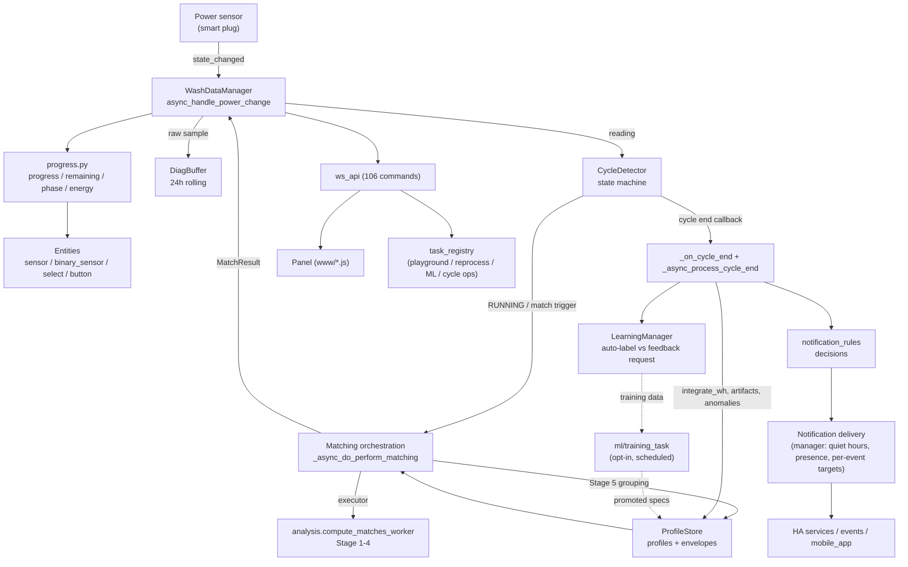

# WashData Integration Reference (Internal)

> **Status:** internal engineering reference, generated 2026-07-18, maintained through branch `0.5.4` (last content pass 2026-08-17).
> **Audience:** maintainers and Claude. This is the authoritative "how every piece works"
> map. It is deliberately not shipped to end users (the `docs/` tree is not part of the
> HACS package). User-facing docs (README, IMPLEMENTATION, NOTIFICATIONS, SETTINGS_VISUALIZED,
> docs/STORE, docs/WS_API) are derived from this reference.
>
> **How to use it:** this file is the synthesis + index. Each subsystem has a one-page
> summary here and a full deep-dive under [`reference/`](reference/) (one file per cluster,
> with `file:line` anchors, exact formulas, and per-method notes). When a fact here and in a
> deep-dive disagree, the deep-dive (and ultimately the code) wins. The
> [Discrepancy & tech-debt register](#discrepancy--tech-debt-register) at the bottom is the
> most actionable part: it lists every place code, `CLAUDE.md`, and the shipped docs disagree.
>
> **House style:** no em dash characters anywhere in this repo (use " - ", en dash, or a reword).

---

## 1. What WashData is

WashData is a Home Assistant custom integration (`domain: ha_washdata`, `iot_class:
local_polling`, requires only `numpy`) that turns a smart power plug into an appliance cycle
monitor. It watches a power sensor, runs a state-machine cycle detector, learns per-program
power-consumption *profiles*, matches running cycles against them, and estimates
progress / time-remaining / phase / projected energy + cost. Everything runs locally; the
only optional network feature is the Community Store.

**Supported device types** (`DEVICE_TYPES` in `const.py`): `washing_machine`, `dryer`,
`washer_dryer`, `dishwasher`, `air_fryer`, `bread_maker`, `pump` (sump/pump), `generic`
("Other (Advanced)" - full profile matching with neutral defaults), and `other`
("Threshold Device" - threshold-only detection, no profile matching, user must tune).
The legacy `coffee_machine` / `ev` / `heat_pump` / `oven` types were **removed in 0.5.0**;
existing entries were migrated to `other` (Threshold Device) with tuned options preserved.

**Scale:** ~43.3k lines of Python across 44 modules in `custom_components/ha_washdata/`,
plus a single 11.7k-line panel (`www/ha-washdata-panel.js`), 25+ languages, 171 pytest
files + 320 Playwright E2E tests.

---

## 2. Module map

| File | ~Lines | Role | Deep dive |
|---|---|---|---|
| `manager.py` | 7182 | Central orchestrator (one per config entry). Power intake, matching orchestration, cycle-end pipeline, notification **delivery**, entity attributes, ML wiring, background ops. | [04](reference/04-manager-orchestrator.md) |
| `profile_store.py` | 7393 | Profiles, storage (`Store` v12: `backfill_cycles`), Stage-5 grouping, envelopes/conformance/artifacts, pure-stats heuristics, match-ranking history, terminal-drop baselines, phase-profile cache, selective export/import (taxonomy + `_scan_data` + manifest + merge apply). | [02](reference/02-matching-and-profile-store.md) |
| `analysis.py` | 861 | The numeric matcher core (`compute_matches_worker`, Stages 1-4) + DTW-lite. Executor-run. | [02](reference/02-matching-and-profile-store.md) |
| `cycle_detector.py` | 2572 | The `OFF -> STARTING -> RUNNING <-> PAUSED -> ENDING -> OFF` state machine (+ delayed-start, anti-wrinkle, anti-crease finalize, dishwasher end, ML end-guard hook, terminal-drop hook). | [01](reference/01-detection-core.md) |
| `signal_processing.py` | 251 | Resampling + energy integration primitives (`integrate_wh`, `energy_gap_threshold_s`). **No DTW, no filtering** (those live in `analysis.py`). | [01](reference/01-detection-core.md) |
| `features.py` | 116 | `CycleSignature` feature vectors. | [01](reference/01-detection-core.md) |
| `time_utils.py` | 291 | Normalizer for the 3 `power_data` formats -> canonical `[[offset_s, power]]`. | [01](reference/01-detection-core.md) |
| `progress.py` | 842 | **Single source of truth** for progress / remaining / phase / projected-energy math. Pure; shared byte-identically by manager (live) and playground (sim). | [05](reference/05-progress-and-notification-rules.md) |
| `notification_rules.py` | 156 | Pure notification **decision** predicates (quiet hours, milestones, pre-completion). Delivery stays in manager. | [05](reference/05-progress-and-notification-rules.md) |
| `learning.py` | 996 | Feedback loop: auto-label vs request-verification routing, confidence tracking, feedback records/stats. | [06](reference/06-learning-and-suggestions.md) |
| `suggestion_engine.py` | 2152 | Classic + ML suggestion engines, `select_clean_cycles`, `reconcile_suggestions` invariants. | [06](reference/06-learning-and-suggestions.md) |
| `phase_catalog.py` | 374 | Legacy per-profile time-band phase ranges + per-device catalog labels. | [03](reference/03-phase-system.md) |
| `phase_segmenter.py` | 296 | NEW (0.5.1): unsupervised regime segmenter (idle/active/high + spin) -> per-role priors. | [03](reference/03-phase-system.md) |
| `phase_match.py` | 294 | NEW (0.5.1): per-role duration/energy agreement + `phase_eta`. | [03](reference/03-phase-system.md) |
| `ml/` | ~3.0k | Opt-in NumPy-only ML: `engine` (resolve_scorer/regressor), `feature_extraction`, `trainer`, `training_task`, `matching_tuner`, 3 embedded models + parity fixtures. | [07](reference/07-ml-subsystem.md) |
| `ws_api.py` | 6674 | 111 WebSocket command handlers (RBAC-guarded, executor/background). | [08](reference/08-ws-api-and-tasks.md) |
| `ws_schema.py` | 1156 | Typed request/response contract for the 111 commands (drives `ws-types.d.ts` + `docs/WS_API.md`). | [08](reference/08-ws-api-and-tasks.md) |
| `frontend.py` | 618 | Panel + card + per-language translation static serving. Minified-artifact resolver (`_resolve_asset`), self-healing gzip pre-compression (`_ensure_gzip`), build-manifest hash validation. | [08](reference/08-ws-api-and-tasks.md) |
| `task_registry.py` | 244 | In-memory long-task registry (progress/ETA/cancel/reconnect + header pills). 11 task kinds. | [08](reference/08-ws-api-and-tasks.md) |
| `playground.py` | 1939 | Headless, executor-safe replay behind the Playground tab. Reuses the real detector + matcher + `progress.py` (byte-identical to live). | [09](reference/09-playground.md) |
| `history_import.py` | 836 | NEW (#344): raw power history -> candidate cycles. Tolerant CSV parse, activity-block pre-pass, quiet-gap densification, resumable replay through fresh real detectors. Pure/executor-safe, never raises. | register 126 |
| `__init__.py` | 1138 | Entry point: setup, service registration, config-entry migration (v1 -> v3.9). | [10](reference/10-entities-config-services.md) |
| `config_flow.py` | 263 | Minimal HA flow (device type, power sensor, min power). 180+ tunables live in the panel. | [10](reference/10-entities-config-services.md) |
| `sensor.py` / `binary_sensor.py` / `select.py` / `button.py` | ~1.4k | Entity platforms (25 entities total). | [10](reference/10-entities-config-services.md) |
| `intents.py` / `recorder.py` / `setup_advisor.py` / `diagnostics.py` / `diag_buffer.py` / `log_utils.py` | ~1.1k | Assist intent, manual recording, adoption guidance, HA diagnostics, rolling buffers, logging adapter. | [10](reference/10-entities-config-services.md) |
| `store.py` / `store_client.py` / `store_account.py` | ~1.5k | Community Store: `StoreBridge` orchestration, Firestore REST client, global account/prefs. | [11](reference/11-community-store.md) |
| `const.py` | 1118 | 303 constants/keys (102 `CONF_*`, 83 `DEFAULT_*`, `MATCH_*`, `ML_*`, device-default maps, feature flags, storage). | [12](reference/12-constants-catalog.md) |
| `www/ha-washdata-panel.js` | 12783 | The full-screen panel (7 tabs). | [13](reference/13-panel-frontend.md) |
| `www/ha-washdata-card.js` | 1324 | Adaptive Lovelace card (`layout: tile`/`detail`/`glance`): device-registry sibling auto-discovery, WS `get_constants` for STATE_COLORS, panel-translation localization, opt-in action-button row. | [13](reference/13-panel-frontend.md) |

---

## 3. Architecture & data flow

```mermaid
flowchart TD
    PS["Power sensor<br/>(smart plug)"] -->|state_changed| M["WashDataManager<br/>async_handle_power_change"]
    M -->|reading| CD["CycleDetector<br/>state machine"]
    M -->|raw sample| DB["DiagBuffer<br/>24h rolling"]
    CD -->|RUNNING / match trigger| MO["Matching orchestration<br/>_async_do_perform_matching"]
    MO -->|executor| AN["analysis.compute_matches_worker<br/>Stage 1-4"]
    PST["ProfileStore<br/>profiles + envelopes"] --> MO
    MO -->|Stage 5 grouping| PST
    MO -->|MatchResult| M
    M --> PR["progress.py<br/>progress / remaining / phase / energy"]
    PR --> ENT["Entities<br/>sensor / binary_sensor / select / button"]
    CD -->|cycle end callback| CE["_on_cycle_end + _async_process_cycle_end"]
    CE -->|integrate_wh, artifacts, anomalies| PST
    CE --> LM["LearningManager<br/>auto-label vs feedback request"]
    CE --> NR["notification_rules<br/>decisions"]
    NR --> ND["Notification delivery<br/>(manager: quiet hours, presence, per-event targets)"]
    ND --> HA["HA services / events / mobile_app"]
    M --> WS["ws_api (106 commands)"]
    WS --> PANEL["Panel (www/*.js)"]
    WS --> TR["task_registry<br/>(playground / reprocess / ML / cycle ops)"]
    LM -.training data.-> MLT["ml/training_task<br/>(opt-in, scheduled)"]
    MLT -.promoted specs.-> PST
```

**The 5-minute matching loop is the heartbeat.** Power changes feed the detector on every
sample; the detector's `profile_matcher` callback is only a *trigger* that fires-and-forgets
an async match. Real matching runs on an interval (`profile_match_interval`, default 300s),
executor-offloaded so NumPy never blocks the event loop. Results update entities via a
dispatcher signal (`ha_washdata_update_{entry_id}`), publish-on-change.

**Cycle end is two-phase:** synchronous `_on_cycle_end` (energy integration via the shared
`integrate_wh`, ghost/pump-out suppression) then async `_async_process_cycle_end` (persist,
artifacts, envelope conformance, anomalies, cost freeze, ML quality gate, learning trigger,
events, notifications). A per-cycle UUID token guards against a back-to-back cycle race.

---

## 4. Subsystem summaries

Each links to its full deep-dive. Only the load-bearing facts are here.

### 4.1 Detection ([01](reference/01-detection-core.md))
- States: `OFF -> STARTING -> RUNNING <-> PAUSED -> ENDING -> OFF`, plus `DELAY_WAIT` (delayed-start) and `ANTI_WRINKLE` (dryer, can re-arm to STARTING).
- Hysteresis: `start_threshold_w` vs `stop_threshold_w`; `STARTING -> RUNNING` is a **dual gate** (`_time_above_threshold >= start_duration_threshold` AND `_energy_since_idle_wh >= start_energy_threshold`).
- Dynamic, cadence-adaptive pause/end thresholds from `_p95_dt` (p95 of last 20 sample gaps).
- Terminal-state expiry is owned by the **manager**, not the detector (issue #284). The detector only owns `ANTI_WRINKLE -> OFF`.
- `ENDING` has two mechanisms: **Smart Termination** (needs matched profile, confidence >= 0.4, not ambiguous/prefix-ambiguous, duration >= expected x smart_ratio, plus a device-specific debounce) and a fallback energy-gate **timeout** over a look-back window.
- **Dishwasher end** is the most intricate path: 85% end-spike arming gate, 90/99% smart_ratio, pump-out wait (`DISHWASHER_END_SPIKE_WAIT_SECONDS=1800` OR quiet-release), 1800s min-cycle floor, terminal-tail match-freeze (300s), fixed 300s smart-debounce deliberately decoupled from `off_delay`.
- Two opt-in one-directional ML/anomaly hooks: end-guard can only **defer** (bounded 1800s); terminal-drop can only **shorten** the wait.

### 4.2 Matching ([02](reference/02-matching-and-profile-store.md))
- Stage 1 duration gate; Stage 2 `score = 0.45*max(0,corr) + 0.55*mae_score` (MAE expressed relative to current cycle peak); Stage 3 DTW-lite (default `ensemble` = 0.7 L1-DTW + 0.3 derivative-DTW, blended 50/50); Stage 4 duration/energy agreement (weights 0.22/0.22, sharpened scales); Stage 5 cohesive profile-group collapsing (`GROUP_MIN_COHESION=0.80`) + member pick + downgrade safeguards.
- `MatchResult.confidence` is the **post-Stage-4 blended score** (not raw Stage-2/3, contra older CLAUDE.md wording). `is_ambiguous = (top1-top2) < 0.05`.
- Profile template order: golden single-cycle trace -> envelope avg (>=2 cycles) -> sample cycle. Envelopes: medoid reference + per-cycle DTW warp -> min/max/avg/std bands.
- `reference_cycles` (imported/community) shape envelope+template+duration but **never** usage/energy/count/trend stats; GC/repair must union `reference_cycles` ids or it corrupts import-only profiles.
- Pure-stats heuristics (never raise): profile health, trends (OLS %/cycle), coverage gaps, advisories, envelope conformance, cycle artifacts (pause/dip/spike).

### 4.3 Phases ([03](reference/03-phase-system.md)) - **heavily reworked in 0.5.1**
- Two layers share the word "phase": (1) **legacy** per-profile time-band ranges (`profile["phases"]`) driving the current-phase readout; (2) **new** unsupervised segmentation -> per-role priors -> blended ETA. They are not wired to each other.
- Legacy readout indexes the range table by **ML-blended progress fraction x nominal**, not raw elapsed, so overrun/underrun still names the phase.
- New live phase-ETA is **opt-in and double-gated**: per-device `enable_phase_matching` flag AND `LIVE_PHASE_DEVICE_TYPES = (washing_machine, washer_dryer)` only (dishwasher has a model but is excluded from live).
- ETA blend (in `progress.compute_progress`): `remaining = (1-f)*phase_remaining_s + f*base_remaining`, `f = base_progress/100`; byte-identical to legacy when `phase_remaining_s is None`.
- Phase-5 mixed-profile advisory (`code: phase_inconsistent`) is computed and served but **currently rendered nowhere** (see register).

### 4.4 Manager ([04](reference/04-manager-orchestrator.md))
- Owns detector, profile store, learning manager, recorder, diag buffer, store bridge.
- Watchdog injects 0W keepalives, extends timeouts for matched/verified-pause, and force-ends zombie (>3x expected & >4h) / ghost cycles.
- Three anomaly signals, all visible-only (never notifications): live overrun (1.5x), post-cycle underrun (<0.55x median), energy z-score (|z|>2.5).
- All progress/remaining/phase/energy/anomaly math delegated to `progress.py` (wrappers do not fork it) - this preserves Playground byte-parity.
- Notification **decisions** in `notification_rules.py`; **all delivery** (quiet-hours queue+timer, presence hold/release, per-event routing, actions/script, persistent-notification fallback, iOS Live Activity) in the manager. One shared `_lifecycle_tag` collapses start/live/pre-complete/finish into one replaceable card.

### 4.5 Progress / ETA / notification gating ([05](reference/05-progress-and-notification-rules.md))
- ML blend weight 0.5 applied **pre-EMA**. Three-tier EMA alpha by power variance (0.20 / 0.10 / 0.05); heavy 95/5 damping on backward drops beyond device threshold.
- Remaining is **always back-calculated** from progress: `remaining = matched_duration * (1 - smoothed/100)`; progress capped at 99 live.
- Phase-resolved ETA is a second blend layer (source `phase_blend`).
- Projected energy prefers the `total_energy` regressor; fallback `energy_so_far / (progress/100)`; both `max(..., energy_so_far)` and gated at progress >= 3%.
- Pre-completion notification has 5 guards incl. `not match_ambiguous`.

### 4.6 Learning & suggestions ([06](reference/06-learning-and-suggestions.md))
- Cycle end routes each cycle to auto-label / feedback-request / skip via a *routing* confidence.
- Auto-label bar `auto_label_confidence` (0.9); request floor `learning_confidence` (0.6). Warmup gate: non-imported profile with < `PROFILE_MIN_WARMUP_CYCLES` (5) labeled cycles always requests confirmation.
- Two downgrade triggers turn a high-confidence match into a feedback request: ML quality `P(problem) >= 0.65` (only when ML opted in) and `envelope_conformance < 0.40` (always live).
- Suggestion engine can recommend ~22 detection/matching/learning parameters, each from a specific statistic (full list in the deep dive); `reconcile_suggestions` keeps coupled settings consistent.

### 4.7 ML subsystem ([07](reference/07-ml-subsystem.md)) - opt-in, NumPy-only, never raises
| Capability | Type | Predicts | Cols | Promotion gate |
|---|---|---|---|---|
| `end` | classifier | P(low-power event is true end vs pause) | 8 | held-out AUC >= base-0.02 & bacc gate |
| `quality` | classifier | P(finished cycle is a problem) | 31 | AUC >= base-0.02 & bacc gate |
| `live_match` | classifier | P(top-1 live match correct) | 8 | AUC >= base-0.02 & bacc gate |
| `remaining_time` | regressor | time-completion fraction | 7 | MAE beats naive by 0.05; **no shipped baseline (inert until promoted)** |
| `total_energy` | regressor | energy-completion fraction | 7 | MAE beats naive by 0.05; **no shipped baseline** |
- Five gated runtime consumers (all behind `CONF_ENABLE_ML_MODELS`, default off), each asymmetric: end-guard (defer-only), early-commit (>=0.85 speeds first commit), quality gate (>=0.65 downgrades auto-label), remaining/energy blend (bounded 50% pre-EMA), terminal-drop (shorten-only; pure stats, no model).
- `matching_tuner` leave-one-out tunes 4 bounded scoring weights only; can never change structural matching.
- Parity fixtures (`tests/test_ml_models.py`, `tests/test_ml_feature_extraction.py`) are the anti-drift gate.

### 4.8 WS API + tasks ([08](reference/08-ws-api-and-tasks.md))
- **106 commands**, all `ha_washdata/*`, RBAC-guarded (`_guard`, 4 levels; admin-only for destructive ones even when RBAC off). Registration is idempotent on every reload (new commands work after an integration reload; the old "needs full HA restart" gotcha is obsolete).
- Background tasks return `{task_id}` immediately and run chunked in the executor; `subscribe_tasks` is the live-push progress channel (reconnect-safe). Per-entry write lock serializes store-mutating handlers.
- Panel served at `/ha_washdata/ha-washdata-panel.js`; translations at `/ha_washdata/panel-translations/{lang}.json` (no build step).

### 4.9 Playground ([09](reference/09-playground.md))
- Three entry points: `simulate_cycle_detail` (faithful per-5s timeline + events + alerts + outcome), `run_playground_history` (per-cycle rows + before/after diff), `run_playground_sweep` (1D/2D over params). No math of its own - reuses the real detector, matcher, `progress.py`, `notification_rules.py`.
- Overridable params: 15 detection keys (`_OVERRIDE_FIELD_MAP`) + 13 matching keys (`_MATCH_OVERRIDE_KEYS`); of the latter only `profile_match_min/max_duration_ratio` are real options - the Stage 2-4 scoring knobs are sandbox-only. Sweep objectives: `match_accuracy`, `end_timing_accuracy`, `false_end_rate`, `median_overrun`, `ambiguity_rate`.
- Settings control panel (0.5.4): `effective_settings()` reads the live detector/matcher config back into option keys (the inverse of `build_sim_config`/`apply_match_overrides`) so the sandbox always opens on the integration's real values; per-device presets live in the store key `playground_presets`; `PUBLISHABLE_SETTING_KEYS` gates what may be written back via `set_options`. See register item 102.
- End-detection alerts: `would_run_indefinitely` (never self-ended), `timeout_end` (ended by off-delay, not smart prediction).

### 4.10 Entities / config / services ([10](reference/10-entities-config-services.md))
- 25 entities: 12 always-on sensors + conditional sensors (pump-runs, and 3 debug sensors + binary ambiguity behind `expose_debug_entities`) + dynamic per-profile count sensors + running binary sensor + program select + 5 buttons.
- State sensor attributes: `samples_recorded`, `current_program_guess`, `sub_state`, `pump_stuck` (pump), and conditional `cycle_anomaly` / `overrun_ratio` / `last_cycle_*` / `ha_restart_gaps` / `maintenance_due`. Progress sensor adds `projected_energy_kwh` / `projected_cost`.
- 13 registered services (`trigger_ml_training` only when `ENABLE_ML_TRAINING`). Config-entry schema at **v3.9** (3.7→3.8: strips dead `running_dead_zone` option; 3.8→3.9: strips options persisted as `null`, #389).

### 4.11 Community Store ([11](reference/11-community-store.md))
- Brand -> Device -> Program -> Reference cycles, Firestore REST backend; device auto-promotes at `confirmCount >= 5` (live-tunable). Three modules: account (global online toggle + GitHub creds + prefs), client (pure REST), `StoreBridge` (orchestration; no-raise `{"error":...}`).
- Sharing bundle: appliance metadata + LTTB-downsampled traces (<=10k pts) + per-cycle stats + QC provenance + optional phase ranges + optional numeric settings (20-key allow-list). Imported cycles land in `reference_cycles`, structurally isolated from real stats.
- Adoption guidance (`setup_advisor.compute_setup_phase`) drives the Setup Card via a 6-phase state machine (Phase 1c = store-download-only).

### 4.12 Panel ([13](reference/13-panel-frontend.md))
- 7 top tabs: Overview, Cycles, Profiles, Settings (edit), Playground (edit), Store (edit+online), Advanced. Push-driven (`set hass()` + `subscribe_events` + `subscribe_tasks`), `_t()` translation, no build step.
- Settings save via `set_options` (triggers reload); the per-key settings-history revert uses `ws_set_options` (no reload). ML Training lives under Advanced -> ML sub-tab.

---

## 5. Cross-cutting concerns

- **Energy math:** the shared `signal_processing.integrate_wh(ts, power, max_gap_s)` + data-driven `energy_gap_threshold_s` (`clip(10 x median_interval, 60, 3600)`) is used by both persistence paths (`manager._on_cycle_end`, `ProfileStore.add_cycle`) and the ENDING gate. Exception: the detector's *running* `_energy_since_idle_wh` accumulator uses a simpler left-rectangle sum (only gates STARTING->RUNNING; acceptable divergence).
- **Notifications:** one delivery layer (manager) + one decision layer (`notification_rules`). No new notification *types* are added by policy - new signals surface as sensor attributes / cycle metadata / panel banners.
- **Gating flags** (`const.py`): `SHOW_ML_LAB`, `ENABLE_ML_SUGGESTIONS`, `ENABLE_ML_TRAINING` (build-time, all True); `CONF_ENABLE_ML_MODELS` (per-device, default off, lives in `ml/engine.py`); `enable_phase_matching` (per-device); `online_features_enabled` (runtime, store).
- **Storage/migrations:** `STORAGE_VERSION = 12`. Config-entry schema v3.9. Both migration layers are tested separately (`test_migration_harness.py` for config entry, `test_migration_v032.py` calling `_async_migrate_func` directly for storage).
- **Background tasks:** `task_registry` (9 kinds) is the single source of truth for "what long thing is running"; wired from `ws_api` (not `manager`). Playground history/sweep/detail, reprocess, ML training, rebuild-envelopes, trim, split, merge.
- **i18n:** English source in `strings.json` (HA layer) + `translations/panel/en.json` (panel). All non-English via Claude subagents only - **never machine-translate**. Panel keys served directly, no bundle.

---

## 6. Documentation map & update status

| Doc | Audience | Primary source subsystems |
|---|---|---|
| README.md | end users | detection, panel, entities, services, notifications, store |
| IMPLEMENTATION.md | developers | all (flows + mermaid), the deep technical doc |
| NOTIFICATIONS.md | automation users | manager delivery + notification_rules + events |
| SETTINGS_VISUALIZED.md | tuners | const defaults + suggestion heuristics |
| docs/WS_API.md | panel/API devs | ws_schema (auto-generated) |
| docs/STORE.md | store users | community store |
| docs/plans/ROADMAP.md, IMPROVEMENT_PLAN.md | maintainer | planning history |
| TESTING.md, CONTRIBUTING.md, SECURITY.md | contributors | testing, process, security |

See the [docs audit](reference/14-docs-audit.md) for the full per-doc stale/missing list and the tiered update plan that this pass executes.

---

## 7. Discrepancy & tech-debt register

The highest-value output of this assessment. Grouped by kind. `[DOC]` = documentation is wrong;
`[CODE]` = likely code bug / dead code; `[NOTE]` = intentional divergence worth recording.

**Last full reverification: 2026-08-17.** Items 1-14 (§7.1) and 15-22 (§7.2) were all fixed in
commit `e7fd400`. Items 23-26 fixed by maintainer in 698ed31+12f61ce. Item 32 reclassified as
false positive. Items 39-40 are new. **All open code bugs (27-31, 33-41) fixed in 0.5.1 branch
(2026-07-20): see individual entries below.**

**2026-07-21 additions (0.5.2 branch):** Item 27 fully closed (panel-side abrupt_drop cleanup);
new items 42-53 added and fixed in same session. Items 50-53 are the detection-tuning fixes
(reconcile Rule 2 / smart_debounce coupling; STARTING timeout; ENDING duration-anchored backstop;
anti-crease standby-band finalize), each validated with the slow suite + a byte-identical
`dtw_ab_eval` top-1 (88.36%, matcher untouched).

**2026-07-26 additions (0.5.3 branch, issues #328/#329/#331):** Items 57-59 added and fixed —
`running_dead_zone` dead config retired (migration 3.7→3.8), live chart diag_buffer overlay,
panel registration blocking-call + race (already fixed by earlier commits on 0.5.3). Item 60:
re-labelling a review cycle now resolves its pending feedback (#331). Item 61 (#325 / PR #326,
community contribution): anti-wrinkle pulse gap made configurable, sensor-swap reload guard
hardened (scope creep, maintainer-accepted), and anti-wrinkle made visible/tunable in the Playground.

**2026-08-20 additions (0.5.5 branch, store read budget):** Items 110-121 added. 120 is the panel i18n pass; 121 records the pre-existing placeholder drift it uncovered. 119 records the review round that caught 4 regressions in 110/111. 111 is now FIXED (brand-scoped browse); 117 covers the release/CI gate for the generated panel bundle. 112 is now PARTIAL (store-side work done in `/root/washdata_store`, uncommitted); 115 records why the catalog manifest was deferred and what would revive it. 110 is fixed
(integration-side catalog read reductions, validated by 14 new tests in `tests/test_store_client.py`);
111-113 are open and deliberately scoped out of the integration — 111 needs the manifest first, and
112-113 live in the `washdata_store` repo.

**2026-08-20 addition (0.5.5 branch, panel):** Item 122 - the device-pill tuning badge now counts Calibrated (ML)
suggestions, via `suggestion_keys` from `get_devices` plus per-entry client caches; same helper de-duplicates the
Overview attention card.

**2026-08-20 additions (0.5.5 branch, issue #364 - Smart-Termination split):** Items 135-140. 135 is the fix
itself (a power-plausibility guard on BOTH SMART paths plus prefix scoring replacing the 1.5x landscape ratio);
136 records that #364's "reintroduced in v0.5" premise is wrong AND that the triage's leak weighting was too
(the 1.5x ratio, not the full-envelope shape score, is what made the #288 guard inert); 137 retires
`profile_match_threshold` as dead config; 138 makes the Playground able to replay this class of failure at all;
139 explains why the prefix verdict is deliberately two-tier (widening it on the anti-crease path would
re-create the #296 hang); 140 is the test-mirror lesson. Validated with the new `devtools/prefix_guard_eval.py`
plus a byte-identical `dtw_ab_eval` before/after (grouped, top-1/MRR **and** recall/FP).

**2026-08-21 addition (0.5.5 branch, issue #393 - configurable Smart-Termination ratio):** Item 141. The
Smart-Termination duration gate compared against `_expected_duration`, the profile's outlier-filtered **mean**,
via a hard-coded ratio (0.98, dishwasher 0.99). Because ~half the cycles of a load-/temperature-dependent
appliance are shorter than their own mean by construction, the fast path was structurally unreachable for them.
Made it the per-device option `smart_termination_duration_ratio` (range 0.50-1.00; empty = default), resolved to
the device-type default in the config builder (**not** in the gate, so `playground.effective_settings()` never
skips a None-valued field). The gate math was extracted into the pure static `CycleDetector._resolve_smart_ratio`
(mirrors the `_smart_term_block_reason` precedent for unit-testability); the dishwasher 0.90 pump-out relief is
folded in via `min()`, so a configured value can only ever loosen the gate. NB: `profile_match_threshold` (the
gate's separate `is_confident_match` input, un-deaded by #364) is deliberately untouched here - raising it to
satisfy the #396 conflict rule would tighten this same gate. 22 tests in
`test_smart_termination_duration_ratio.py`; localized x35.

**2026-08-21 addition (0.5.5 branch, issue #396 - shipped defaults violate the panel's own rules):** Item 144.
Three default pairs tripped the panel's `_SETTING_CONFLICTS` (also enforced server-side in
`suggestion_engine.reconcile_suggestions`). Three distinct root causes, three fixes: (a) the confidence rule was
BACKWARDS - the correct ladder is unmatch(0.35) < match(0.4) < learning(0.6) < auto_label(0.9), but the rule
demanded learning <= match; inverted to learning >= match in BOTH the panel and reconcile Rule 5 (defaults were
right). (b) `DEFAULT_SAMPLING_INTERVAL_BY_DEVICE` was DEAD (never consumed) so every device ran at the coarse 30 s
scalar, leaving watchdog(30)/start_duration(5) below the watchdog>=2*sampling / start_duration>=sampling gates AND
undersampling wet appliances live; added `resolve_sampling_interval_default` / `resolve_watchdog_interval_default`
(max(30, 2*s+1)) / `resolve_start_duration_default` (max(5, s)) in const, wired at manager init+reload; **behavior
change: washers/washer-dryers/dishwashers now keep 2 s live readings** (matcher untouched - dtw_ab_eval flat 88.4%
byte-identical). (c) fixed the stale `DEFAULT_WATCHDOG_INTERVAL` "2*sampling+1" comment. Panel: `ws_get_options`
now returns a device-resolved `defaults` map; `_renderField` + conflict-eval use it so an unset field shows/validates
the real effective default (no spurious warnings). Migration config-schema **3.9 -> 3.10** heals seeded
watchdog=30/start_duration=5 on old entries where they still equal the old default (`MINOR_VERSION` bumped in
config_flow). NB: FR's "profile_match_threshold is inert, remove it" premise was stale - it's live since bcccf64;
left at 0.4. Tests: `test_issue_396_conflict_defaults.py` (9) + 4 migration tests + updated reconcile-ordering test;
2 flipped conflict-message keys re-translated x35.

**2026-08-21 addition (0.5.5 branch, issue #395 - preserve peaks when thinning curves):** Item 143.
`ws_api._downsample` strided (kept every n-th point), so a single-sample load peak or a lone 0 W self-shutdown
sample could vanish from the drawn curve (measured: peak off-curve in 14/49 curves). Rewrote it to keep each
bucket's min AND max (time-ordered) + global first/last, at the same budget - a peak is a bucket max, a zero is
a bucket min, so neither can fall through. All 7 callers benefit. Also declared the thinning: `sample_count` +
`decimated` added to `GetCyclePowerDataResponse` / `AnalyzeSplitResponse` (regen `ws-types.d.ts` + `WS_API.md`
via `generate_ws_types.py`), and the cycle-detail modal shows "Showing N of M samples" (`msg.samples_decimated`,
localized x35) so a thinning gap is not read as a sensor dropout. Trade-off: flat plateaus collapse to 1-2 pts,
so drawn points can sit further apart - which the declaration mitigates. Tests: `test_curve_decimation.py` (10).
Part 2 of the FR (larger single-curve budget) was declined by the maintainer. There is a separate peak-preserving
LTTB `_downsample` in `store.py` (community-upload path) - a different algorithm, not touched.

**2026-08-21 addition (0.5.5 branch, issue #394 - skip idle learning pass):** Item 142. `manager._async_power_changed`
called `learning_manager.process_power_reading` unconditionally, so the 5-min operational-suggestion pass ran + rewrote
the store around the clock while idle (~98% of the time), and the sampling-cadence model was trained on the idle
publish-on-change heartbeat (not the in-cycle rate), oversizing every operational suggestion. The learning call is now
gated on `detector.state in (STARTING, RUNNING, PAUSED, ENDING)`; `detector.process_reading` stays unconditional (it
must catch the next cycle start). Pin test `test_issue_394_idle_learning_gate.py` (10) locks the split so it can't be
folded back together. No runtime dependency on the idle-trained model (it feeds only user-facing suggestions).

| # | Status | Kind | Short description |
|---|---|---|---|
| 142 | FIXED | CODE | #394 learning/auto-tune pass gated on active detector state (was every reading, incl. idle - constant store rewrites + cadence model skewed by the standby heartbeat); detector still sees every reading |
| 141 | FIXED | CODE | #393 Smart-Termination ratio is now the per-device `smart_termination_duration_ratio` option (device-default resolved in the config builder; `_resolve_smart_ratio` helper; dishwasher pump-out relief via `min()`) |
| 135-140 | FIXED | CODE | #364 Smart-Termination split: power-plausibility guard on both SMART paths + prefix scoring replaces the 1.5x ratio; `profile_match_threshold` un-deaded; Playground can replay it |
| 23-26 | FIXED | CODE | phase-match occ_penalty, advisories, cold-start, docstrings |
| 27 | FIXED | CODE | `_abrupt_drop` never set True - dead branch + vestigial config fields |
| 28 | FIXED | CODE | `event_density` always 0.0 - zero-variance ML feature column |
| 29 | FIXED | CODE | Playground legacy `run_playground_batch`/`_simulate_one` dead path; sweep direction missing from payload |
| 30 | FIXED | CODE | `auto_label_cycles` service default 0.70 (schema) vs 0.75 (Python) |
| 31 | FIXED | CODE | Double "Config reloaded" log; snapshot duplication fixed |
| 32 | FALSE POSITIVE | - | ML calibration gate correctly uses 0.55 via `_OPERATING_THRESHOLD` |
| 34 | FIXED | NOTE | analysis.py duration-ratio fallbacks 0.07/1.30 diverged from canonical 0.10/1.50 |
| 36 | FIXED | NOTE | `generate_docs_graphs.py` OUTPUT_DIR pointed to `doc/images` instead of `docs/images/suggest` |
| 39 | FIXED | CODE | `WashDataStore.get_storage_stats/async_clear_debug_data` dead + blocking I/O |
| 40 | FIXED | CODE | 5 `reconcile_suggestions` keys silently dropped by `ws_apply_suggestions` |
| 41 | NOTED | NOTE | Embedded model THRESHOLD vs live gate clarified with cross-reference comments |
| 42 | FIXED | CODE | Dead sync `match_profile()` (56 lines) removed from `profile_store.py` |
| 43 | FIXED | CODE | ML `resolve_scorer`/`resolve_regressor` lacked schema guard for stale feature columns |
| 44 | FIXED | CODE | 5 hardcoded English strings in panel.js now routed through `_t()` |
| 45 | FIXED | CODE | `apply_split_interactive` used sync `add_cycle` — retention unsaved before split `async_save` |
| 46 | FIXED | CODE | Cycle-ID 12-char SHA collision with no dedup guard in `_add_cycle_data` |
| 47 | FIXED | NOTE | `ProfileStore` init used flat duration-ratio default, not per-device default |
| 48 | FIXED | CODE | `_reprocess_task` cancel only honoured before ML step; 3 earlier steps unresponsive |
| 49 | FIXED | CODE | Playground `_SIM_SERIES_THROTTLE_S=5.0` equalled cadence; throttle was a no-op |
| 50 | FIXED | CODE | `reconcile_suggestions` Rule 2 lowered off_delay (split soak pauses); washer smart_debounce uncapped |
| 51 | FIXED | CODE | STARTING had no timeout; user-paused + machine-off pinned it in STARTING forever |
| 52 | FIXED | CODE | Ambiguous-match cycle stuck in ENDING (standby energy gate) — duration-anchored backstop added |
| 53 | FIXED | CODE | Anti-crease baseline above stop_threshold pinned cycle in RUNNING (#296) — standby-band finalize added |
| 54 | ADDED | NOTE | Selective export/import (0.5.3): taxonomy + `_scan_data` + manifest + merge apply; 4 new WS commands |
| 55 | ADDED | NOTE | Playground idle-termination test / stress tail (0.5.3): synthetic standby continuation through the real detector |
| 56 | FIXED | CODE | 0.5.3 pre-release review pass (4 rounds, 14 findings): panel XSS, cache-caches-failures + unbounded growth, import guards/idempotency/O(N²)/replace-overwrite, playground mislabel, DTW fallback |
| 57 | FIXED | CODE | `running_dead_zone` config existed since v0.3 but was NEVER wired to detection — retired in 0.5.3 (migration 3.7→3.8 strips it); `isBool` undefined in `_htmlPgParamRows` playground template |
| 58 | FIXED | CODE | `get_power_history` live chart lagged raw sensor by one sampling interval during ENDING soak-bridge — fixed by overlaying `diag_buffer` tail onto detector trace before downsample |
| 59 | FIXED | CODE | Panel registration blocking FS call (`scandir` on event loop) + multi-device race — already fixed in 0.5.3 by executor offload + shared `asyncio.Task` coalescing |
| 61 | ADDED | NOTE | Anti-wrinkle pulse gap configurable (0.5.3, #325/PR #326): new `anti_wrinkle_idle_timeout` setting; sensor-swap reload guard broadened to all active states & keeps co-submitted options; Playground anti-wrinkle band + `anti_wrinkle_*` overrides |
| 99 | FEATURE | CODE | Stage-5 member-pick now discriminates variants by integrated energy (∫P·dt), not the dead whole-cycle peak + diluted mean power (63.3%→73.3% on real store data; #334 Phase 0.5) |
| 100 | FEATURE | CODE | Stage-4 energy agreement uses integrated energy for WM/washer_dryer only (`stage4_energy_mode`); validated on clean store/golden data (washer +3.4 top-1 at qc≥2, FP −10pp); dishwasher/dryer keep mean power |
| 101 | FIXED | CODE | 0.5.4 pre-release CodeRabbit loop (PR #380): gap-free quiet tally, notify-entity routing, trim inward-snap, Rule-12 rounding floor, executor-side loop-affine option reads, anti-wrinkle restore anchor + CI/workflow hardening |
| 102 | FEATURE | CODE | Playground settings control panel (0.5.4): `effective_settings()` live-settings source, per-device presets (`playground_presets`), per-setting publish (`PUBLISHABLE_SETTING_KEYS`) |
| 103 | FIXED | CODE | Auto-tune proposed end-detection-lagging values: `off_delay` clamped a *measured* p95 pause up to the blind `DEFAULT_OFF_DELAY_BY_DEVICE` prior (dishwasher 1800 s); `watchdog_interval` at 3×p95 despite being a tick period, not a threshold |
| 104 | FIXED | CODE | `min_off_gap` was sized from the *don't-merge ceiling* (`p05 inter-cycle gap × 0.8`) floored by a blind prior, instead of from the measured *don't-split requirement*; now measured, ceiling-capped, and suppressed when the two conflict. Replay-validated (`devtools/min_off_gap_eval.py`) |
| 105 | FIXED | CODE | 3 `ws_schema.py` response TypedDicts under-documented handler fields (`get_constants` version/icon_url/store_prefs, `get_cycle_power_data` is_reference, `get_shareable_cycles` all_programs); added + regenerated `docs/WS_API.md` / `ws-types.d.ts` |
| 106 | FIXED | CODE | `compute_envelope_worker` derived alignment-grid resolution from the median per-cycle sample interval with no ceiling, so a profile with a 1 Hz-recorded cycle computed `num_points = duration / 1.0` (e.g. 15 055 for a 4 h wash) and `compute_dtw_path` then allocated an `(n+1)×(m+1)` dense float64 cost matrix — 1.81 GB in a single `np.full` — OOM-killing HA Core (issue #388). Fix: `MAX_ALIGN_GRID_POINTS = 2000` cap in `const.py`; `compute_envelope_worker` applies it and re-derives `align_dt = target_duration / num_points` so the per-cycle grid inherits the same cap automatically; `compute_dtw_path` adds a pre-flight guard (>10 M cells → warning + return `[]`) as a defence-in-depth backstop. |
| 109 | FIXED | CODE | `.wd-tip-pop` help bubbles were centred on their 15 px anchor with a fixed 264 px width and no edge awareness, so any anchor closer than half that to a clipping container's edge had the overflow cut off (`.wd-modal` declares only `overflow-y: auto`, which promotes `overflow-x` to `auto`, so it clips horizontally too). Reported against the cycle modal's Review tab, where every label sits against the modal's left edge (issue #385). Fix: `_clipRectFor()` + `_positionTip()` in `www/ha-washdata-panel.js` clamp the bubble into the viewport intersected with every overflow-clipping ancestor, on a `pointerover` listener delegated on the shadow root. |
| 110 | FIXED | CODE | Store catalog reads: measured against the live store, `list_brands` (1 336 exec / 110 831 reads) + per-brand `search_devices` (1 058 / 21 233) were **90.7% of all query reads** on a shared 50k/day free-tier budget, and were being spent to render the two identity *badges* in Basic - Device info: `_renderStorePicker` fetched both full lists on every Settings-tab render (128 docs / 119 KB measured) to locate two rows whose ids are deterministic. Fixes in `store_client.py`: `catalog_entry()` + `get_brand()` + `_get_doc()` resolve them as **two cached point reads** (new WS `store_get_catalog_entry`); `list_brands(q=...)` now issues a `brand_lc` range query (rides the existing `(status, brand_lc)` index; 3 docs for `bo` vs 84) with `_cached_brand_superset()` walking shorter cached prefixes so only the first keystroke can query; `get_client(hass)` makes the client **one per install** instead of one per `StoreBridge`/appliance; `_serve_from_superset()` answers an approved-only request from a cached pending-inclusive one (one-directional on purpose — upgrading would raise reads); `_CATALOG_CACHE_TTL_S` 900 → 3600 with new `refresh_catalog()` / WS `store_refresh_catalog` as the escape hatch; `get_device_bundle` passes `include_ratings=False` (one aggregation request per cycle, browse-only, never read by adopt); `select` projections on both list queries (64.7→33 KB brands, 54.4→17 KB devices — device docs carry a ~25-key `settings` map no list view reads); `_seg()` percent-encodes every id-in-path (live catalog holds `aeg lavamat`, `fisher & paykel`). Sharing one client made `_last_error` install-wide state, so `StoreClient.write_lock` now spans the write-then-`last_error()` read in both `StoreBridge` upload paths. **Panel side:** `_renderBrandPicker`/`_renderModelPicker` read the badge from a new `_catalogEntry` slot (`_ensureCatalogEntry`/`_catalogEntryFor`/`_loadCatalogEntry`, keyed `brand|model|type` so it self-invalidates on a device switch or edit) instead of searching the lists; the lists moved to `_ensureCatalogList(optKey)`, called from the combobox's `showDrop` (focus/input) rather than from render. Because that load now runs *while the user is typing*, `_refreshComboAfterLoad` dispatches a synthetic `input` on the focused field to re-run the existing `showDrop` instead of re-rendering (a render would rebuild the input mid-keystroke); it falls back to `_render()` when the field is not focused. `store-confirm-device` patches all three copies of the row (picker entry, `_catalog.devices`, `_storeDevices`). Brand candidates are resolved by `_ensureBrandCandidates(q)`: the field opens pre-filled so the first focus is already a prefix search (250 ms debounce, `_brandSearchTimer`), `_catalog.brandPrefixes` records resolved prefixes so a narrowing keystroke never re-queries, `_catalog.brandsFull` short-circuits everything once the full list is local, and `_mergeBrandCandidates` unions partial results so backspacing does not drop rows. Clearing the field is the only remaining full-list fetch and it cancels a pending prefix search (which would otherwise fire a read the full list already covers). **UX consequence:** brand matching is now prefix, not substring. `store_refresh_catalog` is wired to a **Refresh catalog** button in the gear's Online & Community pane (`_htmlStorePrefs`), which also clears `_catalogEntry`, `_catalog.*` and the `_entityListCache` entries; without it the 1 h TTL had no user-facing escape hatch. Guarded by 8 E2E tests in `store.spec.ts` (Settings-open calls `store_get_catalog_entry` and **not** the list commands; each list arrives only on its picker's first open; first focus searches for the saved brand; narrowing does not re-query; clearing lists everything exactly once; the refresh button reaches the backend). |
| 111 | FIXED | CODE | Panel Store-tab browse listed **approved devices only** (15 of 564 live, ~6 per appliance type — matches the observed 6.028 docs/exec) while the settings picker passed `include_pending=True` and saw everything. Fixed by including pending AND scoping the browse to the declared brand + this device's appliance type, which is what makes it affordable: measured live, unscoped-with-pending is **298 docs** for one appliance type (so the naive fix would have been ~52.7k reads/period — more than the entire daily cap), brand-scoped is **44**, and it reuses the *same* cache key as the Settings model picker (verified: picker-then-browse costs 0 extra reads). `_storeBrandScope()` resolves the scope (typed query, else `store_brand`); `_sortStoreDevices()` pins the user's own model, then entries with content, then the rest; `_storeItemHasContent()` gates the program-count chip on a **positive** count only — the counters under-report where a best-effort increment was denied, so zero/absent means "unknown" and renders nothing rather than falsely claiming an entry is empty. With no brand declared the tab renders an actionable empty state (`store-goto-identity` → Settings/Basic + focus `#wd-store-brand`) and issues **no query at all**. Data behind the design: only **168 of 564** entries have ≥1 shared program (39 of 84 brands; washer 70 / dishwasher 60 / dryer 23 / washer-dryer 15), so the exact model is empty ~70% of the time and the sibling-model path had to be made explicit — hence the hint text and the content chips. `profileCount`/`cycleCount` added back to `_DEVICE_LIST_FIELDS` (they had been omitted by item 110's projection; nothing rendered them at the time, so nothing broke — this is the allow-list risk that item warned about, realised). Search box relabelled (`store.search_brand_ph`, a NEW key — `store.search_ph` is translated in 34 languages and its meaning must not change under them). 7 new English panel keys. Wiki `Community-Store.md` + README golden paths rewritten to an explicit ordered chain (enable → declare → browse/share) and the wiki's incorrect "filtered to your declared **model**" claim corrected to brand. 14 new E2E tests in `store.spec.ts`. |
| 112 | PARTIAL | NOTE | Store-side read reductions (separate repo, `/root/washdata_store`). **DONE 2026-08-20** (uncommitted on `main`): (c) `getProfileRating` now projects `['ratingSum','ratingCount']` and orders by `createdAt DESC` -- measured live 132,673 -> **619 bytes** for a 2-cycle program (214x) and back on the existing composite index, so **no new index is needed** (`restQuery` gained `select` support); (e) `ensureUserProfile()` returns the profile it already read, so the auth callback reads `users/{uid}` **twice, not four times**; (d) the per-card `hasConfirmedDevice`/`getUserDeviceRating`/`hasConfirmedCycle` point reads are cached per session (`_myConfirmCache`/`_myDeviceRating`/`_myCycleConfirm`, cleared on auth change, updated directly by the user's own confirm/rate) so re-renders are free; plus Apply-with-unchanged-filters no longer re-queries (`_queryFilterKey`) and the admin panel no longer pre-loads 40 user docs (the owner picker loads them on open). Rules tests 34/34, unit 14/14. **STILL OPEN:** (a) the `config/catalog` manifest and (b) the GitHub-Pages `catalog.json` -- deliberately deferred, see item 115; (f) admin Catalog's 3x500-doc scans (read count is irreducible there without pagination; a projection would not change it and risks omitting a field an admin flow needs). Note the status filter **cannot** be dropped to cheapen queries: (a) a denormalised catalog manifest — the live catalog is only 84 brands + 564 devices, ~55 KB slim, so **one** document read could replace 84+20; `config/{doc}` is already `read: if true` / `write: if isAdmin()` for any id, so `config/catalog` needs **no rules deploy** (a `catalog/*` path would, the default-deny catch-all covers it); (b) the site is on GitHub Pages, not Firebase Hosting, and `deploy.yml` assembles `dist/` from an explicit `cp` list, so a scheduled Action could publish `catalog.json` at **zero** Firestore reads; (c) `washstore.js::getProfileRating` reads up to 80 **full** cycle documents (including `trace.points`, capped at 900 KB each) per profile row to sum `ratingSum`/`ratingCount`, which are already denormalised on the doc — it also has no `orderBy`, so the implicit `__name__ ASC` cannot ride the `(profileId, status, createdAt DESC)` index and degrades to a zigzag merge (the observed 10.6 index entries per 0.55 results); the missing `cycles(profileId, status)` index or an added `orderBy` fixes it; (d) 2 uncached point reads per rendered device card, re-fired on every filter flip; (e) `users/{uid}` read 4× per signed-in page load; (f) admin Catalog tab does 3 unfiltered 500-doc scans per visit. Note the status filter **cannot** be dropped to cheapen queries: `firestore.rules:56` gates public reads on `status in ['approved','pending']` and Firestore rejects the whole query if any candidate doc is `removed`. |
| 114 | FIXED | CODE | `./run_tests.sh` aborted before pytest ran: the new `devtools/package.json` (added for the panel minifier, which needs `"type": "module"`) makes Node parse every `.js` in `devtools/` as ESM, so the CommonJS `devtools/panel_smoke.js` died on `require is not defined`. Converted the smoke harness to ESM (`import` + `fileURLToPath`-derived `__dirname`). Any future CommonJS script in `devtools/` must be named `.cjs`. |
| 115 | OPEN | NOTE | **Catalog manifest deliberately deferred.** The manifest (`config/catalog`, one read for the whole catalog) was the structural fix for the read budget, but after items 110 + 112 the budget no longer justifies its risk. Observed baseline was 145,569 query reads/period, 91.6% of it the integration. Post-fix projection: integration ~10-19k (the Settings-open path went 128 -> 2 reads; the lists now load only on a picker open, and a brand search costs ~3 docs instead of 84), website ~11k -> **~21-30k against the 50k/day cap**. The manifest needs a denormalised doc, rules allowing a single-element `arrayUnion` append by contributors, an admin rebuild path, a repair path for vandalism, AND matching integration-client changes -- a lot of moving parts for headroom that already exists. **Revive it when:** daily reads climb back over ~35k, or the catalog grows enough that a picker-open (currently ~44 docs for a popular brand) becomes the dominant cost. (Item 111 is now fixed *without* needing it: brand-scoping kept the cost at 44 docs/open, sharing the picker's cache, instead of the 298 an unscoped type-wide browse measured.) It is the only lever that makes catalog cost independent of catalog *size*. | 
| 116 | OPEN | NOTE | Store-side: essentially **no** cycle carries the denormalised `ratingSum`/`ratingCount` fields yet (verified live 2026-08-20: 25/25 sampled cycles have neither, while `downloads` is present), so `getProfileRating`'s pre-backfill fallback fires for *every* cycle -- one `runAggregationQuery` per cycle, unbounded `Promise.all`. Aggregations are cheap in reads (1 per 1000 index entries) but this is a real request fan-out on every device page. Running the admin **Recount** action once would populate the fields and switch the fast path on permanently; it is not run here because it reads up to 5000 docs per collection and is the maintainer's call. |
| 117 | FIXED | CODE | **Release process for the generated panel bundle.** The panel now ships as a build artifact (`*.min.js` + `build-manifest.json`, both committed) and `frontend.py` only serves one whose recorded source hash matches disk -- fail-safe, but silent: a release from a stale bundle loses minification for every user with nothing complaining. Also found while wiring this up: **CI ran no tests at all** (only `validate.yml`/HACS + hassfest), `requirements-dev.txt` was documented in CLAUDE.md but did not exist, and `manifest.json` (0.5.4) disagreed with the top CHANGELOG heading (0.5.5). Added: `devtools/release_check.sh` (artifacts current, WS artifacts current, manifest==CHANGELOG==`--tag`, `strings.json`==`translations/en.json`, all shipped JSON parses, no edge whitespace in translation values, compileall + `node --check` + panel smoke, fast suite, artifacts tracked by git; `--fix` regenerates, `--full` adds slow+E2E; exit code = failure count); `.github/workflows/tests.yml` (fast suite, generated-artifact checks, panel smoke, E2E against BOTH the readable source and `PANEL_BUILD=min`); `.github/workflows/release_preflight.yml` (runs the preflight against a pushed tag -- the only place version agreement can be enforced); `requirements-dev.txt` (pins `pytest-homeassistant-custom-component`, which is how this project moves HA versions). `deploy_to_ha.sh` (gitignored, local) rebuilds before syncing and card-only mode now carries the `.min.js` + manifest. CLAUDE.md gained a generated-files table and the `.cjs`-in-devtools rule. Verified by mutating the panel source and confirming both `release_check.sh` and `tests/test_panel_build.py` fail, then that `--fix` restores green. Slow tests deliberately excluded from CI: they replay the gitignored `cycle_data/`. **Observability:** both variants share one URL by design, so `_prepare_asset` now records `{serving, minified, bytes}` into `frontend._SERVED_ASSETS`, logs it at INFO once per HA start, and `served_asset_report()` surfaces it as the diagnostics `frontend_assets` section — otherwise "is the minified bundle live?" is only answerable by hashing an HTTP response. Test: `test_served_asset_report_names_the_variant_in_use`. |
| 118 | FIXED | CODE | Panel logged `fetch error: Object` and nothing else. HA rejects a WS command with a plain `{code, message}` object, which consoles collapse to `Object`, so a reported poll failure carried zero information and the 5 s poll repeated it forever. Added `_wsErrText(err)` (module-level, next to `_esc`) rendering `code: message`, used at all five `console.warn` sites in the panel; it special-cases `unknown_command` with "the integration is probably still starting up" because the usual cause is the sidebar panel polling before `async_setup_entry` has registered the commands (self-healing). `_fetchAll` dedupes consecutive identical failures via `_lastFetchErr`, cleared on the next successful `get_devices`. Tests: 2 in `boot.spec.ts` using `window.__set_error`. NB `_render()` is in `_fetchAll`'s `finally`, not its `try`, so a render throw does NOT surface here — the only unguarded await on the steady-state poll path is `get_devices`; every other call in that block has its own catch. |
| 119 | FIXED | CODE | Code-review round on the 0.5.5 store/read-budget work found 4 real regressions introduced by items 110/111, all fixed with tests: (1) **`confirm_device` read its own write back through the new 1 h point-read cache** — `_commit` does not invalidate, and the settings badge warms `device:<id>` first, so `confirmCount` came back one behind and `count >= threshold` never became true: community auto-promotion would silently never fire. Fix: `_invalidate_catalog_cache()` between the confirm commit and the read-back. (2) **Unbounded brand-search retry loop** — a failed `store_list_brands` left no terminal state (no `brandPrefixes` entry, `brandsFull` still false) yet still re-dispatched `input` on the focused combo, re-arming the 250 ms debounce → ~4 req/s while the field held focus. Fix: `_refreshComboAfterLoad(..., mayReopen)` skips the re-dispatch after a failure. (3) `_serve_from_superset` could answer an approved-only request from a **truncated** pending-inclusive cache entry (its sibling `_cached_brand_superset` already guarded `len < page_size`); guard added. (4) `_get_doc` cached **without the `_cache_gen` guard** that `_fetch_and_cache` uses, so a point read spanning an invalidation could re-pin a pre-write document for the full hour; guard added. Also fixed in the same pass: `release_check.sh --tag` with no value hit `shift 2` under `set -uo pipefail` (no `-e`), which fails without decrementing `$#` → infinite arg-parse loop. Tests: 3 in `test_store_client.py`, 1 in `store.spec.ts`. |
| 120 | FIXED | CODE | Panel i18n for the 0.5.5 additions: **448 values, 14 keys x 34 languages**, produced by subagents grouped by language family (never the banned machine translator), each instructed to read its target `translations/panel/<lang>.json` first so new strings match established terminology. Merge is **textual, not a JSON re-dump**: 9 of 35 files use 4-space indent and `bg.json` has one pre-existing over-indented section, so a roundtrip would reformat 10 files and bury the additions. Final diff `+449 -1` (the -1 is an en dash removed from the English `msg.collecting_data`, which violated the repo's no-dash rule). Two bugs in the merge tool, both caught by its own assertions: it matched a *nested* `"btn"` object in `de.json` instead of the top-level one (fixed by anchoring on the root's child indent), and it created a duplicate `task.cancelling` because the existing-key text scan stopped at the first closing brace (presence now decided on the parsed object, with an `object_pairs_hook` duplicate detector). |
| 121 | OPEN | NOTE | **Pre-existing panel placeholder drift: 219 values across all 34 languages**, surfaced by a new `release_check.sh` check comparing each language's `{placeholders}` against English. Breakdown: **109 DROP a placeholder** (data silently missing from the UI - e.g. `msg.store_share_device_intro` loses `{brand} {model}` in 11 languages), 33 carry a stale `{s}` plural-hack English no longer has, 33 have an extra placeholder that renders literally, 44 both. Worst key: `suggestion.reason.watchdog` is mismatched in **all 34**. The HA-layer namespace is clean (0), which is the one that would fail HA's own startup validation, so the check FAILS on HA-layer and WARNS on panel - blocking on 219 pre-existing items would make the preflight unusable. Also found: historical machine-translation damage in the same files - cs `lbl.head_trim` = "Obložení hlavy" (head upholstery), pl = "Głowica" (print head), bg/mk/hr/bs/sq trim labels in haircut/animal-tail senses, and `is` rendering appliance *program* as "forrit" (software sense) throughout. Needs a dedicated translation pass; the new keys were phrased to avoid propagating it. |
| 122 | FIXED | CODE | Device-pill tuning badge counted only the backend's **classic** suggestions, so a device whose only suggestions were Calibrated (ML) ones showed no bulb while the Settings banner announced them (`sugCount = classicSugCount + mlOnlyCount`). The ML comparison is client-side and per-device (`_build_settings_comparison` runs the batch simulation - far too heavy for the `get_devices` callback), so the fix keeps the arithmetic in the panel: `ws_get_devices` now returns `suggestion_keys` (not just a count) filtered exactly like `ws_get_suggestions` (muted keys and values equal to the current option dropped - the old count included both, so the badge could show a number with no card behind it), and new `_sugCountsForDevice`/`_mlSugKeysFrom` union those keys with the per-entry-cached Calibrated keys (`_mlSettingsByEntry`/`_lockedByEntry`, populated by `_loadMlIndex`/`_loadMlSettings`/`_fetchSuggestions` and deliberately NOT cleared on device switch, so a visited device keeps its badge). Same helper now feeds the Overview attention card, which had been **adding** the two engines' counts and double-counting a shared key. Consequence to know: a device whose (expensive) ML comparison has never been fetched badges its classic count only - Overview does not fetch it; Cycles/Settings do. Tests: `tests/test_ws_device_suggestion_badge.py` (5), 2 in `status.spec.ts` (one verified to fail against the old badge). |
| 113 | OPEN | NOTE | Store moderation backlog is a compounding read multiplier: 75 of 84 brands, 549 of 564 devices, 454 of 456 profiles and **499 of 499 cycles** are `pending` (counted live via `count()` aggregations, 2026-08-20). Because the picker browses `status IN [approved, pending]`, every brand read costs 84 docs instead of 9 — a 9.3× tax that grows with un-moderated submissions. Brands have no community auto-promotion path (admin-only approval, `firestore.rules:76`), and the pending set contains duplicates/mis-entries (`fisher & paykel` vs `fisher and paykel`, `aeg lavamat` — a model line, not a brand). Worth confirming whether all-pending `cycles` is by design. |
| 123 | FIXED | CODE | Phase scan was pulled to the envelope's trailing all-zero pad by an uninformative window, pinning time-remaining at the 99% clamp for the whole tail of every dishwasher cycle (#386, PR #390). Fix: an uninformative window (max <= the detector's `stop_threshold_w`, or dead flat) declines to the clock estimate, and the scan's candidate offsets + window slices stop at the last *active* envelope point so the pad is not matchable. Premature >=95% progress 24 -> 0 on dishwashers; corpus ETA MAE 11.73 -> 11.69 min. |
| 124 | OPEN | CODE | Second premature-progress family: washing machines report >=95% progress while under 85% done on 0.6% of update steps (worst hides 168 min), on *shaped* windows that item 123's guards do not touch - shape aliasing plus the 40%-capped time penalty. Repro harness in item 124. |
| 125 | FIXED | CODE | An option persisted as `null` (panel Revert of a never-saved setting posted the changelog's `old`) survived `options.get(key, DEFAULT)` and broke `async_setup_entry` on every restart, recoverable only by hand-editing `.storage` (#389, PR #391). One shared `options_utils.strip_null_options()` at every write boundary (`ws_set_options`, `ws_import_config`) + a 3.8 -> 3.9 migration that heals stored nulls. `power_sensor` is stripped too (a null there raises AttributeError in `hass.states.get(None)`; falling back to `entry.data` is the recovery). |
| 126 | ADDED | CODE | **Historical power-data import (#344)** (`history_import.py` NEW, `const.py`, `ws_api.py`, `ws_schema.py`, `profile_store.py`, `__init__.py`, panel, `translations/panel/en.json`): a user who ran a smart plug before installing WashData started from zero, hand-recording every program. The import replays their existing power history through the real detector so past cycles turn up ready to name. **The pre-pass is the load-bearing part.** An HA history export (and a recorder read) is *change-based*: a steady 0 W emits no rows, so the detector never receives the readings that expire a cycle and its outage logic force-stops instead — measured on the export attached to the issue (2358 rows; 6 months of hourly long-term-statistics averages behind 10 days of real 5 s data), a naive single-detector replay produced **18 cycles, every one `force_stopped`, one of them 61 980 minutes long**, with two real washes merged into one blob. So `history_import.py` cuts the stream into activity blocks first and replays each through its own fresh `CycleDetector`, yielding exactly **4 `completed` cycles of 74.4 / 48.3 / 95.5 / 45.8 min** (locked in `tests/test_history_import.py` against a committed excerpt of the reporter's file — the first committed non-Python test data in `tests/`, because the fast suite's data has to exist in CI and `cycle_data/` is gitignored). Four measured constraints are encoded as tests because each is a trap: **(a)** the cut needs *two* union'd rules — accumulated quiet time (carried value below `stop_threshold_w`) **and** time since the last sample at or above `start_threshold_w`; the second is what saves an appliance whose standby floor sits *above* the stop threshold, which would otherwise never accumulate quiet, stay one block, and hit the detector's 8 h `force_stopped` cap (`cycle_detector.py:1224`). **(b)** Do **not** pre-filter isolated sparse samples: that is the tidy-looking way to delete the hourly region and it deletes the *terminal 0 W row of every cycle* (a change-based sensor reports 0 once, then nothing), which is the quiet evidence the split runs on — measured, it silently shortens the 95.5-min wash to 86.4. **(c)** Trim a block's **leading** edge only; the symmetric trailing trim causes the same 95.5 → 86.4 loss. **(d)** Carried-forward quiet gaps must be **densified** before replay (`HISTORY_IMPORT_DENSIFY_STEP_S`): the detector *resets* its gap-free quiet tally when a step exceeds its outage ceiling (`cycle_detector.py:818-828`, correctly — unobserved time may not be credited as quiet), so without densification two real cycles 10 minutes apart merge into one 90-minute cycle (measured, both directions). Gates are relative, not absolute: the cadence ceiling is `max(120 s, 4 × sampling_interval)` so a Zigbee/Tasmota plug reporting once a minute is not rejected, and the sample floor derives from `DEVICE_COMPLETION_THRESHOLDS[device_type]` so a sub-30-second pump cycle is not discarded. `status == "completed"` is the accept default — on the reference export all 18 junk detections were `force_stopped` and all 4 real cycles `completed`. Replay runs **unmatched** (`profile_matcher=None`), which is honest on a fresh install with no profiles but means Smart Termination, the dishwasher end-spike arm and the dryer anti-crease gate are all inert; that divergence from live detection is documented in the module rather than chased. **WS:** 5 commands, all in `_FULL_COMMANDS` **and** `_ADMIN_COMMANDS`. Ingest is chunked (`history_import_begin`/`_chunk`) because HA builds its WebSocket with aiohttp's default **4 MiB** frame cap (`websocket_api/http.py:96` passes only `heartbeat=55`) and 10 days of 5 s data is 5-8 MB — an over-cap frame is not rejected, it **closes the connection**, so `_MAX_IMPORT_JSON_BYTES = 64 MiB` (`ws_api.py`) has always been unreachable fiction. `history_import_recorder` fills the same slot from `_recorder_power`, which gained an `end_dt` parameter and a leading-row clamp so it can be read in bounded day windows instead of one unbounded query. The scan's full traces stay in the staging slot, **not** in the task result: `get_task_result` ships a result verbatim and would hit the same frame cap, and the registry retains 30 finished tasks per entry. Apply validates `task.entry_id`/`task.kind` before trusting a scan id (`get_task_result` is not entry-scoped), and skips re-imports by `(start_second, duration)` because `_add_cycle_data` makes a colliding SHA id unique by suffixing, so a second import of the same file would otherwise store a second copy of every cycle. Staging is dropped in `async_unload_entry`. |
| 127 | ADDED | CODE | **`backfill_cycles`: a third cycle category (storage v12)** (`const.py`, `profile_store.py`, `ws_api.py`, panel). Imported history belongs in neither existing list. `past_cycles` feeds lifetime energy/count, ML training labels and the feedback queue, and is retention-evicted **oldest-first** — so old imports would be the first thing dropped (cap 200). `reference_cycles` is golden *by construction*: `_add_reference_cycle_nosave` force-sets `ml_review.golden = True` because it holds curated community-store templates, and `golden` is also what unlocks Share and stamps the ⭐. An auto-detected, unverified segment recovered from raw history has earned none of that. `backfill_cycles` therefore shapes envelopes and matching once labelled, but is never golden, never shareable, never training data, never in usage statistics, and is not retention-evicted (capped per import and in total instead, because `async_save` rewrites the whole store blob and `async_save_active_cycle` does so on a throttle during *every live cycle*). The load-bearing risk is a read path that forgets the new list: `cleanup_orphaned_profiles` and `async_repair_profile_samples` delete or re-point a profile whose `sample_cycle_id` resolves to nothing, so a missed site silently destroys a backfill-only profile. Two shared helpers now own every such lookup — `iter_stored_cycles()` and `find_stored_cycle(id) -> (cycle, origin)` — and the previously open-coded `past + reference` unions were converted to them (envelope build, matcher snapshots, matcher template pick, `has_real_profiles`, orphan GC, sample repair, rename/delete cascades, label/create/delete/power-data lookups). Tests: 10 in `test_reference_cycles.py` (isolation, envelope shaping with `cycle_count == 0`, GC and repair survival, relabel, cascade, delete-drops-empty-profile, export) + 3 migration tests. Matching is provably untouched for existing installs: the union is identical when the new list is empty, and `devtools/dtw_ab_eval.py` reports the unchanged **88.4%** flat top-1 after the refactor. |
| 128 | FIXED | CODE | Three defects that made naming a program from an imported cycle impossible, found while building #344 and all pre-existing. **(1)** `ProfileStore.create_profile` searched `past_cycles` only and raised `ValueError("Cycle not found")` otherwise, so the panel's **Label → Create new profile…** failed outright on any imported cycle — the primary action for imported history, and already broken for community-store imports. It now uses `find_stored_cycle` and **rebuilds the envelope**, which it never did: a profile created this way previously had no envelope until the next match or maintenance pass, so an import-only profile produced nothing usable. **(2)** `is_reference` was computed two different ways — list membership in `get_device_cycles`, but `meta.source.startswith("store")` in `get_cycle_power_data` — which disagreed for any other source: the row was badged imported while the inspector treated it as a fully editable real cycle and offered Trim/Split/Review, whose store functions are `past_cycles`-only and would have silently no-op'd. Both now answer through one helper, `_cycle_capabilities(cycle, origin)`, which returns three separate flags because "imported" is not one capability: `is_reference` (outside usage stats), `labelable` (true everywhere — that is how a program gets named) and `editable` (real cycles only), plus `cycle_origin` so the UI can distinguish a curated store template from the user's own recovered history. **(3)** The panel hid the Label button for every `isRef` cycle behind a store-specific note ("Imported from the community store"), so even with the backend fixed there was no way to reach it. Now driven by `labelable`/`editable` with source-aware wording. |
| 129 | OPEN | NOTE | Deliberate follow-ups from the #344 import, none of which block it. **(a)** `get_device_cycles` returns *all* non-real cycles (reference + backfill) on page 1, unpaginated, outside the `cycles`/`total` paging math — metadata only (`_strip_cycle` drops `power_data`), so ~200 rows is tens of KB, but it grows with every import and the panel concatenates them ahead of the paged real cycles on every page. **(b)** `auto_label_cycles` iterates `past_cycles` only, so the existing "Auto-label cycles" button cannot label imported history; every backfilled cycle must be named by hand. An opt-in pass over `backfill_cycles` is the obvious extension, deliberately left out of the first cut because auto-labelling *unverified* cycles is exactly the thing the separate category exists to avoid doing silently. **(c)** Trim/split for non-real cycles: `trim_cycle_power_data` returns `False` and `apply_split_interactive` returns `[]` for anything outside `past_cycles`, which is why the panel's `editable` flag hides those tools; a mis-segmented import is deleted and re-scanned instead. **(d)** `setup_advisor` still reports `phase0` ("start recording") for a device whose only cycles are backfilled, and once they are labelled jumps to `phase1c`, whose copy says the profiles came from the community store. **(e)** The selective export/import wizard has no `backfill_cycles` category, so a *selective* export omits them; the full export carries them (it copies the whole store blob), so this is a completeness gap, not data loss. |
| 130 | OPEN | CODE | **Residual machine-translation damage in shipped panel strings**, found incidentally while hand-translating the #344 keys (the new keys themselves are clean). `sr-Latn.json` has `setting.linked_device.doc` calling the product **"VashData"** (the brand name transliterated) and `setting.min_power.doc` saying readings below the threshold are treated as **"0 V"** where the unit is watts - a wrong physical unit in user-facing help text. Both are in keys nobody has touched since the machine translator produced them, which is precisely why `translate.py` is banned (CLAUDE.md). Worth a dedicated sweep: grep every `translations/panel/*.json` for transliterated brand names (`VashData`, `ВашData`, ...), for unit confusions (`0 V`, `V` where `W` is meant, `kV`), and for the domain traps the ban exists for (sports "match", lumber "logs", CV "resume"). Small, mechanical, and independent of any feature. |
| 131 | ADDED | CODE | **Auto-label now reaches backfilled cycles** (`profile_store.py`). `auto_label_cycles` iterated `past_cycles` only, so every cycle recovered by the #344 import had to be named by hand - and nobody remembers which wash was Eco 40 six months later, which made the import barely better than nothing. It now walks `past_cycles + backfill_cycles` under the *same* gate (`confidence >= threshold and not is_ambiguous`) and the same existing `CONF_AUTO_LABEL_CONFIDENCE` / `confidence_threshold` knob - no new setting, no WS/service/panel change, the existing button and service simply cover more cycles. Three things had to be got right. **(a)** A backfilled cycle is written through `_relabel_non_real_cycle`, not mutated like a real one, because moving one off a profile has to clear a stale `sample_cycle_id` and may leave that profile empty (the panel's button calls `overwrite=True`, so the relabel path is live, not theoretical). **(b)** That helper is a new **extraction** from `_assign_reference_cycle_profile`, which now delegates to it: the async original rebuilds *and saves* per call, which inside a bulk pass would mean one whole-store write per imported cycle, so the bulk path collects the touched profile names and rebuilds+saves **once**. Verified against the pre-existing pass, which likewise defers everything to one final save (and, notably, rebuilds no envelopes at all for the profiles it labels into - `async_smart_process_history` only does orphan cleanup + retention; the backfill path *does* rebuild, because a labelled backfill cycle exists precisely to shape a curve). **(c)** Labels are stamped `auto_label_backfill`, distinct from the real-cycle `auto_label_service`: an auto-labelled backfill cycle immediately feeds its profile's envelope, so a wrong guess shifts what later cycles match against, and the marker is what keeps that recoverable rather than indistinguishable from a confirmed label. The four provenance strings are now one tuple, `_AUTO_LABEL_SOURCES`, consulted by both `original_auto_label` preservation checks (`suggestion_engine.py:1137` still has its own copy of the older three - deliberately untouched, it is a different question). No circularity: with `overwrite=False` only unlabelled cycles are touched and an unlabelled cycle is in no envelope yet; on a fresh install with no profiles the pass has nothing to match against, so the real sequence is "hand-label a couple, then auto-label the rest". Tests: 7 in `test_auto_label.py`. |
| 132 | ADDED | CODE | **Setting: which cycle categories count as profile evidence** (`CONF_PROFILE_EVIDENCE_SOURCES`, `profile_store.py`, `manager.py`, panel). A multi-select over the three categories, defaulting to all three so an upgrade changes nothing. It gates **four** sites, which have to agree or a profile's curve and its matching template would describe different things: the envelope build (`async_rebuild_envelope`), the matcher's snapshot pool (`async_match_profile`), the template pick (`_select_reference_cycle_id`) and `has_real_profiles`. Implemented as a new gated view, `iter_evidence_cycles()`, deliberately separate from the ungated `iter_stored_cycles()` / `find_stored_cycle()`: **garbage collection must never see the gate.** `cleanup_orphaned_profiles` and `async_repair_profile_samples` delete or re-point a profile whose `sample_cycle_id` resolves to nothing, so routing them through the gated view would destroy every backfill-built profile the instant someone unticked imported history - there are explicit tests for that, and for lookups by id (the inspector, label, delete and power-data paths must still find an excluded cycle: it is hidden from profiles, not from the user). Two further decisions: **usage statistics are not evidence** and keep counting real cycles either way, so unticking "real cycles" removes them from the curve without making the profile claim it has never run; and an **empty or unrecognised selection falls back to all three** (with a warning) because with nothing allowed every envelope would be empty and no profile could ever match - a setting must not be able to brick matching. Changing the option forces `async_rebuild_all_envelopes` from `async_reload_config`, since envelopes are otherwise only rebuilt on a cycle end or a label change and the user would tick the box and see nothing happen for days; an *unchanged* option does not rebuild, because a reload fires on every settings save. Panel: a new `checkboxlist` field type (several checkboxes writing one option as a list of the ticked values), wired into the renderer and all three value collectors. Store plumbing follows `energy_mode` - the store cannot read entry options, so the manager pushes the value in. Tests: 23 in `test_profile_evidence_sources.py`. **Known narrower gap this does not close:** it is an all-or-nothing switch per category. Nothing offers *per-cycle* envelope exclusion - `_eligible` filters only on profile name, status and duration and ignores `ml_review.quality` entirely - so "one bad import" still has no answer short of deleting the cycle. |
| 133 | FIXED | CODE | **Playground snapshot pool never learned about the third cycle list** (`playground.py`). `_build_match_snapshots` built its `by_id` index from `past_cycles + reference_cycles`, so once `backfill_cycles` existed (item 127) a profile whose `sample_cycle_id` pointed at a backfilled cycle produced **no candidate snapshot at all** - the Playground silently reported such a cycle as unmatched, which reads as a matcher problem rather than a missing-list problem. This is the exact failure mode item 127 warns about, realised one file away from the guards. Now reads `store.iter_evidence_cycles()` (with a fallback to the raw lists for an older store object), which also means the sandbox honours the user's evidence selection and so cannot disagree with live matching about what a profile looks like. Tests: 1 in `test_group_f3_playground.py`, 1 in `test_profile_evidence_sources.py`. |
| 134 | FIXED | CODE | **Playground tab open did real work on the critical path** (`ws_api.py`, panel). Reported as "loading takes too long, it seems like we're not loading something lazily" - and correct, though not caused by the import feature: measured, the panel render is unchanged (6.10 vs 6.11 ms for `_htmlPlayground()` on a 200-real + 60-backfill library), `history_import`'s own import costs 2 ms once `cycle_detector` is loaded, and `get_device_cycles` grew 0.10 -> 0.24 ms of handler time. What *was* slow is pre-existing: `_fetchTabData` awaited **four round-trips in series** (`get_options`, `get_playground_settings`, `get_device_cycles`, `get_profiles`) before rendering anything, and the second of those computed the auto-tuner **and** ML suggestion sets server-side - `MLSuggestionEngine.generate_ml_suggestions()`, statistics across every clean cycle, 34 ms for 200 cycles on a dev box and proportionally worse on a Pi - purely to put a count on two buttons. Fixes: `get_playground_settings` gains `include_suggestions` (default **True**, so no other caller changes); the panel opens with it `False` and fetches suggestions in the background, re-rendering when they land. The buttons were already gated on a non-zero count, so they simply appear instead of holding up the tab. The four fetches now go out via `Promise.all`. Measured: the blocking handler drops **33.9 ms -> 0.0 ms**, and the tab waits on one round-trip instead of four. Tests: 1 in `test_group_f3_playground.py`, 2 in `playground.spec.ts`. |
| 135 | FIXED | CODE | **#364 - a running wash split at a shorter prefix-profile's length.** Two independent paths stamp `TerminationReason.SMART`, both keyed on `elapsed >= 0.98 * _expected_duration`, and `_expected_duration` is set from the raw per-tick top-1 (`manager.py` -> `update_match`), bypassing the manager's 3x persistence machinery - so ONE 5-min tick ranking a 79-min profile first moves the finalize anchor. **Neither path checked power.** (A) ENDING Smart Termination is reachable at 100-165 W: a single ~30 s sub-threshold dip walks RUNNING->PAUSED->ENDING (dynamic thresholds are only ~30/45 s at a 10 s cadence), `_time_in_state` then accrues on EVERY reading regardless of power, and past 0.98x expected a burst no longer returns to RUNNING - so only the one finalizing sample must be low. (B) `_maybe_finalize_anticrease_tail` fires straight from RUNNING needing only 180 s with no reading above `anti_wrinkle_max_power` (**default 400 W**), which a washer's whole wash phase satisfies; the reporter had `anti_wrinkle_enabled=True`. `const.py`'s anti-crease rationale ("a mid-wash trough is always BEFORE the expected duration") only holds when `expected` belongs to the RIGHT profile. **Fix, both shorten-only:** (1) `profile_store.profile_tail_power()` (envelope tail, else the `sample_cycle_id` trace tail - load-bearing, only 7/13 profiles on the reporter's store have an envelope) is pushed as match-tuple element 9 and gates BOTH paths via `_smart_term_power_plausible`; the trailing window is proportional (`_tail_window_s`) because a fixed 300 s is a third of a 15-min Spin & Drain, whose trailing mean is then the spin while its profile tail is post-pump quiet (ratios 45-310x on normal ends; proportional is strictly better at every threshold). (2) `analysis` Stage 6 `annotate_prefix_scores` scores longer candidates against their curve TRUNCATED to elapsed, and `_match_prefix_ambiguity` qualifies on the MARGIN over the winner instead of the brittle 1.5x ratio. Swept with the new `devtools/prefix_guard_eval.py` (19 devices, 225 cycles, LOO): combined catch 47% of split conditions for 6% false blocks (a later finish, not a lost cycle; ~1 in 5 of those had a wrong top-1 anyway). Matching itself is **provably untouched** - `dtw_ab_eval` grouped/top-1/MRR/recall/FP byte-identical before vs after. |
| 136 | NOTE | CODE | **#364's premise is wrong and the triage's leak weighting was too.** The issue says the #288 guard was "reintroduced in the v0.5 rewrite"; it was **born** in 0.5.0 (commit `2bff2d8`) and is still present byte-for-byte - #364 is a leaky guard, not a regression. And measured on real data the triage's leak (2) ("a partial trace scores low against the full envelope") is the WEAK one: with the actual Stage-2 formula (55% peak-relative MAE) 31/34 partial-long traces already clear 0.40 either way, median 0.620 -> 0.716. The dominant leak is (3), the **1.5x ratio**: the reporter's 13 programmes have neighbour ratios of only 1.12-1.48, so the guard was inert on that device. This is why prefix scoring had to *replace* the ratio rather than sit behind it - shipping (a) alone would have changed nothing. |
| 137 | FIXED | CODE | **`profile_match_threshold` was dead config for the whole 0.5 line.** Read at `manager.py`, handed to `ProfileStore`, stored as `self._match_threshold` - and never read again anywhere (repo-wide grep: one assignment, zero reads). So the workaround the #288 reporter documented (raise it to 0.75) silently did nothing, while `suggestion_engine.py` still recommends tuning it and Rule 5 orders it against `learning_confidence`/`auto_label`. Now wired to `CycleDetectorConfig.match_confidence_threshold`, replacing the hard-coded `0.4` in `is_confident_match` (Smart Termination) and in `_anticrease_gate_open`, with a live-update sync mirroring `min_duration_ratio`. Default unchanged, so only deliberately-tuned installs see a behaviour change. |
| 138 | FIXED | CODE | **Playground could not replay #364.** `playground._match_at` returned a 6-tuple, so `len(result_seq) >= 7` was False and `_match_prefix_ambiguous` was never set - the prefix-landscape guard, and now the power guard, were invisible in every simulation. It now returns 9 elements (widened flag, narrow flag, tail power) via `_match_prefix_ambiguity` + `profile_tail_power`, so the sandbox exercises the same gates as the live detector. |
| 139 | NOTE | CODE | **`is_prefix_ambiguous` is deliberately two-tier.** Widening it is safe for the ENDING gate (a false fire only delays the finish - the power fallback plus `ENDING_HARD_FINALIZE` still close the cycle) but NOT for `_anticrease_gate_open`, which on a False disables the finalize AND the #296 match freeze; because the tumble bursts recur faster than `off_delay`, neither the fallback timeout nor the hard-finalize (continuous quiet) can then fire, and the cycle absorbs the next wash - the #296 hang. So `MatchResult.is_prefix_ambiguous_full_shape` carries the narrow #288-only verdict and is what the anti-crease gate reads; `_match_ambiguous` stays in that gate. Arity/snapshot defaults fall back to the widened value, so a 7-tuple caller or a pre-#364 snapshot reproduces the old conservative behaviour rather than loosening it. |
| 140 | FIXED | CODE | **`tests/test_profile_groups.py` mirrored the guard predicate instead of calling it** (`_is_prefix_ambiguous` at :238-243, a hand copy of the production expression), so the five #288 threshold tests would have kept passing while production diverged - they were blind to all three #364 leaks, and `test_prefix_ambiguous_false_when_runner_up_shape_too_low` actively encoded leak (2) as intended behaviour. Now imports `_match_prefix_ambiguity` and asserts the full-shape term, so they are genuine regression tests. General lesson: a test that re-implements the rule it is testing is worse than no test. |

### 7.1 Documentation inaccuracies (fix in this pass)

1. `[DOC]` **IMPLEMENTATION.md line ~899: "Phases are NOT used in profile matching"** - false since 0.5.1 phase-segmented matching. Highest-priority correction.
2. `[DOC]` **IMPLEMENTATION.md Section 8: deprecated types "scheduled removal 0.6.0"** - they were removed in 0.5.0 and migrated to Threshold Device.
3. `[DOC]` **IMPLEMENTATION.md Section 9: server-side SVG chart rendering** - removed; charts are client-side JS canvas now.
4. `[DOC]` **IMPLEMENTATION.md mermaid #1 (User Journey): "Create first profile now?" branch** - that config-flow step was removed in 0.5.1.
5. `[DOC]` **README Getting Started step 6 "Initial Profile (Optional)"** - removed config-flow step; delete it.
6. `[DOC]` **Phase-segmented matching undocumented everywhere** (README, IMPLEMENTATION, SETTINGS_VISUALIZED, CHANGELOG 0.5.1).
7. `[DOC]` **Setup Card / adoption guidance undocumented** (README still describes old onboarding card; STORE.md line ~50 points at it too).
8. `[DOC]` **Background cycle-management tasks (split/trim/merge/rebuild = background tasks + pills)** undocumented in user docs.
9. `[DOC]` **SETTINGS_VISUALIZED `profile_match_threshold` = "DTW similarity score"** - it is the composite Stage-2/3/4 score.
10. `[DOC]` **TESTING.md missing the Playwright E2E category** entirely (`--e2e`, 210 tests).
11. `[DOC]` **CHANGELOG 0.5.1 missing all phase-matching entries** (7 commits).
12. `[DOC]` **SECURITY.md missing 0.5.1 hardening** (admin-required destructive WS actions, RBAC task-access, export/import path guards).
13. `[DOC]` **ROADMAP D5 letter shortcuts** (`h`/`p`/`s`...) were removed; only Escape remains.
14. `[DOC]` **IMPROVEMENT_PLAN status snapshot stale** ("0.5.0, 68 commits ahead, nothing committed").

### 7.2 CLAUDE.md factual drift (fix carefully; preserve all guidance)

15. `[DOC]` `manager.py` "~5200 lines" -> actually ~7180 (was 6359 at the 0.5.1 audit).
16. `[DOC]` `signal_processing.py` "DTW implementation" -> DTW is entirely in `analysis.py`; `signal_processing.py` has no DTW and no filtering.
17. `[DOC]` Storage migrations documented v1-v8 -> actual `STORAGE_VERSION = 12` (v9 lifetime keys, v10 `reference_cycles`, v11 phase-profile cache marker, v12 `backfill_cycles`).
18. `[DOC]` `MatchResult.confidence` described as "raw Stage-2/3 similarity" -> it is the post-Stage-4 blended `best["score"]`.
19. `[DOC]` config schema "v3.6" -> actual v3.8 (3.6 -> 3.7 removes an `initial_profile` stub; 3.7 -> 3.8 removes the dead `running_dead_zone` option).
20. `[DOC]` `ml/README.md` claims no runtime consumer wires `CONF_ENABLE_ML_MODELS` "yet" - 5 do (CLAUDE.md is correct; ml/README is stale).
21. `[DOC]` `task_registry.py:~60` doc comment lists 4 task kinds; actual is 9.
22. `[NOTE]` CLAUDE.md implies `manager.py` uses `task_registry`; it does not - registry wiring lives in `ws_api.py` (manager uses plain `async_create_task`/executor jobs).

### 7.3 Likely code bugs / dead code (record; do NOT fix without maintainer sign-off)

> **Reverification pass: 2026-07-20.** Items 23-26 fixed in phase-matching code-review (698ed31
> + 12f61ce). Item 31 partially addressed (snapshot duplication removed via `_augment_active_snapshot`
> helper; the duplicate reload-complete log line was later removed as well). Item 32 reclassified as FALSE POSITIVE (see note). Items 27-31
> and 39-40 are all now fixed (see the entries below); this blockquote is retained as history.

23. `[FIXED]` ~~`phase_match.py` `occ_penalty` dead no-op (`* 0.0`)~~ - now functional (`num += w * occ_pen`; default `occ_penalty=0.0` preserves the validated behaviour).
24. `[FIXED]` ~~Phase-5 `profile_advisories` rendered nowhere~~ - now rendered inline on the affected profile card in the Profiles tab (`msg.advisory_phase_inconsistent_title`, panel ~L7742; localized x34).
25. `[FIXED]` ~~No cold-start floor~~ - `PHASE_PROFILE_MIN_CYCLES = 2` added (`const.py:115`); phase profiles with fewer member cycles are skipped.
26. `[FIXED]` ~~Stale "INERT" docstrings in `phase_segmenter.py` / `phase_match.py`~~ - de-INERTed.
27. `[FIXED 2026-07-20/2026-07-21]` **`cycle_detector._abrupt_drop` is effectively dead** (`cycle_detector.py:276`): declared, reset to `False` in 3 places (L783/894/944), and read at L1732 to gate an INTERRUPTED path — but **never set to `True` anywhere**. The `abrupt_drop_watts` / `abrupt_drop_ratio` config fields and their `DEFAULT_*` / `CONF_*` entries are vestigial; users who tune them see no effect. **Panel-side cleanup (2026-07-21):** both settings removed from the panel.js settings schema, `_DIAGRAM_BY_KEY` map, SVG diagram renderer, and diagnostics table; translation keys `setting.abrupt_drop_ratio`, `setting.abrupt_drop_watts`, and `pg_desc.abrupt_drop_watts` removed from all 35 panel translation files.
28. `[FIXED 2026-07-20]` **`features.CycleSignature.event_density` is permanently 0.0** (`features.py:38`): the field is declared and documented as deprecated/reserved in a comment, but any ML model that includes it during on-device training has a zero-variance input dimension.
29. `[FIXED 2026-07-20]` **Playground legacy path removed**: `run_playground_batch` / `_simulate_one` were the old less-accurate path; `run_playground_history` / `run_playground_sweep` use the faithful path. Resolved: both legacy functions were removed (the faithful path is now the only one), and `_SWEEP_LOWER_IS_BETTER` is now included in the returned sweep payload, so clients can annotate axes / the optimum direction.
30. `[FIXED 2026-07-20]` **`auto_label_cycles` service default mismatch**: `services.yaml:89` documents `confidence_threshold` default as `0.70`; `__init__.py:496` uses `.get("confidence_threshold", 0.75)`. Python wins when called without the param — the documented default is wrong.
31. `[FIXED 2026-07-20]` **Double "Configuration reloaded successfully" log** (`manager.py:2217` and `manager.py:2245`): active-snapshot snapshot building was deduplicated into `_augment_active_snapshot` (the `age=` line duplication is gone), and the duplicate reload-complete log line has since been removed as well (only one remains).
32. `[FALSE POSITIVE — CLOSED]` ~~`training_task.py` calibration-gate 0.55 vs 0.5~~: `_OPERATING_THRESHOLD["end"] = DEFAULT_DEFER_FINISH_CONFIDENCE = 0.55` is fed correctly into the calibration gate (`op_thr`). The `_baseline_threshold(capability, 0.5)` call is a separate value passed to `select_threshold` (threshold selection during training), not the calibration gate. The 0.5 fallback only fires for an unknown capability. The code is correct; the original register entry was based on a superficial reading.

**New items (2026-07-20 pass):**

39. `[FIXED 2026-07-20]` **`WashDataStore.get_storage_stats()` and `WashDataStore.async_clear_debug_data()` are dead code** (`profile_store.py:830` and `profile_store.py:857`): `WashDataStore` (extends HA `Store`) is stored as `self._store` inside `ProfileStore`. External callers (e.g. `ws_api.py:2666`) always reach `ProfileStore.get_storage_stats()` (L3604), never the `WashDataStore` version. Additionally, `WashDataStore.get_storage_stats()` calls `os.path.getsize()` directly on the event loop (a blocking I/O call); the `ProfileStore` version correctly offloads to executor. **Fix:** delete both dead methods from `WashDataStore`.
40. `[FIXED 2026-07-20]` **`reconcile_suggestions` generates 5 keys that `_SUGGESTION_KEYS` (ws_api) silently drops on apply** (`ws_api.py:3040`): `reconcile_suggestions` can produce `CONF_PROFILE_UNMATCH_THRESHOLD`, `CONF_POWER_OFF_THRESHOLD_W`, `CONF_ANTI_WRINKLE_EXIT_POWER`, `CONF_ANTI_WRINKLE_MAX_POWER`, and `CONF_PUMP_STUCK_DURATION`, none of which are in `_SUGGESTION_KEYS`. `ws_apply_suggestions` silently skips any key not in the allow-list. A user clicking "Apply" for dryer anti-wrinkle, pump-stuck, or power-off suggestions gets a success response but those settings are never written. **Fix:** add the 5 keys to `_SUGGESTION_KEYS` (and `_SUGGESTION_INT_KEYS` for `CONF_PUMP_STUCK_DURATION`).

### 7.4 Intentional divergences / naming traps (record only)

33. `[NOTE]` Stage-4 "energy" term is actually **mean power (W)**, not integrated Wh (`analysis.py:380` comment confirms this) - a naming trap throughout the codebase: `energy_agreement`, `energy_weight`, `MATCH_ENERGY_WEIGHT`, CLAUDE.md. Intentional (benchmarked as more accurate than Wh) but misleading to anyone extending the matching pipeline. **Exception (item 100):** for `washing_machine` / `washer_dryer` the Stage-4 energy term now uses integrated energy via `stage4_energy_mode`; only the other device types still compare mean power.
34. `[FIXED 2026-07-20]` Three different duration-ratio default pairs coexist (const 0.10/1.5, `__init__` 0.50/1.50, worker `.get()` fallback 0.07/1.3); the live values come from `manager.set_duration_ratio_limits`. The `analysis.py` fallback (0.07/1.30) fires only if the manager fails to pass the config dict. **Fix:** analysis.py now uses `DEFAULT_PROFILE_MATCH_MIN/MAX_DURATION_RATIO` (0.10/1.50).
35. `[NOTE]` `CONF_ENABLE_ML_MODELS` is defined in `ml/engine.py`, not `const.py`. `CONF_PROFILE_MIN_WARMUP_CYCLES` is a fixed numeric constant (5) despite the `CONF_` prefix. `start_threshold_w` / `stop_threshold_w` / `low_power_no_update_timeout` have no `DEFAULT_*` (derived in code).
36. `[FIXED 2026-07-20]` `devtools/generate_docs_graphs.py` writes to `doc/images` (singular), but the actual settings images live in `docs/images/suggest/` - stale output path. **Fix:** `OUTPUT_DIR` corrected to `"docs/images/suggest"`.
37. `[NOTE]` The Assist intent (`HaWashdataStatus`) is not auto-wired; users must copy `docs/custom_sentences/en/ha_washdata.yaml`. Intent response templates in `translations/intent/{lang}.json` are not hassfest-validated.
38. `[NOTE]` `reconcile_suggestions` can cascade-create keys (`profile_unmatch_threshold`, `power_off_threshold_w`, `anti_wrinkle_*`, `pump_stuck_duration`) that are not in the panel's applyable allow-list — see item 40 above for the actionable version.
41. `[NOTED 2026-07-20]` Embedded model `THRESHOLD` values (`cycle_end_detector` 0.60, `hybrid_curve_quality` 0.19, `live_match_commit` 0.371786) diverge substantially from the live operating thresholds (`DEFAULT_DEFER_FINISH_CONFIDENCE` 0.55, `ML_QUALITY_SUSPICIOUS_THRESHOLD` 0.65, `ML_MATCH_COMMIT_THRESHOLD` 0.85). This is intentional: the embedded `THRESHOLD` is a training artefact fed to `select_threshold` during on-device retraining; live consumers always apply their own constants. No code bug, but confusing to anyone reading the model files.

**New items (2026-07-21 pass):**

55. `[FIXED 2026-07-21]` **PR #324 CodeRabbit review findings (8 fixed, 1 declined)** — valid pre-release bugs in the 0.5.1 stability/detection work, fixed in the 0.5.2 PR:
    - `manager.async_reload_config` (Major): reseeded `min_duration_ratio` from the flat default (not the per-device map) AND never propagated the new ratio to `detector.config.min_duration_ratio` (read by `_should_defer_finish`). Now both use the per-device map and the detector copy is kept in sync on reload.
    - `manager._on_state_change` start-push (Critical): `_notified_start` was set on event-fire before the push block, silently dropping the start push when `notify_fire_events` (default) + a push service were both configured. Now `_notified_start` is marked only when there is no push to send; regression test `test_integration_flow.py::test_start_push_fires_when_events_also_enabled` (verified fails without the fix).
    - `playground.py` series thinning (Minor): `len/N` dropped the true last point; now `(len-1)/(N-1)`.
    - `ha-washdata-panel.js` (Major x2): `_hideGraphTip` now cancels the pending hover rAF (no stuck tooltip); the Cleanup-graph pointerdown hit-tests synchronously via `_onGraphHoverInner` (click-to-select was reading a stale `_hoverNearest` after the rAF refactor).
    - `ws_api.py` (Major, 6 sites): `await lock.acquire()` moved inside the `try` (guarded release) so cancel during acquisition no longer bypasses `reg.finish()` = zombie task.
    - `cycle_detector` `_transition_to` (Major): `_starting_true_off_seconds` now cleared on OFF/STARTING entry (the paused-STARTING cancel path left it stale).
    - `cycle_detector` standby-band finalize (Major): the flat plateau (above `stop_threshold`) is now trimmed before `keep_tail=False` finalize, so it no longer inflates stored duration/energy.
    - `manager` 4h unmatched watchdog (Major): gated on the active detector state instead of `_current_program == "detecting..."` (only set on RUNNING), so a stuck STARTING now recovers.
    - `manager` low-power bypass (Major): the "genuine drop" check now compares the previous RAW sensor value (`old_state`), not the post-throttle `_current_power`, so a suppressed high→low transition is not missed.
    - `manager._compute_cycle_quality_score` (Major): `past_cycles` is now snapshotted on the event loop before the executor offload (was copied inside the executor, racing the loop appending).
    - `manager` notification actions (Major): the fire-and-forget `script.async_run` now has a done-callback that logs post-scheduling failures (full await+fallback would need a sync→async refactor of the dispatch chain — deferred).
    - `manager` shutdown (Major): detached store-touching tasks (combined-matching trigger, active-cycle clear, post-cycle processing) are now tracked via `_spawn_tracked` and cancelled in `async_shutdown`.
    - **DECLINED (termination judgment):** gating `ENDING_HARD_FINALIZE` on `_match_ambiguous`/`_match_prefix_ambiguous` (register item 52). The backstop is a deliberate duration-anchored catch-all; adding the gate would remove the safety for a confident-but-stuck cycle. Left as-is for the maintainer to decide.
    Validation: fast 1269, slow 62, E2E 272, compile + `node --check`. NB: CodeRabbit's ASSERTIVE profile surfaces a *subset* of findings per pass, so each retrigger uncovers a new batch — this was round 2.
    - **Round 3 (2 findings):** FIXED — the standby (`_is_standby_band_stuck`) and anti-crease (`_is_anticrease_tail`) window scans could accept a "sustained window" containing a data-outage-sized hole (3 readings spanning the window with a big internal gap); added `_window_has_outage_gap` (rejects when any adjacent gap in the window exceeds the sensor's data-driven `energy_gap_threshold_s`, so a change-only sensor's legitimately-sparse stable stretches ≤~35 s still pass while a dropout is rejected). REFUSED — "unload the notification Script before clearing": HA's `Script` has no `async_unload` (only `async_stop`, for in-flight runs), the cached Script holds no persistent listeners that leak on GC, and `async_stop` would only abort a transient in-flight notification (undesirable on a config reload). False positive (wrong API + no real leak).
    - **Round 4 (2 findings, both FIXED):** (a) telemetry-outage-as-quiet — a raw `dt` across a sensor outage was accrued as observed continuous quiet in two spots: the paused-STARTING true-off accumulator (now resets when `dt > _outage_threshold_s()`) and the `ENDING_HARD_FINALIZE` `required_quiet` gate (now requires the tail to be sampled with no outage gap via `_window_has_outage_gap`). Added `_outage_threshold_s()` (data-driven, shared). Both are conservative (can only defer a cancel/finalize, never cause a premature one). (b) force-stop reason: the RUNNING and ENDING 8 h safety caps called `_finish_cycle(status="force_stopped")` with the default `termination_reason=TIMEOUT`, persisting an inconsistent `status="force_stopped"/reason="timeout"`; both now pass `TerminationReason.FORCE_STOPPED` (status still takes precedence for state routing, so anti-wrinkle is unaffected).

54. `[FIXED 2026-07-21]` **Back-to-back washes with an anti-crease burst tail merged into one multi-hour cycle (#296 follow-up)** (`cycle_detector.py:_is_anticrease_tail`/`_in_anticrease_freeze`/`_anticrease_gate_open`/`_maybe_finalize_anticrease_tail`/`update_match`, `const.py:ANTI_CREASE_*`): The 0.5.1 fixes (items 52/53) only caught a *flat* standby plateau. A real Miele "Knitterschutz" tail is a low baseline PLUS periodic sub-`anti_wrinkle_max_power` tumble bursts (no heating) recurring faster than off_delay, so it defeats both the flat-plateau `_is_standby_band_stuck` gate and the continuous-quiet `ENDING_HARD_FINALIZE`. Verified against a real user export (`cycle_data/tron4r/washing_machine/ha_washdata_export_01KWFX8C3HVEK7YK6F9N6KAVVS.json`, the 206-min back-to-back cycle): replaying it through the real detector with a realistically-degrading matcher reproduced the single merged cycle; the merge happens because live re-matching on the growing tail drifts the label to a longer/ambiguous profile, breaking Smart Termination. **Fix (Approach A, opt-in via `anti_wrinkle_enabled`, gated to WM/WD/dryer):** (1) a proactive finalize (`_maybe_finalize_anticrease_tail`, called from the RUNNING/PAUSED/ENDING branches) that ends a *matched, energetic* cycle into `STATE_ANTI_WRINKLE` (reason `SMART`) once elapsed ≥ `ANTI_CREASE_FINALIZE_RATIO` (0.98) × expected AND the last `ANTI_CREASE_CONFIRM_WINDOW_S` (180 s) of readings are all ≤ `anti_wrinkle_max_power` — the anti-wrinkle state then absorbs the tail and splits off the next wash on its first heating burst; (2) a match freeze at the `update_match` sink (the single sink for the detector's own matcher AND the manager's async matcher, which calls `update_match` directly) keyed on the lighter `_in_anticrease_freeze` (gate open + current reading ≤ max_power, no window wait) so a match can't drift/flip-ambiguous during the tail and block the finalize. The past-expected gate makes a mid-wash low-power trough impossible to trip (every clean cycle's high-power activity ends before expected; the tail begins after). Asymmetric (finalize-only). Six tests in `test_issue_296_anticrease_back_to_back.py` (real-export split incl. the manager path, a freeze unit test, a no-high-power-truncation regression guard across all clean cycles, and a dishwasher-exclusion guard). Note: several older recorded cycles already have a baked-in tail (e.g. cycle 12, 112 min = 88 min wash + 24 min tail) and now correctly split into wash + anti-wrinkle tail. **Cross-device validation:** all 161 cycle_data cycles (104 dishwasher / 57 washer, across every contributor) replayed through the real detector with anti-crease force-enabled everywhere produced only the 2 intended tron4r splits — zero dishwasher/other-washer splits, zero exceptions. **Suggestion-engine tail-exclusion (was planned as "Part 3") was investigated and DECLINED:** the poisoned suggestions (stop ~2.46 W, off_delay ~2000-3576 s) are NOT tail-caused — the ~3 W floor is standby-bleed present mid-wash too (`min(active)` ≈ 3.1 W regardless of the tail; no clean percentile fix), and 19/20 of the biggest off_delay "pauses" are genuine mid-wash soaks, not tail artifacts. A proper fix (robust active-power floor / continuous-gap off_delay) is a deeper cross-device tuned-heuristic change out of this fix's scope; Parts 1+2 mitigate for free (new cycles record with the tail routed to anti-wrinkle, not baked in).

53. `[FIXED 2026-07-21]` **Anti-crease standby baseline pinned a cycle in RUNNING forever (#296)** (`cycle_detector.py:_is_standby_band_stuck`, `const.py:STANDBY_BAND_*`): A washer/dryer that finishes but holds a small flat standby draw ABOVE `stop_threshold_w` (e.g. ~2.5-3.2 W vs a ~1.2 W stop threshold) never accumulates `_time_below_threshold`, so it never reaches PAUSED/ENDING and runs to the 8 h RUNNING cap — and anti-wrinkle can't engage because entering it requires a completed TIMEOUT/SMART finish (chicken-and-egg). **Fix:** a new RUNNING-branch detector finalizes a matched cycle (device in `STANDBY_BAND_FINALIZE_DEVICE_TYPES` = WM/WD/dryer) once elapsed ≥ `STANDBY_BAND_MIN_RATIO` (2.0) × expected AND the last `STANDBY_BAND_WINDOW_S` (600 s) of readings form a flat plateau — all ≤ `STANDBY_BAND_MAX_FRACTION` (10%) of the cycle peak and spanning ≤ `max(STANDBY_BAND_FLATNESS_FLOOR_W=2 W, STANDBY_BAND_FLATNESS_FRACTION=3% of peak)`. Finalized as `TerminationReason.TIMEOUT` so an anti-wrinkle-enabled machine still routes into ANTI_WRINKLE. The flat-only + fraction-of-peak gates prevent truncating an active low-power phase; bread-maker/pump/air-fryer are excluded (legitimate holds). Window coverage uses a "saw an older reading" check (not an exact span ≥ WINDOW) so it is robust to sample phase/granularity — with 30 s sampling the oldest in-window reading is only ~570-599 s old and an exact check would never fire on real data. Three tests added to `test_termination_logic.py`.

52. `[FIXED 2026-07-21]` **Ambiguous-match cycle could sit in ENDING for hours (#296/#311)** (`cycle_detector.py:1332`, `const.py:ENDING_HARD_FINALIZE_*`): Smart Termination is (deliberately) gated on a confident, non-ambiguous match — an ambiguous/prefix-ambiguous match skips it and relies on the power+energy fallback timeout, which a low standby baseline (below `stop_threshold_w` but energetic enough to trip the `end_energy_threshold` gate over the off_delay window) holds open until the 8 h cap / manager zombie-kill. **Fix:** added a SEPARATE duration-anchored hard-finalize backstop (the ambiguity gate is unchanged). It finalizes a matched cycle in ENDING once `current_duration ≥ expected × ENDING_HARD_FINALIZE_RATIO` (2.0) AND `_time_below_threshold ≥ max(ENDING_HARD_FINALIZE_MIN_QUIET_S=600, effective_off_delay)` and it is not user-paused, with `TerminationReason.TIMEOUT`. The sustained-quiet guard prevents truncating a longer program mismatched to a shorter profile (a real longer program's high-power phases reset the below-threshold timer, so the required continuous quiet is never reached). Asymmetric (shorten-only); layered between `CYCLE_OVERRUN_ANOMALY_RATIO` (1.5) and the manager's 3× zombie-kill. Two tests added to `test_termination_logic.py`.

51. `[FIXED 2026-07-21]` **STARTING state had no timeout; a user pause + machine-off pinned it forever** (`cycle_detector.py:979-1010`): The false-start abort in STARTING is (correctly) skipped when `_verified_pause` is set (issue #306, so a user pause during start-up isn't treated as a false start). But there was no other exit — if the appliance was then switched off rather than resumed, the detector stayed in STARTING until an external `reset()`/`force_end`/reload. **Fix:** mirrored the DELAY_WAIT sustained-true-off pattern. A new `_starting_true_off_seconds` accumulator counts consecutive time with power below `stop_threshold_w` while a paused STARTING is held; at `STARTING_PAUSED_TRUE_OFF_TIMEOUT_SECONDS` (300 s) it transitions to OFF. A genuine pause holds standby power above the stop threshold, so it still waits indefinitely for Resume. Accumulator resets on any high reading and in `reset()`. Two tests added to `test_issue_306_user_pause_preserved.py`.

50. `[FIXED 2026-07-21]` **`reconcile_suggestions` Rule 2 lowered off_delay + washer smart_debounce uncapped** (`suggestion_engine.py:483`, `cycle_detector.py:1216`): The min-off-gap↔off-delay invariant rule had two branches; Branch B *lowered* `off_delay` to the current `min_off_gap` when `min_off_gap` was a fixed value. A shorter off_delay makes end/pause detection more aggressive and can split a genuine multi-minute soak pause into two cycle records (was test-locked at `test_stage5_core_mechanics.py:151-155`, off_delay 300→120). The rule is redundant at runtime anyway — the detector already computes `effective_off_delay = max(off_delay, min_off_gap)` (`cycle_detector.py:1297`). **Fix:** Rule 2 now always cascade-*raises* `min_off_gap` to `off_delay`, never lowers off_delay. The coupled washer/washer-dryer `smart_debounce = max(180, min_off_gap*0.5)` (which a raised gap would inflate) is now bounded by the new `WASHER_SMART_TERMINATION_DEBOUNCE_MAX_SECONDS` (600 s); shipped defaults (240 s WM / 300 s WD) are unchanged — the cap only bounds pathological hand-set/suggested gaps that previously inflated it to 15+ min and starved end-detection (the dishwasher side was already decoupled to a fixed 300 s constant). Locked test rewritten as `test_reconcile_gap_raised_when_off_delay_suggested`. Validated: fast 1262✓, slow 53✓ (incl. `test_issue_offdelay_smart_debounce`), dtw_ab_eval top-1 88.36% byte-identical (matcher untouched).

42. `[FIXED 2026-07-21]` **Dead sync `match_profile()` method in `profile_store.py`** (~56 lines, pre-#311 reimplementation): The method was a leftover synchronous matching path that omitted Stage-5 profile groups, golden cycle selection, and the envelope-based snapshot pipeline — diverging from the authoritative `async_match_profile`. It had zero callers anywhere in the codebase (all paths use the async version). Removed entirely; `playground.py` docstring that referenced it updated to point to "the store's async matching path".

43. `[FIXED 2026-07-21]` **`resolve_scorer` / `resolve_regressor` lacked a feature-column schema guard** (`ml/engine.py`): A promoted on-device spec trained against an old `FEATURE_COLUMNS` schema could be silently preferred over the correct embedded baseline after a feature-column change. The guard now compares the spec's stored `feature_columns` list against the current model module's `FEATURE_COLUMNS` at load time; a mismatch logs a one-time warning and falls back to the embedded baseline (or returns `(None, None)` for baseless regressors). Four tests in `test_ml_training.py`, `test_ml_model_versions_store.py`, and `test_ml_remaining_time.py` were updated to use the real `FEATURE_COLUMNS`/`PROGRESS_FEATURE_COLUMNS` so the guard behaves correctly.

45. `[FIXED 2026-07-21]` **`apply_split_interactive` used sync `add_cycle`, so retention ran unsaved** (`profile_store.py:6019`): The loop that inserts split-segment cycles called the sync `add_cycle()` helper, which schedules `async_enforce_retention()` as an untracked fire-and-forget task. Retention mutations therefore happened in memory *after* the subsequent `await self.async_save()`, leaving the store temporarily over the retention cap until the next unrelated save. **Fix:** changed to `await self.async_add_cycle()` so retention is awaited before the final save.

49. `[FIXED 2026-07-21]` **Playground `_SIM_SERIES_THROTTLE_S=5.0` equalled sensor cadence** (`playground.py:364`): The series-throttle constant was 5.0 seconds, identical to the typical sensor reading cadence. For a 5s-cadence cycle every single reading triggered a full O(trace-length) estimator pass (`estimate_phase_progress`, `ml_progress_percent`, `phase_remaining`, `projected_energy`), making the simulation O(n²) in the number of readings. MAX_SERIES_PER_CYCLE=600 thinning only fired at finalize — after all the O(n²) work was done. **Fix:** raised to 30.0 s → ≤466 series points for a 233-min/5s cycle, ~6x fewer estimator calls, converting the practical work to O(n²/6).

48. `[FIXED 2026-07-21]` **`_reprocess_task` cancel only honoured before ML training (step 4 of 5)** (`ws_api.py:2736`): Steps 1-3 (`async_reprocess_all_data`, golden backfill, suggestion analysis) ran to completion regardless of a pending cancel request. Cancel checkpoints with `STATE_CANCELLED` + partial result are now inserted before step 1 (after lock acquire) and after steps 1, 2, and 3, matching the existing check before ML training.

47. `[FIXED 2026-07-21]` **`ProfileStore` init uses flat min-duration-ratio default, not per-device** (`manager.py:507-510`): `ProfileStore(...)` was constructed with `DEFAULT_PROFILE_MATCH_MIN_DURATION_RATIO` (0.10) as the options fallback, while `CycleDetectorConfig` correctly uses `DEFAULT_PROFILE_MATCH_MIN_DURATION_RATIO_BY_DEVICE.get(device_type, flat)`. Currently inert (dishwasher entry = 0.10 = flat default), but would silently apply the wrong Stage-1 gate on first power-cycle if a device type with a genuinely different ratio were added to the dict. **Fix:** `ProfileStore(...)` call now uses the per-device dict with fallback.

46. `[FIXED 2026-07-21]` **Cycle-ID 12-char SHA prefix has no collision guard** (`profile_store.py:3084-3086`): `sha256(start_time + "_" + duration)[:12]` is deterministic and undeduped. Two cycles sharing the same raw start-time and duration (most likely during bulk reference-cycle imports) hash to the same ID, causing any ID-based lookup to return or delete the wrong cycle. **Fix:** `_add_cycle_data` now builds the set of existing IDs in the destination list and appends an incrementing suffix to the hash input until the candidate ID is unique.

55. `[ADDED 2026-07-23]` **Playground idle termination test / stress tail (0.5.3)** (`playground.py`, `ws_api.py`, `ws_schema.py`, `const.py`, panel): a Playground-only toggle ("Test idle termination") that replaces the silent 0 W quiet tail with a synthetic standby-draw continuation, then drives the real `CycleDetector` to determine if/when/how WashData stops the cycle. Architecture: `_DetailSim.run_stress_tail()` uses a two-phase approach - dense pre-fill (20 min at 30 s, populates `_power_readings` for `_is_standby_band_stuck`) then sparse main (1800 s steps, max 15, accumulator-correct for the 8 h hard cap). `_sample()` is called on every step (progress/remaining/phase tracked through overrun). `_derive_idle_level()` returns the p7 standby floor (not contaminated mean) of the last 60 s of the real trace; optional manual `stress_idle_w` override. Jitter seeded from cycle id (deterministic replays). `outcome["stress"]` dict + three alert codes (`stress_terminated`/`stress_above_threshold`/`stress_hit_cap`) added to `finalize()`. `run_tail()` is byte-identical (unchanged). WS: `start_playground_cycle_detail` gains optional `stress_tail: bool` and `stress_idle_w: float|null`. Panel: toggle + idle-level field in detection settings column, canvas tinted overlay + dashed separator at `synthetic_from_s`, three new `_pgAlertLabel` entries. 7 fast tests in `tests/test_playground_stress_tail.py`. **Tuning note:** idle_w >= stop_threshold_w means cycle never goes quiet and hits the 8 h cap; the alert guides the user to raise `stop_threshold_w` to fix it.

54. `[ADDED 2026-07-23]` **Selective export/import (0.5.3)** (`profile_store.py`, `ws_api.py`, `ws_schema.py`, panel): the whole-store `export_data`/`async_import_data` are joined by a category-aware path. A module-level `_EXPORT_CATEGORIES` taxonomy + `_scan_data` walker drive both the export inventory and the import manifest. `export_data(selection=…)` filters `data` to chosen categories/items (and carries envelopes for a profiles-only export). `unwrap_import_payload` centralizes the 4 wrapper formats (HA-diag/store_export/v1/v2) and `async_import_data` now reuses it. `build_import_manifest` analyzes a payload (counts, per-profile conflict flags, device-type compat, per-category `importable`). `async_import_data_selective` merges (or replaces) selected categories, resolving profile name clashes (keep_mine/overwrite/import_as_copy) and routing imported real cycles to `reference_cycles` (default, isolation-safe) or `past_cycles` (real-history, device-type-gated). `_add_reference_cycle_nosave` lets the bulk path rebuild each touched profile's envelope once. Four WS commands (`get_export_inventory`, `analyze_import`, `export_config_selective`, `import_config_selective`) back the panel wizards; all full+admin gated. **Two invariants worth remembering:** (a) `lifetime_stats` is *replace-only* — never summed in merge (would double-count); (b) derived `envelopes` are never exported *except* to keep a profiles-only export matchable, and a definition-only imported profile (no cycles) is **never** rebuilt (a zero-cycle rebuild deletes the carried envelope). Tests: `test_export_selective.py`, `test_import_manifest.py`, `test_import_selective.py`, `test_ws_export_import_selective.py`, `playwright-tests/tests/export-import-wizard.spec.ts`.

56. `[FIXED 2026-07-23]` **0.5.3 pre-release code-review pass (14 findings across 4 review rounds; all fixed)** — an iterative review→fix→review loop over the whole 0.5.3 branch (selective export/import, community-catalog caching, DTW/phase/progress vectorization, playground stress-tail). The vectorizations were proven numerically byte-identical (compute_dtw_lite/compute_dtw_path/_runs/estimate_phase_progress — bit-identical or within 3e-16 with zero argmax flips over real traces + 10k fuzz), so no matching/progress behaviour changed. Findings fixed:
    - **`ha-washdata-panel.js` XSS (blocker):** the import device-type-mismatch banner interpolated the imported file's `source_device_type`/`local_device_type` through `_t()` (raw `String(v)` substitution) into `innerHTML` with no escaping — a crafted import/share JSON could execute script. Now `_esc()`'d in both the `_t()` vars and the JS fallback string. Same class as the 0.5.0 XSS blocker. Only interpolation of untrusted values in the new panel code (verified by scan).
    - **`store_client.py` cache-caches-failures (high):** `_run_query` returned `[]` for both a genuinely-empty result AND any HTTP/network error, and `list_brands`/`search_devices` cached that indiscriminately — a single transient failure pinned an empty catalog for the 15-min TTL (contradicting the same commit's own `get_config` discipline and the CHANGELOG's "only successful reads are cached" claim). `_run_query` now returns `None` on failure; catalog callers cache only on success; `get_profiles`/`get_cycles` use `... or []`.
    - **`store_client.py` unbounded cache growth (medium) + wall-clock TTL (low):** `search_devices` keys on the caller's brand term with no size bound (a long-lived singleton leak). Added `_MAX_READ_CACHE_ENTRIES=256` with soonest-to-expire eviction, and switched the read cache to `time.monotonic()` (immune to NTP/wall-clock steps).
    - **`profile_store.py::async_import_data_selective` (4 items):** (a) the replace-mode empty-payload data-loss guard covered `profiles`/`real_cycles` but NOT `reference_cycles` — a stale client could wipe curated reference cycles with a file that carried none; guard extended. (b) the reference-cycle import path (the *default* destination) had no dedup, so re-importing a bundle duplicated cycles and double-weighted envelopes (the real-history path already deduped); added `existing_ref_sources` dedup keyed on the stamped `meta.source` (`store:<id>`). (c) O(N²) — `_add_cycle_data` rebuilt its SHA-uniqueness id set from the growing destination on every insert; added an optional `id_pool` set threaded through `_add_cycle_data`/`_add_reference_cycle_nosave` (default `None` = byte-identical for all other callers) so the bulk import loop stays O(N) on the event loop. (d) **replace-mode conflict resolution (medium, found round 2, hardened rounds 3-4):** a name-clashing profile in replace mode was imported as a `"(imported)"` copy (the panel hides the resolver in replace mode yet still transmits its analyze-time `import_as_copy` default), leaving the original with an un-rebuilt envelope and, when reference_cycles was also replaced, a dangling `sample_cycle_id`. Fix is **backend-authoritative** (`res = "overwrite" if mode == "replace" else ...`) so no client payload can defeat it; an `overwritten` set lets Step-5 replace a stale local envelope with the file's for a definition-only overwrite. Merge mode byte-identical. (Round 3 initially fixed this as a `default_res` and round 3's own sweep caught that the panel defeated it — the loop's value.)
    - **`playground.py` stress-tail mislabel (low):** the finalize `else` branch emitted a `stress_hit_cap` "ran 8h, force-stopped" error for a degenerate non-terminating run (`terminated=False`); changed to `elif st.get("hit_cap")` (hit_cap ⟹ terminated), so the degenerate case emits no spurious alert.
    - **`analysis.py` dead scalar fallback (low):** `compute_dtw_lite`'s docstring promised `_dtw_lite_scalar` as an "automatic fallback on unexpected errors" but no try/except invoked it (the Stage-3 refinement loop in `compute_matches_worker` is unguarded). Wrapped the vectorized DP in try/except → scalar fallback (byte-identical per the parity proof), matching `compute_dtw_path`.
    - **Deliberately NOT changed (design/false-positive):** replace-mode being category-wide (documented UI contract "each ticked category is wiped and replaced"); fingerprint-less files taking the permissive device-type path (needed for legacy/diag migration); profiles-only-import → envelope-less profile (definition-only import is valid); hardcoded `W` unit + untranslated playground alert *details* (match existing convention); cache aliasing (latent, no mutator); cache invalidate-race / confirm-not-invalidating (low, transient).
    - New regression tests: `test_import_selective.py` (`test_replace_empty_reference_payload_guarded`, `test_replace_conflict_overwrites_not_copies` sending the real UI payload, `test_replace_overwrite_carries_file_envelope`, `test_reference_reimport_is_idempotent`). Validation: fast **1331**✓, slow **66**✓ (0 failed), E2E **280**✓, compile + `node --check`✓, translations valid JSON + `strings.json ≡ translations/en.json`. Loop converged at round 4 (verification found nothing new).

60. `[FIXED 2026-07-26]` **Re-labelling a review cycle did not resolve its pending feedback (#331)** (`learning.py:async_resolve_pending_from_label`/`_build_feedback_record`, `ws_api.py:ws_label_cycle`, `__init__.py:handle_label_cycle`, panel `_htmlCycleModal`/label handlers): The "must be reviewed" queue is driven by `pending_feedback`, which was only ever cleared by `learning.async_submit_cycle_feedback` (reachable via `resolve_feedback`/`submit_cycle_feedback`/`dismiss_all_feedbacks`). The obvious user action — the cycle inspector's **Label** button → `label_cycle` → `assign_profile_to_cycle` — never touched `pending_feedback`, so a corrected cycle stayed in review indefinitely with the stale `detected_profile` and `user_response: null`. **Second bug found in the same area:** the Review-mode label field's Save also routed through `label_cycle` (+ `set_ml_review`, which stamps `reviewed_at`); because `needsReview()` short-circuits on `reviewed_at`, the cycle *silently dropped* from the queue while its feedback stayed orphaned/unresolved (no confirm/correct learning signal). **Fix:** a manual (re)label is now treated as the user's answer. New `learning.async_resolve_pending_from_label(cycle_id, applied_profile)` — same-program label ⟹ confirm, different program ⟹ correct, label removed ⟹ reject — records a `feedback_history` record (via a shared `_build_feedback_record` factored out of `async_submit_cycle_feedback`) and deletes the pending entry, **without** re-labelling or rebuilding (the label op already did both, so `label_source="manual"` provenance the suggestion engine reads is preserved). Called from `ws_label_cycle` (covers the Label button, bulk relabel, and the Review-save label change — all route through this WS command) and the `label_cycle` service. Panel: the `label-ok`/`bulk-relabel-ok`/`cyc-review-save` handlers now also re-fetch feedbacks so the queue refreshes without a reload, and the Confirm/Correct/Ignore banner (previously Review-mode only) is factored into shared scope and rendered in Inspect mode too, so a "needs review" cycle exposes its resolve controls on open. New key `msg.feedback_relabel_hint`. Tests: `test_issue_331_relabel_resolves_feedback.py` (4 unit cases: correct/confirm/reject/no-op) + `playwright-tests/tests/feedback-review.spec.ts` (3 E2E: needs-review filter, Inspect-mode banner, confirm→`resolve_feedback`).

61. `[ADDED 2026-07-26]` **Anti-wrinkle pulse gap made configurable + sensor-swap reload guard hardened + anti-wrinkle made visible in the Playground (0.5.3, #325 / PR #326, community contribution by @sharkyy)** (`const.py:CONF_/DEFAULT_ANTI_WRINKLE_IDLE_TIMEOUT`, `cycle_detector.py:CycleDetectorConfig.anti_wrinkle_idle_timeout` + `process_reading` ~L848, `manager.py:async_reload_config`/`_SENSOR_SWAP_BLOCKED_STATES` + config build/reload, `playground.py:_OVERRIDE_FIELD_MAP`/`_coerce_bool`/`_sim_config_summary`, panel `_SETTINGS_SECTIONS`/`_DIAGRAM_BY_KEY`/`_pgMapState`/state band, `translations/panel/*.json`). Three coupled changes:
    - **New setting (the feature).** Anti-wrinkle mode ended after a hardcoded 120 s of quiet (`_anti_wrinkle_idle_timeout` instance attr), shorter than the pulse spacing of some heat-pump dryers (Bosch WTW87583: 18 tumble pulses 130-660 s apart, peaks ≤87 W), so the mode dropped out after the first pulse and every later pulse surfaced as an aborted false start (`off→starting→off`, 3-14×/cycle). The hardcoded attr is replaced by a real config field `anti_wrinkle_idle_timeout` (`DEFAULT_...=120.0`, so behaviour-neutral for existing installs). The exit still uses `max(self._dynamic_end_threshold, float(self._config.anti_wrinkle_idle_timeout))`, so a hand-set value can never end the mode *sooner* than the cadence-derived floor. Panel-only setting (edited via `ws_set_options`, which does a permissive `{**options, **submitted}` merge — no allow-list to update).
    - **Sensor-swap reload guard (scope creep — maintainer-accepted, NOT required by the feature except for the ANTI_WRINKLE state).** `async_reload_config` previously blocked a power-sensor swap only in `STATE_RUNNING` and did so with an early `return` that silently dropped every *other* option saved in the same submission (the inline comment already claimed "continue with other config updates" — a latent bug). Now a module-level `_SENSOR_SWAP_BLOCKED_STATES = frozenset({STARTING, RUNNING, PAUSED, USER_PAUSED, ENDING, ANTI_WRINKLE})` gates an if/**else**: the swap is skipped (re-pointing the listener mid-cycle would splice a foreign appliance into the in-flight trace / the anti-wrinkle tail still attributed to the just-finished cycle) but the rest of the reload proceeds. Consistent with what every *non-sensor-change* save already did (the full reload tail always ran mid-cycle). Side effect: the continue-past-guard makes the full reload tail (`get_duration_ratio_limits`, `_attempt_state_restoration`, maintenance scheduler) run in the blocked-state unit tests, which the minimal shared `manager` fixture never stubbed — greened with a `_stub_reload_ready` helper mirroring the idle-reload test's stub set (`tests/test_manager.py`).
    - **Playground visibility/tuning.** `anti_wrinkle` was mapped to `idle` in `_pgMapState`, so the state was invisible in the very view used to tune it; it now renders as its own state-band segment + strip badge (`#ab47bc`, key `lbl.pg_anti_wrinkle`). All five `anti_wrinkle_*` keys (`enabled`, `max_power`, `max_duration`, `exit_power`, `idle_timeout`) are honoured as sim overrides in `_OVERRIDE_FIELD_MAP` (previously silently dropped, so the sim always used stored values) and surfaced in `_sim_config_summary`; the boolean `anti_wrinkle_enabled` uses a strict `_coerce_bool` (accepts only bool / 0-or-1 / the usual string spellings, rejects `2`/`-1`/`NaN`/`inf` so a malformed toggle can't switch a mode *on*), and `build_sim_config` ignores un-coercible overrides. The sweep dropdown filters out `type==='bool'` fields.
    - **Merge & validation.** The only PR/branch conflict was in `ha-washdata-panel.js` (0.5.3 had already reworked the same param-input render + input handler for accessibility — `type="text" inputmode="decimal"` + aria-label — and had *independently* added the `pgtype==='bool'` checkbox path via `5b4ec6e`), resolved by taking 0.5.3's strict-superset handler; all anti-wrinkle-specific panel hunks live in non-conflicting regions and survived. Green: fast **1360**, E2E **286** (playground 14/14), `compileall` + `node --check`. **Translation follow-up (same pass):** 8 net-new panel keys (`lbl.pg_anti_wrinkle`, 5× `pg_desc.anti_wrinkle_*`, `setting.anti_wrinkle_idle_timeout.{label,doc}`) were English-only in `en`/`de` at merge time; localized into all shipped languages via subagents (never the machine translator).

78. `[ADDED 2026-08-11]` **Panel font-size slider (accessibility, user request)** (`ws_api.py:ws_set_user_prefs` font_scale clamp, panel `_htmlPanelPrefs` slider + `_applyFontScale` + `_wire` live-preview + save-prefs + `_applyPanelConfig`): new `font_scale` user pref (default 1.0). `:host` has no explicit font-size and all panel sizes are `em`, so `_applyFontScale` sets the host `font-size` as a percentage and the whole panel scales. Slider in My Preferences (gear -> Display): live-preview on `input`, persist on `change` via `_setPref`, also captured by Save. Clamped [0.7, 2.0] server-side (`ws_set_user_prefs`) + client-side. **GOTCHA (fixed):** the panel per-user prefs (`cfg["prefs"][uid]`, via `ws_set_user_prefs`) are a SEPARATE store from the global `store_account` prefs (`_DEFAULT_PREFS`/`async_set_prefs`, via `store_set_prefs`). `ws_set_user_prefs` whitelists keys, so a new key must be added THERE or it is silently dropped and the setting vanishes on refresh - the first attempt wrongly added it to `store_account` and the value did not persist. Tests: `tests/test_font_scale_pref.py` (persist + clamp + per-user isolation via `ws_set_user_prefs.__wrapped__`), E2E `playwright-tests/tests/font-size.spec.ts`. Translated into all 34 non-EN languages (commit a6e2cdf).

79. `[ADDED 2026-08-11]` **Config-flow links to the panel (user request)** (`strings.json` + `translations/en.json`, config `user`/`reconfigure` + options `init` descriptions): each flow description now includes a markdown link to `/ha-washdata` so users know where to go post-setup. Strings-only; strings.json and en.json kept identical (hassfest). Translated into all 34 non-EN languages (commit a6e2cdf).

77. `[ADDED 2026-08-11]` **Door-auto-open dishwasher support (#342)** (`const.py:CONF_/DEFAULT_DOOR_OPENS_AT_END`+`DOOR_END_DWELL_SECONDS`, `manager.py:_handle_door_sensor_change` + `_arm/_cancel_door_end_dwell` + `_door_end_dwell_fired`, panel Triggers/Door fields + en.json): a door-open on a running cycle set a sticky user-pause (`_is_user_paused`), stranding AirDry dishwashers in user_paused. **Change:** when `door_opens_at_end` is on and the detector is RUNNING/ENDING, a door-open arms an `async_call_later` dwell (`door_end_dwell_seconds`, default 60) INSTEAD of the sticky pause; if it fires (door still open - cancelled on door-close) it finalizes via `detector.user_stop()` (completed, same path as the External End Trigger). Door-close cancels a pending dwell; dwell cancelled in `async_shutdown`. Legacy pause-on-open kept for non-opt-in devices / other active states. Opt-in, needs a door sensor. Tests: `tests/test_issue_342_door_auto_open.py` (arms-not-pauses, fires->user_stop, close-cancels, no-flag->legacy). Translated into all 34 non-EN languages (commit a6e2cdf).

76. `[FIXED 2026-08-11]` **#343 part 2: three more suggestion gaps on anti-crease devices** (`suggestion_engine.py`): Three remaining gaps after the initial stop/start fix: (A) `min_power` in `generate_detection_suggestions()` was not stripped — the anti-crease baseline dragged p05 below the real operating draw; fixed by applying the new `_strip_anti_crease_readings(readings)` helper (time-domain twin of `_strip_anti_crease_tail`) to per-cycle readings before taking `np.min`. (B) Cadence-fallback `off_delay` (p95 × 5) was emitted even when anti_wrinkle_enabled — the inter-burst gap dominates p95 so the result exceeds the burst interval and resets the end timer on every tumble burst; suppressed when `_is_anti_crease_enabled()`. (C) Pause-based `off_delay` (`_suggest_off_delay_from_pauses`) used full readings — anti-crease inter-burst quiet periods (up to 220 s) were counted as genuine intra-cycle pauses; stripped per-cycle before `_resumed_low_runs`. (D) `run_simulation()` hardcoded `end_energy_threshold = 0.05 Wh` — below the baseline energy accumulated over the off_delay window (3 W × 150 s = 0.125 Wh), making the gate unsatisfiable; the single-cycle path no longer suggests `end_energy_threshold` (the multi-cycle batch path derives a cycle-proportional floor from real false-end events). New helpers: `_is_anti_crease_enabled()`, `_strip_anti_crease_readings(readings)`. Tests: `tests/test_issue_343_part2.py` (14 tests covering strip helper, min_power, cadence suppression, pause-path, end_energy removal). **Commit after part-1 (mute) which is register item 76 below.** `[ADDED 2026-08-11]` **Per-setting mute for auto-tune suggestions (#343 part 1)** (`profile_store.py:get_locked_suggestions`/`set_suggestion_locked`, `learning.py:_apply_suggestions_and_notify` filter, `ws_api.py:ws_set_suggestion_lock` + `get_suggestions` locked list, `ws_schema.py`, panel mute button + muted banner + `set_suggestion_lock` wire, `translations/panel/en.json`): the tuner re-proposed dismissed values every cycle (no rejection memory). **Change:** a persisted `locked_suggestions` list; locking a key drops its pending suggestion and the surface path skips+deletes locked keys forever until unlocked. WS `set_suggestion_lock`. Panel: 🔕 mute button per suggestion card + a "N muted / Reset muted" banner. `_strip_anti_crease_tail(ordered_powers)` drops the post-cycle tail from the min-active statistic in `run_simulation` AND `run_batch_simulation`. Tests: `tests/test_issue_343_suggestion_lock.py`, `tests/test_issue_343_anti_crease_exclusion.py`. Translated into all 34 non-EN languages (commit a6e2cdf).

75. `[FIXED 2026-08-11]` **#331 residual: relabel didn't clear the red dot on no-pending-feedback cycles** (`learning.py:async_resolve_pending_from_label`): the #331 core (relabel resolves pending feedback) shipped in 0.5.3, but a cycle flagged only by an uncertain quality label or force_stopped/interrupted status has no pending feedback, so the resolver returned False and the red dot persisted. **Fix:** in the no-pending branch, if the cycle needs review (`ml_review.label`/`quality` in uncertain/review, or status force_stopped/interrupted) and is not already reviewed, stamp `reviewed_at` via `set_cycle_review(cycle_id)` (quality/label untouched -> no training signal lost). Panel picks it up live: `_fetchAll` -> `_loadMlIndex` refreshes `mlById`, and with #355 `isReviewed` clears `needsReview`. Normal cycles untouched (gated). Tests: `tests/test_issue_331_residual_marks_reviewed.py` (+ existing `test_issue_331_relabel_resolves_feedback.py` mock extended).

74. `[FIXED 2026-08-11]` **Merge/split left orphaned pending feedback -> stale review badge (#362)** (`profile_store.py:apply_merge_interactive`/`apply_split_interactive`, `ws_api.py` feedback_count ~L1213, `translations/panel/de.json`): both mutation paths removed cycles but never pruned their `pending_feedback`, so the badge (`len(pending)`) outran the review list. **Fix:** call `prune_orphaned_feedback()` before save in both; harden `feedback_count` to count only pending whose cycle is still live (self-heals pre-existing orphans, no migration). Also fixed the DE plural: `feedback_cycles_pending` used the English `{s}` suffix hack (-> "Zykluss"); rephrased to `"Zu überprüfen: {n}"` (count-agnostic, grammatically correct). NB: the `{s}` suffix is a systemic i18n smell affecting other stem-changing-plural languages; a proper per-key singular/plural (or ICU) fix is out of scope here. Merge is NOT gone (multi-select `cyc-merge`); the "gone" premise was invalid, discoverability hint deferred. Tests: `tests/test_issue_362_merge_prunes_feedback.py`.

73. `[FIXED 2026-08-11]` **Review counter vs list disagree on reviewed+pending cycles (#355)** (panel `needsReview`/`reviewBadge` ~L3928/3976): a cycle with BOTH unresolved `pending_feedback` and `ml_review.reviewed_at` was counted by the header (`feedback_count = len(pending)`) but hidden by the list, because `needsReview` short-circuited on `isReviewed` before the pending-feedback check. **Fix:** `needsReview` now checks `fbIds.has(c.id)` FIRST (pending feedback always needs review), and `reviewBadge` shows 💬 before ✓, so counter and list agree and the cycle stays resolvable. Semantics kept separate (quality-review does NOT auto-resolve match feedback - avoids recording a wrong training label). E2E `playwright-tests/tests/review-queue.spec.ts` (needs `get_ml_comparison` mock + ml_lab_enabled to reproduce). Orphaned-feedback half is #362.

72. `[FIXED 2026-08-11]` **Tile card ignored entity Display Precision (#354)** (`www/ha-washdata-card.js` details block ~L473): the card read the raw `.state` and unconditionally appended "min", so a high-precision or seconds-native `time_entity` rendered as e.g. "16.2833... min". **Fix:** when a `time_entity` is configured, format via `this._hass.formatEntityState(stObj)` (applies per-entity display precision + the entity's own unit/device_class), tracked by a `remainingFormatted` flag so the push path does not re-append "min"; falls back to raw state + "min" when `formatEntityState` is unavailable (older HA). The `attr.time_remaining` path (raw minutes) keeps its "min" suffix. NB: superseded by the 2026-08-14 card rewrite (adaptive tile/detail/glance, device auto-discovery, STATE_COLORS via WS, machine-translated blob replaced by the panel-translation pipeline); a card E2E harness now exists (`playwright-tests/tests/card.spec.ts` + `fixtures/card.html`, served via the new `/card.js` route in `serve.mjs`).

71. `[ADDED 2026-08-11]` **Live notification `sticky` + `clickAction` opt-ins (#347)** (`const.py:CONF_/DEFAULT_NOTIFY_LIVE_STICKY/CLICK_ACTION`, `manager.py:_apply_live_notification_prefs` + `_MOBILE_ONLY_EXTRA_KEYS` gains `clickAction`, panel Notifications fields + en.json): the two live `extra_vars` dicts (waiting + progress) never set `sticky`/`clickAction`. `sticky` was already whitelisted; `clickAction` was NOT, so it would have been filtered out - now added to `_MOBILE_ONLY_EXTRA_KEYS`. New `_apply_live_notification_prefs()` injects them into both payloads from the loaded options (default off/empty -> byte-identical payload). NOT a new notification type (options on the existing one), so does not violate the no-new-types rule. Mobile-only (live already gated to `mobile_app_*`). Additive options, no migration. Tests: `tests/test_issue_347_live_notification_prefs.py`. Translated into all 34 non-EN languages (commit a6e2cdf).

70. `[ADDED 2026-08-11]` **`power_profile_interval_min` made configurable (#367)** (`const.py:CONF_/DEFAULT_POWER_PROFILE_INTERVAL_MIN`, `sensor.py:WasherProfileCountSensor.extra_state_attributes`, panel Timing/Housekeeping field + `translations/panel/en.json`): the per-profile `power_profile` attribute (external-planner per-slot watts) hardcoded a 15-min bucket + `interval_min=15`. Now reads the option (clamped >=1), passes `interval_s=min*60` to the already-parameterized `get_profile_power_profile`, and reports the configured interval. Read-time only; no detection/matching impact; additive option, no migration. Tests: `tests/test_issue_367_power_profile_interval.py` (default/configured/clamp). Translated into all 34 non-EN languages (commit a6e2cdf).

69. `[ADDED 2026-08-11]` **Two DEBUG lines for the silent Smart-Termination decisions (#346)** (`cycle_detector.py:_smart_term_block_reason` + gate log ~L1350, `manager.py` release block): the fast end-path gate and the envelope pause-release were both silent, so a late finish had no traceable cause. **Change (no behaviour):** a pure static `_smart_term_block_reason()` (unit-tested) mirrors the gate's four conditions and names the first blocker (`duration_not_reached`/`low_confidence`/`match_ambiguous`/`prefix_ambiguous`, None when the gate passes or expected==0); the detector logs it at debug, throttled via `_last_smart_term_block_reason` to reason changes. The manager logs the mapped-position-vs-95%-release fraction when the release is held. Debug-level only. Tests: `tests/test_issue_346_smart_term_debug.py`.

69. `[FIXED 2026-08-11]` **Trim missed fractional samples + early clock entry collapsed the window (#373)** (`profile_store.py:trim_cycle_power_data` ~L6628, panel `_clockToOffset` + `_snapTrimBounds` + trim handlers + `cyc-apply-trim`): follow-up to #366 (item 65) closing the root causes the reporter isolated. **(A) Whole-second granularity dropped fractional samples.** Trim inputs round to whole seconds but sample offsets are usually fractional (drifting cadence -> ~3132.3), and the `[start,end]` filter is inclusive, so a whole-second End fell just below the aimed sample and cut one short (report: 26.9% of offsets affected). **Fix:** `trim_cycle_power_data` snaps both boundaries to the nearest real sample offset against the full-resolution trace (independent of panel curve decimation) before filtering, re-checking `new_end_s <= new_start_s` after the snap; the panel `_snapTrimBounds` snaps the drag handles + number fields to the displayed samples on drag-end (`pointerup`) and input `change` so the shaded preview matches. **(B) An early clock Start wrapped to the cycle end.** `_clockToOffset`'s `if (off < -1) off += 86400` (past-midnight correction) fired for any Start before the cycle's actual start, pushing a negative offset forward a full day, clamping to `full`, and collapsing the window to ~1 s. **Fix:** the +24 h shift is now gated on `off + 86400 <= full` (only when the shifted time lands inside the cycle); an early Start falls through to `Math.max(0, ...)` = 0 ("keep everything from the start"), while a genuine past-midnight time still shifts. **(#4) Destructive-trim confirmation.** `cyc-apply-trim` now shows a `confirm()` (new panel key `msg.trim_destructive_confirm`, `{pct}`, localized x34) when the window would keep < 50% of the cycle, since a trim can't be undone. The #366 `<2`-sample backend guard still stands. Tests: `tests/test_issue_373_trim_snapping.py` (end/start snap keeps aimed sample, snap-collapse rejected, wide trim OK); 3 clock/snap checks in `devtools/panel_smoke.js`.

68. `[FIXED 2026-08-11]` **Envelope alignment dropped trace timestamps -> per-sample position (#350)** (`profile_store.py:async_verify_alignment` + new `_resample_trace_to_grid`): the worker was fed `[p for (t,p) in trace]` (timestamps dropped), so the mapped index advanced one envelope grid step per sample; a sparse tail crawled ~30x slower than the clock (never reaching the 0.95 release) while a dense short prefix raced to the end. **Fix:** resample the live trace onto the envelope's median time step (`np.interp`, matching the build side, bounded 2x envelope length) before the worker, so position tracks elapsed seconds. NOTE this is the pause-release/Smart-Termination path, NOT the Stage 1-5 matcher, so the "sample-count beats time-aware features" matching result and `dtw_ab_eval` do NOT apply. **Design choice (maintainer):** linear interp chosen over zero-order-hold for build-side consistency; ZOH (more faithful to publish-on-change) left as a future option. Tests: `tests/test_issue_350_alignment_time_resample.py` (same-timespan-maps-same, short-prefix-maps-short). Pairs with #348.

67. `[FIXED 2026-08-11]` **Verified-pause release divided mapped_time by avg_duration (#348)** (`manager.py` Smart-Termination block ~L1233, `profile_store.py:envelope_time_span` + `_envelope_time_power`): the release compared `mapped_time / avg_duration > 0.95`, but `mapped_time` is capped at the envelope grid span while `avg_duration` is a trimmed mean, so the ceiling `span/avg_duration` could sit below 0.95 (worsened by force-ended cycles inflating the mean) - the cycle then hung to the `DEFAULT_MAX_DEFERRAL_SECONDS` (4 h) cap. **Fix:** new `ProfileStore.envelope_time_span()` returns the grid span via a shared `_envelope_time_power()` helper (also now used by `async_verify_alignment`, so mapped position and span always share the grid); the manager divides by that span (ceiling 1.0 by construction). `async_verify_alignment` refactored to the shared helper (behavior-preserving; return signature unchanged). Tests: `tests/test_issue_348_verified_pause_span.py` (span new/legacy/missing, mapped_time <= span invariant); test_issue_112 / test_306 / long_drying still green. Pairs with #350 (position advance).

66. `[FIXED 2026-08-11]` **Full-page panel traps the user when sidebar is always-hidden (#359)** (panel `_htmlHeader` burger + `.wd-burger` CSS): the panel renders its own header with a `wd-burger` that dispatches HA `hass-toggle-menu`, but the burger was CSS-gated to `@media (max-width:870px)` only. On a wide tablet with "Always hide sidebar", the HA header is replaced and the only escape (the burger) was hidden, trapping the user. **Fix:** `_htmlHeader` adds a `wd-burger--force` class when `this._hass.dockedSidebar === 'always_hidden'`, and a new `.wd-burger.wd-burger--force { display: inline-flex }` rule (specificity beats the base `display:none` and the media query) shows it at any width. Re-renders on hass change so it toggles live. E2E: `playwright-tests/tests/header.spec.ts`.

65. `[FIXED 2026-08-11]` **Clock-mode trim could collapse a cycle to 0 s, unrecoverably (#366)** (`profile_store.py:trim_cycle_power_data` ~L6530-6555, panel `_clockToOffset`/`_trimInputToOffset`/trim input handlers): `trim_cycle_power_data` overwrote `power_data` in place with no floor, so a window keeping <2 samples (or an inverted window) set `duration=0`/`energy=0` with no backup, and re-trims then worked on the emptied cycle - permanent data loss. Frontend `_clockToOffset` returned 0 for an empty/unparseable field (dragging an endpoint to a degenerate position; compounded by #369 offset mix + the `off < -1` past-midnight wrap). **Fix (backend, the safety net):** reject before ANY mutation when `new_end_s <= new_start_s`, or when the kept window has `<2` samples / non-positive duration (the `start_time` mutation sits mid-function, so the guard must precede it); `_trim_task` already surfaces the `False` return as an error, leaving the cycle intact. **Fix (frontend):** `_clockToOffset`/`_trimInputToOffset` now return `null` (no-change) for empty/unparseable input, and the trim input handlers skip on `null` instead of collapsing. Tests: `tests/test_issue_366_trim_guard.py` (single-sample + inverted rejected & preserved, valid trim still works); E2E `cycles.spec.ts` 24/24 green. Coupled with #369 (offset trigger).

64. `[FIXED 2026-08-11]` **Mixed UTC offsets in stored cycle timestamps (#369)** (`cycle_detector.py:_finish_cycle` ~L2251): `start_time`/`end_time` were serialized from the source datetime's own tz - reading timestamps come from `dt_util.now()` (HA-local, e.g. `+02:00`) while trim/split emit UTC (`+00:00`), so `past_cycles` mixed offsets (a restart-straddling cycle could even mix within itself). All instants were correct; the hazard is cross-device/store transfer. **Fix:** serialize via `dt_util.as_utc(...).isoformat()` (instant-preserving) so both are canonical UTC. No migration of existing history (older cycles keep their offset; all consumers parse offsets correctly). The reporter's "vor 2 Stunden" display symptom is a separate, likely start-vs-end misread (the Cycles list renders start time) - NEEDS-INFO, not addressed here. Removes the offset-mismatch trigger feeding #366's clock-mode trim. Tests: `tests/test_issue_369_utc_timestamps.py`.

63. `[FIXED 2026-08-11]` **Anti-wrinkle pinned for hours when a publish-on-change sensor goes silent (#339)** (`manager.py:_handle_state_expiry`): the anti-wrinkle idle-timeout + 2 h cap live only in `CycleDetector.process_reading` (`cycle_detector.py:838-868`), and the watchdog is stopped for the tail, so a plug that sends one final 0 W then goes silent leaves the mode stuck until the next cycle. `_handle_state_expiry` (60 s timer, the one timer still running in the tail) previously early-returned on `STATE_ANTI_WRINKLE`. **Fix:** that branch now injects `detector.process_reading(0.0, now)` when `now - _last_real_reading_time > off_delay`, so the detector's own idle/2h-cap logic exits the mode. Gated on `_last_real_reading_time` (never bumped by the keepalive) so a genuine pulse still resets the idle timer and a still-reporting plug drives itself. Complementary to #363 (that handles periodic re-reports; this handles full silence). Tests: `tests/test_issue_339_anti_wrinkle_silent.py`.

62. `[FIXED 2026-08-11]` **Power sensor `state_reported` (unchanged re-reports) never consumed (#363 / #329)** (`manager.py`: new `_subscribe_power_sensor()` helper, `async_track_state_report_event` import, `_remove_report_listener` handle, `async_shutdown` teardown, diag-buffer `last_reported` timestamp): the power listener used only `async_track_state_change_event`, so HA `EVENT_STATE_REPORTED` (fired for same-value re-reports: Tasmota `TelePeriod`, Zigbee max reporting interval) was invisible. A flat sub-threshold tail therefore never advanced the detector's end-of-cycle timer (`_time_below_threshold` only moves inside `process_reading`), so a finished cycle lagged by the plug's reporting interval (#329, ~15 min on Zigbee) or never completed (#363, dishwasher idling at ~1 W). **Fix:** a single `_subscribe_power_sensor()` (called from `async_start` and the sensor-swap path, replacing the duplicated inline subscribe) registers BOTH change and report events into the same `_async_power_changed`. Mutually exclusive per write (no double count); existing sampling throttle + low-power bypass still apply; report listener torn down in `async_shutdown`. The `#329` `done` label was a misclassification (its 0.5.3 commits touched a dead knob + chart cosmetic, not this root cause). Tests: `tests/test_issue_363_state_reported.py` (subscription wiring, re-subscribe teardown, report-shaped-event handler compat). **[FOLLOW-UP FIXED 2026-08-11]** The item-62 refactor (commit `116e2d9`) dropped the `@callback` decorator from `_async_power_changed` (it landed on `_subscribe_power_sensor` instead, *doubled*). An undecorated sync action is inferred by HA as an **executor** `HassJob`, so the handler ran in a `SyncWorker` thread and every loop-only call it drives (`async_dispatcher_send`, `hass.async_create_task`, `hass.bus.async_fire`, `hass.services.async_call`) raised `report_non_thread_safe_operation` — a hard `RuntimeError` on HA 2026.8/py3.14 — silently killing live matching, notifications, cycle events, and the periodic active-cycle save (each logged as `coroutine … was never awaited`). Also tripped `learning._dispatch_scan_and_apply`'s "no running loop → run inline" test-only branch in production (worker thread has no loop), so `suggestion_engine.apply_suggestions` hit the same error. **Fix:** restored `@callback` on `_async_power_changed`; removed the duplicate `@callback` on `_subscribe_power_sensor`. Heavy NumPy matching is still offloaded (`_async_perform_combined_matching` → `profile_store.async_match_profile` executor job); the loop-side handler only does light bookkeeping + task dispatch, exactly as pre-`116e2d9`. Regression test `test_power_handler_is_hass_callback` (asserts `is_callback(_async_power_changed)`) added to `tests/test_issue_363_state_reported.py`.

80. `[FIXED 2026-08-11]` **`meta` variable shadowing in `async_import_data_selective` silently dropped import settings** (`profile_store.py:6355`): `data_dict, meta = unwrap_import_payload(...)` captured the import metadata, then the reference-cycle dedup loop at L6352-6358 used the same name `meta = c.get("meta")`. After the loop, `meta` held the last cycle's meta dict (no `entry_options` key) → `_shareable_settings` received `{}` → selected settings were never returned. When the last reference cycle had a non-dict meta, `meta.get(...)` raised `AttributeError` after `async_save()` had already committed the import, so the caller saw an error banner on a successful import. **Fix:** loop variable renamed to `cyc_meta`.

81. `[FIXED 2026-08-11]` **Migration log for bulk 3.x→3.8 path reported wrong target version** (`__init__.py:305`): `async_migrate_entry`'s bulk path set `minor_version=8` but logged "Migrated … to 3.7". Cosmetic; no runtime impact. **Fix:** log message updated to "3.8".

82. `[FIXED 2026-08-11]` **`ws_get_export_inventory` ran `get_export_inventory` in an executor thread** (`ws_api.py:3018`): iterating `profile_store._data` (a plain dict) from a worker thread while the event loop concurrently mutates it (cycle end, profile save, etc.) produces `RuntimeError: dictionary changed size during iteration` or silently double-counts items. `get_export_inventory` is pure Python (no I/O, no GIL release) so the executor wrapper provided no benefit. **Fix:** call directly on the event loop.

83. `[FIXED 2026-08-11]` **Expand button nested inside `<label>` in export/import wizard accidentally toggled group selection** (`ha-washdata-panel.js:7906`): the `▸` expand button was a child of the group's `<label>` element; browser propagation caused the click to also activate the label's checkbox, selecting all cycles in the group when the user intended only to expand the sub-list. **Fix:** button moved outside the label; the label now wraps only the checkbox and the profile name span.

84. `[FIXED 2026-08-11]` **Stale door-end dwell could fire during a subsequent cycle (#342 edge case)** (`manager.py:_on_cycle_end`): when an auto-open dishwasher cycle ended naturally while a door-end dwell was already armed, `_on_cycle_end` did not call `_cancel_door_end_dwell`. If the next cycle started within the dwell window (~60 s), the stale callback fired `user_stop()` on the new cycle. **Fix:** `_cancel_door_end_dwell()` added to `_on_cycle_end`, matching the watchdog and state-expiry cancel pattern. Regression test in `tests/test_issue_342_door_auto_open.py`.

85. `[FIXED 2026-08-11]` **split/merge/store-import cycles stored non-UTC timestamps (extending #369)** (`profile_store.py`): `_finish_cycle`'s #369 UTC normalization did not cover three other write paths: `apply_split_interactive` (L6921-6923: both start and end computed from a local-tz source datetime), `apply_merge_interactive` (L7104-7105: start_time untouched, end_time from `utc_from_timestamp` already UTC but start inherited the original offset), and the store-cycle-import path (L1779-1782: `dt_util.now()` is HA-local, not UTC). **Fix:** all three paths wrap with `dt_util.as_utc(...).isoformat()`. The trim-leading-zeros start_time shift (L3865) also used raw `datetime.fromisoformat` + `.isoformat()`; changed to `_parse_start_dt` + `dt_util.as_utc()`. `test_apply_split_interactive_with_manual_segments` updated to use UTC-aware source datetime and assert `+00:00` output.

86. `[FIXED 2026-08-11]` **`_wizGroupIds` did not filter `undefined` cycle IDs** (`ha-washdata-panel.js:7832`): `String(undefined)` is `'undefined'`, which was not caught by the `.filter(id => id !== 'null')` guard. `undefined` IDs would be sent to the backend as import/export selection, silently skipped. **Fix:** pre-filter with `cy.id != null` (covers both `null` and `undefined`) before mapping to string, matching `_wizInitSel`'s existing guard.

89. `[NOTE 2026-08-11]` **`_remove_listener` not zeroed after unload** (`manager.py:async_shutdown`): `_remove_report_listener` is set to `None` after teardown but `_remove_listener` is not. Not a functional bug (the manager object is discarded on unload; a fresh one is created on reload), but a minor inconsistency. Low priority, no regression risk.

90. `[NOTE 2026-08-11]` **Post-import settings refresh in panel** (`ha-washdata-panel.js`): After a selective import that applies settings, `this._opts` (the settings baseline) is not immediately refreshed — the panel shows stale settings values until the next natural options fetch (tab navigation or 30 s poll). Settings are correctly persisted on the backend. Cosmetic UX gap only; no data-correctness impact.

88. `[FIXED 2026-08-11]` **Locked-suggestion deletions were never persisted when all suggestions are locked** (`learning.py:_apply_suggestions_and_notify`): `delete_suggestion()` only removes a key from `self._data["suggestions"]` in memory. `async_save()` was called only inside `suggestion_engine.apply_suggestions()`, which is skipped when `filtered_suggestions` is empty (i.e. every incoming suggestion was locked). Each evaluation cycle therefore deleted in-memory, then the HA restart re-read the unchanged JSON and the locked suggestions resurfaced on every boot. **Fix:** track whether any locked-key deletions occurred and schedule `async_save()` on the early-return path. Regression test added.

87. `[FIXED 2026-08-11]` **Missing `_isActiveEntry` guard after `await` in suggestion-lock click handler** (`ha-washdata-panel.js:9334`): after `await this._ws(set_suggestion_lock)`, the handler mutated `this._suggestions` and `this._lockedSuggestions` without verifying the active device had not changed. A device switch during the WS call would corrupt the new device's suggestion state. **Fix:** added `if (!this._isActiveEntry(eid)) return;` immediately after the `await`, consistent with all other async handlers in the file.

92. `[FEATURE 2026-08-12]` **Opt-in repeat unload reminder until door-open / dismiss (#374)** (`manager.py`, `const.py:CONF_NOTIFY_UNLOAD_REPEAT`, panel `notify_unload_repeat`): the clean-laundry unload nag was one-shot (latched by `_notified_clean_laundry`; the state-expiry poll already re-runs every 60s). New per-device boolean `CONF_NOTIFY_UNLOAD_REPEAT` (default False) makes `_handle_state_expiry` re-fire the reminder every `notify_unload_delay_minutes` (first at `clean_start + delay`, then paced by `_last_unload_nag_time`), carrying an actionable mobile "Stop reminding" button (`actions` + `sticky` extra_vars, already whitelisted in `_MOBILE_ONLY_EXTRA_KEYS`) wired via a `mobile_app_notification_action` listener — mirroring the timer-pause interactive-notification pattern (`_ensure_unload_dismiss_listener`/`_remove_unload_dismiss_listener`, action id `_unload_dismiss_action_id`). Tapping it sets `_unload_nag_dismissed` and clears the card; opening the door still clears the Clean state as before (the feature inherently requires a `door_sensor_entity` since the Clean state does). The terminal→OFF hold was centralized into `_unload_nag_active(now)` (replacing the two inline `nag_pending` checks in the poll path and the power-off one-shot timer): default mode holds only until the single reminder is due (behaviour-identical); repeat mode holds indefinitely until dismissed/door-open. Tracking is reset at all 5 Clean-clear sites via `_reset_unload_nag_tracking()` and the listener is torn down in `async_shutdown` + `_clear_clean_notification`. HA-layer action title `options.error.unload_dismiss_action_title` (strings.json/en.json). 6 tests in `test_issue_374_repeat_unload_reminder.py`. **Pending:** 34-language translation of the 3 new strings (English fallback is hassfest-safe meanwhile; must be done via subagents, never the machine translator).

91. `[FIXED 2026-08-12]` **Frozen envelope verified-pause hung a finished dishwasher for hours (#375)** (`manager.py:_async_do_perform_matching`): when a dishwasher's program envelope has a long near-zero drying tail (baked in by earlier `force_stopped` cycles with `keep_tail=True`), a genuinely-finished cycle that goes fully silent keeps re-confirming the envelope's low-power tail via `async_verify_alignment`, so the manager sets `_verified_pause=True`. Smart Termination's release needs `mapped_time/span > 0.95`, but the appliance goes quiet *before* the learned tail ends so the mapped position never reaches 95% — the flag freezes True. Every ENDING finalize backstop (`_should_defer_finish` L2081, the ENDING_HARD_FINALIZE duration-anchor L1549, the terminal-drop path L1604) is gated on `not _verified_pause`, so all are defeated and the cycle sits open until the watchdog's `DEFAULT_MAX_DEFERRAL_SECONDS + 1800 = 16200s` real-update silence limit force-ends it (observed ~6.7 h for a ~2 h cycle; ends `force_stopped` with inflated duration). Also note the frozen path: once live duration exceeds `profile_match_max_duration_ratio × expected` the matcher returns `None`, but `update_match(None)` does **not** clear `_matched_profile`, so `current_matched` stays truthy and `_verified_pause` is re-pushed True every pass while Smart Termination can never re-fire. **Fix:** an *auto-detected* (non-user) pause is now released in the matching flow once `current_duration >= expected_duration_seconds` AND `_time_below_threshold >= ENDING_HARD_FINALIZE_MIN_QUIET_S` (600s) — the same sustained-quiet signal the dishwasher `quiet_released` gate already trusts — un-freezing the flag so the normal end path finalizes. `_is_user_paused` is exempt (issue #306 sanctity). 4 tests in `test_issue_375_verified_pause_silent_end.py`.

93. `[FIXED 2026-08-14]` **`device_type` never reached the live `CycleDetectorConfig` (#378)** (`manager.py`): the `CycleDetectorConfig(...)` construction (L710) passed 24 kwargs but not `device_type`, and `async_reload_config` updated 24 fields in-place but not `device_type` — so the field kept its `DEVICE_TYPE_WASHING_MACHINE` default and the detector's ~16 `self._config.device_type` branches (dishwasher end-spike arm L398, `keep_tail` L1651/L1668, passive-drying deferral, terminal-tail match-freeze, the whole issue-#43 dishwasher machinery) were **dead in production** for every non-washing-machine device. Manager-side `self.device_type` was correct (ghost-cycle suppressor, phase naming, per-device defaults all worked); the Playground path `build_sim_config` already passed it, so the sim modeled dishwashers correctly while the live detector did not. Detector unit tests construct `CycleDetectorConfig(device_type=...)` directly (`test_cycle_detector.py:348`), which masked the wiring gap. Effect on a dishwasher: cycle closed ~2 min early at the generic `else` end-ratio (0.98 vs 0.99) and the profile average ratcheted downward each cycle. **Fix:** `device_type=self.device_type` added to the construction; `self.detector.config.device_type = self.device_type` added to `async_reload_config`. Field has been unwired since it was introduced (commit 30ee1b2, 2026-01-06). Tests: `tests/test_issue_378_device_type_wiring.py` (4 construction device types + reload). Thanks to @andrei-marinache. **NB:** this activates dishwasher/other-type detection paths that only ran in tests/Playground before — a real live-behaviour change for those users. **Validation gate:** fast 1452 pass; the fix (correctly) made `tests/repro/test_smart_termination.py` refuse to finalize a synthetic *constant 1 W* dishwasher tail (that 1 W sits above the energy end-gate — the #376 pathology — so a machine drawing 1 W forever is legitimately not "off"). The test bolted 1 W onto real dishwasher data and passed only because the WM path smart-terminated at ratio 0.98 regardless of draw; verified via a 0 W tail → 8/8 pass. Test recalibrated to pad a genuinely-off (0 W) tail (its `verified_pause_released` primary assertion was always satisfied). Separately, while validating, the pre-existing `running_dead_zone=` stale kwarg (that `CycleDetectorConfig` field was removed in 66de4b7/#329 but three test files still passed it, `TypeError` on every run) was cleaned out of `test_issue_296_anticrease_back_to_back.py`, `test_issue_offdelay_smart_debounce.py`, `test_real_data.py` — unrelated to #378 but was masking the slow suite.

94. `[FIXED 2026-08-14]` **A single duplicate sample offset discarded the whole cycle from the envelope (#377)** (`analysis.py:623` `compute_envelope_worker`): the strict `if not np.all(np.diff(offsets) > 0): continue` rejected any cycle whose offsets were not *strictly* increasing. Offsets are stored rounded to 0.1s, so two readings <0.1s apart collapse onto the same offset — one such duplicate pair anywhere dropped the entire trace. When every stored cycle carried one, `normalized_curves` ended empty, the worker returned `None`, and the caller (`profile_store.py:4268` `if not result_pkg:`) deleted the profile's envelope; matching silently limped on the raw `sample_cycle` so nothing looked broken. Ironically the same function tolerates zero-intervals 16 lines down (`positive_intervals = intervals[intervals > 0]`). **Fix:** exact-duplicate offsets are collapsed (drop the duplicate sample, keep the trace) with a debug log; genuinely out-of-order (decreasing) offsets — which sorted storage never produces — are still rejected by the retained strict check. Tests: `tests/test_issue_377_duplicate_offset_envelope.py` (3). Thanks to @andrei-marinache.

95. `[FIXED 2026-08-14]` **No conflict check between `end_energy_threshold` and `stop_threshold_w` (#376)** (`www/ha-washdata-panel.js` `_SETTING_CONFLICTS`, `suggestion_engine.py` `reconcile_suggestions`, `cycle_detector.py:126` comment): cycle end passes two gates in different units — `stop_threshold_w` (instantaneous power) and `end_energy_threshold` (energy over an `off_delay` window). The energy gate implies a wattage `end_energy_threshold*3600/off_delay`; when that sits below `stop_threshold_w` it forbids what the power gate allows and the cycle can only close via a fallback path (smart termination, watchdog), surfacing only as unexplained late completion. Stock defaults ship in this state for washers/dryers (implied 1.0 W) and dishwashers (implied 0.1 W vs 2.0 W stop, 20× stricter). **Fix:** added a new `_SETTING_CONFLICTS` rule (`end_energy_threshold < stop_threshold_w*off_delay/3600`) with a one-tap fix, and a Rule 12 in `reconcile_suggestions` that cascade-raises `end_energy_threshold` to the implied floor (safe direction; never lowers `stop_threshold_w`) when the pair is coupled via a suggestion (both keys are in `_SUGGESTION_KEYS`, so the cascade is applyable — cf. register item 40). Also corrected the stray `# 50 Wh` comment (0.05 Wh = 50 mWh). Conflict messages use the established `msgFb` English-fallback pattern (no `conflict.*` keys exist in en.json for any rule). Tests: `tests/test_stage5_core_mechanics.py` (2 reconcile). Thanks to @kdjkdjkdj.

96. `[FEATURE 2026-08-14]` **Configurable dishwasher end-spike quiet-release timeout (#379)** (`const.py:CONF_DISHWASHER_END_SPIKE_QUIET_RELEASE`, `cycle_detector.py`, `manager.py`, `playground.py`, panel `dishwasher` section): `DISHWASHER_END_SPIKE_QUIET_RELEASE_SECONDS` (600) was a hard constant gating the early release of the end-of-cycle drain wait (`current_duration >= expected AND time_below_threshold >= quiet_release`, used at two sites — the STATE_ENDING `past_wait_period` and `_should_defer_finish`'s `quiet_released`). On a machine whose silent passive-dry stretch exceeds 600 s the wait degenerates to "release at expected", so an upward-drifting true duration (winter inlet temps) loses the final drain and the rolling-mean profile can't follow the drift. **Change:** new `CycleDetectorConfig.dishwasher_end_spike_quiet_release` field (default = the constant), wired from a per-device option in construction + `async_reload_config` (mirrors the #326 `anti_wrinkle_idle_timeout` pattern), the two usage sites now read `self._config....`, plus full parity in `playground.py` (`_OVERRIDE_FIELD_MAP` + config echo so the sim A/B's it) and the panel (a new dishwasher-only settings section gated `onlyDeviceTypes:['dishwasher']` + `_pgOverrideFields` row + `section.dishwasher`/`setting.dishwasher_end_spike_quiet_release`/`pg_desc.*` en.json keys). Depends on #378 (item 93) for the detector to run the dishwasher path at all. Tests: `tests/test_issue_379_configurable_quiet_release.py` (default-tracks-constant + a behavioural proof that a shorter window finalizes sooner on the same trace). **Pending:** 34-language translation of the 3 new panel strings (English fallback is safe meanwhile; subagents only, never the machine translator).

97. `[FIXED 2026-08-14]` **Matcher wrapper's async-offload sentinel was a truthy tuple, processed by the detector on every match tick** (`manager.py:profile_matcher_wrapper`, `cycle_detector.py:_try_profile_match` L431-436 + callback type): the detector's contract is "callback returns `None` == I offloaded the real match to an async task and will call `update_match` later" (`if result: self.update_match(result)`). The wrapper's docstring said "Returns: None (async offload)" but it actually returned the placeholder `(None, 0.0, 0.0, None)` in both the empty-readings and async-offload branches. A non-empty tuple is **truthy**, so `_try_profile_match` fed that placeholder into `update_match` on every rate-limited match tick — *regardless of whether a profile was confidently matched* — where the 4-tuple fallback branch (L554-578) ran `_sanitize_expected_duration(0.0)` (logging `update_match: invalid raw_expected_duration 0.0 (<= 0), defaulting to 0.0` at DEBUG every time, item observed live at 60.7% confidence / 32 min remaining) and then set `self._last_match_confidence = 0.0` (L581) — momentarily zeroing a value Smart Termination reads, in the gap before the real async result arrived via `manager._async_do_perform_matching → detector.update_match` (L1402). `match_name=None` meant nothing else was mutated (no false match), which is why it went unnoticed. **Fix:** the wrapper now returns `None` in the empty-readings and async-offload cases; only the manual-program override still returns a genuine synchronous tuple. Detector callback type widened to `tuple[...] | None`. Tests: `tests/test_manager_match_offload.py` (3: async-offload→None + spawns task, empty→None + no task, manual override→real tuple). NB: the separate benign `progress.py:314` "Insufficient data in current window for phase estimation" DEBUG line is *not* this bug — it is a genuine sparse-sampling artifact (the trailing `min(60s, expected×0.25)` window holding <3 samples on a change-reporting plug during a steady phase); when it fires constantly it just means phase-aware progress falls back to the linear elapsed/expected estimate.

99. `[FEATURE 2026-08-14]` **Stage-5 member-pick discriminates variants by integrated energy, not mean-power + peak** (`profile_store.py:_stage5_pick_member`): the within-group member selector scored members by `duration × whole-cycle-mean-power × whole-cycle-peak`. Validated on real store data (196 washer cycles from the community dump, run through the production `phase_segmenter`): whole-cycle **peak** is the ~constant heating-element draw, **flat** across temperature/spin variants (median fold-change 1.01× per adjacent-temp step, separability 0.55 — dead weight, and equally useless for spin since the terminal-spin burst sits ~200-600 W far below the ~2000 W heater peak); whole-cycle **mean power** is diluted because hotter cycles also run longer (1.73×). Integrated **energy** (∫P·dt — already computed and persisted in `stats.energy_wh` / `signature.total_energy` but never read by the matcher) separates temperature at 2.09×. **Fix:** member score is now a single integrated-energy log-ratio agreement (proxy = `mean(power) × duration`, the 1/3600 Wh factor cancels in the ratio; scale 0.30, validated insensitive over 0.25-0.40). Duration is intentionally **not** in the selection — grouped members are duration-cohesive by construction (the cohesion gate), so duration is near-constant within a group and only adds noise; the sim confirmed adding any duration term back regressed it (73.3%→66.7-70.0%, e.g. the clean `miele w149` 40/60 °C family goes 2/5→0/5). Duration is still returned for ETA / the overrun guard. Validated: leave-one-cycle-out member-pick on real store families **63.3% → 73.3%** (`scratchpad` harness); `dtw_ab_eval` program-level top-1/FP **byte-identical** before/after (Stage-5 runs only post-group-commit, outside its path); fast suite 1463 ✓. Tests updated/added in `test_profile_groups.py` (`test_stage5_picks_member_by_energy`, `..._uses_energy_not_peak_or_mean`, `..._selection_ignores_duration_prefers_energy`). This is **Phase 0.5** of `docs/superpowers/specs/2026-08-14-cycle-variant-discrimination-design.md` and the near-term half of issue **#334** (the fill / water-level term still needs the reporter's top-loader export; front-loader fill is unmeasurable — 33% of cycles have no isolable fill window). NB: the same integrated-energy change was applied at **Stage-4 (program level)** too — initially rejected on cycle_data, then **shipped device-gated for washing_machine/washer_dryer** after a clean-data redo showed the cycle_data "regression" was a mislabelling artifact. See **item 100**.

100. `[FEATURE 2026-08-14]` **Stage-4 energy agreement uses integrated energy for washing_machine/washer_dryer** (`analysis.py:compute_matches_worker` + `stage4_energy_mode`, `const.py:STAGE4_INTEGRATED_ENERGY_DEVICE_TYPES`, wired via `profile_store.energy_mode` set by the manager). The Stage-4 "energy agreement" historically compared whole-cycle **mean power** (`cur_energy = np.mean(curr_arr)`), which dilutes temperature (a hotter wash also runs longer). A new opt-in `energy_mode` config key switches it to **integrated energy** (`mean(power) × duration`, the 1/3600 Wh factor cancels in the log-ratio). **Initially rejected**: on cycle_data/ it regressed the benchmark (top-1 88.4%→87.3%). **Then re-validated on clean labels** after the maintainer flagged that cycle_data cycles without a golden marker (`ml_review.golden` / `meta.source=="recorder"`) are mislabelled — golden cycle_data has only ~11 washer-relevant cycles (useless), so the "regression" was integrated energy disagreeing with *wrong* labels. On **trusted store data** (program_lc, qc-filtered) integrated energy is a clear, monotonic-with-cleanliness **win**: washer top-1 +1.3 (qc≥1) → +3.4 (qc≥2) → +3.7 (qc≥3), with FP dropping ~10pp. Tested per device type before gating: **washer** clear win; **dishwasher** already at ceiling (the maintainer's reliable 50°/65° is 100% on mean, and store dishwashers *slightly regress* because their programs differ in duration where integrated conflates the axes); **dryer** too small N (11–17 folds) and same duration-discriminates regime. **Decision:** gate integrated energy to `("washing_machine", "washer_dryer")` only — the regime where same-base variants share duration so energy is the clean discriminator — leaving dishwasher/dryer on proven mean power. Physical principle: integrated energy helps when duration does *not* discriminate (same-duration temp/spin variants), and conflates the axes when it does (distinct-duration programs). `stage4_energy_mode(device_type)` in `analysis.py` is the single gate, consumed by the manager (sets `profile_store.energy_mode`), the Playground `_matching_config` (byte-identical mirror), and `matching_tuner.tune_matching_config` (tunes under the live mode; new `device_type` param). Default `"mean"` keeps the matcher byte-identical everywhere else — `dtw_ab_eval` unchanged. Tests: `test_stage4_energy_mode.py` (gate + flip + default), `test_matching_tuner_wiring.py` (fake gains `device_type`). Complements item 99 (Stage-5), covering the case where a user has *not* grouped their near-duplicate washer profiles so Stage-5 never fires (#334).

101. `[FIXED 2026-08-16]` **0.5.4 pre-release CodeRabbit review loop (PR #380, many rounds)** — findings verified against live code, fixed or declined with rationale. Substantive code fixes:
     - **Outage-sized telemetry gaps counted as observed quiet** (`cycle_detector.py:_time_below_threshold_gapfree`, `manager.py` auto-pause release): the dishwasher quiet-release gates and the #375 frozen-verified-pause release both read `_time_below_threshold`, which accumulates raw `dt` — a plug that drops off the network for 40 min "earned" 40 min of quiet it never observed. A parallel tally now **resets** whenever `dt` exceeds the data-driven outage ceiling (`clip(10×p95_cadence, 60, 3600)`); the global tally is untouched so the main end-gate is byte-identical. Carried in the state snapshot (old snapshots default to the plain value). Tests: `test_issue_379_configurable_quiet_release.py::test_outage_gap_does_not_satisfy_quiet_release`.
     - **Notify *entities* silently dropped when `notify_icon` is set** (`manager.py:_send_notification_service`): the routing chose `notify.send_message` only when `svc_data` was empty, but `CONF_NOTIFY_ICON` makes it non-empty for *every* notification, so entity targets fell through to a legacy `notify.<object_id>` service they do not register → `ServiceNotFound`. Now routed on `state.domain == "notify"` regardless of extras (dropped extras logged at DEBUG).
     - **Trim snapping could widen the kept window** (`profile_store.py:trim_cycle_power_data`, `_TRIM_SNAP_TOLERANCE_S`): nearest-in-either-direction snapping (#373) moved a boundary *outward* by up to half a sample interval — on a 60 s-cadence trace a 25–275 s request kept the whole 0–300 s cycle while `meta["trim"]` recorded the widened bounds. Now snaps **inward**, tolerating only the 1 s whole-second input quantization the #373 fix exists for (so #373 still passes); a window that snaps to <2 samples is rejected rather than silently expanded.
     - **Rule 12 floor lost to rounding** (`suggestion_engine.py:reconcile_suggestions`): the implied `end_energy` floor was computed at 3 decimals but `adjust()` persists 2, so `stop=2 W, off_delay=60 s` → floor 0.0333 → stored 0.03, *below* the floor; the next fixpoint pass found the value unchanged and stopped, returning a map that still violated the rule. Floor now rounds **up** at adjust()'s own precision (`math.ceil(x*100)/100`). Test: `test_stage5_core_mechanics.py::test_reconcile_end_energy_floor_survives_rounding`.
     - **Loop-affine config reads from executor threads** (`suggestion_engine.py:refresh_options_snapshot`/`_entry_options`/`_read_entry_options`, `learning.py` dispatch sites, `ws_api.py:ws_get_ml_comparison`): every generator runs in an executor but `_entry_options()` called `hass.config_entries.async_get_entry` there, and its two-mapping `{**data, **options}` merge can tear if `async_update_entry` replaces either between the reads. The engine now holds a snapshot captured **on the loop** immediately before each dispatch; `_entry_options()` prefers it and falls back to a live read for loop-side callers/tests. The ML-comparison handler hands over its already-merged view instead of re-reading.
     - **Anti-wrinkle keepalive dead after a restart** (`manager.py:_attempt_state_restoration`): the #339 keepalive gates on `_last_real_reading_time`, which only a live reading ever sets — so restarting into `STATE_ANTI_WRINKLE` with an already-silent plug left it `None` and the mode stayed pinned until the next cycle, the exact failure #339 targets. The restore path now seeds the anchor from the snapshot's last-save time (itself driven by real readings), scoped to `ANTI_WRINKLE` so no other timer sees a synthetic anchor. (CodeRabbit's proposed `or self._last_reading_time` fallback does not help — that field is `None` after a restart too.) Test: `test_issue_339_anti_wrinkle_silent.py::test_restore_into_anti_wrinkle_seeds_keepalive_anchor`.
     - Also: `_resample_trace_to_grid` sorts + dedupes offsets before `np.interp` (which requires monotonic `xp`); version cache no longer caches `""` on a transient loader failure; `clear_all_data` resets `locked_suggestions`; `set_suggestion_lock` validates against `_SUGGESTION_KEYS` and gained a closed `ws_schema` type; door-end dwell re-validates live door state / user-pause before finalizing and is cancelled on pause + re-armed on config reload; `async_run_ml_training` snapshots the cycles list before the executor hop; notification logging split INFO(event label) / DEBUG(target + body) for PII; card rebuilds on a structural signature rather than `layout` alone, and tracks resources per-language.
     - CI/workflow + docs: heading regexes anchored with `[ \t]+` / `(?=[ \t]|$)` so they cannot match across lines; `N/A` log answers must carry a reason; `close_incomplete_prs` distinguishes an events-API failure (`undefined` → skip, retry next run) from "no label event" (`null`); Documentation issues added as a third accepted-issue path; reporter log guidance aligned to the validator's >50-char rule; `STAGE4_INTEGRATED_ENERGY_DEVICE_TYPES` defined from the `DEVICE_TYPE_*` constants; CHANGELOG date/counts and the Stage-4 `+3.4pp` figure aligned across CHANGELOG/CLAUDE.md/register.
     - **Declined (with tagged rationale on the PR):** `integrate_wh` in the matcher's Stage-4/5 energy proxy (arrays are already uniformly resampled at 5 s; `mean × duration` is the A/B-validated design — see items 99/100) and in `run_batch_simulation`'s pause-energy scan (that loop must share the `_MAX_PAUSE_GAP_H` gap rule with the other pause heuristics; the CLAUDE.md rule scopes to the two *persistence* paths); `validate_pr.yml` accepted-before-creation check (needs a new `issues: labeled` trigger — CI policy, not a bug); the panel's regex mute-button injection (CodeRabbit itself rates it "currently correct", 💤 low value); DRY helper extraction with no behaviour change.
     - **[ROUND 2 2026-08-16]** Follow-ups on the round-1 gap-free work plus two adjacent finds: (a) the outage ceiling was derived from `self._p95_dt` *after* `_update_cadence(dt)` had already folded the current step in, so a gap widened the very threshold meant to catch it (120 s dropout on a 10 s cadence lifts p95 to ~15.5 s -> ceiling 155 s -> the gap counted as 120 s of observed quiet); the ceiling now uses a `prior_p95_dt` snapshot taken before the cadence update. Note the sub-5-sample case was strictly worse: `_p95_dt = max(dt, 1.0)` made the ceiling `10x dt`, which no `dt` can ever exceed, so an outage was *never* detectable right after a reset. (b) `restore_state_snapshot` defaulted the gap-free tally to the legacy `time_below`, importing exactly the outage contamination the field exists to exclude — now `0.0`, which is also correct on its own terms since a restart *is* unobserved time (the manager records it as a restart gap). (c) `ws_api._playground_base_config` never passed `dishwasher_end_spike_quiet_release`, so Playground sims silently ran the shipped 600 s default instead of the device's #379 setting. (d) `clear_all_data` missed `playground_presets`. (e) `close_incomplete_prs.yml` revalidates linked issues immediately before an irreversible close — `validate_pr.yml` has no `issues: labeled` trigger, so a maintainer accepting the issue after the label was applied never cleared it and the scheduler would close a since-legitimate PR; an API failure during the recheck skips rather than closes. Tests: 4 added to `test_issue_379_configurable_quiet_release.py` (ceiling, normal-cadence control, legacy-snapshot, snapshot round-trip), the ceiling one verified to fail against the pre-fix line.
     - **[ROUND 3 2026-08-16]** `_CLEAR_NOTIFICATION_MARKER` regression from the round-1 notify-entity routing fix, plus follow-ups. (a) The three dismiss paths (`_clear_live_progress_notification`, `_clear_clean_notification`, `_clear_timer_pause_notification`) send the literal `"clear_notification"` body, which the companion app interprets via the accompanying `tag`. Routing notify *entities* to `notify.send_message` drops `svc_data` (incl. `tag`), so the marker was **delivered as visible text**. Entity targets now skip the send; the literal is a module constant. **Second leak found only by writing the test:** with the send skipped, `sent` stayed False and the `if not sent:` fallback posted a *persistent notification* reading "clear_notification" — guarded too (the marker never creates a PN; the callers `_pn_dismiss` their own). Tests: `test_notify_entity_dismiss_marker_is_not_delivered` + a control that ordinary tagged messages still deliver. (b) `SuggestionEngine._options_snapshot` (round 1) was shared mutable state — concurrent `async_create_task` passes could overwrite it, and once set, loop-side callers read it as stale forever. Replaced `refresh_options_snapshot()` with `for_job(options=None)`, which binds the snapshot to a **`copy.copy` throwaway**; the shared engine's snapshot stays permanently `None` so loop-side callers always get a live read. NB CodeRabbit's "another job's configuration" framing was wrong — there is one engine per entry, so cross-device contamination was never possible; the real defect was staleness. (c) `test_matching_tuner.py` never passed `device_type`, so `stage4_energy_mode`'s `"integrated"` path (item 100) was untested — asserted at the seam (spying on `stage4_energy_mode`) rather than on tuning *outcome*, because the synthetic corpus separates perfectly (top-1 1.0) and nothing is ever promoted in either mode. (d) `sanitize_setting_values` rejects negative physical quantities (rejected, not clamped, so the sim cannot disagree with the control panel).
     - **[ROUND 4 2026-08-16]** Diagnostics-accuracy follow-up on the gap-free work: the dishwasher pump-out deferral debug line printed `_time_below_threshold` while the `quiet_released` gate one block above reads `_time_below_threshold_gapfree`. After an outage the two diverge, so the log reported quiet time that played no part in the decision — actively misleading in exactly the scenario (a hung dishwasher cycle, #375/#379) where a user is asked to paste debug logs. Now prints the gap-free tally, labelled "observed quiet %.0fs of %.0fs needed" with the configured threshold alongside, so the two tallies cannot be confused in a log. The other two quiet sites were audited and are self-consistent (the ENDING duration-anchored finalize gates AND logs the plain tally, and has its own `_window_has_outage_gap` guard; the `_STATE_ENDING` end-spike log prints no quiet value). Also `profile_store`: `async_save_playground_preset` clamped the key to `PLAYGROUND_PRESET_NAME_MAX` while `async_delete_playground_preset` did not, so an over-long name was **stored truncated but looked up in full** — the preset became undeletable and permanently consumed one of the `PLAYGROUND_PRESET_MAX` slots. Both now route through a `_playground_preset_key()` static helper that strips, clamps, then strips again (a cut landing mid-space would otherwise bake a trailing space into the key). Tests: `test_playground_preset_overlong_name_is_deletable`, `test_playground_preset_key_has_no_trailing_space`, both verified to fail against the pre-fix pair. **[ROUND 5]** Four more: (a) `cycle_detector.reset()` never cleared `_last_smart_term_block_reason`, and the #346 diagnostic only logs when the reason *changes* — so a new cycle blocked for the same reason as the previous one silently lost its first "Smart Termination not applied" line (the common case: the same appliance keeps hitting the same gate). Cleared in `reset()` above the `ANTI_WRINKLE` branch, so both reset paths clear it. (b) `ws_save_playground_preset` caught only `ValueError` and `ws_delete_playground_preset` caught nothing, so a store-write failure escaped the WS handler and the client never got a reply — the panel's save button spins forever instead of reporting the error; both now send `unknown_error`. (c) `close_incomplete_prs.yml`'s new accepted-issue branch cleared only `rule.label`, leaving the *other* accepted-issue label to trip a later rule and leaving the stale `<!-- pr-validator-issue-link-bot -->` notice contradicting the PR's state — it now mirrors `validate_pr.yml`'s Case 1 exactly (both labels + delete the notice). (d) CHANGELOG said "one of the ten preset slots"; `PLAYGROUND_PRESET_MAX` is **30** — a factual error introduced in round 4 by assuming the cap instead of reading `const.py`. Tests: `test_reset_clears_the_block_reason_throttle`, `test_anti_wrinkle_reset_also_clears_the_block_reason_throttle`, both verified to fail pre-fix. **[ROUND 6]** `NOTIFY_UNLOAD_REPEAT_MAX_REMINDERS` (48) bounds the #374 repeat unload reminder: the "Stop reminding" action is `mobile_app`-only, so a non-mobile-only user's sole escape is the door sensor — and a sensor that never reports open left the reminder re-firing forever AND `_unload_nag_active` pinning Clean state, which also suppresses the #284 power-based Off indefinitely. New `_unload_nag_count` increments at all three sites that stamp `_last_unload_nag_time`, resets in `_reset_unload_nag_tracking`, and gates both `repeat_due` and the hold. 48 ≈ 2 days at the 60-min default, so no realistic use reaches it. Tests: `test_repeat_mode_is_bounded_and_releases_the_hold` (verified to fail unbounded), `test_repeat_counter_resets_between_cycles`. **Declined:** routing the `invalid_key` WS error message through `strings.json` — it is 1 of **95** `send_error` sites (a pervasive pre-existing pattern), and `strings.json` would not actually translate it since HA sends `connection.send_error(id, code, message)` verbatim and the panel embeds the raw message in its `_t('msg.toast_error', {error})` wrapper. A real fix is a panel-side error-**code**→`_t()` map across all 95 codes (no `error.*` namespace exists in `translations/panel/en.json` today) — a design change for the maintainer, not a pre-release item.
     - **[ROUND 7 2026-08-17]** Three structural findings. (a) `ws_get_constants` returns `pg_match_defaults` but `GetConstantsResponse` in `ws_schema.py` and the TypeScript `GetConstantsResponse` in `www/ws-types.d.ts` did not declare it -- schema and wire format diverged. Added to both, then regenerated `docs/WS_API.md` (detected by `test_generated_files_exist_and_are_current`). (b) `async_setup_entry`'s version-loading exception path left `hass.data["ha_washdata_version"]` absent on failure; `ws_get_constants` fell back to `_INTEGRATION_VERSION = ""` (always empty), so the panel received an empty version string if `async_get_integration` ever failed. Exception path now falls back to an executor job that reads `manifest.json` directly (only stores result if non-empty, so a double-failure leaves the key absent rather than storing `""` which would shadow the fallback). (c) The issue validator rejects log sections < 50 chars but the posted comment said only "a few lines of error text are enough", so a reporter who pasted a single short string would be rejected without understanding why -- guidance now states the threshold explicitly. **Declined (with rationale posted):** routing the `invalid_key` WS `send_error` message through `strings.json` (1 of 95 sites; `send_error` delivers the string verbatim, so `strings.json` would not translate it; real fix is a panel-side code→`_t()` map across all 95 codes).
     - **[ROUND 8 2026-08-17]** Seven findings. **My own regression first:** the round-7 `issue_validator.yml` edit replaced the guidance line WITHOUT including the original trailing ` +` in `old_string`, leaving `'new text' + +` (unary `+` on the next string literal → NaN in JS). Fixed by removing the spurious second `+`. Remaining: (a) The #374 feature entry described the reminder as stopping "until you open the door or tap Stop reminding" with no mention of the 48-repeat cap added as a concurrent bug fix -- updated the feature entry. (b) The round-7 CHANGELOG bug-fix entry said "always returns a non-empty version string" which is wrong if both reads fail; code tightened (only write key if non-empty) and CHANGELOG corrected to "best-effort". (c) `playground.build_sim_config` received direct WS override values without `sanitize_setting_values`, so a negative `off_delay` could affect a sim even though preset saves reject it -- `sanitize_setting_values` now called at entry (returns `{}` for None/non-dict, so existing `not settings_override` early-return still fires). (d) `_suggest_off_delay_from_pauses` incremented `n_traced` before the `peak <= 0` guard while `_bridged_spans` increments after -- moved to align (a zero-peak cycle was counted as evidence but contributed nothing to `pause_durations`, inflating the `n_traced < 5` gate). **Declined (Trivial/Low-value):** (e) warm-up outage-ceiling transient in `cycle_detector` (one sample, self-corrects next interval; seeding from a config option adds a dependency with no field for it in `CycleDetectorConfig`); (f) extra `async_save` when a locked suggestion key had no pending entry (no-op, save is debounced).
     - **[ROUND 9 2026-08-17]** Two findings. (a) CHANGELOG wording: "shorter than 50 characters" should be "50 characters or fewer" (`logContent.length > 50` rejects exactly 50 chars too; corrected). (b) Watchdog suggestion pre-satisfies reconciler Rule 3a: `generate_operational_suggestions` proposed `max(30, ceil(p95)+1)` which the reconciler's Rule 3a (`watchdog >= 2*sampling_interval`) could silently override with a different reason; formula extended to `max(30, max(ceil(p95)+1, 2*ceil(median_dt)+1))` so the two constraints are merged up-front. Register item 103 bullet updated to match. Test assertion updated (`62 -> 63` for the p95=60.3/median=30.1 case).
     - Validation each round: compile, fast 1473 (round 1) / 1494 (round 2) / 1496 (rounds 3-4) / 1502 (rounds 6-8), slow 66-68, E2E 308-320.

98. `[FEATURE 2026-08-14]` **Per-notification audit logging** (`manager.py:_log_notification`, called from `_dispatch_notification`): every user-facing notification funnels through `_dispatch_notification`, which now emits one line per send/defer/drop. Discrete notifications (start/finish/milestone/clean/pause/…) log at **INFO** as `Notification sent (<event>) via <target>: <message>` naming the delivery target (each `notify.*` service, `actions`, or `persistent_notification` fallback); high-frequency `NOTIFY_EVENT_LIVE` progress ticks log the same line at **DEBUG** (in-place edits of one persistent card, would otherwise bury the INFO stream). Quiet-hours / presence holds log a DEBUG "deferred" line when queued, then the normal "sent" line when re-dispatched on release (`_flush_quiet_hours_notifications` / presence flush re-enter `_dispatch_notification`). The "clear_notification" dismiss calls (`_clear_live_progress_notification`, `_clear_clean_notification`, `_clear_timer_pause_notification`) go straight to `_send_notification_service`/`_run_notification_actions`, bypassing the funnel, so they are intentionally not logged as sends. Tests: `tests/test_manager_notification_logging.py` (4).

44. `[FIXED 2026-07-21]` **5 hardcoded English strings in `panel.js` bypassed `_t()`** (accessibility labels / tooltips / trim-modal hints): (1) pill remove-button `aria-label` in `_field()` — hardcoded `"Remove"`; fixed with `extra.t('btn.remove', …)` (standalone-function context requires `extra.t()`, not `this._t()`). (2) Sidebar toggle `aria-label` — hardcoded `"Toggle Home Assistant sidebar"`; fixed with `this._t('hdr.toggle_sidebar', …)`. (3) Log-drawer resize handle `title` — hardcoded `"Drag to resize"`; new key `lbl.drag_to_resize` added to `translations/panel/en.json`. (4-5) Trim-modal head/tail hint text — two hardcoded English sentences; new keys `msg.head_trim_hint` and `msg.tail_trim_hint` added. The merge dropdown already used `lbl.create_new_profile` (key existed; only the call-site was missing).

102. `[FEATURE 2026-08-16]` **Playground settings control panel: live-settings source, per-device presets, per-setting publish** (`playground.py`, `profile_store.py`, `ws_api.py`, `ws_schema.py`, `const.py`, panel `_htmlPgControlPanel`): the Playground's detection-settings block previously pre-filled each field from `entry.options` and, for anything not explicitly stored, from the panel's own static schema default — so a key resolved at runtime from a **device-type** default (`DEFAULT_MIN_OFF_GAP_BY_DEVICE`, the `min_power`-derived thresholds, `DEVICE_COMPLETION_THRESHOLDS`) showed a wrong value or a blank box, even though the simulation itself ran on the correct live `CycleDetectorConfig`. Three additions close that and make the sandbox round-trippable:
     - **`playground.effective_settings(base_config, match_config)`** — the exact inverse of `build_sim_config` + `apply_match_overrides`, reading the option-keyed values back off the live detector config and the live matcher config (falling back to the new canonical `MATCH_DEFAULTS_BY_OPTION` table for Stage 2-4 knobs the matcher config does not carry). `build_sim_config(base, effective_settings(base, mc)) == base` is asserted in tests. `ws_get_constants`' `pg_match_defaults` now serves that same table instead of its own duplicate literal block.
     - **Presets** — `playground_presets` store key (name -> `{values, created_at, updated_at}`), `ProfileStore.get_playground_presets` / `async_save_playground_preset` / `async_delete_playground_preset`, capped by `PLAYGROUND_PRESET_MAX` (30) / `PLAYGROUND_PRESET_NAME_MAX` (60). **Additive key, no storage-version bump** (`setdefault` + type self-heal on read); deliberately **not** in `_EXPORT_CATEGORIES` (sandbox convenience data), so a wholesale `async_import_data` (which replaces `_data` outright) drops them — acceptable and non-crashing. Values are sanitized through `playground.sanitize_setting_values` **in `ws_api`, not in the store**: `playground` imports `profile_store`, so the reverse import would be a cycle.
     - **Publish allow-list** — `playground.PUBLISHABLE_SETTING_KEYS` = the override keys that are real `CONF_*` options (all detection keys + the two Stage-1 duration ratios), shipped to the panel by `get_playground_settings`. This closes a real bug: `_pgApplyToSettings` assumed *every* param row was a settable option (true when it was written, false since the Stage 2-4 knobs were added as sandbox-only fields), so a bulk save wrote `corr_weight`/`dtw_*`/`duration_weight`/… into `entry.options` as dead keys that nothing reads. The same handler also cleared **all** staged overrides after saving, discarding sandbox-only matcher edits the user had not published; it now clears only the keys it actually wrote.
     - WS: `get_playground_settings` (read level), `save_playground_preset` / `delete_playground_preset` (edit level). Panel: `.wd-pg-ctrl` bar (status "Matches live settings" / "N changed vs live settings", **Load live settings**, preset picker + load/delete, name box + save) plus a per-row `↑` publish button gated on `_pgIsPublishable(key) && changed`. Note the per-row button carries `data-pgkey` like the value input, so the param-input listeners and `_pgUpdateParamInput` are scoped to `input[data-pgkey]`. Tests: `test_playground_overrides.py` (+4), `test_profile_store.py` (+3), `playwright-tests/tests/playground.spec.ts` (+6).

103. `[FIXED 2026-08-16]` **Auto-tune suggested off_delay / watchdog_interval values that lag end detection** (`suggestion_engine.py:_measured_off_delay_floor`, `_suggest_off_delay_from_pauses`, `MLSuggestionEngine._ml_off_delay`, `generate_operational_suggestions`). Reported from a two-entry A/B on one physical dishwasher (a "prod" entry on hand-tuned settings vs a clone running the recommendations): prod ended within a minute of the real cycle end, the clone was still open ~20 min later.
     - **`off_delay` floored at the blind per-device prior.** `_suggest_off_delay_from_pauses` measured a p95 intra-cycle pause of 241 s (140 pauses across 39 clean cycles) → 301 s, then `max(device_floor, ...)` clamped it to `DEFAULT_OFF_DELAY_BY_DEVICE[dishwasher]` = **1800 s**, discarding the measurement entirely. That prior is sized to bridge a passive drying phase, but off_delay is *never* what holds a cycle together: every finalize path in `cycle_detector` uses `max(off_delay, min_off_gap)`, and `min_off_gap` keeps its own 3600 s dishwasher floor. The solo uses of off_delay all get **worse** as it grows — `gate_window` (the end-gate energy lookback, `cycle_detector.py:1600`), the watchdog's 0 W keepalive cadence (`manager.py:3808/3827`), and the Rule-12 `end_energy_threshold` coupling. At 1800 s the lookback swept the appliance's standby blips (3 W / 23 W ticks minutes after the real end) into the energy gate, which then blocked the finish indefinitely. **Fix:** `_measured_off_delay_floor(device_floor) = min(device_floor, DEFAULT_OFF_DELAY)` — once real pauses are measured (≥5 traced cycles, ≥3 pauses) the measurement wins, floored at the generic 180 s; device priors *below* the generic default (pump 20 s) are still honoured. The cadence fallback (no traces) keeps the full per-device prior. Applied to both the classic and the ML twin.
     - **`watchdog_interval` = 3 × p95 update gap.** The watchdog is only the **tick period** of `async_track_time_interval`; it is never itself a staleness threshold (force-stop is gated by `no_update_active_timeout` / `DEFAULT_NO_UPDATE_ACTIVE_TIMEOUT_BY_DEVICE` / the verified-pause extension), so the "avoid false stops" rationale in the old comment did not hold. It *does* bound how late the keepalive injection and timeout checks can fire, so the multiple was pure end-detection lag: a 30 s sensor with p95 = 60.3 s got a 181 s tick, ~6× slower than its own updates. **Fix (revised in Round 9):** `max(30, max(ceil(p95) + 1, 2*ceil(median_dt) + 1))` — takes the larger of "just above p95" and "just above 2x the sampling interval", so the formula pre-satisfies Reconcile Rule 3a (`watchdog ≥ 2 × sampling_interval`) without relying on the reconciler to silently override with a different reason. For p95=60.3 s / median=30.1 s the result is `max(62, 63) = 63` s.
     - `reconcile_suggestions` never raises `off_delay` (it is not an `adjust()` target; Rule 2 only cascades `min_off_gap` *up* from it), so neither change can be undone downstream. Six tests in `test_suggestion_stage2.py`; `suggestion.reason.watchdog` re-translated by hand across all 34 non-English panel languages (`3x` → `just above`), placeholders preserved.
     - **Not changed (recorded for follow-up):** `no_update_active_timeout` is still `p95 × 20` (20 min on the reporting device), and `DEFAULT_MIN_OFF_GAP_BY_DEVICE[dishwasher]` is still 3600 s. min_off_gap is the knob that genuinely gates "how soon a promptly-started next load is recorded as a *new* cycle" (a high reading during ENDING revives the same cycle, `cycle_detector.py:1260`), so lowering it trades cycle-merge risk against drying-phase splits and needs its own validation pass.

104. `[FIXED 2026-08-16]` **`min_off_gap` suggestion derived from the wrong bound** (`suggestion_engine.py:_suggest_min_off_gap`, `_measured_bridge_requirement`, `_bridged_spans`; harness `devtools/min_off_gap_eval.py`). Follow-up to item 103, same root cause (blind prior beating measurement) but a different failure mode, because unlike `off_delay` this knob has a real splitting cost.
     - **The bound it was measuring was the wrong one.** `min_off_gap` is constrained from two sides: it must *outlast the longest quiet span inside a cycle that is followed by more of that cycle* (don't split), and it must *stay under the shortest turnaround the user actually runs* (don't merge - a high reading in ENDING revives the same cycle, `cycle_detector.py:1260`). The old formula was `max(device_floor, min(p05_inter_cycle_gap × 0.8, 3600))`: it sized the value **at 80% of the merge ceiling**, with no evidence any bridging was needed, then floored it with the blind prior and suppressed itself whenever the result equalled that floor. Consequences measured on the corpus: `cycle_data/me/washing_machine` would be proposed ~1748 s against a measured need of 1271 s and a real 181 s turnaround (guaranteed merge - the #296 shape, and that device is in fact sitting on 1647 s); the reporting user's dishwasher was pinned at the 3600 s prior against a measured 2084 s need, and never told.
     - **New derivation.** `_bridged_spans` reuses `_resumed_low_runs` with `min_resume_active_s=0` so that *any* resumption counts, including a dishwasher's short terminal pump-out - the exact blip that `_MIN_RESUME_ACTIVE_S` deliberately excludes from the off-delay statistic (it must not inflate the end-gate window) but that `min_off_gap` exists to bridge (#43). The value is `max(bridged spans) + 60 s`, capped by `_MIN_GAP_ABS_CAP` and by the merge ceiling; when `needed > ceiling` **no suggestion is made** (that machine cannot be separated by a quiet-gap rule and needs the event-based splitters - anti-crease finalize, dishwasher end-spike - so the safe move is to leave the current value alone: splitting corrupts the learned profile, merging only produces a visibly over-long record).
     - **Two statistic choices that matter, both evidence-driven.** (a) The requirement uses `max`, not a percentile: the bridged-span distribution on washers is dominated by thousands of sampling-jitter dips, so p95 collapses to ~100 s while the real phase gap is ~1300 s (dishwashers agree at ~2078 s under every candidate). (b) The ceiling uses `min(gaps)`, not `p05`: these gap distributions are strongly skewed (one 181 s turnaround, then a jump to 5000 s+), so `p05` interpolates straight past the single tight pair that *is* the merge case. Erring low on the ceiling only ever suppresses, which is the safe failure.
     - **Clean vs raw history.** The measurement takes clean cycles; the ceiling takes the **unfiltered** history via the new `gap_cycles` parameter, because dropping a mis-detected cycle fuses its two neighbouring gaps into one long gap - worth 1748 s vs 181 s on the washer export. Both call sites (`generate_model_suggestions`, `run_batch_simulation`) pass the raw list.
     - **Validation** (`devtools/min_off_gap_eval.py`, replays every `cycle_data/` trace through a real *unmatched* `CycleDetector` - matched cycles close via Smart Termination long before `min_off_gap` is consulted): shipped values give **0 splits / 95 cycles, 0 merges**. The harness counts a split as "not exactly one emitted cycle covering >=90% of the source active span", because `completion_min_seconds` silently discards a short split fragment and would otherwise mask a truncation. The only trace that splits under any candidate is tron4r's `6e614aadcfd4` (206 min), the known back-to-back **merged** cycle from item 54 - splitting it is the correct outcome. Corpus outcome: dishwasher 3600 -> 2144; both washers suppressed (constraints genuinely conflict); thin-data device suppressed.
     - New panel key `suggestion.reason.min_off_gap_bridge` hand-translated into all 34 non-English languages. Six tests in `test_suggestion_stage2.py`, incl. an end-to-end pass that covers the `gap_cycles` wiring. **Note for fixture authors:** a synthetic dishwasher trace whose dead run resumes at or before 90% of the cycle is classified `mid_restart` by `select_clean_cycles` and dropped - real machines resume at ~96-99%.

105. `[FIXED 2026-08-17]` **Three `ws_schema.py` response TypedDicts under-documented fields their handlers emit** (documentation-audit follow-up): `GetConstantsResponse` omitted `version` / `icon_url` / `store_prefs`, `GetCyclePowerDataResponse` omitted `is_reference`, and `GetShareableCyclesResponse` omitted `all_programs` - all returned by the live handlers (`ws_api.py:ws_get_constants` L3252-3275, `ws_get_cycle_power_data` `**meta` spread with `is_reference` at L3535, `ws_get_shareable_cycles` L1046-1052), so the debug WS-contract validator (`HA_WASHDATA_WS_CONTRACT=1`) would flag them as unexpected keys and the auto-generated `docs/WS_API.md` was missing them. **Fix:** added the fields to the three TypedDicts and regenerated `www/ws-types.d.ts` + `docs/WS_API.md` via `devtools/generate_ws_types.py`. Verified by `tests/test_ws_contract.py` (17, incl. `test_generated_files_exist_and_are_current`). Same class of drift as the round-7 `pg_match_defaults` finding in item 101.

106. `[FIXED 2026-08-17]` **Calibrated (ML) suggestions not surfaced as "tuning suggestions available" inside the Settings page** (`www/ha-washdata-panel.js` `_htmlSettings` banner + section-nav dots, new `_mlSugKeys` helper; `playwright-tests/tests/settings.spec.ts`). The Settings-tab **light-bulb dot** (`_htmlBody`, L3595) and the OVERVIEW **attention card** (L3686) already counted ML "Calibrated" recommendations (`this._mlSettings` where `ml_value` differs from the effective value) alongside the classic `this._suggestions`, but the Settings **page's own** in-page surfacing did not: the "N tuning suggestions available" banner counted only `this._suggestions.length` and the section-nav dots (`secHasSug`/`sugKeys`) only classic keys. A device whose sole recommendation was a Calibrated off-delay therefore lit the tab bulb yet, once Settings opened, showed no banner and no section dot - only the Calibrated pill beside the field (rendered independently in `_field`, L1524) and the "Show only" filter (`_htmlSettingsSugOnly`, which *did* include ML). **Fix:** extracted the ML-key computation into one `_mlSugKeys(eff)` helper reused by all four call sites (tab bulb, attention card, `_htmlSettings`, `_htmlSettingsSugOnly`); the Settings banner + section dots now count the union of classic and ML-only keys. The banner's **Apply all** / **Dismiss** buttons act on the classic engine only, so they render solely when a classic suggestion exists (Calibrated values are applied individually via each pill's **Use** button); "Show only" surfaces ML-only via the already-ML-aware filter. Tests: new `Calibrated (ML-only) suggestion surfaces the tuning banner` in `settings.spec.ts` (banner visible with zero classic suggestions, Apply-all/Dismiss absent, Calibrated pill present); full E2E 322 ✓.

---

107. `[FIXED 2026-08-19]` **Lovelace card intermittently never defines its custom element (#384)** (`frontend.py:WashDataCardRegistration.async_register`). Reported as the card missing from the dashboard with `Custom element not found: ha-washdata-card` thrown by the frontend's `create-element-base.ts` timeout — i.e. `customElements.whenDefined()` never resolved, so `ha-washdata-card.js` never executed its `customElements.define()` at L1314. Reporter confirmed a full HA restart and a browser cache clear did **not** help, and that the card rendered correctly exactly once across many attempts — an intermittency that rules out both a stale cache and a JS error (the module has no top-level throw path; `node --check` clean, 0 backticks, all 16 card E2E specs green, and the shipped file is tracked and not gitignored). **Root cause — two defects in asset registration, both of which `_do_register_panel` already handled correctly:** (1) *Ordering.* `async_register` called the fire-and-forget `_register_static_path()`, which dispatches `hass.async_create_task(_safe_register())` and returns immediately, and then registered the Lovelace **resource** via `_init_resource`. The resource is what makes every browser fetch `/ha_washdata/ha-washdata-card.js?v=…`; a fetch landing before the detached task registered the route gets a 404, the module never runs, and the element is never defined. Which side of the race the browser hit explains the "worked once" report, and explains why a client-side cache clear cannot help (the failure is server-side). (2) *Silent failure.* `_register_static_path` swallows every registration error at **DEBUG** and has no return value, so `async_register` went on to publish a Lovelace resource pointing at a permanently-404ing URL and still returned `CARD_REGISTERED` — leaving no warning-level trace. **Fix:** the card now registers its static route through the same awaited, fail-loud `_async_register_path()` helper the panel uses (which treats "already registered" as success for reload idempotency and re-raises anything else); a genuine failure logs a **warning** and returns `CARD_FAILED`, so no resource is published for an unreachable URL. `_register_static_path` is retained only as `_async_register_path`'s legacy-HA fallback. Note this bug predates 0.5.4 (`frontend.py` is byte-identical to `main`) — 0.5.4 made it visible because the rebuilt adaptive card is a much larger module and the release reloads the integration. Tests: `tests/test_issue_384_card_static_path.py` (4 — static-before-resource ordering, failure ⇒ `CARD_FAILED` with no resource published, route still registered on the lovelace-deferred path, and version-distinct cache buster); 3 of the 4 fail against the pre-fix code. **Also fixed alongside:** `get_cache_buster()` derived the resource URL from file mtimes only, so a package manager that preserves archive mtimes (some HACS extraction paths) could emit an identical URL across releases; it now hashes the `manifest.json` version together with the mtime, keeping the mtime input so translation-only GitLocalize releases still bust the cache.

108. `[ADDED 2026-08-20]` **Production minified build + self-healing gzip pre-compression** (`devtools/build_panel.mjs`, `frontend.py`, `tests/test_panel_build.py`, `playwright-tests/serve.mjs`, `playwright-tests/playwright.config.ts`): Panel and card JavaScript sources stay heavily commented (developer ergonomics); a new `devtools/build_panel.mjs` build step (esbuild `transform`, `target: esnext`, no mangle, `legalComments: none`) produces `*.min.js` artifacts and records SHA-256 hashes of source and artifact in `www/build-manifest.json`. `frontend.py` resolves the minified artifact **only when** the recorded source hash still matches the file on disk — a source change silently falls back to the readable file; a hand-edited artifact also falls back. The AGPL notice is re-attached to the artifact by the build script. The served file is also pre-compressed as an atomic `.gz` sibling via `_ensure_gzip()` (written to a temp path then `os.replace()`; regenerated whenever the `.gz` mtime is older than the source; skipped silently on read-only installs). aiohttp's `FileResponse` serves `.gz` siblings automatically under `Content-Encoding: gzip` when the client accepts it. **Transfer savings: panel 766 KB → 522 KB minified (−32%) → 131 KB gzipped (−83%); card ~49 KB → 29 KB → ~8 KB.** `get_cache_buster()` folds in the resolved artifact mtime so a new build busts the Lovelace resource URL. CI gate: `tests/test_panel_build.py::test_build_artifacts_are_current` fails when source changes without a rebuild (17 tests total covering resolver fall-through and gzip freshness). E2E suite runs against the built artifacts via `./run_tests.sh --e2e-min` (also inside `--all` and `devtools/release_check.sh`); the mode hard-fails on a stale build rather than testing last release's bytes, and `playwright.config.ts` uses port 4568 when `PANEL_BUILD=min` so `reuseExistingServer` cannot mix up variants (`serve.mjs` honours the `PORT` env var). 336/336 E2E green on the minified build. Generated files now tracked (`www/build-manifest.json`, `www/*.min.js`) so the shipped artifact is reviewable; `www/*.gz` stays gitignored since it is regenerated at integration setup. **Trap:** `www/ha-washdata-panel.js` remains the source of truth — editing a `.min.js` by hand makes `_resolve_asset` reject it (artifact-hash mismatch) and the panel silently reverts to the readable source, which looks like "my change did nothing".

109. `[FIXED 2026-08-20]` **Help-bubble popovers cut off at a container edge (#385)** (`www/ha-washdata-panel.js`: new `_clipRectFor()` beside `_tip()`, new `_positionTip()` beside `_hideGraphTip()`, delegated `pointerover` listener wired in `_boot` / `connectedCallback` / `disconnectedCallback` next to the existing `_kbdHandler`). Reported against the cycle modal's **Review** tab: the explanation text in the "i" bubbles was clipped mid-word, with the reporter asking that the bubble be shifted right so it renders in full. **Root cause:** `_tip()` emits `i…`, and `.wd-tip-pop` is a fixed-width (264 px, 210 px under the 680 px breakpoint; 290 px / 236 px total since the panel CSS has no global `box-sizing`) absolutely-positioned bubble centred on its 15 px anchor via `left: 50%` + `transform: translateX(-50%)`. There is no edge awareness anywhere in the widget, so an anchor sitting closer than half the bubble width to a clipping ancestor's edge pushes the overflow outside and it is clipped away. The clipper in the reported case is `.wd-modal` itself: it declares only `overflow-y: auto`, but CSS promotes the unset axis to `auto` when the other is not `visible`, so it clips (and can scroll) horizontally as well. Measured in the E2E harness on the Review tab: bubble left edge at x=120.9 against a modal left edge of x=176, i.e. 55 px of text destroyed, matching the ~36 px lost in the reporter's 1x screenshots. Because the anchor position is what matters, the bug is generic to `_tip()` and not specific to Review mode; it happens to bite there because every Review label (`Profile`, `Quality`, `Tags`, `Notes`, `Compare with profiles`) is short and left-aligned, putting the icon roughly 96 px from the modal's padding edge against a 132 px half-width. Settings-tab tips are *not* affected in practice (probed at both viewports: the longer field labels push the icon far enough right, and `.wd-main` spans the full window), which is why the report is Review-specific. **Fix:** on `pointerover` (delegated on the persistent shadow root, so it survives every `innerHTML` swap, and re-attached by `connectedCallback` exactly like `_kbdHandler`), `_positionTip()` resets the inline transform, measures the bubble from its unshifted position (laying it out `visibility: hidden` first if the `:hover` rule has not applied yet), computes the real clip rect as the viewport intersected with every ancestor whose computed `overflow-x` is not `visible`, clamps the bubble into it with a 6 px edge gap, and re-applies the delta as `translateX(calc(-50% + Npx))`. Centred stays the preferred position, so nothing moves unless it would otherwise be clipped; measuring from the reset position makes repeat hovers idempotent. Mirrors the existing `_showGraphTip` pattern (viewport-clamped hover tooltip) rather than adding a second one. Deliberately **not** changed: the vertical axis (`bottom: 150%`, no flip-below) since no reported case clips vertically, and `.wd-tip-pop` inheriting `font-style: italic` from the `.wd-tip` anchor glyph (the rule resets `font-weight`/`text-transform`/`letter-spacing` but not `font-style`, so all tooltip body text renders italic - cosmetic, pre-existing, out of scope here). Tests: new `playwright-tests/tests/tooltip.spec.ts` (2 specs x 2 projects): every Review-tab bubble is inside the modal's box on both edges, and the nudge is idempotent across repeat hovers. The first spec fails on the pre-fix file at both viewports. Green: E2E **336**, fast pytest **1509**.

110. `[ADDED 2026-08-20]` **Panel action dispatchers decomposed; heavy suites removed from CI** (`www/ha-washdata-panel.js`, `.github/workflows/tests.yml`, `run_tests.sh`, `devtools/gen_panel_map.mjs`, `docs/internal/PANEL_MAP.md`). Two parts. **(a) Dispatcher decomposition.** `_onAction` (935 lines) and `_onModalAction` (589) were single `if/else-if` chains covering ~100 actions. Extracted ten prefix-grouped sub-methods — `_onActSuggestions` (58), `_onActMl` (33), `_onActStore` (271), `_onActAuto` (44), `_onActMaintenance` (45), `_onActPlayground` (67), `_onMActImport` (174), `_onMActStoreShare` (71), `_onMActCycleDetail` (91), `_onMActProfilePanel` (66) — leaving `_onAction` at **446** and `_onModalAction` at **201**. Pure code motion, verified by a sorted line-multiset diff: the only altered lines are six chain heads (`} else if (a === 'x') {` → `if (a === 'x') {`); every moved line is byte-identical. **Two structural traps this hit:** (1) `_onAction` is one chain, so a guard *cannot* sit mid-chain — all six guards are hoisted to just after `const eid = dev.entry_id;`, which changes evaluation order. That is only safe because no action outside a moved block shares its prefix; verified by enumerating every `data-action` the panel emits and confirming each prefixed action is handled inside the sub-method its guard routes to (no dead buttons, no misroutes). Re-verify this if a new `sug-`/`ml-`/`store-`/`auto-`/`maint-`/`pg-` action is ever added *outside* its family. (2) A bare `startsWith('pg-')` is **wrong** — `pg-new`/`pg-edit`/`pg-suggest` are profile-*group* actions, not Playground, so the guard excludes them explicitly; likewise `task-cancel` sits inside the old `pg-*` line range but stays in the main chain, and `pp-tab-${id}` (the only interpolated action name in the file) stays in the `_onModalAction` caller. `_onModalAction`'s blocks are independent `if`s, so its guards keep their original positions and the sub-methods replicate the enclosing `if (m && m.type === '...')` gate verbatim. `_wire` (851 lines) was deliberately left alone. **(b) CI trimmed.** `tests.yml` dropped the `python` and `e2e` jobs (renamed workflow `Tests` → `Checks`); ~1500 pytest cases plus two browser suites on every push to every branch were consuming runner minutes the issue/PR automation workflows need. What remains is the seconds-not-minutes generated-artifact gate (`build_panel.mjs --check`, `generate_ws_types.py --check`, `node --check` + `panel_smoke.js`) — the class of breakage nobody catches by eye. Tests are now a local/maintainer gate; `run_tests.sh` gained **`--e2e-min`** (E2E against the minified artifacts, wired into `--all`), which hard-fails on a stale build rather than silently testing the previous release's bytes. No branch protection existed, so no PR was left waiting on a removed required check. `devtools/release_check.sh` still gates releases and is unchanged. New `devtools/gen_panel_map.mjs` emits `docs/internal/PANEL_MAP.md` (297 methods grouped by subsystem + an oversized-method table); regenerate after significant panel work. Green: E2E **372** readable + **372** minified, fast pytest **1544**.

123. `[FIXED 2026-08-20]` **A quiet window was pulled to the envelope's trailing zero pad, pinning time-remaining at the 99% clamp (#386; diagnosed and first fixed by @andrei-marinache in PR #390)** (`progress.py:estimate_phase_progress`; wrappers `manager.py:_estimate_phase_progress` and `playground.py:_DetailSim` now pass the off-floor; tests `tests/test_issue_386_flat_window_phase_scan.py`). Reported on a dishwasher whose passive dry draws exactly 0 W for over half an hour: `time_remaining` dropped from 33 min to 1 min about 30 min before the cycle really ended and stayed there, every cycle. **Root cause, two independent ingredients.** (1) *No signal.* The scan ranks offsets by `0.4*max(corr,0) + 0.3*mae_norm + 0.3*bounds_score` and then applies a time penalty capped at 40% (`score * (1 - 0.4*time_penalty)`). An uninformative window kills the correlation term (`np.std(window) > 0` is False, or the term is noise on the plug's last reported digit) and MAE/bounds score every similar stretch of the envelope alike, so the only term that still knows the clock is the one that is capped. (2) *A perfect decoy.* `compute_envelope_worker` holds each cycle at its last value across the shared grid, so a profile whose cycles end in a long 0 W stretch grows a trailing **all-zero pad** - measured at 33 to 37 min (17 to 18% of the grid) on three independent users' dishwasher exports in `cycle_data/`. A 0 W reading is a perfect fit there on both MAE and bounds, while the honest offset scores 0 on bounds because the drain pump smears across cycles and keeps the envelope's own min above zero (6.07 W on the reporter's device, ~3 W on the corpus ones); reporter measured the flip at 0.042 vs 0.600, reinforced by +1128% then +1819%. `remaining` is back-calculated from a progress percentage clamped to 99%, so the answer became 1% of the profile duration regardless of the drying left. **Fix, all three parts needed.** (a) An **uninformative window declines**, returning `None` so `_compute_progress_base` runs its linear (clock) branch: either the window never rises above the new `quiet_threshold_w` parameter - passed by both wrappers from `CycleDetectorConfig.stop_threshold_w`, the detector's own off-noise floor, and the value the state machine actually compares against - `CycleDetectorConfig.min_power` is never read inside `cycle_detector.py`, only in `manager.py` (threshold seeding, the reading throttle at L3194, the watchdog idle/stale branch, restore heuristics, noise auto-tune). Binding to `stop_threshold_w` rather than `min_power` is deliberate: stop sits *below* min_power by default (min_power*0.6) and stays there by Rule 1b, so the decline is the conservative one, and a user who raises `min_power` to ignore standby does not thereby lose a genuinely informative quiet window - a dishwasher dry at 12 W inside its envelope band locates correctly at 81.9%) - or it is dead flat at any level (the contributor's original condition, kept: replay shows plateaus mislocating too, and the cost of declining is inside the noise). Parameter default 0.0 keeps the devtools harnesses on flatness-only. (b) `active_len`/`scan_n` bound **both** scan paths to the last envelope point where `max > 0`, so pad offsets are not candidates *and* no window slice reads into the pad. Bounding the start offset alone was insufficient: the winner simply moved to the last active point and its window still reached in (caught by test). `active_len` is clamped to the shortest of the three bands so a malformed envelope cannot index past one of them. (c) Both wrappers pass the floor; nothing else keys off the return value's source. **Why the flatness test alone was not enough:** it mirrors the dead-correlation condition exactly, but the failure is behavioural, not statistical - 0.1 W of dither on the tail defeats it and reinstates the full collapse (reproduced on the PR's own fixture: `phase=(96.90, 5.0)`, 4.3 min against a truth of 25.3 min). **Validation.** Vectorized-vs-scalar parity fuzz 200/200 identical (padded and unpadded envelopes). Live-style replay with the EMA carried, 166 real cycles: ETA MAE 11.73 -> 11.69 min overall, 8.12 -> 8.02 on dishwashers, unchanged elsewhere (a change-reporting trace's quiet tail already returns early via the `< 3 samples` path, which is why nobody hit this before plugs that re-report unchanged values - 0.5.5 ingests those in full via the `state_reported` subscription, item #363). Same replay with a 10 s integer-watt re-reporting plug emulated (the population that actually hits this): steps reporting **>= 95% progress while the cycle is under 85% done** drop from 24 to **0** on dishwashers (worst case hid 48 min of remaining time), MAE within 0.1 min of baseline. Tests: 8 in `tests/test_issue_386_flat_window_phase_scan.py` (zero tail declines; falls back to the clock at 25.3 min; **jittered** 0.0/0.1 W tail declines; quiet-but-in-band 12/13 W window still scans and lands at 81.9%; flat powered plateau declines; shaped window still scans; the off-floor parameter gates the decline; an unpadded envelope still reaches >90%). Fast 1557, slow 68.

124. `[OPEN 2026-08-20]` **A second premature-progress family, on *shaped* washing-machine windows** (`progress.py:estimate_phase_progress`, found while validating item 123, not fixed there). The same replay harness (10 s integer-watt re-reporting plug, EMA carried, 125 real cycles) counts steps that report **>= 95% progress while the cycle is under 85% done**. Item 123 takes the dishwasher count to 0, but washing machines sit at **33 of 5 540 steps (0.6%) both before and after** it, with a worst case hiding **168 min** of remaining time, and washer-dryers at 1 of 1 450 (hiding 114 min). Those windows are neither quiet nor flat, so none of item 123's guards touch them: the scan is picking a late offset on a genuinely shaped window, i.e. a shape-aliasing failure (a rinse/spin burst late in the envelope resembling one earlier, with the 40%-capped time penalty unable to overrule it) rather than the missing-signal failure #386 was. Reproduce with the scratch harness pattern in item 123 (LOO envelope per label, `progress.estimate_phase_progress` + `compute_progress` per 60 s step, flag `progress >= 95 and elapsed/total < 0.85`). Candidate directions if it is ever prioritised: raise or make the time-penalty cap device-relative, require the winner to be `in_bounds` before it may exceed the runner-up by less than some margin, or forbid a *backwards* jump in the located offset once a cycle has progressed.

125. `[FIXED 2026-08-20]` **An option persisted as `null` bricked the config entry, and `null` could reach storage from three writers (#389; diagnosed and first fixed by @DennisGoss99 in PR #391)** (new `options_utils.py`; `ws_api.py:ws_set_options` + `ws_import_config`; `__init__.py:async_migrate_entry` 3.8 -> 3.9 + `config_flow.py:MINOR_VERSION`; tests `tests/test_options_null_normalization.py`, `tests/test_migration_harness.py`). **Symptom:** the entry failed `async_setup_entry` on every restart with `TypeError: float() argument must be a string or a real number, not 'NoneType'`, and because setup fails the panel and the options flow go with it - the only recovery was hand-editing `.storage/core.config_entries`. **Root cause:** a setting that has never been saved is *absent* from `entry.options`, which is exactly what makes `options.get(key, DEFAULT)` return the compiled default. Saving it the first time records a changelog row whose `old` is `null`; the panel's per-setting **Revert** button posts that `old` back verbatim (`set_options {key: null}`, `www/ha-washdata-panel.js` `settings-revert-key`), and `ws_set_options` merged it in. A stored `None` is *not* an absent key - `.get()` hands it back, the default never applies, and the numeric casts that build `CycleDetectorConfig` raise. **Fix:** one rule, `options_utils.strip_null_options()` (pure, no HA imports), applied at every write boundary - `ws_set_options` (which still records the revert in the settings changelog via `dropped_null_keys`, so history does not lose the action) and `ws_import_config` (an export taken from an already-broken entry carries the null; `ws_import_config_selective` and `apply_suggestions` were already safe) - plus a **3.8 -> 3.9 config-entry migration** that heals entries already carrying one. `NULL_MEANINGFUL_OPTION_KEYS` is retained as the documented extension point but is **empty**: dropping a key and storing `None` are indistinguishable at every read that takes no default (`.get(key)`, `.get(key) or None`, `.get(key, "")` behind a falsy check) or that ors into `entry.data`, so only a key whose absent-read falls through to a *non-None* default could need an exception. **Divergences from the PR as merged, both evidence-driven.** (a) *`power_sensor` is stripped too, not exempted.* It is the one key read as `options.get(k, entry.data.get(k))`, and the PR kept its `None` so a "cleared" binding would not resurrect the data value. But `None` is not a supported binding: `manager.async_setup` calls `hass.states.get(self.power_sensor_entity_id)` (L1927/L1930 -> L1575), and HA's `StateMachine.get` does `entity_id.lower()`, so a null power sensor raises **AttributeError** - the same bricked entry, in a form the PR's `except TypeError` cannot catch. Nothing in the UI can request it either: the config flow declares `vol.Required` and writes the sensor into `entry.data`, the panel field is not `clearable` (an emptied non-clearable field is dropped from the submission, `_saveSettings`), and the selector-clearing loop in `ws_set_options` deliberately omits the key - while Revert *can* post a null for any key. Falling through to `entry.data` is therefore the correct recovery. (b) *The heal moved from a setup-failure retry into the migration.* The PR wrapped `WashDataManager(hass, entry)` in `except TypeError`, checked `has_null_options`, rewrote the entry and rebuilt. Migrating instead is deterministic and idempotent, is unit-testable in the existing harness (the failure path had no automated test, by the author's own note), covers the crash classes a null produces *outside* a numeric cast (the AttributeError above), and does not call `async_update_entry` mid-setup. NB the update listener is registered *after* the manager is built (`__init__.py` L396), which is the only reason the PR's mid-setup rewrite did not schedule a reload into itself. **Version-bump trap:** three places move together - `config_flow.MINOR_VERSION`, the new stepwise block, and the `minor_version=` in the one-pass legacy migration at the end of `async_migrate_entry` (miss the last one and a v1 entry lands one version short, then re-migrates on every start). Tests: 12 in `test_options_null_normalization.py` (strip/keep rules incl. the power-sensor case, no input mutation, the exact `float()` failure, five `ws_set_options` cases, and the import path - which persists the null without the fix, verified) + 4 new in `test_migration_harness.py` (nulls dropped, null power_sensor falls back to data, clean options only bump, plus the existing chain/idempotency tests updated to 3.9). Fast 1572.

126. `[FIXED 2026-08-20]` **CodeRabbit round 1 on PR #392 (0.5.5 -> main): five accepted findings** (`frontend.py`, `analysis.py`, `store.py` + `store_client.py`, `run_tests.sh`, `.github/workflows/release_preflight.yml` + `tests.yml`; tests `tests/test_panel_build.py`). (a) *A stale `.gz` could be served for a month.* `_ensure_gzip` skipped the rebuild when the sibling's mtime was not older than the asset's, but the `.gz` is written at **install** time while an update can restore an **older** source mtime out of the release archive - the same mtime preservation `get_cache_buster` already works around - so "newer .gz" never implied "current .gz", and aiohttp serves a pre-compressed sibling on existence alone. Now rebuilt unconditionally (two files, once per HA start, in an executor); the noop-when-fresh test became `test_ensure_gzip_rewrites_an_up_to_date_sibling` + a new older-source-mtime regression test. (b) *`MAX_ALIGN_GRID_POINTS` did not bound what `const.py` says it bounds.* `compute_envelope_worker` capped only the **reference** grid; each cycle's own `this_num_points` was still `this_dur / align_dt`, so a cycle longer than the median sized a grid past the cap and could push the cost matrix over `compute_dtw_path`'s 10 M-cell budget - which then **silently drops that cycle to plain interpolation**, i.e. the outliers that most need warping were the ones that lost it. Capped with `min()`. Measured on the real corpus (`cycle_data/`, envelope inputs grouped and degeneracy-filtered exactly as `_rebuild_envelope_sync` does): 13 of 166 per-cycle grids were over the cap (largest 3 992), 16 of 21 profile envelopes are **bit-identical**, and the 5 that move do so by **0.02-0.42% of peak in the mean** (the max single-point delta, up to 27%, is one grid step of a sharp heating edge). Slow suite 68 passed. (c) *Every `_last_error` writer now holds `write_lock`.* `ensure_id_token` writes the client-wide slot, so `connect`/`confirm_device`/`rate_device` (which never read it back) could overwrite the reason a concurrent share was about to report; the three call sites in `store.py` take the lock, and the `write_lock` docstring records the invariant + that it is not reentrant. (d) *`./run_tests.sh --e2e-min` / `--all` failed on a fresh clone*: `build_panel.mjs --check` needs `devtools/node_modules` (esbuild) and only `playwright-tests/` was installed. (e) *Release Preflight*: `inputs.tag` was interpolated straight into shell (dispatch-time injection) and, with no input, fell back to `GITHUB_REF_NAME` - a **branch** name on a manual run, contradicting the documented "defaults to manifest.json" and failing outright when dispatched from `main`. Now passed via `env`, format-validated (`^v?[0-9][A-Za-z0-9._-]*$`, which unlike the suggested `{2}` form still accepts real tags like `v0.4.5.2`), and only a genuine tag push supplies a ref fallback; the checked-out actions in both in-diff workflows are SHA-pinned with `persist-credentials: false`. **Declined:** checking out `inputs.tag` as the checkout `ref` (the input is a *version to verify against*, dispatched from the branch about to be tagged - the tag usually does not exist yet, so this would break the workflow's main use); repo-wide SHA pinning of the workflows not in this PR, and `home-assistant/actions/hassfest@master`, which upstream documents as `@master`; and the `RUF003` glyph sweep beyond the two in-diff sites (ruff is not configured for this repo and `x` vs `×` is cosmetic).

129. `[FIXED 2026-08-21]` **CodeRabbit full review on PR #392 (0.5.5 -> main): 12 findings accepted, 3 declined** (spans `frontend.py`, `cycle_detector.py`, `manager.py`, `playground.py`, `profile_store.py`, `suggestion_engine.py`, `ws_api.py`, `ws_schema.py` + `www/ws-types.d.ts`/`docs/WS_API.md`, `CLAUDE.md`; tests `test_auto_label.py`, `test_issue_396_conflict_defaults.py`). The full re-review covered the whole PR base→head, so it reached the maintainer's own 0.5.5 feature commits (#393 smart-term ratio, #344 backfill cycles, ML preload). **Accepted (data-integrity / correctness):** (a) *manual relabel of a non-real cycle was not marked manual* — `_assign_reference_cycle_profile` (the UI relabel path) only moved `profile_name`, so a corrected backfill cycle kept its `auto_label_backfill` source and a later `auto_label_cycles(overwrite=True)` would silently overwrite the user's correction. Now stamps `label_source="manual"` + preserves `original_auto_label` like the real path, and `auto_label_cycles` skips any `label_source=="manual"` candidate even under overwrite (protects real cycles too). (b) *`ws_get_cycle_power_data` returned undeclared capability keys* — `_cycle_capabilities` spreads `labelable`/`editable`/`cycle_origin` for a non-`past` cycle but `GetCyclePowerDataResponse` declared only `is_reference`, so the WS-contract check flagged them and `ws-types.d.ts` omitted them; declared + regenerated. (c) *device-pill badge vs Settings list disagreed on int-key rounding* — the badge compared the raw suggestion value while `ws_get_suggestions` coerced first (`int(float)`/`round(…,4)`); factored the coercion into `_coerce_suggested` and used it in both (a 30.4 int-key suggestion no longer shows an unclearable badge). **Accepted (stability):** (d) untracked envelope-rebuild task in `async_reload_config` → `_spawn_tracked` so a reload can cancel a store-writing job; (e) `_ensure_gzip` left a stale `.gz` when a rebuild failed → unlink it (aiohttp serves a sibling on existence alone); (f) `_prepare_asset` re-`stat()`ed the asset unguarded after the guarded read → stat once, reuse; (g) `playground._matcher` called `store.profile_tail_power` unguarded → an older store/partial double would `AttributeError` up through `_try_profile_match` and report every sim cycle unmatched; guarded like `iter_evidence_cycles`. **Accepted (correctness, minor):** (h) `cycle_detector.update_match` left `_matched_tail_power` at the previous match's value on a <9-element tuple (Playground/tests) → the #364 power guard could compare against the wrong profile's tail; now cleared to None (the documented "inert" contract); (i) Playground fallback `_playground_base_config` omitted `match_confidence_threshold` (used the 0.4 dataclass default, not `CONF_PROFILE_MATCH_THRESHOLD`); (j) `suggestion_engine` Rule 5 always yielded on `profile_match_threshold` — now anchors on whichever key the engine proposed (`is_original`, like every other two-sided rule), so an engine-proposed *raise* of the live match gate lifts the auto ceiling instead of being silently discarded; (k) history-import scan/apply task failures logged at DEBUG → WARNING like the other task runners; (l) `store_refresh_catalog` was read-level but busts the install-wide catalog cache → moved to `edit`. Plus the CLAUDE.md duplicated `iter_stored_cycles` paragraph and the two `×`/SHA-1 lint sites. **Declined, with rationale posted:** (1) *set-compare `evidence_sources`* — false positive: the setter already normalizes any input to canonical `PROFILE_EVIDENCE_SOURCES` order, so the tuple compare is already order-insensitive. (2) *`backfill_cycles` absent from selective export/import* — a feature gap, not a bug: the **whole-store** export/import already round-trips `backfill_cycles` losslessly (`export_data(selection=None)` dumps `self._data`; `async_import_data` wholesale-replaces), only the selective *wizard* can't individually target them; adding a fully-guarded enumerable category to that delicate anti-data-loss subsystem + the panel tree is a maintainer-owned #344 enhancement. (3) *bound `_smart_term_power_plausible` in `_anticrease_gate_open`* — a real but maintainer-owned tradeoff in the fresh #364 work: relaxing the guard risks reintroducing the #296 anti-crease hang or the #364 mid-wash split, and re-validating needs the real anti-crease replay corpus; flagged for the maintainer rather than restructured. Validation: fast 1774, `release_check.sh` green.

130. `[FIXED 2026-08-21]` **CodeRabbit full review, round 2 on PR #392: 6 of 7 new findings fixed, 1 declined** (`cycle_detector.py`, `history_import.py`, `ml/engine.py`, `ws_api.py`, `suggestion_engine.py`, `analysis.py`; tests `test_issue_364_*`, `test_history_import.py`, `test_issue_396_conflict_defaults.py`). After the round-1 replies CodeRabbit surfaced 7 more. **Accepted:** (a) *`_trailing_mean_power` had no outage ceiling* (Major) — a stale high reading held across an unobserved telemetry gap dominated the trapezoid (worked example: 2000 W, 284 s dropout, 5 W integrates to ~1000 W though every observed reading is 5 W), which makes `_smart_term_power_plausible` wrongly block Smart-Termination and can hold an anti-crease cycle to the safety cap. Now drops everything up to and including the most recent outage-sized gap (`_outage_threshold_s`, the same ceiling `_is_standby_band_stuck`/`_is_anticrease_tail` reject a holed window with) and judges only the clean contiguous tail; fail-open (too-short clean segment gives None, guard inert). This is the energy-integration coding rule and is distinct from the low-`profile_tail_power` tradeoff flagged in item 127. (b) *`history_import.dedup_key` returned None for a numeric unix `start_time`* — `_parse_ts` is ISO-only, so a legacy cycle (numeric-timestamp storage, per `profile_store._parse_start_dt`) produced no key and a re-import stored a duplicate; added a local `_dedup_start_dt` numeric fallback (kept in-module so `history_import` stays hass-free). (c) *`ml/engine` re-imported siblings at resolve time* — `preload_models` imported `trainer`/`feature_extraction` without caching, so a *failed* preload let the event-loop resolvers retry a blocking `from .trainer import ...` (the #328 class); siblings now go through `_load_model_module` (module-or-None cache) and resolve via a new `_sibling_attr`, falling back to baseline/inert when absent. (d) *`total_backfill` was read after the write lock released* — captured `len(target)` inside the lock so a concurrent apply can't inflate the reported count. (e) *the confidence ladder's top rung (`learning <= auto`) had no rule* — the comment declared the full ladder but nothing bounded learning from above, and `_add_confidence_suggestions` derives learning (p05 manual) and auto (p15 auto) independently; added a cascade that RAISES the auto ceiling to the learning floor (conservative direction). (f) *`prefix_shape_score` legacy-mode normalization* (non-production) — documented that prefix scoring normalizes on the shared resample grid and does not support the devtools-only `dtw_mode="legacy"` normalization. **Declined, with rationale posted:** *relabeling the last cycle of a non-real profile deletes the profile + its user-authored phases/groups* — the empty-profile deletion in `_relabel_non_real_cycle` is a **deliberate, test-encoded** design (`test_delete_last_reference_cycle_removes_empty_profile_no_theft`): it prevents `async_repair_profile_samples`' steal-fallback from pulling an unrelated real cycle into a phantom sampleless profile, and the same behaviour is on the delete path too. Preserving the metadata means reworking the repair steal-fallback across relabel + delete + repair, a heavy GC redesign in the area `project_reference_cycles_maintenance_gotcha` flags as high-risk, so it's the maintainer's call. Matcher top-1 unchanged (dtw_ab_eval 88.4%). Validation: fast 1784, slow 68, `release_check.sh` green.

131. `[FIXED 2026-08-21]` **CodeRabbit full review, round 3 on PR #392: 1 finding** (`ml/engine.py:available_models`; test `test_ml_models.py`). A `promoted_manifest.json` that decoded to a JSON list/scalar rather than an object would make `payload.get("models")` raise `AttributeError`, which the surrounding `except (OSError, ValueError)` does not catch - so `available_models()` (whose contract is never-raise / cache []) would fail on every call. Added an `isinstance(payload, dict)` guard that caches `[]` for a non-object manifest, alongside the existing missing/unreadable handling. Defensive (the shipped manifest is an object), but the function is one of the resolve/preload paths and the cheap guard keeps the contract intact. Test: a monkeypatched non-dict manifest returns `[]` and does not raise. No other new findings; the prior 7 replies were all acknowledged. Fast 1785.

132. `[FIXED 2026-08-21]` **CodeRabbit full review, round 4 on PR #392: 9 of 10 findings fixed, 1 declined** (`cycle_detector.py`, `profile_store.py`, `ml/engine.py`, `playground.py`, `history_import.py`, `const.py`, `CLAUDE.md`, `devtools/prefix_guard_eval.py`; tests `test_issue_364_*`, `test_ml_models.py`). **Accepted, notable:** (a) *`_trailing_mean_power` did O(n) work on the per-reading path* (Major perf, my own round-2 regression) — the gap-trim added a `_outage_threshold_s()` call that rebuilds a NumPy array from every reading, now on the ENDING / anti-crease hot path. Switched to the O(1) `min(3600, max(60, 10·_p95_dt))` ceiling the gap-free tally already uses (L1006); the ENDING block computes `_smart_term_power_plausible` once and reuses it (was 2-3×/reading); and `_anticrease_gate_open` now runs the cheap past-expected clock test *before* the trailing-power scan, skipping it for the whole mid-wash phase. (b) *the #364 prefix guard compared a shape-scale `prefix_score` against the winner's blended `score`* (Major correctness) — mixed scales made the 0.15 margin too strict. Now measured against the winner's `shape_score` (blended `score` only as fallback), in both `profile_store._match_prefix_ambiguity` and `devtools/prefix_guard_eval.py`. Validated on the harness (225 labelled real cycles): at the shipped 0.15 margin the prefix term now catches **32% of positives (was 25%) for 4% false blocks (was 3%)** — a favourable move given a false block only delays the end while a miss splits a cycle. Matcher top-1 unaffected (dtw_ab_eval 88.4%; the guard is downstream of Stage 1-5). (c) *`available_models` returned unfiltered `models`* — a `{"models":[null]}` violated the `list[dict]` contract; non-dict entries are dropped. (d) *`playground` evidence fallback omitted `backfill_cycles`* — a backfill-only profile had no sim snapshot; added. (e) *`history_import` locale-decimal rewrite* — `"1,234"` (comma = thousands, exactly three trailing digits) was rewritten to `1.234` W (1000× low); the `,`→`.` rewrite is now suppressed for that ambiguous shape (the value is dropped rather than mis-stored). (f) `const.py` export-taxonomy comment narrowed; `CLAUDE.md` config schema updated to 3.10 + the 3.9→3.10 cadence-heal + an MD031 blank line; `_delete_non_real_cycle` binds `cycle` before the loop (UnboundLocalError-proofing). **Declined:** *cap the auto-label pass over backfilled cycles* — #344 deliberately auto-labels the whole import (capping would leave imported cycles unnamed, defeating the feature), and the pass runs in a registry-tracked background executor job, not on the loop; a "skip previously-scored-below-threshold" optimisation is a maintainer-owned enhancement. Validation: fast 1785, slow 68, `release_check.sh` green. **Round 5 (one outside-diff finding, declined):** "keep all live ML imports off the event loop" - the `from .ml.feature_extraction import ...` statements in `progress.py`/`manager.py` are statement-level imports, and HA's `block_async_io` patches **`importlib.import_module` only, not `builtins.__import__`** (verified against the installed HA: `patches builtins.__import__: False`), so they are not flagged by the blocking-call detector (same basis as this item's own #328 note); they are warmed by `preload_models` and the reachable ones are guarded / only reached after `resolve_*` already loaded the module via `_sibling_attr`. And `_baseline()` cannot loop-import post-preload because `preload_models` calls `_load_model_module` (which caches `None` on failure) for every model **and** sibling, so the cache is never cold after setup. No code change.

133. `[FIXED 2026-08-21]` **CodeRabbit full review, round 6 on PR #392: 2 of 3 findings fixed, 1 declined** (`suggestion_engine.py`, `ws_api.py`; tests `test_issue_396_conflict_defaults.py`, `test_ws_history_import.py`). **Accepted:** (a) *reconcile rounding could leave a confidence inequality violated* — `adjust()` rounds to 2 dp, so raising `auto` to a `match` of 0.901 rounded to 0.90 and stayed *below* it. `adjust()` gained a `round_dir` param: `"up"` (ceil) when raising a value to clear a lower bound, `"down"` (floor) when lowering to a ceiling; the four confidence-ladder call sites pass it, every other rule keeps nearest-rounding (byte-identical). (b) *the history-import apply loop did not dedupe the client `accept` indices* — a repeated index visited the same candidate twice, and one whose `dedup_key` is `None` (unparseable start_time/duration) slipped past the in-loop dedup set and stored a second copy; `wanted` is now `dict.fromkeys(...)` (order-preserving). **Declined:** *add migration fixtures for 3.8→3.9 and 3.9→3.10* — false positive, the fixtures already exist in `test_migration_harness.py` (`test_migrate_3_8_to_3_9_*` ×3, `test_migrate_3_9_to_3_10_*` ×3, plus the shared idempotence/latest-noop tests) which CodeRabbit did not associate with the migration. Validation: fast 1790, `release_check.sh` green.

134. `[FIXED 2026-08-21]` **CodeRabbit full review, round 7 on PR #392: 2 findings, both fixed** (follow-ups on round 6; `suggestion_engine.py`, `ws_api.py`; tests `test_issue_396_conflict_defaults.py`, `test_ws_history_import.py`). (a) *directional rounding used binary FP* — `math.ceil(x*100)/100` could nudge an already-2dp value off its cent (`0.58*100 = 57.999…` → floor 0.57; `0.07` → ceil 0.08). Switched to `Decimal(str(x)).quantize(Decimal("0.01"), ROUND_CEILING/ROUND_FLOOR)`, which is exact at cent boundaries (verified: 0.58/0.07 unchanged, 0.901 → 0.91/0.90). (b) *the history-import apply validated + copied the staging slot **before** taking `_entry_write_lock`* (Major) — two concurrent applies could both pass the pre-lock checks and each persist the same candidate (a `dedup_key=None` one bypasses `existing_dedup_keys`), and the unconditional `async_clear_history_import` could wipe a *replacement* upload staged during the `async_save` await. Moved slot fetch/validate/copy + the `wanted` dedupe inside the lock, and made the clear conditional on `_history_staging(...) is slot` (identity), so a replacement upload survives. This is the cross-apply race my round-6 in-list dedupe did not cover. Validation: fast 1791, slow 68, `release_check.sh` green.

135. `[FIXED 2026-08-21]` **CodeRabbit full review, round 8 on PR #392: 4 of 5 findings fixed, 1 declined** (`manager.py`, `cycle_detector.py`, `ml/engine.py`, `history_import.py`; tests `test_manager.py`, `test_smart_termination_duration_ratio.py`, `test_history_import.py`, `test_ml_models.py`). **Accepted:** (a) *`async_reload_config` never reloaded `_watchdog_interval`* (Major) — it was read only at construction, so a changed `CONF_WATCHDOG_INTERVAL` (or a device-type change selecting a new default) kept the old cadence until the manager was recreated. Now reloaded like the sampling interval, and an active watchdog (`_remove_watchdog` set) is stopped + restarted to re-arm at the new cadence. (b) *`_resolve_smart_ratio` read the stored ratio unclamped* — the WS write path clamps to [0.50, 1.00] but a value from an import/older schema is read here, so a persisted `0.0` dropped the duration floor and let Smart Termination fire immediately; clamped at the top of the helper (the pure chokepoint used by both live + Playground). (c) *`available_models` could leave the cache cold on an unexpected failure* — an exception outside the handled missing/unreadable/malformed cases skipped the cache assignment, so a later event-loop caller retried `Path.exists()`/`read_text()` (re-creating the #328 blocking-call warning); wrapped so every failure caches `[]`. (d) *history-import preview curve used floor-division stride* — for `curve_points < len < 2·curve_points` the stride was 1 and the `[:curve_points]` slice showed only the head of the cycle; switched to ceiling division so the preview spans the whole segment. **Declined:** *move the reconcile reason fragments to translation resources* — `adjust()` deliberately composes an English `reason` and drops the `reason_key`/`reason_params` sidecars (documented in its body: the flat single-key `_t()` cannot recompose a nested base-reason + why-fragment, so the panel falls back to the composed English), and every pre-existing reconcile rule uses the same `why`-fragment pattern; my new ladder rules just extend it. Localizing reconcile-composed reasons is a reconcile-wide re-architecture the maintainer already chose against, not a per-rule fix. Validation: fast 1794, slow 68, dtw_ab_eval 88.4%, `release_check.sh` green.

136. `[FIXED 2026-08-21]` **CodeRabbit full review, round 10 on PR #392: 1 of 2 findings fixed, 1 declined** (`__init__.py`). **Accepted:** *the legacy `import_config` service persisted imported options without stripping nulls* — the #389 fix covered `ws_set_options` and `ws_import_config` (the WS/selective paths) but the wholesale `import_config` service (`async_import_data` -> merge `entry_options` -> `async_update_entry`) was the last writer that did not, so an export taken from an already-broken entry could re-plant a `null` and re-brick setup. Added `new_options = strip_null_options(new_options)` before the update (same tested helper as the other paths). **Declined:** *couple the envelope verified-pause release (`mapped_time / span > 0.95`, manager.py:1356) to `smart_termination_duration_ratio`* — the 0.95 is the #348 verified-pause-release margin, an **envelope-position** fraction (mapped_time over the envelope's own grid span, deliberately not avg_duration per the #348 comment), which is a different quantity from the clock-based #393 ratio (elapsed over expected_duration). Raising it to the default ratio (0.98 washer / 0.99 dishwasher) would tighten a release gate in the exact area of the #375 dishwasher verified-pause hang, leaning harder on the #375 fallback - a behavioural shift in hang-prone code that needs the maintainer's real-data validation, not a review-pass coupling. Flagged the minor inconsistency (a user tuning the ratio below 0.95 gets a bounded ~5% later release) for the maintainer. Validation: fast 1797, `release_check.sh` green.

137. `[FIXED 2026-08-21]` **CodeRabbit full review, round 11 on PR #392: 1 finding fixed** (`__init__.py`; tests `test_migration_harness.py`). A **present-but-null** `CONF_DEVICE_TYPE` in `entry.options` reached the cadence-default resolvers in `async_migrate_entry`: `options.setdefault(CONF_DEVICE_TYPE, ...)` does not replace a `None`, and `new_opts.get(CONF_DEVICE_TYPE, default)` returns the `None` (the default only fires on an absent key). `resolve_start_duration_default(None)`/`resolve_watchdog_interval_default(None)` then miss the per-type maps and fall through to the coarse **scalar** defaults (30 / 61) instead of the washing-machine defaults `DEFAULT_DEVICE_TYPE` stands for (5 / 30) - and in the 3.9->3.10 step this actively *heals* a washing-machine-equivalent entry's seeded 30/5 **up** to the wrong 61/30. Fixed both sites: the one-pass legacy block coerces `options[CONF_DEVICE_TYPE]` to `DEFAULT_DEVICE_TYPE` when falsy (an explicit type is truthy and preserved) before the resolvers; the 3.9->3.10 step computes `_dt` with `or`-fallback so a null flows to the data value / default. Tests: a null device type in the 3.9->3.10 step leaves 30/5 unchanged (proven to fail as 61 against the old code), and the legacy path seeds the washing-machine 5/30 and stamps the device type. Validation: fast 1799, `release_check.sh` green.

138. `[FIXED 2026-08-22]` **History import: a valid CSV was refused as `entity_not_in_file`, and the recorder read was capped at 14 days** (`history_import.py`, `ws_api.py`, `ws_schema.py`, `const.py`, panel + `translations/panel/*`; tests `test_history_import.py`, `test_ws_history_import.py`). Reported with a real dishwasher export. **(a) The entity match was exact-string.** `parse_history_csv` skipped every row whose `entity_id` differed from the device's configured `power_sensor_entity_id` and then hard-failed, so a legitimate export dead-ended with an unactionable error whenever the ids differ at all - a renamed entity, a template/helper sensor in front of the plug, or an export taken under the old id. Now: the comparison is case/whitespace-insensitive, and when the file holds **exactly one** entity that is not the configured one it is read anyway (the upload is unambiguous - the user picked this file for this device) with the substitution recorded on `ParsedHistory.entity_substituted_from` and surfaced in the review step ("read X, this device is configured for Y"). The error is retained for a **multi-entity** file, where guessing would interleave two appliances. Safe because nothing is written until the user confirms the reviewed candidates. Verified end-to-end on the reporter's shape: identical detected cycle (124 min, 2075 W peak, 1243 Wh) with and without a matching id. **(b) `HISTORY_IMPORT_RECORDER_MAX_DAYS` 14 -> 3700 (~10 years)** - a recorder configured to keep full-resolution states for years is a real setup and must not be capped out of reach; `HISTORY_IMPORT_MAX_ROWS` is the real guard. Two changes make that window usable: the day-by-day read now walks **backwards from today** (it previously started at the oldest requested day, which for a 10-year window would issue thousands of empty queries before reaching data, and on truncation kept the OLDEST rows instead of the most recent), and it stops after `HISTORY_IMPORT_RECORDER_EMPTY_DAY_STOP` (30) consecutive empty days - inside the retention window a day always yields at least the carried start-time state, so a run of empty days means the recorder is purged past that point. `samples_from_readings` sorts, so accumulation order does not matter downstream. **(c) Day count -> date picker** (maintainer request): `history_import_recorder` accepts `start_date` (an ISO local calendar day, clamped to the supported range) alongside the legacy `days`, and returns the oldest day actually queried; the panel's number field became `<input type="date">` with local-day helpers (`toISOString` would shift across the UTC boundary and offer tomorrow or skip today). 3 panel strings added/reworded and translated into all 34 languages by subagents (never the machine translator). Validation: fast 1805, settings E2E 42.

139. `[FIXED 2026-08-22]` **Config-entry schema version was a literal in three places** (`const.py`, `config_flow.py`, `__init__.py`). CodeRabbit round 12. `ConfigFlow.VERSION`/`MINOR_VERSION`, the migration's already-current short-circuits and the one-pass legacy write each repeated `3` / `10`, which is exactly the bump trap CLAUDE.md warns about (miss one and an entry lands a version short, then re-migrates on every start). New `CONFIG_ENTRY_VERSION` / `CONFIG_ENTRY_MINOR_VERSION` in `const.py` are the single source; the historical stepwise blocks (6->7, 7->8, 8->9) deliberately keep their literals, since a past step is forever about those two numbers, while the newest step's target tracks the constant. **Declined in the same round:** *only heal cadence values with reliable provenance*. The 3.9->3.10 heal already rewrites `watchdog_interval == 30` / `start_duration_threshold == 5` **only where the device-resolved default differs**, i.e. only where those exact values break the panel's own `watchdog >= 2*sampling` / `start_duration >= sampling` gates - so it repairs invalid state and leaves a valid 30/5 (fast-sampling device) untouched, as the new `test_migrate_3_9_to_3_10_only_heals_values_invalid_for_the_device` pins. Requiring provenance that is not available at migration time (the settings changelog lives in the ProfileStore, not the config entry) would mean healing nothing and leaving every pre-3.9 coarse-device entry showing the red conflict #396 exists to remove.

140. `[FEATURE 2026-08-22]` **A pre-commit hook now gates the generated panel/card bundles** (`devtools/hooks/pre-commit`, `devtools/install_hooks.sh`, `devtools/build_panel.mjs` `--www`; tests in `test_panel_build.py`; docs CLAUDE.md + CONTRIBUTING.md). `www/*.min.js` + `build-manifest.json` are generated but **committed** (they are the bytes users download), and a forgotten rebuild fails *safe but silent*: `frontend.py` falls back to the readable source, so the release just quietly loses minification. The existing gates (`test_panel_build.py`, the Checks workflow, `release_check.sh`) only catch it after the commit. The hook is the earliest gate. **It verifies the STAGED tree, not the working tree** - the common miss is not "never rebuilt" but rebuilding and then committing only the source (`git commit panel.js`, or a narrow `git add`), which a working-tree check passes while the commit itself is inconsistent. It materialises each relevant blob with `git show :<path>` (falling back to `HEAD:<path>` for files not staged, so the snapshot is the commit's own tree) into a temp dir and runs the existing verifier against it via a new `build_panel.mjs --check --www <dir>` - one source of truth for the rule rather than a second hashing implementation. Fast path: a commit staging no `www/` asset exits before touching node. Degrades to a skip (never a false block) when node or `devtools/node_modules` is absent. Installed per clone with `./devtools/install_hooks.sh`, which sets `core.hooksPath=devtools/hooks` so the hooks stay versioned; `git commit --no-verify` bypasses for a deliberate WIP commit. Verified in a throwaway clone across all four cases: unrelated commit allowed, source-without-rebuild refused, **rebuilt-but-artifact-unstaged refused** (the case a working-tree check misses), source+artifacts allowed. Three tests pin the contract (hook present + executable, reads staged blobs and passes `--check --www`, and `build_panel.mjs` still supports the `--www` seam).

141. `[FIXED 2026-08-22]` **CodeRabbit full review, round 13 on PR #392: 3 findings, all fixed** (`ws_api.py`, `profile_store.py`, `const.py`; test `test_ws_history_import.py`). (a) *the recorder read reported the requested window, not the one it queried* - the loop can stop early (empty-day run or the row cap), and the reply still echoed the requested `days` plus a `start_date` that was additionally off by one (`now - (N-1)` days, while the oldest window queried for `days=N` starts at `now - N` days). Both fields are now derived from the loop itself: `queried_days` counts iterations and `oldest_queried` records the last `window_start` reached, so an early stop cannot name a range that was never read. (b) *`_apply` in `auto_label_cycles` closed over three loop variables* while binding two others as defaults - correct today (it is called in the same iteration) but fragile: a later change that defers the call would apply the LAST iteration's match to every cycle. All five values (`target`, `backfill`, `match`, `source`, `ranking`) are now default-bound, completing the idiom the function had already started. (c) the "Historical power-data import" section header in `const.py` sat above the evidence-sources block, whose constants it does not describe; moved down to the `HISTORY_IMPORT_*` block it belongs to, leaving the evidence block under its own header. Validation: fast 1808, slow 68, `release_check.sh` green.

142. `[FIXED 2026-08-22]` **CodeRabbit full review, round 15 on PR #392: 7 findings, all fixed** (`__init__.py`, `profile_store.py`, `playground.py`, `ml/engine.py`, `ws_schema.py`, README, CHANGELOG; tests `test_migration_harness.py`, `test_issue_364_profile_tail_power.py`). **(a) The worst one was my own round-12 regression.** The 3.9->3.10 step wrote `minor_version=CONFIG_ENTRY_MINOR_VERSION`, but the stepwise blocks form a **chain** - each advances to exactly N+1 so the next block picks it up. After a future bump to 11 with a new 3.10->3.11 block, that write would jump a 3.9 entry straight to 11 and **never run the new step**; it would then apply only to entries already sitting at 3.10. Reverted to the literal `10` (every step is a literal; only the one-pass legacy write means "land on current" and keeps the constant), with a new AST-ish guard `test_stepwise_migration_targets_are_literals_not_the_current_constant` that parses each block and asserts it writes N+1 literally - verified to fail against the bad form. **(b) `profile_tail_power` read raw `power_data`** so a legacy `(iso_string, power)` cycle raised inside `float(pt[0])`, the broad except returned None, and the #364 guard stayed **inert** for that profile - the `isinstance(points[0], (list, tuple))` check cannot catch it because `[iso_str, power]` IS a list. Now goes through `decompress_power_data` like every other trace read in the file. Measurable effect on the reference library: the prefix+power guards go from 47% -> **52% of splits caught** (54/114 -> 59/114) for 6% -> 8% false blocks, i.e. profiles that were silently unguarded are now covered. **(c) Two Playground/production divergences in the #364 guard inputs** (the sim's whole contract is to reproduce production): snapshots now carry `sample_span_s` (the trace's own span, which is NOT `avg_duration`, a trimmed mean - `analysis._prefix_point_count` uses it to convert elapsed time to an index, so the sim truncated the prefix at a different point), and the Stage-5 relabel now carries the resolved member's `profile_duration` as well as its name, exactly as `async_match_profile` does (it was feeding the group's aggregate duration to both the detector and `_match_prefix_ambiguity`). **(d) `start_date` was missing from `WS_COMMANDS`** for `history_import_recorder` - the handler and panel supported it but the contract did not, so the generated `ws-types.d.ts`/`WS_API.md` omitted it; declared as `str|null` (the vocabulary uses no spaces) and regenerated. **(e)** the `available_models()` warm-up guard in `preload_models` became unreachable once that function grew its own outer try/except (Ruff S110/SIM105); dropped, plus `-> Any | None` return annotations on `_load_model_module`/`_sibling_attr`. **(f)** README's Roadmap link pointed at a non-existent `docs/plans/ROADMAP.md`; repointed to the wiki page (verified to exist), and every remaining relative doc link in the README was checked to resolve. **(g)** a "falls in" typo in the condensed changelog. Validation: fast 1810, slow 68, dtw_ab_eval 88.4% (unchanged), `release_check.sh` green.

**Round 2** (CHANGELOG only): the 0.5.5 entry claimed the **Checks** workflow runs the fast suite and both E2E passes. It does not, by design (`tests.yml` header: the pytest and Playwright suites are a local gate so the shared runner minutes stay with the issue/PR automation) - the fast suite reaches CI only through Release Preflight on a tag push, and the slow suite cannot run there at all because `cycle_data/` is gitignored. Entry corrected. Declined: "the Store-tab entry contradicts itself on `status == approved`" - those clauses are the entry's past-tense problem statement and its fix, the shape every entry in this changelog uses.

**Round 3** (outside-diff findings on `frontend.py`, both accepted): (a) *a failed rebuild used to leave the old `.gz` behind*, which aiohttp keeps serving on existence alone - the exact staleness the unconditional rebuild was added to prevent, so the sibling is now unlinked when it cannot be rewritten (losing compression is the safe half of the trade); (b) *the legacy static-path shim reported success without registering anything*. `_register_static_path` now returns bool and `_async_register_path` propagates a False, because a silent skip there republishes the Lovelace resource against a permanently 404ing URL - #384 in its quiet form. The shim's duplicated modern-API branch was dropped: it is only reachable when the modern API is absent, which no supported HA hits (`hacs.json` floors at 2026.5.0, and upstream removed `register_static_path` well before that). Tests: 1 in `test_panel_build.py` (forced compression failure drops the sidecar), 3 in `test_issue_384_card_static_path.py` (legacy failure propagates, legacy success is accepted, raising helper propagates). Fast 1577.

**Round 4** (one outside-diff finding, accepted): `get_cache_buster` read mtimes with `getmtime()` (float seconds) and truncated the max to whole seconds, so two rebuilds inside the same second - a normal development cycle, where `manifest.json` does not move - produced the same token and left the browser on the immutably-cached previous artifact. Now read as `st_mtime_ns` throughout. Test `test_cache_buster_has_sub_second_resolution` patches `os.stat` to shift *every* input by 1 ms (shifting only one file would depend on which one happens to hold the newest mtime in a given checkout, which is a coin flip on a fresh clone); verified to fail against the whole-second implementation and pass with the fix. Fast 1578.

127. `[FIXED 2026-08-20]` **`resolve_scorer` imported the embedded baseline from inside the event loop, tripping HA's blocking-call detector (#328, reported against 0.5.4)** (`ml/engine.py`, `ml/training_task.py`, `__init__.py`; tests `tests/test_issue_328_ml_blocking_import.py`). Users saw `Detected blocking call to import_module with args ('custom_components.ha_washdata.ml.live_match_commit_model',) ... at ml/engine.py, line 84`, traced through `manager._async_do_perform_matching` -> `resolve_scorer("live_match", ...)`. **Root cause:** `_baseline()` called `importlib.import_module` lazily on *every* resolution, and all three live consumers (live-match commit, ML end guard, cycle-end quality gate) plus the panel's `ml_health` run on the loop; the on-device schema guard imported the baseline a second time for its `FEATURE_COLUMNS`. HA allows an in-loop `import_module` only when the module is already in `sys.modules` (`block_async_io._check_import_call_allowed`), which nothing guaranteed - the *first* live match after a restart always paid a real disk import on the loop. Functionally harmless (the modules are small), but it is a real loop stall and a warning + traceback per HA start. **Fix:** `_load_model_module()` caches each baseline module (including a `None` for a failed import, so a broken install warns once instead of per inference) and is used by both the baseline path and the schema guard; `preload_models()` imports the three baselines plus `trainer` and `feature_extraction` (the other modules the loop-side lazy `from .ml... import` lines pull in) and warms the `available_models()` manifest read, which is a blocking `open`; `__init__._async_preload_ml_modules` runs it once per entry setup via `hass.async_add_import_executor_job` and swallows failures (a preload failure only means ML stays inert, it must not fail setup). `training_task._embedded_module` now shares the same cache rather than keeping a second import path (it runs in the executor, so it was never the offender). No behaviour change to any score. Tests: 6 - preload puts every model + sibling in `sys.modules` and warms the manifest cache; `resolve_scorer` for all three capabilities and the stale-spec schema guard resolve to the baseline with `importlib.import_module` patched to raise; a failed module import is attempted once and degrades to `(None, None)`; and setup preloads through `async_add_import_executor_job` and survives a preload failure. **Integration-wide sweep for the same class** (every call HA's `block_async_io._BLOCKING_CALLS` patches: `open`/`Path.open|read_text|read_bytes|write_text|write_bytes`, `importlib.import_module`, `glob.glob|iglob`, `os.walk|listdir|scandir`, `time.sleep`, `HTTPConnection.putrequest`, the four `SSLContext` loaders): the only other file I/O in the integration is `__init__.py`'s export/import services, `frontend.py`'s asset resolve / sha256 / gzip / cache-buster helpers, `profile_store._safe_file_size_kb` and `intents._load_intent_file`, and all of them are already reached only through `async_add_executor_job`; there is no module-scope file I/O left (AST-checked), no sync HTTP (the store client is aiohttp on HA's shared session), no `time.sleep`, no `ssl` context building, and `ws_api`'s heavy statistics (`compute_profile_health|trends|advisories`, `suggest_coverage_gaps`, `detect_cycle_artifacts`, playground) are all offloaded. **One latent case found and fixed** (`intents.py:_localized_templates`): the executor offload of the template read had a bare `except Exception` that fell back to calling `_load_intent_file` inline, so any real executor failure - `cannot schedule new futures after shutdown` being the plausible one - would have done the blocking `open()` on the loop, which is what the offload exists to prevent. Narrowed to `(AttributeError, TypeError)` (a hass with no usable executor, i.e. the minimal test stand-in) with a separate broad `except` that keeps the English defaults, preserving the handler's never-raises contract (`_localized_templates` is awaited *outside* `async_handle`'s try). **Measured but left alone:** `ml.training_task` (1.0 ms) and `ml.matching_tuner` (0.6 ms) are still first imported on the loop by `manager.async_run_ml_training` / `_tune_matching_config`, and `frontend`/`intents`/`ws_api`/`store`/`store_client` (0.4-20 ms) by `async_setup_entry` - plain `import` statements, which HA does not patch (only `importlib.import_module` is), on paths that run once per start or once per training pass. Tests: +2 in `test_group_g_intents.py` (a failing executor keeps English and never calls the loader; a hass with no executor still reads inline). Fast 1587.

128. `[FIXED 2026-08-21]` **Remaining-time / progress froze during a silent low-power tail** (`manager.py` `_watchdog_check_stuck_cycle`): `_update_remaining_only` is driven only by power-sensor events (`_async_power_changed`, both `state_changed` and `state_reported`); there is no wall-clock ticker. A publish-on-change plug emits nothing while the appliance sits at a flat 0 W, so during a dishwasher's ~30 min passive drying tail the estimate was recomputed only on the plug's sparse max-report heartbeats (measured ~6 min apart on a live install, one dropped -> an 11 min gap), and the displayed countdown sat at ~35 min for the entire tail. Confirmed on the reporter's install via HA history: the raw plug logged 0 W at 16:34 then nothing until 24 W at 17:03 (29.7 min of silence), while `time_remaining` crept 37 -> 36 -> 35 -> 31 across that span; a same-plug clone device showed the identical hover, proving it is the shared power stream, not the differing settings. This is the trigger-layer companion to #386 (which fixed the *value* collapsing to the 99% clamp): #386 made the quiet-window estimate correct, but nothing recomputed it once the plug went silent. **Fix:** the active-cycle watchdog (already running every `_watchdog_interval = max(30, 2*sampling+1)`s while RUNNING/STARTING/PAUSED/ENDING) now calls `_update_remaining_only()` + `_notify_update()` at the top of its normal path, ahead of the keepalive/force-end branches, so even a verified-pause drying tail (which skips those branches) still ticks down. The estimate is wall-clock based (`net_elapsed_seconds`), so it advances with zero readings; no synthetic reading is injected, no cycle is ended, and no notification of its own is fired (the pre-completion / live-progress checks are intentionally left on the event path, unchanged). Tests: `tests/test_watchdog_eta_refresh_silent_tail.py` (3). Fast 1779.

## 8. Index of deep-dive files

1. [Detection core](reference/01-detection-core.md)
2. [Matching & profile store](reference/02-matching-and-profile-store.md)
3. [Phase system](reference/03-phase-system.md)
4. [Manager orchestrator](reference/04-manager-orchestrator.md)
5. [Progress & notification rules](reference/05-progress-and-notification-rules.md)
6. [Learning & suggestions](reference/06-learning-and-suggestions.md)
7. [ML subsystem](reference/07-ml-subsystem.md)
8. [WS API & tasks](reference/08-ws-api-and-tasks.md)
9. [Playground](reference/09-playground.md)
10. [Entities, config & services](reference/10-entities-config-services.md)
11. [Community store](reference/11-community-store.md)
12. [Constants catalog](reference/12-constants-catalog.md)
13. [Panel frontend](reference/13-panel-frontend.md)
14. [Docs audit](reference/14-docs-audit.md)
